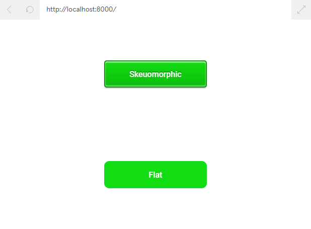

# Index
* [Tooltips and Titles](#tooltips-and-titles)
* [Hover States and Cursors](#hover-states-and-cursors)
* [Link States](#link-states)
* [Skeuomorphism and Flat Design](#skeuomorphism-and-flat-design)
* [Buttons: Skeuomorphic styling](#buttons-skeuomorphic-styling)

# Tooltips and Titles
Most browsers will display the text of a title attribute as a tooltip, meaning when a user hovers their cursor over an element, the text will appear in a small box near the cursor.

To add tooltips to a clickable element like a link, add it as the title attribute.
```HTML
<p>
  <a href="https://www.codecademy.com" title="Codecademy is an online learning platform">Codecademy</a> is the best place to learn to code!
</p>
```

# Hover States and Cursors
2. Add a declaration to also change the cursor to pointer. Even though this behavior is seen when the mouse is hovered over, you should add it to the rule for all `<a>` tags, as the browser will only change cursor styles on hover by default. Putting the rule on an a:hover rule can cause unwanted behavior in some cases.
```CSS
a {
  color: #466995;
  text-decoration: underline;
  cursor: pointer;
}

a:hover {
  text-decoration: none;
}
```

# Link States
Links have four main states: normal (not clicked), hover, active (clicked), and visited. These four states have associated CSS pseudo-classes: :link, :hover, :active, and :visited. These four states can be used to give a full range of visual feedback to users about the status of their link interaction.

The ordering of link state pseudo-class rules is important to reveal the proper information. When a user hovers and then clicks a link, those styles should always override the static styling surrounding a user’s history with the link (unvisited :link and :visited). The proper order of these rules is:
* :link
* :visited
* :hover
* :active

This ordering will ensure that the rules cascade properly and the user can receive the most applicable visual feedback about the state of the link.
```CSS
a {
  color: #466995;
  text-decoration: underline;
  cursor: pointer;
}

a:hover {
  text-decoration: none;
}

a:visited {
  color: #466995;
}

.question-link:visited {
  color: #ffffff;
}

a:active .question-link:active {
  color: #dbe9ee;
}
```

# Skeuomorphism and Flat Design


```HTML
<!DOCTYPE html>
<html>
  <head>
    <link href="https://fonts.googleapis.com/css?family=Roboto:500" rel="stylesheet">
    <link rel="stylesheet" type="text/css" href="style.css">
  </head>
  <body>
    <div class="content">
      <div class="button skeuomorphic">
        Skeuomorphic
      </div>
      <div class="button flat">
        Flat
      </div>
    </div>
  </body>
</html>
```
```CSS
.content {
  width: 100%;
  display: flex;
  flex-direction: column;
  align-items: center;
  justify-content: space-around;
  height: 400px;
  font-family: 'Roboto', sans-serif;
}

.button {
  height: 50px;
  width: 200px;
  display: flex;
  align-items: center;
  justify-content: center;
  cursor: pointer;
  font-weight: 500;
}

.skeuomorphic {
  border: 2px solid #0c960c;
  border-radius: 5px;
  color: #F8F8F8;
  text-shadow: 0 -2px #006bb3;
  box-shadow: 0px 2px 2px rgba(0, 0, 0, 0.2), 0px -2px 2px rgba(255, 255, 255, 0.5) inset, 0 2px 2px rgba(255, 255, 255, 0.8) inset;
  background: #1D1;
  background: linear-gradient(#1D1, #0ebc0e);
  text-shadow: 0 -2px #0c960c;
  
}

.skeuomorphic:hover {
  box-shadow: 0px 2px 2px rgba(0, 0, 0, 0.1), 0px -2px 2px rgba(255, 255, 255, 0.25) inset, 0 2px 2px rgba(255, 255, 255, 0.4) inset;
  background: #0ebc0e;
  background: linear-gradient(#0ebc0e, #0c960c);
  border-color: #064f06;
}

.skeuomorphic:active {
  margin-top: 2px;
  margin-bottom: -2px;
  box-shadow: 0px 2px 2px rgba(63, 63, 63, 0.1), 0px -2px 2px rgba(255, 255, 255, 0.25) inset, 0 2px 2px rgba(255, 255, 255, 0.4) inset;
  background: #0c960c;
  background: linear-gradient(#0c960c, #0ebc0e);
}

.flat {
  background-color: #1D1;
  color: #fff;
  border: 2px solid #12dd23;
  border-radius: 10px;
}

.flat:hover {
  background-color: #0c960c;
  transition: background-color .15s, font-size .15s;
  font-size: 18px;
}

.flat:active {
  border-color: #fff;
}
```


# Buttons: Skeuomorphic styling
The default state of the .button class has some basic ‘buttony’ appearance with a rounded border (border and border-radius properties) and a slightly raised appearance with the use of the box-shadow. The :hover cursor is added for visual feedback. When the button is clicked (:active), the box-shadow is removed, and the margin-top moves the button down by 5px, make it appear to be pressed.
```HTML
<div class="button">Click me</div>
```
```CSS
.button {
  padding: 5px;
  border: 1px solid black;
  border-radius: 5px;
  text-decoration: none;
  box-shadow: 0px 5px;
}
 
.button:hover {
  cursor: pointer;
}
 
.button:active {
  margin-top: 5px;
  color: black;
  box-shadow: 0px 0px;
}
```
