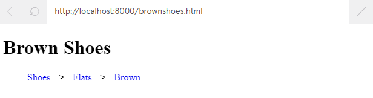

# Index
* [What is primary vs secondary navigation?](#what-is-primary-vs-secondary-navigation)
* [Simple Example of Breadcrumbs](#simple-example-of-breadcrumbs)
* [Where do Breadcrumbs Lead](#where-do-breadcrumbs-lead)
* [Breadcrumb Styles](#breadcrumb-styles)
* [Breadcrumb Types](#breadcrumb-types)
* [Breadcrumb Pitfalls](#breadcrumb-pitfalls)

# What is primary vs secondary navigation?
* The primary navigation system typically contains the most important links and buttons that need to be displayed on every single page of the site.
* Secondary navigation, or breadcrumb navigation, usually consists of a clickable list of pages or attributes that led to the current page. It can help users understand the extent of the site and also where they are currently.

For example, a shopping site may have a breadcrumb trail leading to a pair of shoes like so:


# Simple Example of Breadcrumbs
Breadcrumbs are usually displayed as a horizontal list of pages and take up minimal space. Users expect to find them in the header, left-aligned, and below any primary navigation. Typically they are separated with a “>” or a “/“ symbol.

To add “>” or a “/“ symbol programmatically
* The + is called the adjacent sibling combinator; it will only select two li‘s when they are immediately next to each other, with the same parent. The element that actually gets selected is the second element of this sibling pair.
* The ::before part of this selector creates a pseudo-element. The ::before pseudo-element is often used with the content property, to add content that will be displayed just before the selected element.
```CSS
.breadcrumb li+li::before {
  content: "/";
}
```


`index.html`
```HTML
<!DOCTYPE html>
<html>
<link rel="stylesheet" type="text/css" href="./styles.css">

<ul class="breadcrumb">
  <li>
    <a href="shopping">Shopping</a>
  </li>
  <li>
    <a href="fashion">Fashion</a>
  </li>
  <li>
    <a href="shoes">Shoes</a>
  </li>
  <li>
    <a href="flats">Flats</a>
  </li>
  <li>
    <a href="brown">Brown</a>
  </li>
</ul>
</html>
```
`styles.css`
```CSS
.breadcrumb > li {
  display: inline;
}
.breadcrumb li+li::before {
	padding: 10px;
  content: ">";
}
.breadcrumb a {
  text-decoration: none;
}
.breadcrumb a:hover {
  color: red;
}
```

# Where do Breadcrumbs Lead
In a full site, these breadcrumbs would link to their respective pages. This is accomplished by setting the href property to the appropriate page.

Since breadcrumbs are typically relative to the current page, the breadcrumb list on each page needs to be different. However, as a user moves around the breadcrumb list, they should expect the breadcrumb style and list to stay consistent.



`brown.html`
```HTML
<!DOCTYPE html>
<html>
<link rel="stylesheet" type="text/css" href="./styles.css">
  <h1> Brown Shoes </h1>
  <ul class="breadcrumb">
    <li>
      <a href="shoes.html">Shoes</a>
    </li>
    <li>
      <a href="flats.html">Flats</a>
    </li>
    <li>
      <a href="#">Brown</a>
    </li>
  </ul>
</html>
```
`flats.html`
```HTML
<!DOCTYPE html>
<html>
<link rel="stylesheet" type="text/css" href="./styles.css">
  <h1>Flats</h1>
  <ul class="breadcrumb">
    <li>
      <a href="shoes.html">Shoes</a>
    </li>
    <li>
      <a href="#">Flats</a>
    </li>
    <li>
      <a href="brown.html">Brown</a>
    </li>
  </ul>
</html>
```
`shoes.html`
```HTML
<!DOCTYPE html>
<html>
<link rel="stylesheet" type="text/css" href="./styles.css">
  <h1>Shoes</h1>
  <ul class="breadcrumb">
    <li>
      <a href="#">Shoes</a>
    </li>
    <li>
      <a href="flats.html">Flats</a>
    </li>
    <li>
      <a href="brown.html">Brown</a>
    </li>
  </ul>
</html>
```

# Breadcrumb Styles
The previous exercise demonstrated the most basic styling for breadcrumbs. When designing your own site, you’ll need to make a judgment call if this approach is sufficient. If you want to invite the user to interact with the breadcrumbs, you can style them to make them a more prominent part of the page design.

The example below makes use of a couple of CSS tricks to create an arrow effect. We’re using the ::before and ::after pseudo-elements to add filled rectangles (with empty content) before and after each list item:
```CSS
.breadcrumb li a::before, .breadcrumb li a::after {
  content: "";
  position: absolute;
  border-color: darkcyan;
  border-style: solid;
  border-width: 15px 5px;
}
```

By setting a portion of the border to transparent, it creates the “tail” of the arrow:
```CSS
.breadcrumb li a::before {
  left: -10px;
  border-left-color: transparent;
}
```

This effect works because the element borders are drawn from the center of the element. We use similar CSS to draw the head of the arrow.

We’ll walk through the individual steps in the exercises so you can see how each step affects the resulting look.


`index.html` part of it
```HTML
<ul class="breadcrumb">
  <li><a href="">Asia</a></li>
  <li><a href="">Singapore</a></li>
  <li><a href="">Tourism</a></li>
  <li><a href="">Hotels</a></li>
</ul>
```
`breadcrumbs.css`
```CSS
.breadcrumb {
  text-align: left;
}
.breadcrumb li {
  float: left;
}
.breadcrumb a {
  color: #fff;
  background: darkcyan;
  text-decoration: none;
  position: relative;
  height: 30px;
  line-height: 30px;
  text-align: center;
  margin-right: 15px;
  padding: 0 5px;
}
.breadcrumb a::before,
.breadcrumb a::after {
  content: "";
  position: absolute;
  border-color: darkcyan;
  border-style: solid;
  border-width: 15px 5px;
}
.breadcrumb a::before {
  left: -10px;
  border-left-color: transparent;
}
.breadcrumb a::after {
  left: 100%;
}
.breadcrumb a::after {
  left: 100%;
  border-color: transparent;
  border-left-color: darkcyan;
}
.breadcrumb a:hover {
  background-color: blue;
}
.breadcrumb a:hover::before {
  border-color: blue;
  border-left-color: transparent;
}
.breadcrumb a:hover::after {
  border-left-color: blue;
}
```

# Breadcrumb Types
There are three major types of breadcrumbs:
* Location
* Attribute
* Path

You’ve seen the first two types in our examples so far:

Location based breadcrumbs are based on where you are with respect to the navigation structure of the website. In our shoe shopping example above, the first three li elements are location based. We are in the “shoes” section of the website, which is contained within the “fashion” section, which is contained within the “shopping” section.

Attribute based breadcrumbs are based on the attributes of the page or product that you are browsing. In our example above, the final two li elements are attribute based. We are shopping for shoes that are “flats” and “brown”. Since the order of these attributes is not prescriptive, you’ll see some sites display these at the same level in the UI. If you want to allow users to remove attributes, provide an (x) button or similar to indicate they can be removed. Finally, breadcrumbs can be based on a user’s unique path through the site. For example, if they landed on the home page, browsed to the about page and finally the registration page, their breadcrumb trail may look like:

`Home > About > Register`

Note that this breadcrumb trail will be different for each user and each visit. For even mildly complex sites, the number of steps will become large. To simplify the display, the beginning of the trail is often abbreviated:

`... > About > Register`


`index.html` part of it
```HTML
<ul class="breadcrumb">
  <li class="location"><a href="">...</a></li>
  <li class="location"><a href="">Hotels</a></li>
  <li class="attribute"><a href="">Pets</a></li>
  <li class="attribute"><a href="">Queen Bed</a></li>
</ul>
```
`breadcrumb.css`
```CSS
.breadcrumb {
  text-align: left;
}
.breadcrumb li {
  display: inline;
}
.breadcrumb li.location+li.location::before {
  color: gray;
  content: ">";
}
.breadcrumb a {
  display: inline;
}
.attribute a {
  color: gray;
}
.attribute a::after {
  content: " x";
  font-size: 8px;
  vertical-align: super;
}
```

# Breadcrumb Pitfalls
Sometimes it is not appropriate to use breadcrumbs as a means of secondary navigation within a website. Users expect breadcrumbs to behave a certain way and attempts to deviate from this may confuse them. Most users are expecting breadcrumbs to expose the hierarchy of the site or display attributes of the page they are on.

Path based breadcrumbs are unique to a user’s journey and are not commonly implemented. Only use this type of breadcrumbs if there is a compelling reason for it.

While breadcrumbs are common, it is not the primary way users will navigate a site. Don’t make the breadcrumbs the only navigation structure.

In general, the rule of not adding anything extraneous to the design applies here. If the site only contains a few pages or if the pages in the breadcrumbs are already available through primary navigation, there is little reason to include breadcrumbs in the design.