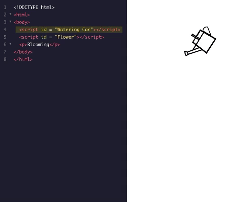
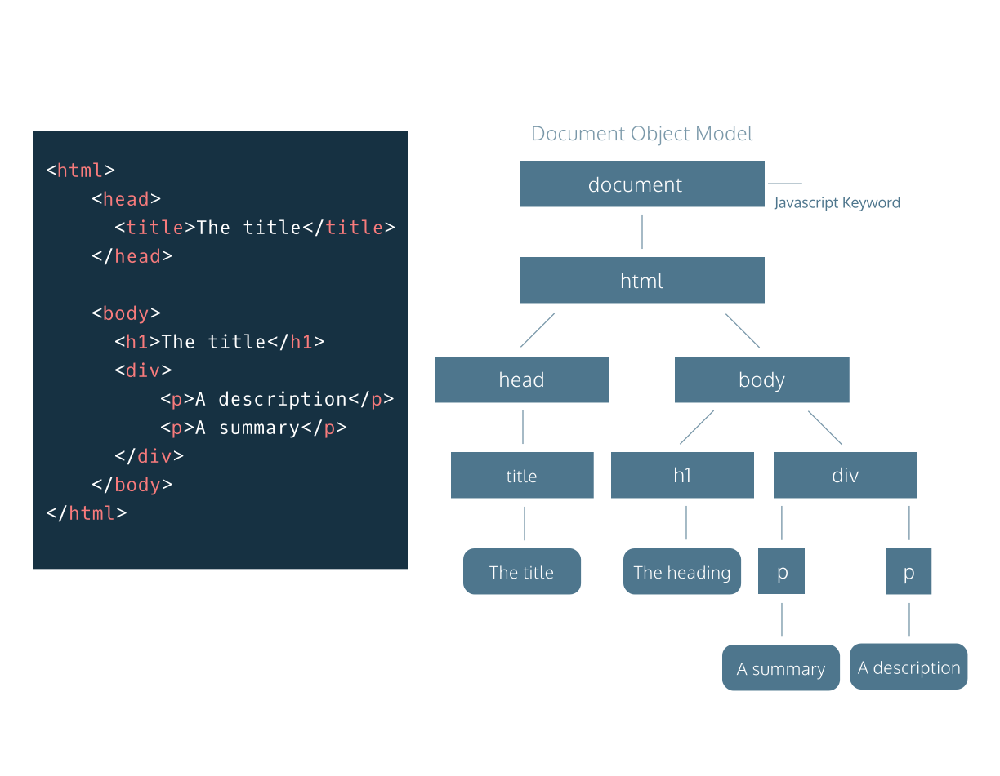
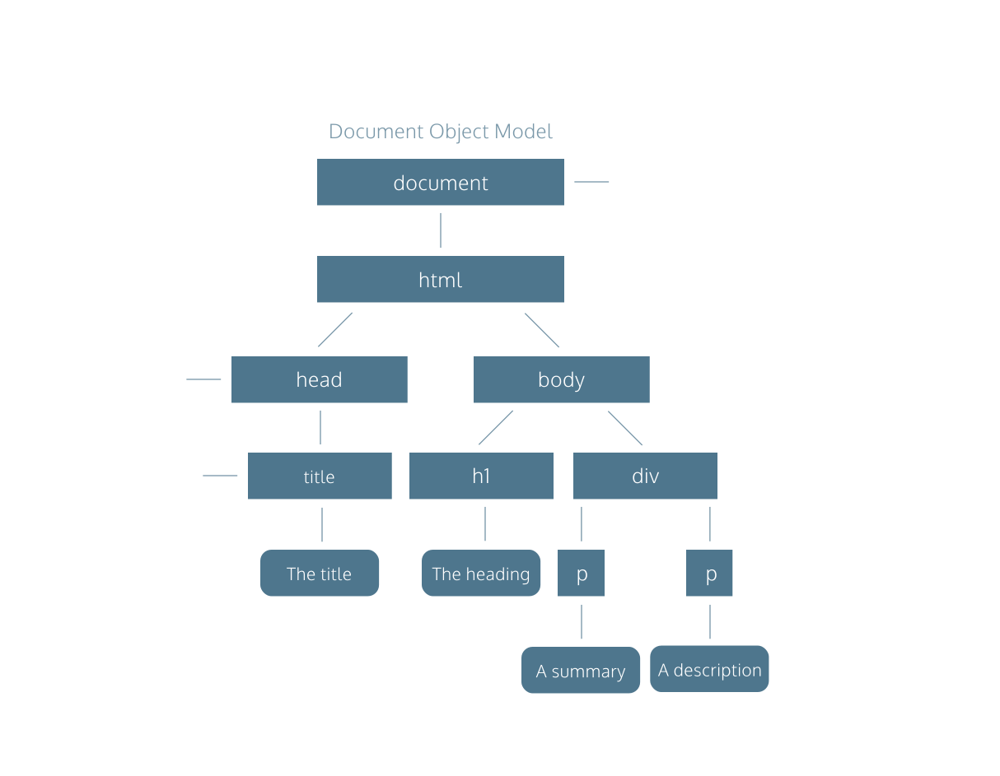
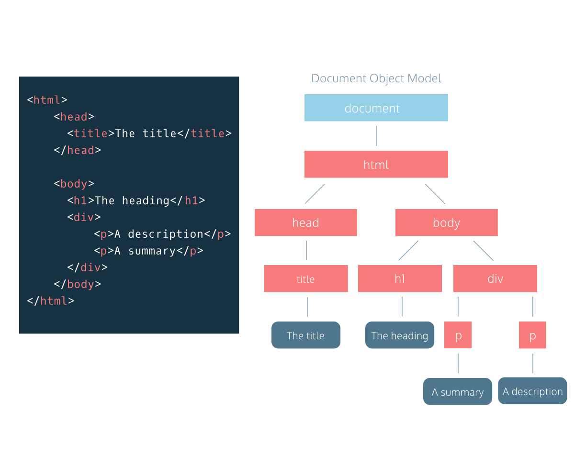
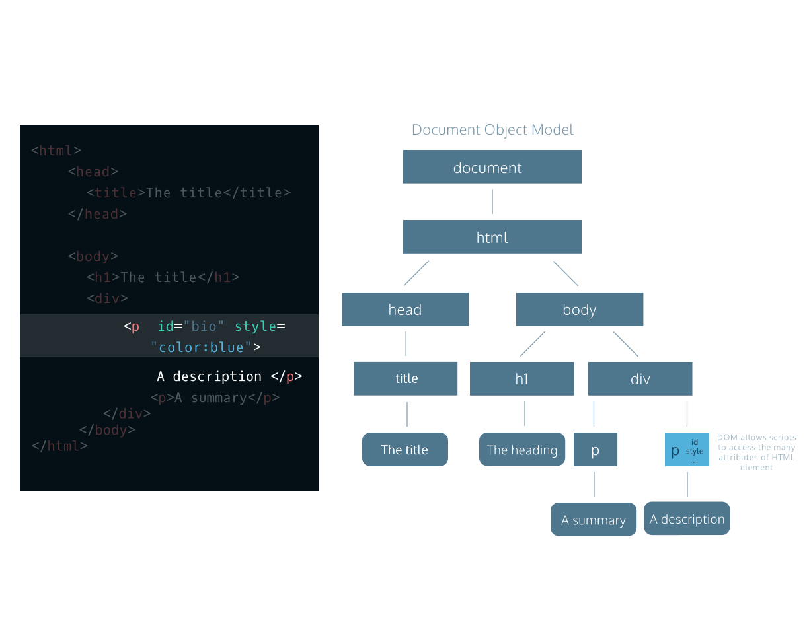

# Index
* [The Script Element](#the-script-element)
8 [The Document Object Model: DOM](#the-document-object-model-dom)

# The Script Element

## How are scripts loaded?
A quick recap: the `<script>` element allows HTML files to load and execute JavaScript. The JavaScript can either go embedded inside of the `<script>` tag or the script tag can reference an external file. Before we dive deeper, let’s take a moment to talk about how browsers parse HTML files into web pages. This informs where to include a `<script>` element inside your HTML file.

Browsers come equipped with HTML parsers that help browsers render the elements accordingly. Elements, including the `<script>` element, are by default, parsed in the order they appear in the HTML file. When the HTML parser encounters a `<script>` element, it loads the script then executes its contents before parsing the rest of the HTML. The two main points to note here are that:
* The HTML parser does NOT process the next element in the HTML file until it loads and executes the `<script>` element, thus leading to a delay in load time and resulting in a poor user experience.
* Additionally, scripts are loaded sequentially, so if one script depends on another script, they should be placed in that very order inside the HTML file.

The GIF below displays two scripts being loaded. The first script makes a Watering Can appear, the second script makes a Flower appear. This shows how scripts are loaded sequentially, and how they pause the HTML parser, which is why “Blooming” appears at the end.



## Defer attribute
When the HTML parser comes across a `<script>` element, it stops to load its content. Once loaded, the JavaScript code is executed and the HTML parser proceeds to parse the next element in the file. This can result in a slow load time for your website. HTML4 introduced the defer and async attributes of the `<script>` element to address the user wait-time in the website based on different scenarios.

The defer attribute specifies scripts should be executed after the HTML file is completely parsed. When the HTML parser encounters a `<script>` element with the defer attribute, it loads the script but defers the actual execution of the JavaScript until after it finishes parsing the rest of the elements in the HTML file.

Here is an example of the defer tag:
```HTML
<script src="example.js" defer></script> 
```

When is defer useful?

When a script contains functionality that requires interaction with the DOM, the defer attribute is the way to go. This way, it ensures that the entire HTML file has been parsed before the script is executed.

## Async attribute
The async attribute loads and executes the script asynchronously with the rest of the webpage. This means that, similar to the defer attribute, the HTML parser will continue parsing the rest of the HTML as the script is downloaded in the background. However, with the async attribute, the script will not wait until the entire page is parsed: it will execute immediately after it has been downloaded. Here is an example of the async tag:
```HTML
<script src="example.js" async></script>
```

When is it useful?

async is useful for scripts that are independent of other scripts in order to function accordingly. Thus, if it does not matter exactly at which point the script file is executed, asynchronous loading is the most suitable option as it optimizes web page load time.

# The Document Object Model: DOM
The DOM as a Tree Structure
Tree-like modeling is used in many fields, including evolutionary science and data analytics. Perhaps you’re already familiar with the concept of family trees: these charts represent the familial relationships amongst the descendants of a given family name.

The DOM tree follows similar logic to that of a family tree. A family tree is made up of family members and their relationships to the family name. In computer science, we would call each family member a node.

We define a node as an intersecting point in a tree that contains data.

In the DOM tree, the top-most node is called the root node, and it represents the HTML document. The descendants of the root node are the HTML tags in the document, starting with the `<html>` tag followed by the `<head>` and `<body>` tags and so on.



## Parent Child Relationships in the DOM
Following the metaphor of a family tree, let’s define some key terminology in the DOM hierarchy:

A parent node is the closest connected node to another node in the direction towards the root.

A child node is the closest connected node to another node in the direction away from the root.

Knowing these terms will allow you to understand and discuss the DOM as a tree-like structure. In fact, you will also see this terminology used when referring to the nesting structure of HTML code. Programmers refer to elements nested inside other elements as the children elements and parent elements respectively.



## Nodes and Elements in the DOM
As mentioned, a node is the equivalent of each family member in a family tree. A node is an intersecting point in a tree that also contains data.

There are nine different types of node objects in the DOM tree. In our diagram, the node objects with the sharp-edge rectangles are of the type [Element](https://developer.mozilla.org/en-US/docs/Web/API/Element), while the rounded edge rectangles are of type [Text](https://developer.mozilla.org/en-US/docs/Web/API/Text), because they represent the text inside the HTML paragraph elements.

When trying to modify a web page, the script will mostly interact with the DOM nodes of type element. Elements are the building units of HTML web pages, they contain everything between an opening tag and a closing tag. If the tag is a self-closing tag, then that is the element itself.



## Attributes of Element Node
DOM element nodes model elements in an HTML document.

Much like an element in an HTML page, the DOM allows us to access a node’s attributes, such as its class, id, and inline style.

In the diagram to the right, we have highlighted the paragraph element with an id of “bio” in the HTML document. If we were accessing that element node in our script, the DOM would allow us to tweak each of those attributes, or simply access them to check their value in the code.

