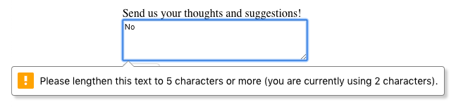
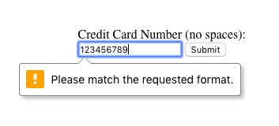

# Introduction to Form Validation

## Regular Expressions
Data submitted through forms are stored as strings. Strings are a fundamental data type in computer science representing a series of characters “strung” together. As humans, we can intuitively recognize patterns within strings, and this allows us to catch errors. Try to notice what’s wrong in the following examples:
* ABCDEF2GHIJKLMNOPQRSTUVWXYZ
* My zip code is 9021
* The ct meowed
* `<h1> Hello, World! </h2>`

In the first example, we had the letters of the alphabet presented in order but interrupted by an out of place 2. In the second, we left off the 5th digit of a famous zip code. In the third, we omitted the “a” from the word cat. In the final example, we wrote some HTML with an `<h1>` opening tag but an unmatching `</h2>` closing tag. If you picked up on these mistakes, it’s because your brain has been trained to expect patterns in certain types of data.

Unlike humans, who can get this training passively over time, computers have to be precisely programmed to recognize patterns. To specify patterns for the computer to recognize, we use a special language called _regular expressions_—also known as regex or regexp. A regular expression is a sequence of characters representing a pattern. We can use that pattern to match a string, match parts of a string, confirm that data is formatted acceptably, or even replace parts of strings with different characters.

## Client-side Validation: HTML
The first technique we can use to validate form data is to prevent problematic inputs from being submitted in the first place. This is called client-side validation. The client is the process interacting with the server on behalf of a user—in the case of websites, the web browser is the client. The logic for validating the form is included with the code that displays the form on the user’s device. No interaction with the back-end is required to perform client-side validations.

Since form validation is so common, modern HTML provides some of these validation features built-in. For example, we can use HTML to make parts of a form required and others optional. We can also use HTML to set minimum and maximum values for an input or minimum or maximum lengths for a text input. We can even necessitate that the input match a particular pattern, specified by a regular expression.

If any of the rules laid out in the HTML form validation aren’t followed, the user will not be able to submit their form, and they’ll receive an error message explaining why. With these checks in place, the back-end is less likely to be sent incorrect data. HTML form validation will also benefit the user—the client provides the user immediate feedback, without having to wait for time-consuming communication with the back-end.

```HTML
<!DOCTYPE html>
<html lang="en" dir="ltr">
  <body>
    <h1>Basic HTML Validation</h1>
    <form action="" method="POST">
      <label for="text">Enter your name here:</label>
    	<input id="name" name="name" type="text" required minlength="3" maxlength="100">
      <br><br>
      <label for="number">Enter your age here:</label>
      <input type="number" name="age" id="age" required min="1" max="123">
      <br><br>
        <label for="code">Best place to learn to code: (hint: starts with a "C")</label>
  <input id="code" name="code" type="text" required pattern="[cC]odecademy">
      <br><br>
      <input type="submit" value="Submit">
    </form>
  </body>
</html>
```

## Client-side Validation: JavaScript
Client-side validation has two main advantages. First, it’s a better experience for the user to be alerted to problematic data immediately rather than having to wait for that information to come back from the server and have to fill out the form again. Second, catching mistakes earlier in the process saves the application time and resources as well. But not all issues can be handled with the built-in HTML validations.

In order to truly customize validation or to perform more complex validations, we can incorporate JavaScript form validations. We can do this by either writing the JavaScript ourselves or by incorporating a JavaScript library. If we have unique requirements for usernames on our site, for example, we’ll have to provide these systems of validation ourselves.

If we’re creating a relatively simple website, it makes sense to code the form validation ourselves or use a simple vanilla JavaScript library—[just-validate](https://www.npmjs.com/package/just-validate), for example. But most basic validation libraries will involve directly accessing or manipulating the DOM. This can get tricky when working with a framework that relies on a virtual DOM—like React or Vue. In those situations, it might be best to incorporate a library that works well with your specific framework. For example, the [formik library](https://www.npmjs.com/package/formik) is a lightweight library that simplifies validating forms in a React app.

## Back-end Validation
No matter how complete the front-end validation of a website or application seems, validations must also be completed on the back-end or server-side. Front-end validations are easy to bypass—a malicious user can simply turn off JavaScript on their browser, for example. There’s also the potential for middleman attacks in which data is changed after the request is submitted by a user but before it arrives at the server. As a rule, the back-end should never trust the data it receives.

As the developer, once data is in the back-end, we have complete control over it, luckily. Back-end validation has several advantages:
* It enables us to use validation code often on machines with more computing power.
* It allows us to write validation code that a user can’t see—if malicious users can’t see exactly how we validate the data, it’s much more difficult for them to find ways around it.
* We can validate the information against other data the front-end doesn’t have access to—for example, we can check our database to see if a given username is already in use.

There are two main ways to validate inputs on the server-side. The first takes place while the user is still inputting data into the form on the front-end. We can make asynchronous requests to the server with pieces of their data and send feedback directly to the user before they’ve submitted. This is slower than front-end validation and can be a design challenge from a user-experience perspective.

The second is once the form has been submitted. Back-end form validation is our application’s last defense against problematic data, and it’s essential to verify the validity and safety of data before adding it to a database. This is also an opportunity to “sanitize” the data: in order for our database to be useful, it’s important that all data within it is formatted consistently. This means that while we may want to be flexible about the formatting we require from a user, we likely want to transform inputs into a strict format before entering them in the database.

# Form  Validation

## Requiring an Input
Sometimes we have fields in our <form>s which are not optional, i.e. there must be information provided before we can submit it. To enforce this rule, we can add the required attribute to an <input> element.

Take for example:
```HTML
<form action="/example.html" method="POST">
  <label for="allergies">Do you have any dietary restrictions?</label>
  <br>
  <input id="allergies" name="allergies" type="text" required>
  <br>
  <input type="submit" value="Submit">
</form>
```

This renders a text box, and if we try to submit the `<form>` without filling it out we get this message:


## Set a Minimum and Maximum
Another built-in validation we can use is to assign a minimum or maximum value for a number field, e.g. `<input type="number">` and `<input type="range">`. To set a minimum acceptable value, we use the min attribute and assign a value. On the flip side, to set a maximum acceptable value, we assign the max attribute a value. Let’s see this in code:
```HTML
<form action="/example.html" method="POST">
  <label for="guests">Enter # of guests:</label>
  <input id="guests" name="guests" type="number" min="1" max="4">
  <input type="submit" value="Submit">
</form>
```

If a user tries to submit an input that is less than 1 a warning will appear:


## Checking Text Length
In the previous exercise, we were able to use min and max to set acceptable minimum and maximum values in a number field. But what about text fields? There are certainly cases where we wouldn’t want our users typing more than a certain number of characters (think about the character cap for messages on Twitter). We might even want to set a minimum number of characters. Conveniently, there are built-in HTML5 validations for these situations.

To set a minimum number of characters for a text field, we add the minlength attribute and a value to set a minimum value. Similarly, to set the maximum number of characters for a text field, we use the maxlength attribute and set a maximum value. Let’s take a look at these attributes in code:
```HTML
<form action="/example.html" method="POST">
  <label for="summary">Summarize your feelings in less than 250 characters</label>
  <input id="summary" name="summary" type="text" minlength="5" maxlength="250" required>
  <input type="submit" value="Submit">
</form>
```

If a user tries to submit the <form> with less than the set minimum, this message appears:



And if a user tries to type in more than the maximum allowed number of characters, they don’t get a warning message, but they can’t type it in!

## Matching a Pattern
In addition to checking the length of a text, we could also add a validation to check how the text was provided. For cases when we want user input to follow specific guidelines, we use the pattern attribute and assign it a regular expression, or regex. Regular expressions are a sequence of characters that make up a search pattern. If the input matches the regex, the form can be submitted.

Let’s say we wanted to check for a valid credit card number (a 14 to 16 digit number). We could use the regex: [0-9]{14,16} which checks that the user provided only numbers and that they entered at least 14 digits and at most 16 digits.

To add this to a form:
```HTML
<form action="/example.html" method="POST">
  <label for="payment">Credit Card Number (no spaces):</label>
  <br>
  <input id="payment" name="payment" type="text" required pattern="[0-9]{14,16}">
  <input type="submit" value="Submit">
</form>
```

With the pattern in place, users can’t submit the <form> with a number that doesn’t follow the regex. When they try, they’ll see a validation message like so:



If you want to find out more about Regex, read more at [MDN’s regex article](https://developer.mozilla.org/en-US/docs/Web/JavaScript/Guide/Regular_Expressions).