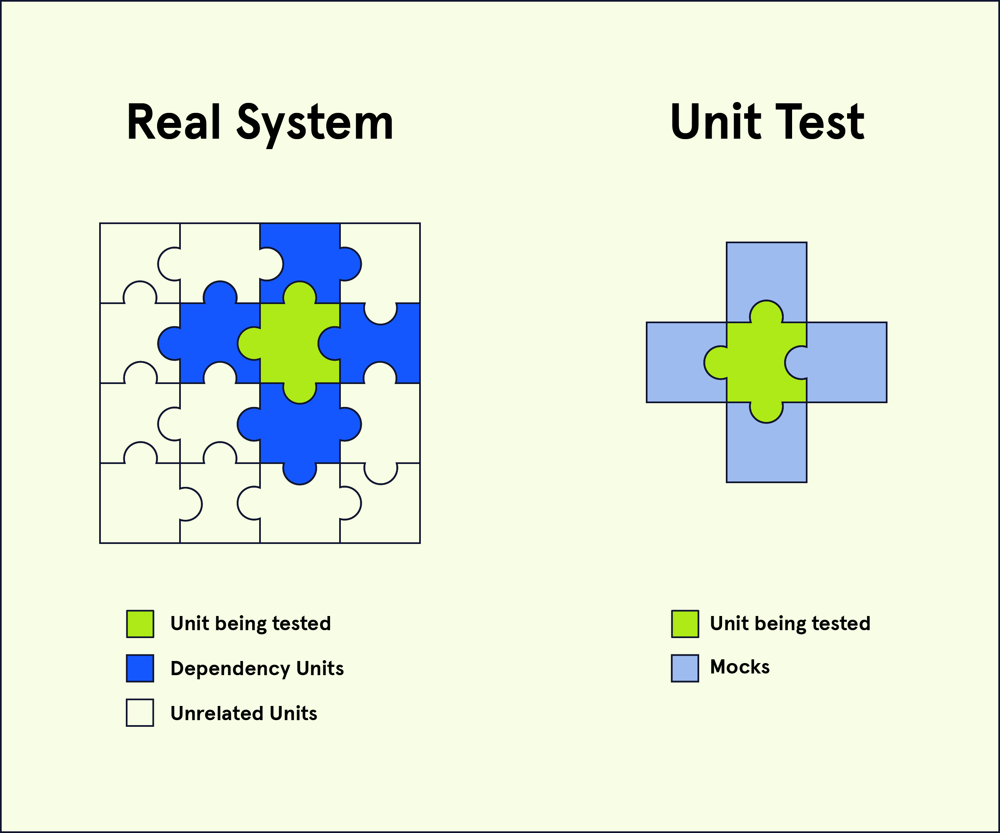

# Code Coverage

## What is Code Coverage?
Code coverage is the metric that measures the amount of application code that has been executed in testing, represented as a percentage. For example, if 90% of our code has been executed in our tests, then we would say that we have “90% code coverage”.

But what does it mean for code to be executed in a test? How rigorous does a test need to be in order to qualify as having executed the entirety of a program? And does 100% test coverage mean that a program is bug-free?

## Code Coverage Criteria
Measuring code coverage is conducted using one or more criteria, depending on the organization’s standards for code coverage. Though this is not an exhaustive list, some key criteria to use when measuring code coverage include:
* Function Coverage: Has each function been called?
* Statement Coverage: Has each statement been executed?
* Path Coverage: Has every edge in the [control-flow graph](https://en.wikipedia.org/wiki/Control-flow_graph) been executed?
* Condition Coverage: Has each boolean sub-expression evaluated to be both true and false?

Let’s look at an example of how these criteria can be used to determine code coverage. Here we have a very simple function that returns the sum of two arguments, if two arguments have been provided, and returns null otherwise:
```JS
function numSum(x, y) {
  if (x && y) {
    return (x + y);
  } else {
    return null;
  }
}
```

The most basic test of this function would include calling the function at least once, thus achieving 100% function coverage.
```JS
numSum(1, 2);  // This should return 3
```

By executing the function only once and with the arguments above, we will execute some, but not all, of the lines of code in the function. So, we can test our function by calling it with arguments that will return null:
```JS
numSum(1, 2);  // This should return 3
numSum(1, false);  // This should return null
```

With these two calls together, both paths in the if / else blocks are taken and both return statements are executed. Thus, we have 100% statement coverage and 100% path coverage.

Finally, to achieve 100% condition coverage, we need to call our function with arguments such that x and y each evaluate to true and false in the function’s if condition statement.
```JS
numSum(1, 2);  // This should return 3
numSum(1, false);  // This should return null
numSum(false, 1);  // This should return null
numSum();   // This should return null
```

## The 100% Code Coverage Myth
And there we have it, we’ve achieved 100% coverage in each of the four criteria! So, we’re done testing, right? Well, not quite.

Having 100% code coverage does not guarantee bug-free code – it simply validates the completeness of our tests using a given set of criteria relative to other test suites with lower code coverage. We still must be vigilant about writing robust test suites that specifically address both the intended use cases, and unintended edge cases, of our application.

For example, as written, the numSum function will concatenate numeric string arguments rather than performing addition.
```JS
numSum('1', '2') // This will return '12' instead of 3
```

While there are [other coverage criteria](https://en.wikipedia.org/wiki/Code_coverage#Parameter_value_coverage) we can use to identify the full range of function parameters, code coverage is an insufficient metric to determine if our tests confirm the intended functionality of our program as defined by the end user’s requirements.

Instead, we should consider the code coverage criteria as a set of guidelines to help you develop intuition for testing your code while remaining determined to write robust test suites that are specific in targeting the various use cases of our programs.

## Test Coverage
Another term you may hear with regards to testing is called test coverage. Test coverage differs from code coverage in that test coverage measures the percentage of the required features/specs that are tested, as opposed to the percentage of lines executed. These features/specs are typically defined in a [requirements document](https://en.wikipedia.org/wiki/Product_requirements_document) provided by a client or product designer.

Suppose you are building a mobile-native application that needs to work on phones using the Android and iOS operating systems but is not expected to work on desktop browsers. Accordingly, to achieve high test coverage, you will be expected to write tests for your application’s performance on Android and iOS but not on browsers.

Like code coverage, test coverage cannot guarantee that our program will not have unexpected behavior. However, the pursuit of high test coverage can lead us to identify bugs and unexpected behavior earlier on in the development process.

## Conclusion
Code coverage measures the percentage of lines of code that are executed in a test while test coverage measures the percentage of required features that are tested. Though these metrics cannot guarantee bug-free code, by incorporating these two metrics into your test analysis, you can increase your confidence that your test suites are robust and that your products can satisfy your end users.

# Mocking In Tests

## What is Mocking?
Mocking is the process of creating a fake version of an external service for testing purposes, particularly in unit tests and integration tests. Mocking is effective in testing individual units of code without relying on the functionality of other services or units such as APIs or databases.

Another word that is used to describe this practice is stubbing. [While there is a difference](https://dev.to/snird/the-difference-between-mocks-and-stubs-explained-with-js-kkc), it’s not a very relevant difference in this scope and context.

Let’s say we’re testing a feature for a blog website which renders profile data (i.e. name and bio) of the author of a certain blog post. How might mocking help us better test this feature?

## Mocking in Unit Tests
As mentioned above, mocking allows us to test a particular feature without needing to rely on other services or units. By removing dependencies, we are limiting the sources of potential bugs and unintended results to just the feature being tested.

In our blog application, the new feature has three steps:
1. profile data must first be fetched from a database
2. the data received must be parsed and formatted
3. the formatted data is rendered

When unit testing how the data is displayed (step 3), we can skip the first two steps (fetching and formatting) by mocking the formatted data we need, allowing us to focus solely on testing how our feature renders that data. We can even mock bad or unexpected inputs to test how our feature might display an error message.



## Mocking in Integration Tests
While it’s helpful to use mocks in unit tests, we should avoid using mocks in integration tests to better simulate interactions between internal services (though external services should remain mocked).

In our blog application, we use an intermediate function to format incoming data from the database for our new feature that will render the data. To test this integration, we would no longer mock how that raw data is formatted and then displayed. We would, however, still mock the raw data coming in from the database.

# Spies with Sinon

## What are Spies?
In testing, a spy is a function that observes and records information about another function’s calls including arguments, return value, the this value, and exceptions thrown (if any). The information that is observed by the spy can then be used in assertions for testing.

As an example, let’s say we are testing a top-secret application with a feature to receive a message, display for 5 seconds, then delete it. We can wrap a spy around this unit to keep track of how many messages were received, what the messages said, if any errors were thrown, etc. Using its stealthy powers of espionage, a spy won’t change anything about how the function operates, it will just observe what happens.

`one img of an animation`


## What is Sinon?
Sinon.js is a JavaScript library that includes standalone fakes, spies, and mocks that can be used in any unit testing framework. The [Sinon spies documentation](https://sinonjs.org/releases/v13/) highlights the different information that can be pulled from spies.

## How to Spy?
There are multiple ways to use a spy, they can be anonymous functions or they can wrap around existing methods in a program. You can see all the many ways to use spies in the Sinon spies documentation, but we’ll focus on one type in particular: wrapping methods.

Our spy will be wrapped around a method and, as we use the method in our tests, will observe everything that happens involving that method. We can think of a spy with a wiretap, taking notes on every interaction that method has.

The following example demonstrates some basics of using the sinon.spy() method to test the method of an object.
```JS
const robot = {
  greet(name){  // Unit being tested
    return 'Hello ' + name;
  }
};
 
test('greet should return hello codey', () => {
  sinon.spy(robot, 'greet'); // Initialize the spy
  robot.greet('codey'); // Call the method
  expect(robot.greet.called).to.be.true;
  expect(robot.greet.calledWith('codey')).to.be.true;
  expect(robot.greet.returned('Hello codey')).to.be.true;
  robot.greet.restore(); // Remove spy from wrapped method
});
```

In the example above, the sinon.spy() method is used to wrap the robot object’s .greet() method. Doing so adds a number of useful properties and methods that allow us to monitor its behavior after we call robot.greet('codey'). Using a few of these methods, we test if the .greet() method…
* has been called using the .called property
* is called with the correct argument using the .calledWith() method
* returns what we expect it to return using the .returned() property

Finally, to ensure that the method returns to its original, un-spied-on state, we use the .restore() method.

There are too many properties and methods available to spied-on functions to cover in one article and even to commit to memory, so we recommend that you check out the documentation to find the right tools for your needs.

## Summary
Spies are an incredibly useful tool that serve as a means for observing and recording information about how our methods are used in tests. Though there are a number of JavaScript libraries that provide spying functionality, Sinon.js is well known and used widely, including at Codecademy!
