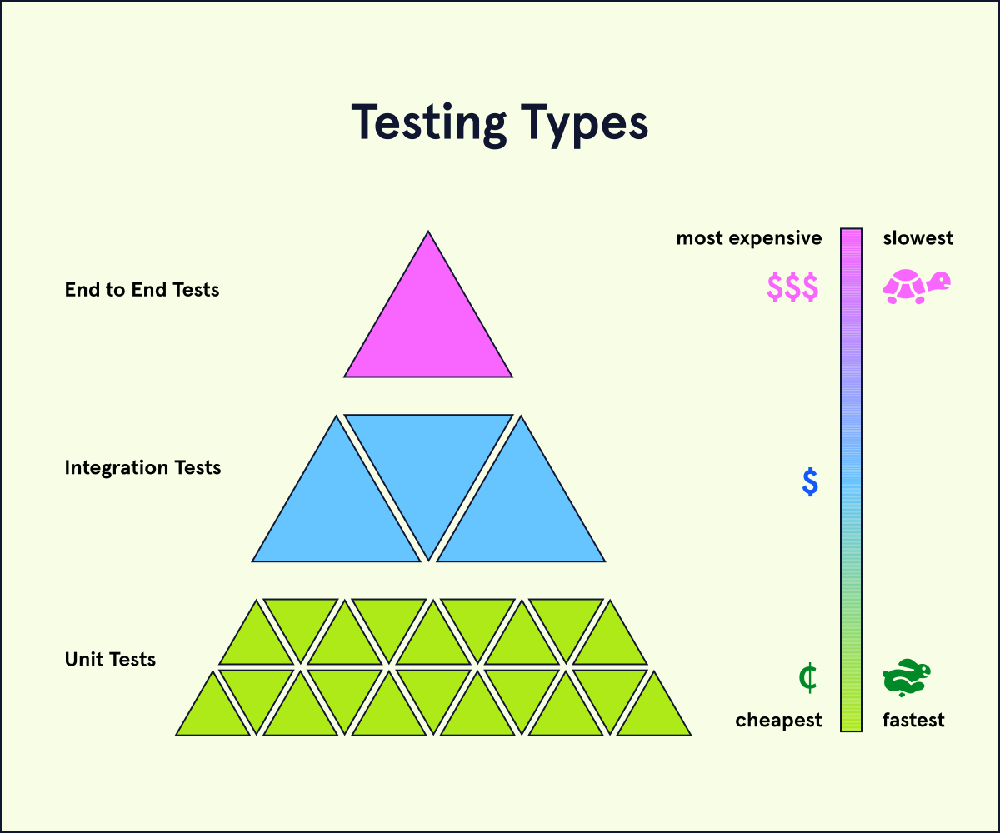

# Testing Types

## What are the Types of Testing?
At different stages of production for a particular project, you may encounter the opportunity for different types of tests, which can vary in scale and resource intensity, as well as serve different purposes. The types of testing we will discuss in this article are:
* Unit tests
* Integration tests
* End to end tests

Throughout this article, we will discuss how each of these types of tests can be applied to a basic weather application.

## Unit Tests
A unit test covers the smallest possible unit of testable code, such as a single function. In order to keep the scope of a unit test focused on the unit being tested, any data or behavior from other units or external sources that the unit relies on should be replaced with fake (mock) data or behavior.

For example, in a weather application, we might have a number of functions that each handle a small piece of computation, such as converting fahrenheit to celsius or formatting incoming weather data from an API. Unit tests would be written first to ensure that these functions can perform independently before we move on to testing how they work together. Any data that might come in from an external database or API would be mocked.

## Integration Tests
An integration test covers how the units of a particular program work with one another. When testing integrations with external services, only the handling of incoming data is tested while the data itself remains mocked.

For example, in a weather application, integration tests would be written to ensure that weather data fetched from an API will be properly formatted to be displayed to the user. It would also ensure that delays, errors, or invalid data from the external service would be handled properly once they are introduced. The data itself would be mocked.

## End to End Tests
An end to end test (sometimes referred to as a UI layer test or e2e) automates user flow to test the application in the way that a real user would experience it. To closely match the end user’s experience, this type of testing would also test interactions with external services such as databases and APIs.

For example, in a weather application, end to end tests might be written to simulate a user searching for a particular location, selecting that location, choosing celsius or fahrenheit, and clicking through various aspects of the UI. In this test, the actual database and external API is used.

## How do these tests relate?
The order of tests in this article (unit -> integration -> end to end) represent an increase in resource intensity (time, computation, money) and the scope of the tests (amount of code being tested). Due to the increase in complexity, tests of these types may initially be written in this order. However, as an application is developed, new features may be tested using all three types simultaneously, with each providing different feedback to the developer or testing team.

A typical developer’s feedback loop using these various test types might be:
1. Make code changes
2. Make a pull request
3. The code change has tests run against it (unit, integration, sometimes e2e)
4. If there are any failures then the dev will work on fixes in their local development environment.
5. Repeat steps 1-4 until all tests pass.
6. The pull request is allowed to be merged.

## Summary
In this article, we learned about the different types of tests that are written and performed throughout the production process. These include:
* Unit tests, which test the smallest unit of code possible.
* Integration tests, which test the interactions between internal services in the application.
* End to end tests, which test the whole application including the external services it depends on.

These types of tests increase respectively in terms of resource intensity and amount of code being tested and each provide developers and/or testing teams with distinct feedback during the development cycle.

# Software Testing Methodologies

## What Is a Software Testing Methodology?
Imagine this scenario: you’ve written some code for a new feature and it’s time to test it. You deploy your development version of the code and interact with all of the features of your application that were impacted. This could include features you built in the past and anything new. You repeat that process for different browsers and devices, and a few hours later, you’re confident that it’s ready to go. But then you deploy it to production and the error reports start to come in!

This scenario describes the process of manual testing, which is time-consuming, can result in errors being overlooked, and can’t be repeated easily. To get around the issues related to manual testing, organizations generally use software to automate their testing processes to validate code.

Testing methodologies are specific strategies for testing all of the pieces of your software to make sure it behaves as expected. These strategies include many ways to test software, such as unit testing, integration testing, performance testing, and more. In this article, we’ll take a closer look at testing practices that use a test-first approach to software development.

## Why Use Software Testing Methodologies?
There are many reasons that organizations adopt software testing methodologies:
* Software errors can cost companies money, users, and more
* Testing results in better reliability
* Testing can provide a better end user experience
* Failing tests help indicate which part of the software is not working when bugs occur

Overall, the primary goal of testing is to make software development more efficient, reliable, and future-proof.

## Different Types of Software Testing Methodologies
Some software testing methodologies prioritize writing test cases before writing the code those test cases will validate. Those types include:
* Test-Driven Development (TDD)
* Behavior-Driven Development (BDD)
* Specification by Example (SBE)
* Acceptance Test-Driven Development (ATDD)

These methodologies are particularly relevant for teams that use an agile, or iterative, approach to software development. Teams don’t have to pick one testing solution and stop there — several approaches can be used by the same team at different stages of development. The following sections take a closer look at TDD and BDD and where they fit into the development cycle to give some more context on testing methodologies in practice.

## Test-Driven Development
Testing doesn’t necessarily have to occur after code has been written. Test-driven development is a methodology that flips the order, where tests are written before the functioning code is written. By writing tests in this order, test cases can start with the definition of their purpose, or use case.

Those use cases define the specification and documentation on what actions are to be supported by new code. TDD tests look at the components of code, like functions and classes, as the smallest unit to test.

In practice, TDD can accelerate software development since it dictates short development cycles with direct test cases. There are many other benefits of test-driven development:
* Developers can better understand the requirements of code, before writing the code
* Code that will never be executed won’t be added to the codebase
* The scope of development is reduced
* Code is written with testability in mind

TDD is not the only testing methodology that takes a test-first approach to software development.

## Behavior-Driven Development
Another testing methodology that uses the strategy of writing test cases before code is behavior-driven development (BDD). BDD is extremely similar to TDD in terms of process. Where these two methodologies differ is in why or when tests are written, what an individual unit is considered to be, and how the language of the test is composed.

Since BDD tests are driven by behavior, the language of the test cases are simplified and written via collaboration between engineers, product owners, and other stakeholders, to ensure the specified behaviors make sense from a user perspective.

It can be said that BDD is more specific than TDD. Changes to the code base, such as changing the design of the code, will not occur unless there is a relevant change in the product. Since those changes are feature-related, the unit of tests is called a “feature”. Test cases are related to whether or not the feature works, rather than if the individual functions or classes you are writing to develop features work. Altogether, the tests are about how the product behaves — not the nitty-gritty technical details.

## Review
Nice work, you now know more about software testing methodologies! Let’s quickly recap the main ideas:
* Automated testing makes code production more reliable thanks to the ease of running frequent tests on all new and old code in a software application.
* Software companies don’t need to pick a singular software testing methodology — they can be combined and used at various stages during software development.
* Some organizations take a test-first approach to software development, with testing methodologies such as TDD and BDD being the first step of code production.
* Since software errors can cost businesses money and customer trust, testing is an integral part of the development process and used in some flavor by every software company.

As you continue with testing content, you’ll see TDD as the main methodology we teach. Now you have some insight into what TDD is and how it can be used as an example of how to guide the software development process!
