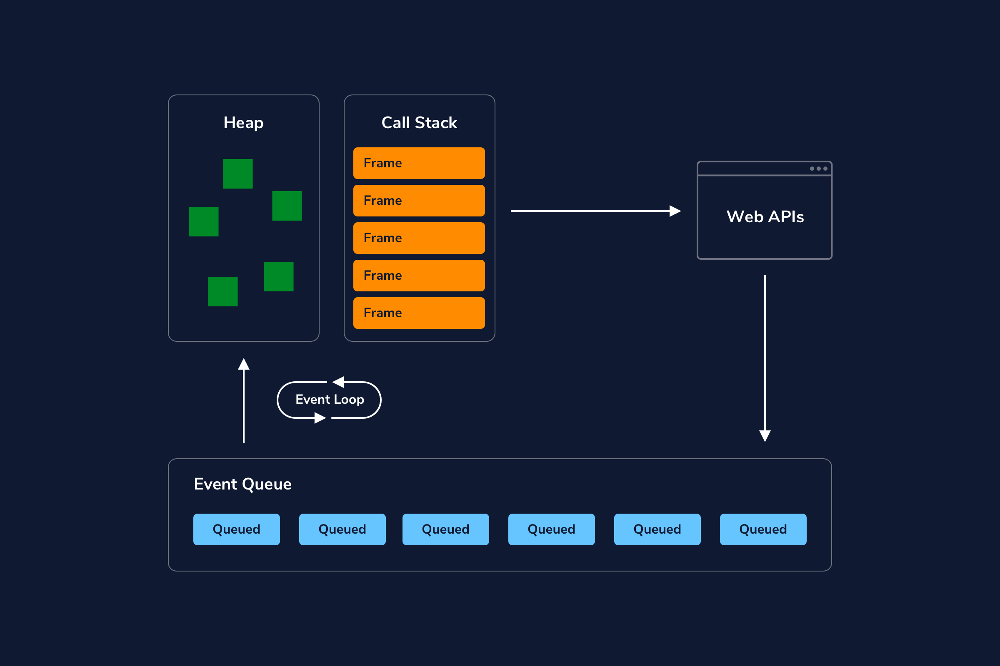

# General Asynchronous Programming Concepts

Synchronous actions happen sequentially, one after the other. Whereas, asynchronous actions can happen at the same without one action blocking the other.

# Introduction to Asynchronous JavaScript

## JavaScript and Asynchronous Code
JavaScript is a single-threaded language. This means it has a single thread that can carry out one task at a time. However, Javascript has what is known as the event loop, a specific design that allows it to perform asynchronous tasks even while only using a single thread (more on this later!). Let’s examine some examples of asynchronous code in Javascript!

### Asynchronous Callbacks
One common example of asynchronicity in JavaScript is the use of asynchronous callbacks. This is a type of callback function that executes after a specific condition is met and runs concurrently to any other code currently running. Let’s look at an example:
```JS
easterEgg.addEventListener('click', () => {
  console.log('Up, Up, Down, Down, Left, Right, Left, Right, B, A');
});
```

In the code above, the function passed as the second argument of .addEventListener() is an asynchronous callback — this function doesn’t execute until the easterEgg is clicked.

### setTimeout
In addition to asynchronous callbacks, JavaScript provides a handful of built-in functions that can perform tasks asynchronously. One function that is commonly used is the [setTimeout()](https://developer.mozilla.org/en-US/docs/Web/API/setTimeout) function.

With setTimeout() we can write code that tells our JavaScript program to wait a minimum amount of time before executing its callback function. Take a look at this example:
```JS
setTimeout(() => {
  console.log('Delay the printing of this string, please.');
}, 1000);
```

Notice that setTimeout() takes 2 arguments, a callback function and a number specifying how long to wait before executing the function. In the example above, the function will print 'Delay the printing of this string, please.' after 1000 milliseconds (or 1 second) have passed.

Since setTimeout() is non-blocking, we can be executing multiple lines of code at the same time! . Imagine if we had a program like this:
```JS
setTimeout(() => {
  console.log('Delay the printing of this string, please.');
}, 1000);
console.log('Doing important stuff.');
console.log('Still doing important stuff.'); 
```

Which outputs:
```JS
'Doing important stuff.'
'Still doing important stuff.' 
'Delay the printing of this string, please.'
```

If we take a closer look at the output, we’ll see that our setTimeout()‘s callback function didn’t execute until after our other very important console.log() statements were executed.

In web development, this means we can write code to wait for an event to trigger all while a user goes on interacting with our app. One such example could be if a user goes to a shopping site and gets notified that an item is up for sale and only for a limited time. Our asynchronous code could allow the user to interact with our site and when the sale timer expires, our code will remove the sale item.

### setInterval()
Another common built-in function is setInterval() which also takes a callback function and a number specifying how often the callback function should execute. For example:
```JS
setInterval(() => {
  alert('Are you paying attention???')
}, 300000)
```

The setInterval() would call the alert() function and show a pop-up message of 'Are you paying attention???' every 300000 milliseconds (or 5 minutes). Note: Please don’t actually do this in your apps, thank you.

While we wait for our alert to chime in every 5 minutes, our users could still use our app! Note: Again, please don’t do this.

With setInterval(), we can programmatically create an alarm, a countdown timer, set the frequency of an animation, and so much more!

# Concurrency Model and Event Loop in JavaScript

## Concurrency in JavaScript
Usually when we think about concurrency in programming, it means that two or more procedures are executed at the same time on the same shared resources. Since JavaScript is single-threaded, as we saw in the for loop example, we’ll never have that flavor of “true” concurrency. However, we can emulate concurrency using the event loop.

## What Is the Event Loop?
At a high level, the event loop is a system for managing code execution. In the diagram, you can see an overview of how the parts that make up the event loop fit together.

We have data structures that we call the heap and the call stack, which are part of the JavaScript engine. The heap and call stack interact with Node and Web APIs, which pass messages back to the stack via an event queue. The event queue’s interaction with the call stack is managed by an event loop. All together, those parts maintain the order of code execution when we run asynchronous functions. Don’t worry about understanding what those terms mean yet–we’ll dive into them shortly.



## Understand the Components of the Event Loop
The event loop is made up of these parts:
* Memory Heap
* Call Stack
* Event Queue
* Event Loop
* Node or Web APIs

Let’s take a closer look at each part before we put it all together.

### The Heap
The heap is a block of memory where we store objects in an unordered manner. JavaScript variables and objects that are currently in use are stored in the heap.

### The Call Stack
The stack, or call stack, tracks what function is currently being run in your code.

When you invoke a function, a frame is added to the stack. Frames connect that function’s arguments and local variables from the heap. Frames enter the stack in a last in, first out (LIFO) order. In the code snippet below, a series of nested functions are declared, then foo() is called and logged.
```JS
function foo() {
 return function bar() {
   return function baz() {
     return 'I love CodeCademy'
   }
 }
}
console.log(foo()()());
```

The function executing at any given point in time is at the top of the stack. In our example code, since we have nested functions, they will all be added to the stack until the innermost function has been executed. When the function finishes executing e.g. returns, its frame is removed from the stack. When we execute console.log(foo()()()), we’d see the stack build as follows:

You might have noticed that global() is at the bottom of the stack–when you first initiate a program, the global execution context is added to the call stack, which contains the global variable and lexical environment. Each subsequent frame for a called function has a function execution context that includes the function’s lexical and variable environment.

So when we say the call stack tracks what function is currently being run in our code, what we are tracking is the current execution context. When a function runs to completion, it is popped off of the call stack. The memory, or the frame, is cleared.

### The Event Queue
The event queue is a list of messages corresponding to functions that are waiting to be processed. In the diagram, these messages are entering the event queue from sources such as various web APIs or async functions that were called and are returning additional events to be handled by the stack. Messages enter the queue in a first in, first out (FIFO) order. No code is executed in the event queue; instead, it holds functions that are waiting to be added back into the stack.

### The Event Loop
This event loop is a specific part of our overall event loop concept. Messages that are waiting in the event queue to be added back into the stack are added back via the event loop. When the call stack is empty, if there is anything in the event queue, the event loop can add those one at a time to the stack for execution.

First the event loop will poll the stack to see if it is empty.
It will add the first waiting message.
It will repeat steps 1 and 2 until the stack has cleared.

## The Event Loop in Action
Now that we know all of the pieces of the event loop, let’s walk through some code to understand the event loop in action.
```JS
console.log("This is the first line of code in app.js.");
 
function usingsetTimeout() {
    console.log("I'm going to be queued in the Event Loop.");
}
setTimeout(usingsetTimeout, 3000);
 
console.log("This is the last line of code in app.js.");
```

1. console.log("This is the first line of code in app.js."); is added to the stack, executes, then pops off of the stack.
2. setTimeout() is added to the stack.
3. setTimeout()’s callback is passed to be executed by a web API. The timer will run for 3 seconds. After 3 seconds elapse, the callback function, usingsetTimeout() is pushed to the Event Queue.
4. The Event Loop, meanwhile, will check periodically if the stack is cleared to handle any messages in the Event Queue.
5. console.log("This is the last line of code in app.js."); is added to the stack, executes, then pops off of the stack.
6. The stack is now empty, so the event loop pushes usingsetTimeout onto the stack.
7. console.log("I'm going to be queued in the Event Loop."); is added to the stack, executes, gets popped
8. usesetTimeout pops off of the stack.

## Summary
Thanks to the event loop, JavaScript is a single-threaded, event-driven language that can run non-blocking code asynchronously. The Event Loop can be summarized as: when code is executed, it is handled by the heap and call stack, which interact with Node and Web APIs. Those APIs enable concurrency and pass asynchronous messages back to the stack via an event queue. The event queue’s interaction with the call stack is managed by an event loop. All together, those parts maintain the order of code execution when we run asynchronous functions.
