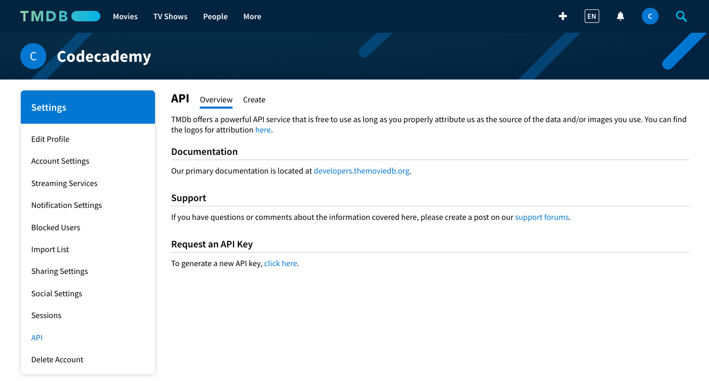

# Learn JavaScript Syntax: Requests
# Film Finder

You’ve caught up on your list of TV shows and movies and want to get recommendations for what to watch next, but aren’t sure where to look. In this project, you’ll use your knowledge of HTTP requests and asynchronous JavaScript to create a movie discovery app that will recommend random movies by genre. You’ll be able to choose from several genres, and like or dislike a movie to get another suggestion.

Before you begin, you’ll need to [create an account](https://www.themoviedb.org/signup) on The Movie Database website. After you create your account and verify your email address, click on your user icon at the top right corner and navigate to the Settings page.

On the Settings page, navigate to the API section and click on the link to Request an API Key to register as a Developer.

You’ll be asked to enter some personal information like your address and phone number. This is pretty common. Many APIs use this information to keep track of how their data is being used. As a part of your registration, you will also be asked to provide a URL for the site where you will be using this API. Here, you can list "https://codecademy.com". Check out these [instructions](https://developers.themoviedb.org/3/getting-started/introduction) if you need further assistance with registering for an API key.

After you finish this project, feel free to challenge yourself to continue building it out. For example, you might recommend TV shows instead of movies, or change the information you present about the recommended movies. The possibilities are endless. Next time you find yourself needing new content recommendations, you’ll know where to turn!

If you get stuck during this project or would like to see an experienced developer work through it, click “Get Unstuck“ to see a project walkthrough video.

Youtube: [Project walkthough](https://www.youtube.com/watch?v=W6El1fjUaJI)

## Populate Drop-down Menu with Genres
1. Save the API key you obtained from the TMDB API to the tmdbKey variable. We’ll be making multiple calls to the TMDB API and will reference this key in the upcoming steps.

    Remember not to share this API key with others!
2. Check the [TMDB documentation](https://developers.themoviedb.org/3/getting-started/introduction) to find the API’s base URL, and save it to the tmdbBaseUrl variable.

    We will append specific endpoints to this URL for each of our requests to the TMDB API.
3. For the next several steps we’ll be working inside the getGenres() function to fetch a list of genres from the API.

    Check the [TMDB documentation](https://developers.themoviedb.org/3/genres/get-movie-list) to find the “Genres” API endpoint. Create a variable called genreRequestEndpoint inside getGenres() and set it to the “Genres” API endpoint.
4. We will use query parameters to add more specificity to our request. Still inside the getGenres() function, create a variable called requestParams and set it to a query string where the key is api_key and the value is tmdbKey.

5. Let’s put together the URL where we’ll send our fetch request. Create a variable called urlToFetch and set it to a string that consists of tmdbBaseUrl, followed by genreRequestEndpoint, followed by requestParams.
6. Turn getGenres() into an asynchronous function that returns a promise. We’ll include our fetch() request in this function, and making it asynchronous will simplify handling the promise our API call returns.
7. We need a straightforward way to catch and handle errors if our fetch() request fails. Underneath our variable declarations inside the getGenres() function, add a try/catch statement. Leave the try block empty for now. In the catch block, log caught errors to the console.
8. In the try block, use fetch() to send a GET request to urlToFetch. Await the response and save it to a variable called response. We need to await the resolution of our fetch() call so that we can do something with the data we get back.
9. Still inside the try block, create a conditional statement that checks if the .ok property of the response object evaluates to a truthy value.
10. Inside the if statement of our try block, we’ll capture the data that we need to populate our dropdown menu. To get the requested data, convert the response object to a JSON object. Await the resolution of this method and save it to a variable called jsonResponse.
11. To make sure your code is working, log jsonResponse to the console inside our if statement. You should see a single object with a single key, genres. The value of genres is an array that lists TMDB’s genres.

    Save the genres property of jsonResponse in a variable called genres. Log this variable to the console to confirm that it contains the correct information.
12. Return genres as the very last line of the if statement inside our try block of the getGenre() function.

    When you run your program should now be able to see your dropdown menu populated with genres!

