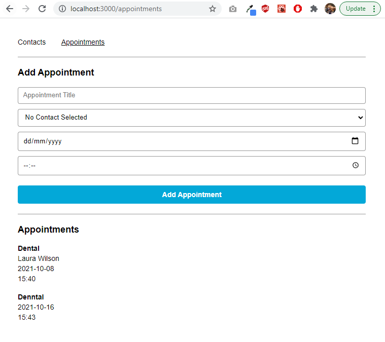

# Challenge Project: Appointment Planner

## Overview
Instead of a step-by-step tutorial, this project contains a series of open-ended requirements which describe the project you’ll be building. There are many possible ways to correctly fulfill all of these requirements, and you should expect to use the internet, Codecademy, and other resources when you encounter a problem that you cannot easily solve.

## Project Goals
In this project, you will use functional React components to create an app that manages contacts and appointments. The app consists of two pages: one to view and add contacts and one to view and add appointments.

You will work with stateful and stateless functional React components using hooks. The requirements section will walk through implementing the app from the topmost component down. If you would like to implement it in a different order feel free to do what is comfortable for you.

## Setup Instructions
If you choose to do this project on your computer instead of Codecademy, you can download what you’ll need by clicking the “Download” button below. Make sure you have [Node installed on your computer](https://www.codecademy.com/articles/setting-up-node-locally) and then, inside the project’s root directory, run npm install. Finally, run npm start which will automatically open up a new tab in your browser with your running application. If a new tab does not appear, you can visit [http://localhost:3000/](http://localhost:3000/).

## [Download](https://static-assets.codecademy.com/skillpaths/react-redux/react_challenge_start.zip)

## Structure
* src
  * components
    * `ApplicationForm.js` - returns appointment form `HTML & JS`
    * `ContactForm.js` - returns contact form `HTML & JS`
    * `ContactPicker.js` - returns contact selection `HTML`
    * `TilesList.js` - returns `list contacts` or `list appointments`
    * `Tile.js` - returns `list item`
  * containers
    * `AppointmentPage.js` - returns page `HTML & JS`
    * `ContactPage.js` - returns page `HTML & JS`
  * `App.js` - returns `HTML & JS`, initiates `states` & `handlers`
  * `index.js` - `renders App`