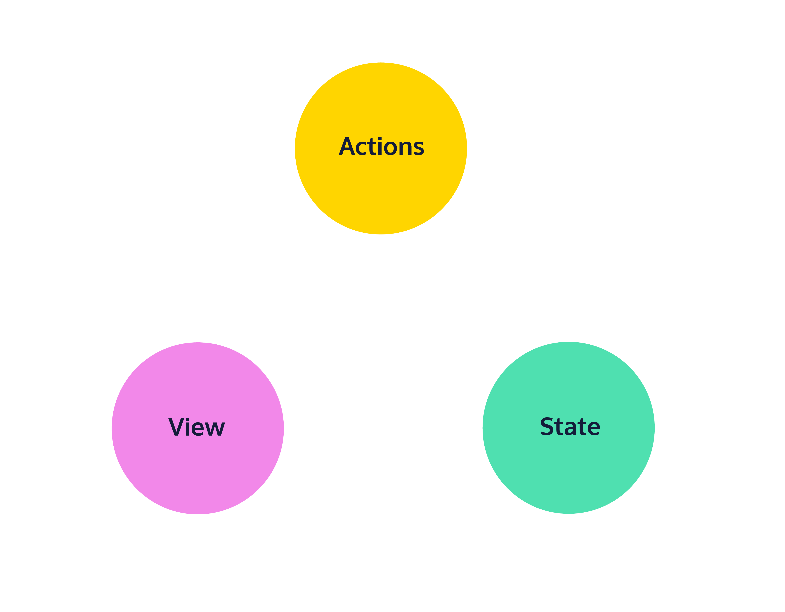

# Core Concepts in Redux

## Introduction to Redux
Imagine a calendar app. One part of the app lists all of the events. Another part of the app sets filters on which types of events are shown. A third part of the app sets the current time zone and a fourth part creates new events. Whew, that’s a lot to keep track of!

In React, each of these “parts” would be a component and data would need to be shared and updated by these components. Developers call this shared data the state of the application. Meanwhile, the process of sharing and updating this state is called state management. Depending on the size and complexity of your state, state management can be a complicated process in plain React.

That’s where Redux comes in. Redux is a state management library that follows a pattern known as the Flux architecture. In the Flux pattern, and in Redux, shared information is not stored in components but in a single object. Components are just given data to render and can request changes using events called actions. The state is available throughout the application and updates are made in a predictable manner: components are “notified” whenever a change is made to the state.

To put it another way, here’s the description from the Redux documentation: “The patterns and tools provided by Redux make it easier to understand when, where, why, and how the state in your application is being updated, and how your application logic will behave when those changes occur. Redux guides you towards writing code that is predictable and testable, which helps give you confidence that your application will work as expected.”

There are similar tools like Recoil, MobX, and Apollo Client, but Redux is the tried-and-true tool for state management in React applications. It’s more popular in the developer community and it’s well supported with documentation and online tutorials.


## One-Way Data Flow
In most applications, there are three parts:
* State – the current data used in the app
* View – the user interface displayed to users
* Actions – events that a user can take to change the state

The flow of information would go like this:
* The state holds the current data used by the app’s components.
* The view components display that state data.
* When a user interacts with the view, like clicking a button, the state will be updated in some way.
* The view is updated to display the new state.

With plain React, these three parts overlap quite a bit. Components not only render the user interface, but they also may manage their own state. When actions that may change the state occur, components need to directly communicate these changes to each other.

Redux helps separate the state, the view, and acti
ons by requiring that the state be managed by a single source. Requests to change the state are sent to this single source by view components in the form of an action. Any components of the view that would be affected by these changes are informed by this single source. By imposing this structure, Redux makes our code more readable, reliable, and maintainable.



## State
State is the current information behind a web application.

For a calendar application it includes the events (name, date, label, etc.), the current timezone, and the display filters. For a todo app it includes the todo items (description, completed/not completed), the current order of the items, and display filters. For a word editor, it includes the contents of the document, the print settings, and comments.

With Redux, state can be any JavaScript type, including: number, string, boolean, array, and object.

Here’s an example state for a todo app:
```JS
const state = [ 'Print trail map', 'Pack snacks', 'Summit the mountain' ];
```

Each piece of information in this state—an array in this case—would inform some part of the user interface.

## Actions
Most well-designed applications will have separate components that need to communicate and share data with each other.

A todo list might have an input field where the user can type in a new todo item. The application might transfer this data from the input field, add it to an array of all todos, and then render them as text on the screen. This entire interaction can be defined as an action. In Redux, actions are represented as plain JS objects.

Here’s what that action might look like:
```JS
const action = {
  type: 'todos/addTodo',
  payload: 'Take selfies'
};
```

* Every action must have a type property with a string value. This describes the action.
* Typically, an action has a payload property with an object value. This includes any information related to the action. In this case, the payload is the todo text.
* When an action is generated and notifies other parts of the application, we say that the action is dispatched.

Here are two more example actions:

“Remove all todos”. This requires no payload because no additional information is needed:
```JS
const action = {
  type: 'todos/removeAll'
};
```

“Remove the ‘Pack snacks’ todo”:
```JS
const action = {
  type: 'todos/removeTodo',
  payload: 'Pack snacks'
};
```

## Reducers
So far, we’ve defined the state of our application and the actions representing requests to change that state, but we haven’t seen how these changes are carried out in JavaScript. The answer is a reducer.

A reducer, or reducer function, is a plain JavaScript function that defines how the current state and an action are used in combination to create the new state.

Here’s an example of a reducer function for a todo app:
```JS
const initialState = [ 'Print trail map', 'Pack snacks', 'Summit the mountain' ];
 
const todoReducer = (state = initialState, action) => {
  switch (action.type) {
    case 'todos/addTodo': {
      return [ ...state, action.payload];
    }
    case 'todos/removeAll': {
      return [];
    }
    default: {
      return state;
    }
  }
}
```

There a few things about this reducer that are true for all reducers:
* It’s a plain JavaScript function
* It defines the application’s next state given a current state and a specific action
* It returns a default initial state if no action is provided
* It returns the current state if the action is not recognized

There are two intermediate JavaScript syntaxes used here:

We use the equals sign = to [supply a default value](https://developer.mozilla.org/en-US/docs/Web/JavaScript/Reference/Functions/Default_parameters) for the state parameter.
We use [the spread operator (...)](https://developer.mozilla.org/en-US/docs/Web/JavaScript/Reference/Operators/Spread_syntax) to copy the current state and any changed values into a new object, not the existing state argument. We’ll explain why in the next exercise.

## Rules of Reducers
In the previous exercise, we wrote reducers that returned a new copy of the state rather than editing it directly. We did this to adhere to the [rules of reducers provided by the Redux documentation](https://redux.js.org/tutorials/fundamentals/part-3-state-actions-reducers#rules-of-reducers):
1. They should only calculate the new state value based on the state and action arguments.
2. They are not allowed to modify the existing state. Instead, they must copy the existing state and make changes to the copied values.
3. They must not do any asynchronous logic or have other “side effects”.

By asynchronous logic or “side effects”, we mean anything that the function does aside from returning a value, e.g. logging to the console, saving a file, setting a timer, making an HTTP request, generating random numbers.

These rules make Redux code predictable and easy to debug: tests run reliably and other developers know what to expect from your code.

## Immutable Updates and Pure Functions
In programming, there is a more general way to describe the three rules of reducers in Redux: reducers must make immutable updates and be pure functions.

If a function makes immutable updates to its arguments, it does not change the argument but instead makes a copy and changes that copy. (Sounds similar to rule 2, no?) It’s called updating immutably because the function doesn’t change, or mutate, the arguments.

This function mutates its argument:
```JS
const mutableUpdater = (obj) => {
  obj.completed = !obj.completed;
  return obj;
}
 
const task = { text: 'do dishes', completed: false };
const updatedTask = mutableUpdater(task);
console.log(updatedTask); 
// Prints { text: 'do dishes', completed: true };
 
console.log(task); 
// Prints { text: 'do dishes', completed: true };
```

Meanwhile, this function “immutably updates” its argument:
```JS
const immutableUpdater = (obj) => {
  return {
    ...obj,
    completed: !obj.completed
  }
}
 
const task = { text: 'iron clothes', completed: false };
const updatedTask = immutableUpdater(task);
console.log(updatedTask); 
// Prints { text: 'iron clothes', completed: true };
 
console.log(task); 
// Prints { text: 'iron clothes', completed: false };
```

By copying the contents of the argument obj into a new object ({...obj}) and updating the completed property of the copy, the argument obj will remain unchanged.

Note that, plain strings, numbers, and booleans are immutable in JavaScript so we can just return them without making a copy:
```JS
const immutator = (num) => num + 1;
const x = 5;
const updatedX = immutator(x);
 
console.log(x, updatedX); // Prints 5, 6
```

If a function is pure, then it will always have the same outputs given the same inputs.

This is a combination of rules 1 and 3:
* Reducers should only calculate the new state value based on the state and action arguments.
* Reducers must not do any asynchronous logic or other “side effects”.

In this example, the function is not a pure function because its returned value depends on the status of a remote endpoint.
```JS
const addItemToList = (list) => {
  let item;
  fetch('https://anything.com/endpoint')
    .then(response => {
      if (!response.ok) {
        item = {};
      }
 
      item = response.json();
   });
 
   return [...list, item];  
};
```

The function can be made pure by pulling the fetch() statement outside of the function.
```JS
let item;
  fetch('https://anything.com/endpoint')
    .then(response => {
      if (!response.ok) {
        item = {};
      }
 
      item = response.json();
   });
 
const addItemToList = (list, item) => {
    return [...list, item];
};
```

## Store
So far we have covered state, actions, reducers, and how they participate in the one-way data flow. Where, in JavaScript, does all of this take place?

Redux uses a special object called the store. The store acts as a container for state, it provides a way to dispatch actions, and it calls the reducer when actions are dispatched. In nearly every Redux application, there will only be one store.

We can rephrase our data flow using the new term:
1. The store initializes the state with a default value.
2. The view displays that state.
3. When a user interacts with the view, like clicking a button, an action is dispatched to the store.
4. The dispatched action and the current state are combined in the store’s reducer to determine the next state.
5. The view is updated to display the new state.

## Review
Congratulations! In this lesson you’ve built a strong conceptual foundation of Redux and built a state object, some actions, and a reducer along the way. Here’s what else you learned:
* Redux is a library for managing and updating application state based on the Flux architecture
* Redux makes code more predictable, testable, and maintainable by consolidating state in a single object. Components are just given data to render and can request changes using events called actions.
* In a Redux application, data flows in one direction: from state to view to action back to state and so on.
* State is the current information behind a web application.
* An action is an object describing an event in the application. It must have a type property and it typically has a payload property as well.
* A reducer is a function that determines the application’s next state given a current state and a specific action. It returns a default initial state if none is provided and returns the current state if the action is not recognized
* A reducer must make follow these three rules:
  1. They should only calculate the new state value based on the existing state and action.
  2. They are not allowed to modify the existing state. Instead, they must copy the existing state and make changes to the copied values.
  3. They must not do any asynchronous logic or other “side effects”.
* In other words, a reducer must be a pure function and it must update the state immutably.
* The store is a container for state, it provides a way to dispatch actions, and it calls the reducer when actions are dispatched. Typically there is only one store in a Redux application.


# Redux Core Concepts
# Redux Road