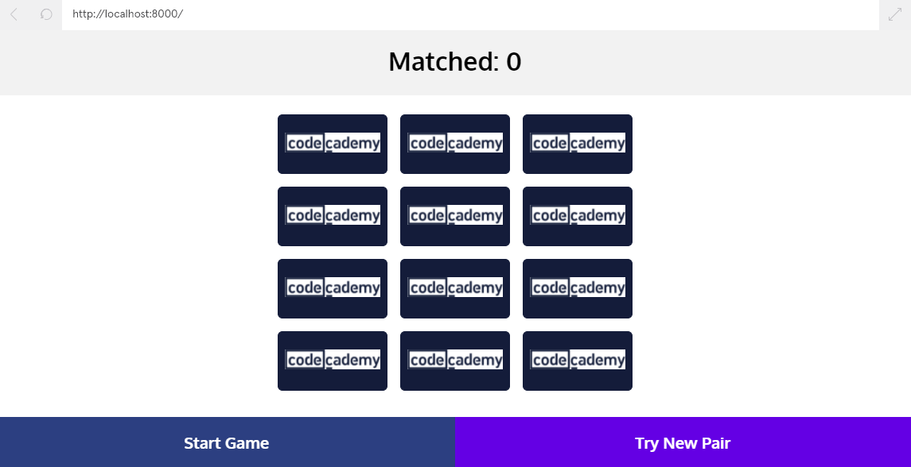

# Matching Memory
When introducing Redux to a React application, you transfer the responsibility of state management over to Redux. This is great because Redux is really good at state management, but this also hinders React’s optimized UI rendering. That is why react-redux was created to bind the UI rendering of React to the state management of Redux.

This project explores where react-redux fits into an application by finishing off the implementation of a one-player matching game.

The application consists of 5 React components:
1. App: The root component, App renders the Score and Board components.
2. Score: Child of the App component, Score will display the number of matched cards.
3. Board: Child of the App component, Board will create the card grid for gameplay.
4. CardRow: Child of the Board component, CardRow renders a row of Card components.
5. Card: Child of the CardRow component, Card displays the card content when flipped over.

One goal of this project will be to show that a nested component like Card can access data and dispatch actions as easily as a higher-level component like App or Score.

Most of the Redux store logic is implemented in boardSlice.js. This includes initializing the state, the reducers, and the action creators.

The application state is an array of 12 objects with each object representing a card:
```JS
// card object
{
  id: uniqueID, 
  contents: wordString, 
  visible: visibleBoolean, 
  matched: matchedBoolean
}
```

There are 3 actions needed to run the game:
* setGame: randomize the card array and set visible and matched of all cards to false
* flipCard: set visible of the specified card id to true
* resetCards set visible to false on unmatched cards

To complete this project you will add a \<Provider /> component, implement selectors, retrieve data from the store with useSelector(), and dispatch actions with the help of useDispatch(). With all of this ahead of you, explore the starting code of the application and then move on to the first task to begin implementing the matching game.




