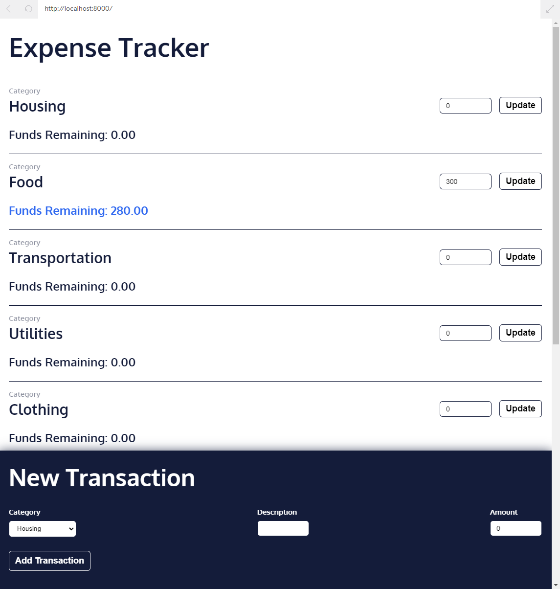
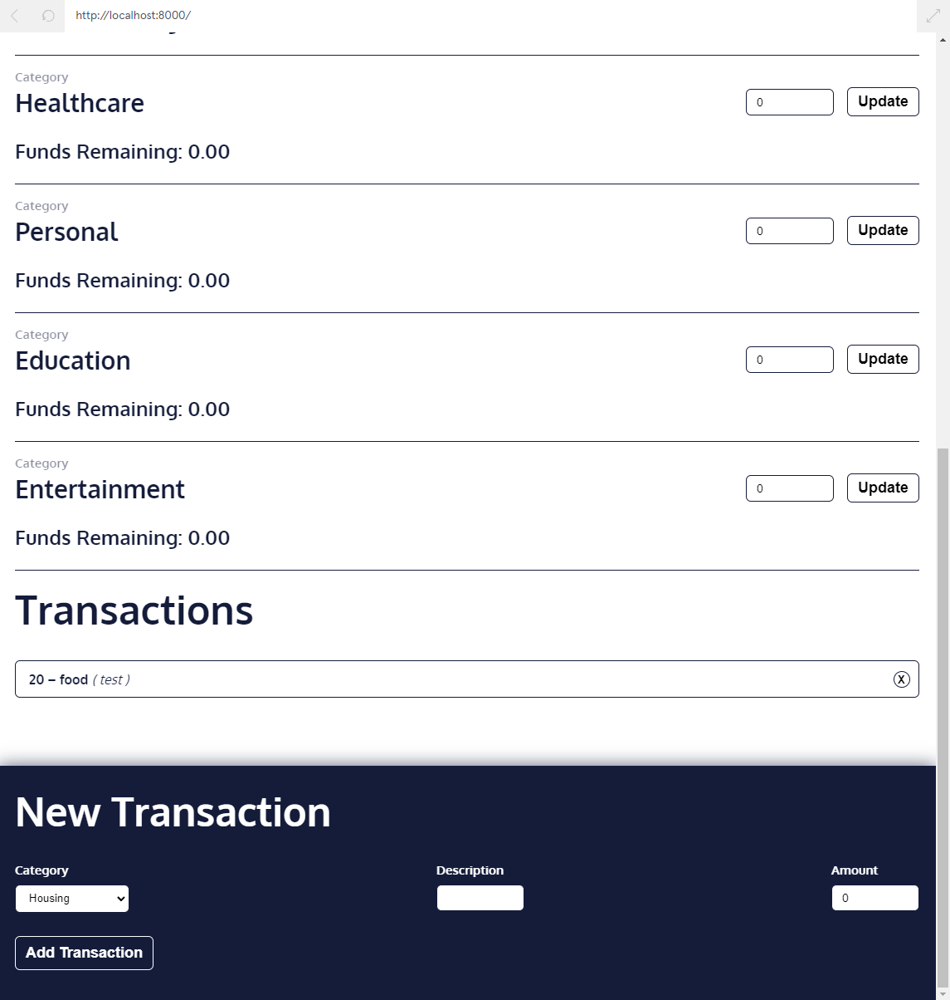

# Expense Tracker
This project—a budgeting and expense tracking app—allows you to practice refactoring with Redux Toolkit. The app allows you to set budgets for various categories, such as food and transportation, and track transactions in those categories. It then sums your spending in each category to calculate the amount of money that remains to be spent.

To help you to understand how the data of the application works, consider an example of the Redux store’s state:
```JS
{
  budgets: [ 
    { category: 'housing', amount: 400 },
    { category: 'food', amount: 100 },
    ...
  ],
  transactions: {
    housing: [ 
      { 
        category: 'housing', 
        description: 'rent', 
        amount: 400, 
        id: 123 
      }
    ],
    food: [ 
      { 
        category: 'food', 
        description: 'groceries on 1/12/2021', 
        amount: 50, 
        id: 456 
      },
      { 
        category: 'food', 
        description: 'dinner on 1/16/2021', 
        amount: 12, 
        id: 789 
      },
    ]
  }
}
```

You will work primarily in budgetsSlice.js and transactionsSlice.js where reducers and action creators are currently programmed by hand. Your task will be to refactor this project using a slice-based approach to produce the app’s actions and reducers.

Before you get started, spend some time using the app in its current implementation to ensure you understand how it’s supposed to work. Set a budget of $300 for food, create a $20 food transaction, and then check the food budget again to see how much you have left to spend. As you progress through the project, take note of the ways that Redux Toolkit simplifies your code.



