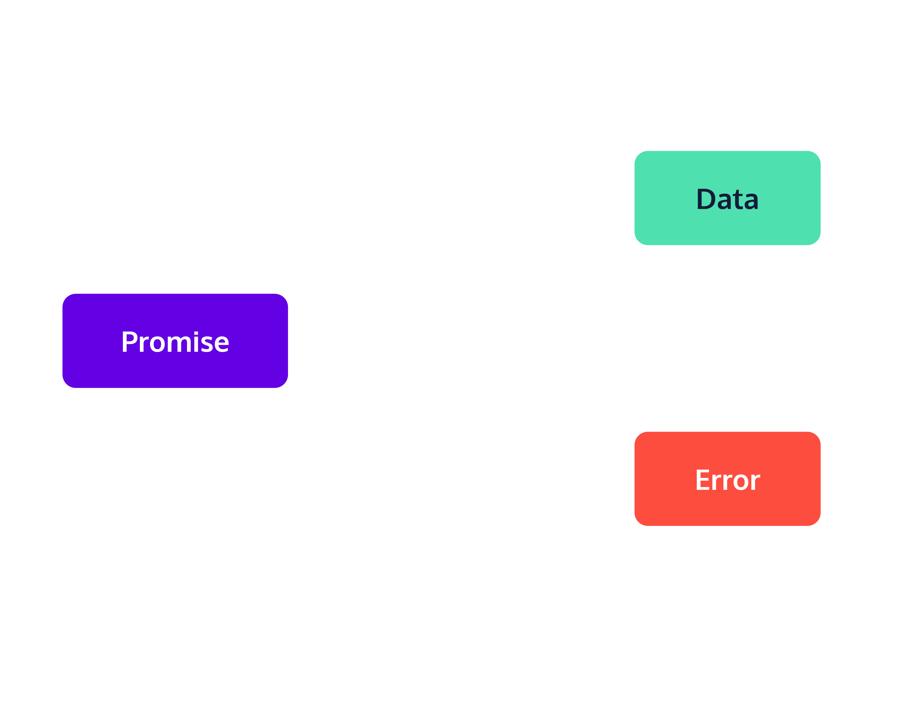

# Index
* [Redux Middleware](#redux-middleware)
* [Managing Promise Lifecycle Actions](#managing-promise-lifecycle-actions)

# Redux Middleware

## Introduction
At this point, we can write an app with Redux state management. But we haven’t covered one of the most common challenges in app development: making asynchronous requests. With a basic Redux store, we can only do synchronous updates. When an action is dispatched, it is immediately processed by a reducer, which updates the store accordingly. But when developing applications, we often want to perform asynchronous operations (such as making API calls) and update the state based on the results.

In this lesson, you will gain the tools necessary to write asynchronous logic that interacts with your Redux store.
1. First, you will learn about two general concepts in computing: middleware and thunks, and the ways they relate to Redux.
2. Next, you will learn about redux-thunk, a middleware that uses a thunk-based approach to writing asynchronous actions.
3. Finally, you will practice using redux-thunk to add asynchronous functionality to your Redux apps.

## Middleware in Redux
Out of the box, Redux may meet most of your app’s state management needs. But every project is different, and so Redux provides some ways to customize its behavior. One of the ways we can customize Redux is by adding middleware.

You may be familiar with middleware from experiences working with other frameworks. As the name suggests, middleware is the code that runs in the middle—usually between a framework receiving a request and producing a response. Middleware is a powerful tool for extending, modifying, or customizing a framework or library’s default behavior to meet an application’s specific needs.

In Redux, middleware runs between the moment when an action is dispatched and the moment when that action is passed along to the reducer. By this point you’re familiar with the way data flows through Redux: actions are dispatched to the store, where they are processed by reducers that produce new state; that new state becomes accessible to all the components that reference it, causing those components update. We’ve rendered that flow in the included diagram, and added middleware to help you see where and how it comes into play.

Middleware intercepts actions after they are dispatched and before they are passed along to the reducer. Some common tasks that middleware perform include logging, caching, adding auth tokens to request headers, crash reporting, routing, and making asynchronous requests for data. You can add any of these functionalities to your apps by using popular open-source middleware. Of course, you can also write your own middleware to solve problems that are specific to your application and its architecture.

To make asynchronous requests in our recipe app, we’re using redux-thunk, a middleware for handling asynchronous requests. There are several popular middleware that make asynchronous functionality compatible with Redux; we chose this one because it’s one of the most widely-employed, and it is included with Redux Toolkit by default. In subsequent exercises, we will walk through how redux-thunk makes asynchronous requests possible; for now, you should just understand where it sits in Redux’s data flow.

## Write Your Own Middleware
Before we get to redux-thunk specifically, we want to solidify our understanding of how middleware fits into Redux’s data flow. Let’s explore how middleware actually gets invoked in Redux, so that we know how a middleware should be structured. After that, we’re going to write a simple middleware from scratch.

But first, you’ll recall from the previous exercise that middleware runs after an action is dispatched and before that action is passed along to the reducer. How does this actually work?

To add a middleware to our project, we use Redux’s applyMiddleware function like so.
```JS
import { createStore, applyMiddleware } from 'redux';
import { middleware1, middleware2, middleware3 } from './exampleMiddlewares';
import { exampleReducer } from './exampleReducer';
import { initialState} from './initialState';
 
const store = createStore(
  exampleReducer, 
  initialState, 
  applyMiddleware(
    middleware1, 
    middleware2, 
    middleware3
  )
);
```

The specifics of how applyMiddleware works are outside the scope of this lesson. All you need to know is that once middleware has been added to a Redux project, calls to dispatch are actually calls to the middleware pipeline (the chain of all added middlewares). This means that any actions we dispatch will be passed from middleware to middleware before they hit an app’s reducers.

Middlewares must conform to a specific, nested function structure in order to work as part of the pipeline (this nested structure is also called a [higher-order function](https://eloquentjavascript.net/05_higher_order.html), if you’d like to read more). That structure looks like this:
```JS
const exampleMiddleware = storeAPI => next => action => {
  // do stuff here
  return next(action);  // pass the action on to the next middleware in the pipeline
}
```

Each middleware has access to the storeAPI (which consists of the dispatch and getState functions), as well as the next middleware in the pipeline, and the action that is to be dispatched. The body of the middleware function performs the middleware’s specific task before calling the next middleware in the pipeline with the current action (note that if the middleware is the last in the pipeline, then next is storeAPI.dispatch so calling next(action) is the same as dispatching the action to the store).

## Introduction to Thunks
Recall that our overarching goal in this lesson is to give you the tools you need to add asynchronous functionality to your Redux apps. One of the most flexible and popular ways to add asynchronous functionality to Redux involves using thunks. A thunk is a higher-order function that wraps the computation we want to perform later. For example, this add() function returns a thunk that will perform x+y when called.
```JS
const add = (x,y) => {
  return () => {
    return x + y; 
  } 
}
```

Thunks are helpful because they allow us to bundle up bits of computation we want to delay into packages that can be passed around in code. Consider these two function calls, which rely on the add() function above:
```JS
const delayedAddition = add(2,2)
delayedAddition() // => 4
```

Note that calling add() does not cause the addition to happen – it merely returns a function that will perform the addition when called. To perform the addition, we must call delayedAddition().

## `redux-thunk`
To appreciate how thunks can help us integrate asynchronous actions into our Redux apps, let’s review the barriers to performing asynchronous operations that exist within traditional Redux. First, asynchronous logic returns promises, and store.dispatch expects to receive a plain object with a type property. Second, asynchronous operations create side effects. And so including them in our reducers would violate a core tenet of Redux, which is that [reducers must be pure functions](https://redux.js.org/tutorials/essentials/part-2-app-structure#rules-of-reducers).

Redux recommends making code with side effects part of the action creation process. It would be great if we could write action creators that return thunks, which would handle our asynchronous operations, in addition to the plain objects we’ve returned from our action creators thus far.

As it turns out, redux-thunk is a middleware that lets you do exactly that. redux-thunk makes it simple for you to write asynchronous logic that interacts with the store by allowing you to write action creators that return thunks instead of objects. These thunks can perform asynchronous operations, and per the [redux-thunk documentation](https://github.com/reduxjs/redux-thunk#motivation), “can be used to delay dispatching an action” (for example, until after an API response is received), or “to dispatch an action only if certain conditions are met”.

For example, imagine we’ve written a simple counter whose reducer contains a single value, which is updated by a single reducer. Without redux-thunk we are limited to writing synchronous action creators like this one:
```JS
const increment = () => {
  return {
    type: 'counter/increment',
  }
}
```

When we call dispatch(increment()), the value in our store immediately increases. With redux-thunk, we can extend our counter app to accommodate asynchronous action creators, like asyncIncrement, in addition to synchronous ones.
```JS
const incrementLater = async () => {
  setTimeout(() => {
    dispatch(increment())    
  }, 1000)    
};
 
const asyncIncrement = () => {
  return incrementLater;
}
```

redux-thunk is such a popular solution for handling asynchronous logic that it is included in Redux Toolkit. It also exists as a standalone package, but you won’t need to install redux-thunk separately if you use Redux Toolkit. This is because Redux Toolkit’s configureStore function, which you learned about in a previous lesson, will apply redux-thunk to the store by default.

## Writing Thunks in Redux
To better appreciate redux-thunk, let’s review the process of retrieving data from a Redux store. For example, suppose we have a list of users’ data, and want to retrieve the data corresponding to the user with a particular id = 32. Assuming we have that user’s data in the store, we can access the user’s data by writing a selector to retrieve the information we need.
```JS
useSelector((state) => state.users.byId[32]);
```

But what if we don’t have that particular user in the store? Say, for example, that we need to fetch the user’s data from an API. Ideally, we would like to be able to dispatch an action creator that would first perform an asynchronous operation (fetching the data), and then dispatch a synchronous action (adding the data to the store) after the asynchronous operation completes.

This is where thunks come in handy. Up to this point, we’ve only written action creators that returned plain objects. But redux-thunk allows us to write action creators that return thunks, within which we can perform any asynchronous operations we like. Consider the following asynchronous action creator:
```JS
import { fetchUser } from './api'
const getUser = (id) => {
  return async (dispatch, getState) => {
    const payload = await fetchUser(id);
    dispatch({type: 'users/addUser', payload: payload});
  }
}
```

getUser has two key parts: the synchronous outer function (otherwise known as the thunk action creator) which returns the inner, asynchronous thunk. The thunk receives dispatch and getState as arguments, and dispatches a synchronous action after the asynchronous operation (fetchUser) completes.

To get the user with id = 32, we can call dispatch(getUser(32)). Note that the argument to dispatch is not an object, but an asynchronous function that will first fetch the user’s data and then dispatch a synchronous action once the user’s information has been retrieved.

## `redux-thunk` Source Code
At this point, you are ready to use thunks to define asynchronous operations in Redux. But you may be curious about how redux-thunk works. In order to allow us to write action creators that return thunks in addition to plain objects, the redux-thunk middleware performs a simple check to the argument passed to dispatch. If dispatch receives a function, the middleware invokes it; if it receives a plain object, then it passes that action along to reducers to trigger state updates.

We’ve pasted the source code into your code editor so you can see it for yourself. [And here’s a link to the project’s repo in case you’d like to explore further](https://github.com/reduxjs/redux-thunk/blob/master/src/index.ts)!

We won’t worry about the extraArgument option, so for our purposes, we can focus on thunk, the default export, which is equal to the function returned on line 2.

Recall getUser, the thunk action creator from the previous exercise:
```JS
const getUser = (id) => {
  return async (dispatch, getState) => {
    const payload = await fetchUser(id)
    dispatch({type: 'users/addUser', payload: payload})
  }
}
```

Suppose we were to call dispatch(getUser(7)) with the thunk middleware applied. We know that getUser(7) returns a thunk, so on line 3 of the thunk middleware, typeof action === 'function' will evaluate to true. On line 4, the middleware will then invoke getUser(7) with the arguments dispatch and getState. This invocation will initiate the asynchronous fetching performed by the thunk. When that asynchronous fetching is complete, the thunk will dispatch the synchronous action {type: ‘users/addUser’, payload: payload}.

For contrast, let’s walk through what happens when we dispatch that synchronous action. Since the action is a plain object, typeof action === 'function' will evaluate to false. The redux-thunk middleware therefore skips to line 7, and invokes the next middleware in the pipeline, passing the action along.

## Conclusion
In this lesson you:
* Learned about Redux middleware and wrote your own simple logging middleware
* Encountered thunks and learned about how valuable thunks are for deferring computation
```JS
const remindMeLater = task => { 
  return () => {
    remindMeTo(task)
  } 
}
```

* Discovered redux-thunk, a middleware that allows you to write asynchronous action creators that return thunks instead of objects
* Automatically enabled redux-thunk by using configureStore
```JS
import { configureStore } from '@reduxjs/toolkit;
```

* Took a deep dive into the middleware’s source code, in order to understand how the middleware actually works
* Wrote your own asynchronous action creators in the format that redux-thunk expects
```JS
const getUser = (id) => {
  return async (dispatch, getState) => {
    const payload = await fetchUser(id)
    dispatch({type: 'users/addUser', payload: payload})
  }
}
```

If you’d like to learn more, you can read the [redux-thunk documentation](https://github.com/reduxjs/redux-thunk) and [visit the Redux Toolkit site to see how configureStore includes redux-thunk by default](https://redux-toolkit.js.org/api/getDefaultMiddleware#getdefaultmiddleware).

# Managing Promise Lifecycle Actions

## ntroduction
At this point, you can write a Redux app that uses redux-thunk—a middleware included in Redux toolkit—to permit asynchronous operations, such as fetching data from an API. In this lesson, we will explore some common patterns for managing asynchronous operations and the state changes they cause. We will learn about two Redux toolkit utilities—createAsyncThunk and the extraReducers option you can pass to the createSlice function—that simplify the process of performing asynchronous operations and reflecting their results in state.

This lesson uses [Mock Service Worker](https://mswjs.io/) to replicate the functionality of an external API. To use MSW, you’ll want to use Google Chrome and [enable third-party cookies](https://support.google.com/chrome/answer/95647?co=GENIE.Platform%3DDesktop&hl=en).

## Promise Lifecycle Actions
In a perfect world, every network request we make would yield an immediate and successful response. But network requests can be slow, and sometimes fail. As developers, we need to account for these realities in order to create the best possible experience for our users. If we know a request is pending, we can make our application more user-friendly by displaying a loading state. Similarly, if we know a request has failed, we can display an appropriate error state.

In order to create these satisfying user experiences, we need to keep track of the state our async requests are in at any given moment so that we can reflect those states for the user. It is common to dispatch a “pending” action right before performing an asynchronous operation, and “fulfilled” or “rejected” actions depending on the results of the completed operation. Take this simple thunk action creator, fetchUserById.
```JS
import { fetchUser } from './api';
 
const fetchUserById = (id) => {
  return async (dispatch, getState) => {
    const payload = await fetchUser(id);
    dispatch({type: 'users/addUser', payload: payload});
  }
}
```

Rewritten to include pending and rejected actions, it might look like this:
```JS
import { fetchUser } from './api'
const fetchUserById = (id) => {
  return async (dispatch, getState) => {
    dispatch({type: 'users/requestPending'})
    try {
      const payload = await fetchUser(id)
      dispatch({type: 'users/addUser', payload: payload})
    } catch(err) {
      dispatch({type: 'users/error', payload: err})
    }
  }
}
```

We call these pending/fulfilled/rejected actions promise lifecycle actions. This pattern is so common that Redux Toolkit provides a neat abstraction, createAsyncThunk, for including promise lifecycle actions in your Redux apps. We’ll explore that method in the following exercises.




## createAsyncThunk()
createAsyncThunk is a function with two parameters—an action type string and an asynchronous callback—that generates a thunk action creator that will run the provided callback and automatically dispatch promise lifecycle actions as appropriate so that you don’t have to dispatch pending/fulfilled/rejected actions by hand.

To use createAsyncThunk, you’ll first need to import it from Redux Toolkit like so:
```JS
import { createAsyncThunk } from '@reduxjs/toolkit';
```

Next, you’ll need to call createAsyncThunk, passing two arguments. The first is a string representing the asynchronous action’s type. Conventionally, type strings take the form "resourceType/actionName". In this case, since we are getting an individual user by their id, our action type will be users/fetchUserById. The second argument to createAsyncThunk is the payload creator: an asynchronous function that returns a promise resolving to the result of an asynchronous operation. Here is fetchUserById rewritten using createAsyncThunk:
```JS
import { createAsyncThunk } from '@reduxjs/toolkit'
import { fetchUser } from './api'
const fetchUserById = createAsyncThunk(
  'users/fetchUserById', // action type
  async (arg, thunkAPI) => { // payload creator
    const response = await fetchUser(arg);
    return response.json();
  }
)
```

There are a few things worth highlighting here. First, observe that the payload creator receives two arguments—arg and thunkAPI. We will elaborate on those in the next exercise. Second, note that the payload creator we provided doesn’t dispatch any actions at all. It just returns the result of an asynchronous operation.

As you can see, createAsyncThunk makes defining thunk action creators more concise. All you have to write is an asynchronous thunk function; createAsyncThunk takes care of the rest, returning an action creator that will dispatch pending/fulfilled/rejected actions as appropriate.

## Passing Arguments to Thunks
In the last exercise, we promised to elaborate on the two arguments that the payload creator (the asynchronous function we pass to createAsyncThunk) receives: arg and thunkAPI. The first argument, arg, will be equal to the first argument passed to the thunk action creator itself. For example, if we call fetchUserById(7), then inside the payload creator, arg will be equal to 7.

But what if you need to pass multiple arguments to your thunk? Since the payload creator only receives the first argument passed to the thunk action creator, you’ll want to bundle multiple arguments into a single object. For example, say we want to search our app’s users by first and last name. If the thunk action creator is called searchUsers, we would call it like this: searchUsers({firstName: 'Ada', lastName: 'Lovelace'}).

If you need to access these variables individually, you can use ES6 destructuring assignment to unpack the object when you declare the payload creator and pass it to createAsyncThunk, like this :
```JS
const searchUsers = createAsyncThunk(
    'users/searchUsers',
    async ({ firstName, lastName}, thunkAPI) => {
        // perform the asynchronous search request here    
    }
)
```

If your thunk requires no arguments, you can just call your thunk action creator without, and the arg argument will be undefined. In the event the thunk requires only one param (for example, fetching a specific resource by id) you should name that first param semantically. Here’s the fetchUserById example from the last exercise, with the arg parameter semantically renamed to userId.
```JS
import { createAsyncThunk } from '@reduxjs/toolkit'
import { fetchUser } from './api'
const fetchUserById = createAsyncThunk(
    'users/fetchUserById', // action type
    async (userId, thunkAPI) => { // payload creator
        const response = await fetchUser(userId)
        return response.data
    }
)
```

The payload creator’s second argument, thunkAPI, is an object containing several useful methods, including the store’s dispatch and getState. [For an exhaustive list of methods available in the thunkAPI object, you can read the documentation](https://redux-toolkit.js.org/api/createAsyncThunk#payloadcreator).

## Actions Generated by createAsyncThunk
As you know, createAsyncThunk takes care of dispatching actions for each of the promise lifecycle states: pending, fulfilled, and rejected. But what exactly do these actions look like?

Building off the action type string you pass to it, createAsyncThunk produces an action type for each promise lifecycle states. If you pass the action type string 'resourceType/actionType' to createAsyncThunk, it will produce these three action types:
* 'resourceType/actionType/pending'
* 'resourceType/actionType/fulfilled'
* 'resourceType/actionType/rejected'

To use our earlier example:
```JS
import { createAsyncThunk } from '@reduxjs/toolkit'
import { fetchUser } from './api'
 
const fetchUserById = createAsyncThunk(
  'users/fetchUserById', // action type
  async (userId, thunkAPI) => { // payload creator
    const response = await fetchUser(userId)
    return response.data
  }
)
```

When you pass createAsyncThunk the action type string 'users/fetchUserById', createAsyncThunk produces these three action types:
* 'users/fetchUserById/pending'
* 'users/fetchUserById/fulfilled'
* 'users/fetchUserById/rejected'

If you need to access the individual pending/fulfilled/rejected action creators, you can reference them like this:
* fetchUserById.pending
* fetchUserById.fulfilled
* fetchUserById.rejected

You will have to handle these action types in your reducers if you want to reflect these promise lifecycle states in your app. In the next exercise, we will show you how to do that.

## Using createSlice() with Async Action Creators
In a previous lesson, you learned about createSlice. In this lesson, you will learn about extraReducers, a property you can optionally pass to createSlice that allows createSlice to respond to action types it did not generate.

To refresh your memory, createSlice accepts a single argument, options, which is an object containing configuration parameters including a name, some initial state, and reducers. createSlice then uses these configuration parameters to generate a slice of the store, including action creators and action types for updating the state contained in that slice. Consider the following example:
```JS
const usersSlice = createSlice({
  name: 'users',
  initialState: { users:  [] },
  reducers: {
    addUser: (state, action) => { 
      state.users.push(action.payload) 
    }        
  },
})
```

This call to createSlice, generates a slice of the store that responds to the action creator usersSlice.actions.addUser. But what if we’ve generated our action creators via calls to createAsyncThunk? Consider fetchUserById, the asynchronous action creator from earlier in this lesson:
```JS
const fetchUserById = createAsyncThunk(
  'users/fetchUserById', // action type
  async (userId, thunkAPI) => { // payload creator
    const response = await fetchUser(arg)
    return response.data
  }
)
```

This asynchronous action creator will generate three action types: 'users/fetchUserById/pending', 'users/fetchUserById/fulfilled', and 'users/fetchUserById/rejected'. Currently, these action types have no effect on our users slice, which only responds to the users/addUser action type generated by createSlice.

How can we account for these promise lifecycle action types in our user slice? This is exactly the problem that extraReducers, an optional property on the configuration object passed to createSlice, was designed to solve. extraReducers allows createSlice to respond to action types generated elsewhere. To make the users slice respond to promise lifecycle action types, we pass them to createSlice in the extraReducers property.

Open usersSlice.js in your code editor to see an example of the extraReducers property in context.

Note that in addition to using the extraReducers property, we also added some extra fields to our state object: a boolean, isLoading, which will be true when a request is pending, and otherwise false, and a boolean hasError, which we will set to true if our request to fetch a user is rejected. These additions allow us to track promise lifecycle states so that we can create satisfying and informative user interfaces when the promise is either pending or rejected. When the promise is fulfilled these are set to false and the user data is added to the state.

## Conclusion
Well done! In this lesson you:
* Learned the three promise lifecycle actions: pending, fulfilled, and rejected
* Learned how to use createAsyncThunk, which abstracts the process of handling promise lifecycle states according to best practices/common design paradigms
* Imported createAsyncThunk from the Redux Toolkit:
```JS
import { createAsyncThunk } from '@reduxjs/toolkit';
```

* Refactored existing asynchronous action creators using createAsyncThunk.
* Made your reducers respond to pending/fulfilled/rejected promise lifecycle actions by supplying the extraReducers property to createSlice.
