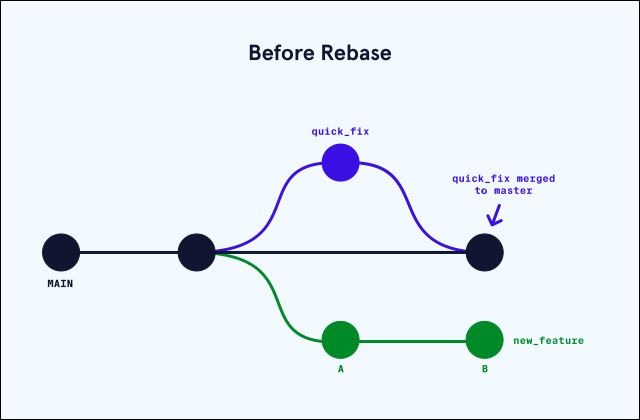

# Index
* [How to Use Git Rebase](#how-to-use-git-rebase)
* [Git Rebase Off-Platform Project](#git-rebase-off-platform-project)
* [Managing a GitHub Repository](#managing-a-github-repository)
* [Using a .gitignore File in Your GitHub Repository](#using-a-gitignore-file-in-your-github-repository)

# How to Use Git Rebase

When working with a Git repository, there will be a time when we need to combine changes from a working branch into another one. This can be accomplished with the use of the commands merge or rebase. In this article, we’ll focus on rebase and see how it can work some magic in order to manage the future development of a product by simplifying git history.

## What is Git Rebase?
At a high level, rebasing can be understood as “moving the base of a branch onto a different position”. Think of it like a redo — “I meant to start here.”

Consider that a team just completed a production release. While working on a completely new feature branch called new_feature, a co-worker finds a bug in the production release (main branch). In order to fix this, a team member creates a quick_fix branch, squashes the bug, and merges their code in to the main branch. At this point, the main branch and the new_feature branch have diverged and they each have a different commit history. We can visualize this in the image below:



If we want to bring the updated changes from main into new_feature one could use the merge command, but with rebase we can keep the Git commit history clean and easy to follow. By “rebasing” the new_feature branch onto the main one, we move all the changes made from new_feature to the front of main and incorporate the new commits by rewriting its history. We can see how this is done below:


We can see above that the new “base” of our new_feature branch is the updated main branch with the previous changes from the bug fix implemented.

One of the major benefits of using Git rebase is that it eliminates unnecessary merge commits required by git merge. Most importantly, the history of the changes made in the main repository remains linear and follows a clear path of changes. This allows us to navigate the changes easier when viewing the changes in a log or graph.

## Merge vs Rebase
Although git rebase is an extremely useful tool to keep a Git repository clean and easy to follow, it doesn’t mean that one should always stick to that command when integrating code changes. Let’s go over the definitions of rebase and merge one more time:
* Git rebase: Reapplies commits on top of another base branch.
* Git merge: joins two or more development histories together (creating a new merge commit).

In other words, Git merge preserves history as it happened, whereas rebase rewrites it.

Generally, if one is dealing with numerous branches, and the commit graph becomes really difficult to read, it can be very useful to use rebase instead of merge. Since Git rebase creates a linear history, it can be a lot easier to visualize the changes made and get a cleaner graph.


In the end, each team will develop their preferred method of integrating changes and preserving history. Generally, it’s useful to use merge whenever we want to add changes of a branch back into the base branch. And rebase is useful whenever we want to add changes of a base branch back to a branched out branch.

## Disadvantages of using rebase
As useful as Git rebase can be, it doesn’t come without risks. When using git rebase in our workflow it’s imperative to understand that rebase is a destructive operation and creates new commits, which can make it complicated to track the context of any changes made. One common rule when using rebase is to only use it locally. That is to say, once something has been pushed then do not rebase it after that. Otherwise, things can get convoluted when rewriting history on a remote.

Since we’re rewriting history we will also have to solve more commit conflicts. When we merge a branch, we only need to solve the conflicts once straight into the merge commit. However, when using rebase we might end up having to solve similar conflicts in previous commits that are being rewritten because rebase practically cherry-picks each commit individually and attempts to merge it in. If a commit introduces a conflict, rebase will complain about it even if the conflict is fixed in subsequent commits. In order to reduce the number of merge conflicts, it’s suggested to rebase often and to also squash changes into one commit as much as possible.

Moreover, make sure that the branch we’re working on is not a shared branch. A shared branch meaning a branch that exists on the distant repository and that other people on our team could pull. Why should we avoid this? Well, remember that rebasing changes commit history. So if we share our commits publicly, and others start additional work based on those commits, our trees are no longer in sync after rebasing. As a golden rule, it’s important to only use rebase on a local branch that we’re working on individually.

## Conclusion
Git rebase can be a very powerful tool when working with numerous people and branches, if used correctly it allows everyone to view a very clean commit history and track what commits fixed given defects or whether or not a commit was included in a release. However, it’s critical to understand how it works and the risks that come with it since it’s a destructive operation. If done so correctly, it can result in a very fluid and effective workflow.

# Git Rebase Off-Platform Project

As a refresher, the Git rebase functionality helps branches keep up to date with the most recent changes in the main branch. We get a more linear history in the repository after rebasing. In this project, you will help two friends with their project of transcribing a story onto a GitHub repository.

Let’s start with a bit of back story; Viraj and Noah collaborate to transcribe the children’s story of “The Little Black Fish” and store the text in a Github repository. They have broken the story into two parts, with Viraj working on part 1 while Noah types part 2. They track their progress in a GitHub repository

They decided to work on separate branches to avoid conflicts in case there is any overlap. Viraj works in a branch named part_1, and Noah tracks his contributions in part_2. The main branch follows the most recent approved and merged work.


Viraj and Noah started working on Monday and made some progress on their parts. They committed and pushed changes to their feature branches, part_1 and part_2, respectively.

Noah ends the day by creating a pull request and merging his changes to the main branch of the repository.


Note that both main and part_2_Monday track the same progress andpart_1_Monday tracks its isolated progress while staying behind from the most recent changes. So let’s help Viraj keep his branch up to date with the most recent changes using the git rebase command. Please note that Viraj could alternatively pull origin main and merge the changes into his branch if he didn’t care about maintaining all the interim commits. Nevertheless, we will proceed with rebasing to maintain the commits.

Let’s see if you can help them rebase the repository! [Fork the repository](https://github.com/Codecademy/practice-rebase-off-platform-project) to your Github account and clone it onto your local computer. Next, open a terminal and change your current directory to the directory of the local repository and visually observe the state of the branches:
```
> git checkout part_1_Monday
> git pull
> git checkout part_2_Monday
> git pull
```

You can use the following Git command to see a fuller picture of commits and progresses made in the branches:
```
> git log --graph --decorate --oneline --all
```

Now, check out Viraj’s branch:
```
> git checkout part_1_Monday
```

And rebase Viraj’s branch with main:
```
> git rebase main
```
Notice that the The Little Black Fish - Part 2 file in Viraj’s branch is updated with Noah’s changes.

Observe the new state of the branches, visually:
```
> git log --graph --decorate --oneline --all
```

## Walkthrough
If you need any more guidance to complete this project, we have a project walkthrough video for you:

## [Youtube: Git Rebase](https://www.youtube.com/watch?v=85Lx8s_i4Yk)

## Conclusion
In this tutorial, you applied git rebase in a repository. Git rebase is an important feature for collaborating effectively in a development team. Using git rebase, you can keep your branches up to date with the most recent changes while keeping your in-progress changes isolated!

# Managing a GitHub Repository

## GitHub Repository Settings


GitHub is a powerful code hosting platform for version control and collaboration. It allows multiple people to work on the same project from anywhere. However, that doesn’t even begin to scratch the surface of what GitHub has to offer. In this article, we will explore settings to customize our GitHub repository as well as discuss features that will take our repository to the next level.

All GitHub settings can be accessed by clicking the ⚙️Settings tab on the main page of our repository. You can follow along with this article by opening your own repository settings!


### The Options Tab
The Options tab allows us to change the basic repository information such as its name and social media banner. It’s where we can enable or disable certain GitHub features like Wikis, Issues, Discussions, and more. We can also change merge options to only allow certain types of merges, or automatically delete head branches. Most importantly, there’s the danger zone.

#### The Danger Zone


As the name suggests, the danger zone is where one should take caution when changing settings. We can make a repository private or public, transfer ownership to another user, and archive or delete the repository.

### The Branches Tab
The settings’ Branches tab is where we can set a default branch. The default branch is the branch against which all pull requests and code commits are automatically made (typically this is already set to the main branch). We can also protect our branches by adding rules that prevent branches from being deleted, disable force pushing, or require a pull request to be made before merging to a branch.

## Managing Repository Access
By default, only the owner of the repository or the organization can configure the settings of a repository and access the tools. We have to go through the repository settings’ Manage Access tab to grant other users or teams access. The specificity of permissions differs greatly between a user repository and an organization repository.

As always, we should use caution when granting permissions especially to those outside of our immediate organization or team. They can make undesired changes to the code, host pages or packages on our behalf, or even leak private source code.

### User Repository
For a user repository, the owner can easily add another user by clicking the “Add people” button, searching their full name, email address, or username. The user will then have to accept the invitation. While the added user doesn’t have the same permissions as the owner of the repository, the user can still rename a branch and publish packages among other things. For more information on the differences between the permission levels, check out [GitHub Docs](https://docs.github.com/en/account-and-profile/setting-up-and-managing-your-github-user-account/managing-user-account-settings/permission-levels-for-a-user-account-repository).


### Organization Repository
GitHub Organizations provide its members a way to collaborate on multiple projects across multiple repositories. Owners or administrators of the organization can manage member access to the organization’s repositories. Adding a member to a repository is no different from the process in a user repository with the exception of adding teams. In a GitHub Organization, admins can group members into teams and reference users by team names. You can read more about organization roles and their varying abilities on the [GitHub Docs](https://docs.github.com/en/organizations/managing-peoples-access-to-your-organization-with-roles/roles-in-an-organization).


#### Repository Roles
Businesses and institutions usually have a hierarchy that defines levels of authority and responsibilities. The same principles can be applied in a GitHub repository or organization; we don’t want everyone to have admin privileges. Plus, it’s strategic and secure to map levels of access.

You can check out GitHub Docs for a detailed breakdown of permissions for repository roles. You can also read about [creating custom repository roles](https://docs.github.com/en/enterprise-cloud@latest/organizations/managing-peoples-access-to-your-organization-with-roles/managing-custom-repository-roles-for-an-organization) to have a configurable set of permissions with a role name of your choice.

### Other Repository Features and Tools
So far, we’ve already discussed the GitHub features we will be using most of the time. However, GitHub has a ton of advanced tools and settings we should definitely take advantage of. While we will not be diving deep into these, we still want you to be aware of them so you can revisit them when the need arises. Each of the following features has a dedicated tab in the GitHub repository settings:
* Security & Analysis: We can enable or disable a variety of security features for our repository.
* [Webhooks](https://docs.github.com/en/developers/webhooks-and-events/webhooks/about-webhooks): We can use webhooks to get notifications when certain events happen.
* Notifications: We can receive email notifications when push events are triggered.
* Integrations: Any open source applications we use to extend our GitHub workflow or any third-party tools we integrate with GitHub will appear here. For example, Slack or CircleCI.
* [Deploy Keys](https://docs.github.com/en/developers/overview/managing-deploy-keys#deploy-keys): We can use the SSH keys generated here to grant servers access to a repository for deployment.
* [Actions](https://docs.github.com/en/actions): GitHub Actions is a powerful tool to automate, customize, and execute software workflows such as testing The [Actions tab](https://docs.github.com/en/repositories/managing-your-repositorys-settings-and-features/enabling-features-for-your-repository/managing-github-actions-settings-for-a-repository) allows us to change the permissions.
* Secrets: Secrets are encrypted environment variables that can be used in Actions.
* [Pages](https://pages.github.com/): GitHub Pages allows us to host simple web pages straight from the repository.

# Using a .gitignore File in Your GitHub Repository

## What is a .gitignore file?
What happens when our Git repository contains certain files we never want to commit to a shared or public codebase? We want to be careful that git add doesn’t accidentally move them to the staging area. That’s where a .gitignore file comes in. .gitignore is a plain text file that tells Git to intentionally ignore changes in certain files. This also ensures that no other contributor in the repository accidentally commits those files.

## Why use a .gitignore file?
Each line in .gitignore corresponds to a file, directory, or pattern we would like to ignore when staging. Using a .gitignore file results in cleaner staging areas and prevent files containing sensitive information from being committed. Some of the files or folders we should ignore include:
* Configuration files with API or secret keys such as .env
* Compiled binary files or production directories such as build or dist
* Log files
* Dependencies downloaded from a package manager such as node_modules
* System files such as thumbs.db on Windows or .DS_Store on macOS

## .gitignore in action
Let’s say we run git status and see that operating system files, such as thumbs.db and .DS_Store, are staged and will be committed!


Let’s ignore those files using their exact names. For example, if we add these lines to our .gitignore file:
```
# Windows OS file
thumbs.db
 
# macOS OS file
.DS_Store
```

Git will ignore the special operating system files for Windows and macOS. These files will never be committed for this particular repository regardless of their location in this project. Note that in the file, blank lines are ignored and lines starting with # are treated as comments.

After unstaging and running git add . again, the output of git status shows that the thumbs.db and .DS_Store files have been ignored!


Let’s go over how to write a file yourself!

## Creating a .gitignore File
We can create a .gitignore file easily using a terminal editor like nano or emacs, or just using a File explorer. Don’t forget the . before the filename!

.gitignore is usually placed in the root directory of the repository. The filenames inside a .gitignore file can be written relative to the location of the .gitignore file. For example, we could add the line
```
src/main.js
```
to ignore the file main.js under the src/ directory.


Note: since .gitignore is a hidden file, we will need to add the -a flag to ls to see it.

## Ignore a directory with .gitignore
Sometimes we want to ignore entire directories or specify certain files in a directory. Common directories to leave out of a Git repository are node_modules or logs folder. We can ignore an entire directory by simply adding its name to .gitignore:
```
node_modules/
```

This will ignore the node_modules directory, and all subdirectories and files inside them. The forward slash / specifies that we are ignoring the directory.

## .gitignore Patterns
We can take advantage of [patterns](https://git-scm.com/docs/gitignore#_pattern_format) to match multiple filenames. These help us handle special cases such as ignoring specific file types or ignoring all but one file inside a directory. Some examples of things that make up patterns are:
* Wildcard * to match 0 or more characters except for /. For example, adding \*.html to .gitignore would ignore all files ending with the .html extension. example* would match any file starting with example such as example.txt or exampleHtmlFile.html.
* Negation ! as a prefix to negate any file that would otherwise be ignored. For example,
  ```
  index*
  !public/index.css
  ```
  will ignore all files starting with index except for src/index.css. But, we cannot negate a file inside an ignored directory.
* Square brackets [] can be used to match a single character from a set of characters or a range of characters. Note that the range can be alphabetical: \[a-z] or \[A-Z], numeric \[0-9], or a set of characters. If we added index.\[a-i]* with both the square bracket and wildcard to .gitignore, we would ignore index.css and index.html but not index.js, since “j” is outside of the \[a-i] range.
* Double asterisk \** is used to match 0 or more directories. If we had a temp folder inside all of the folders in the root directory and we only wanted to match files with the .log extension, we could use the pattern \**/temp/*.log.

## GitHub Provided Templates
When we create a new repository on GitHub, we have the option to add a .gitignore file from a list of templates. These templates are pulled from [GitHub’s gitignore repository](https://github.com/github/gitignore). For example, below is the template for Java projects.
```
# Compiled class file
*.class
 
# Log file
*.log
 
# BlueJ files
*.ctxt
 
# Mobile Tools for Java (J2ME)
.mtj.tmp/
 
# Package Files #
*.jar
*.war
*.nar
*.ear
*.zip
*.tar.gz
*.rar
```

## Conclusion
Good job on completing this article! .gitignore files are incredibly useful to make sure our repositories are only tracking changes on relevant files. They also ensure that we can keep files with sensitive data out of the staging area. You’ll come across .gitignore files in almost every project on GitHub.

This file is shared by the repository, so make sure your patterns are correct and take your time with creating your first .gitignore file!
