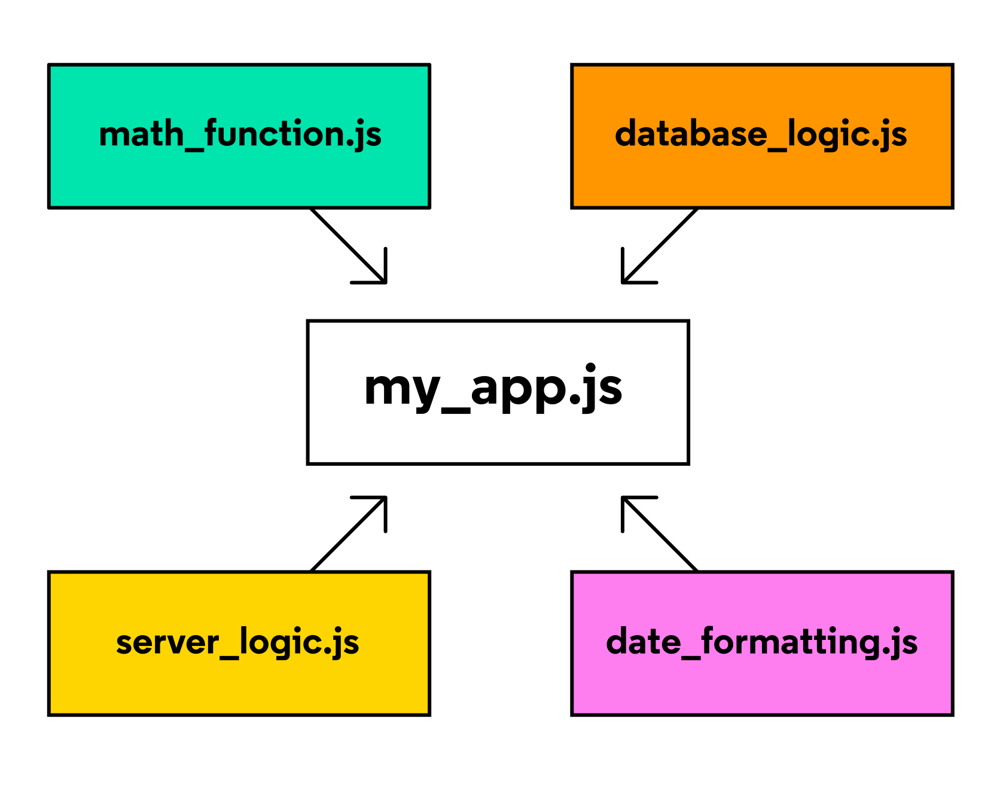

# Index
* [Implementing Modules in Node](#implementing-modules-in-node)
* [Node Package Manager](#node-package-manager)

# Implementing Modules in Node

## What are Modules?
Modules are reusable pieces of code in a file that can be exported and then imported for use in another file. A modular program is one whose components can be separated, used individually, and recombined to create a complex system.

Consider the diagram below of an imaginary program written in a file my_app.js:



Note: The words “module” and “file” are often used interchangably

Instead of having the entire program written within my_app.js, its components are broken up into separate modules that each handle a particular task. For example, the database_logic.js module may contain code for storing and retrieving data from a database. Meanwhile, the date_formatting.js module may contain functions designed to easily convert date values from one format to another (a common headache among programmers!).

This modular strategy is sometimes called separation of concerns and is useful for several reasons. What do you think those reasons might be?

<b>Write down a few of your ideas before revealing the reasons below:</b>
By isolating code into separate files, called modules, you can:
* find, fix, and debug code more easily.
* reuse and recycle defined logic in different parts of your application.
* keep information private and protected from other modules.
* prevent pollution of the global namespace and potential naming collisions, by cautiously selecting variables and behavior we load into a program.

Implementing modules in your program requires a small bit of management. In the remainder of this article, we will be covering:
* How to use the Node.js module.exports object to export code from a file - meaning its functions and/or data can be used by other files/modules.
* How to use the Node.js require() function to import functions and/or data from another module.

## Implementations of Modules in JavaScript: Node.js vs ES6
Before we dive in, it should be noted that there are multiple ways of implementing modules depending on the runtime environment in which your code is executed. In JavaScript, there are two runtime environments and each has a preferred module implementation:
1. The Node runtime environment and the module.exports and require() syntax.
2. The browser’s runtime environment and the ES6 import/export syntax.

This article will focus on using the module.exports and require() syntax in the Node runtime environment. For more information, you can read the two articles linked below
* Implementing modules using ES6 Syntax
* Introduction to JavaScript Runtime Environments

## Implementing Modules in Node
Every JavaScript file that runs in a Node environment is treated as a distinct module. The functions and data defined within each module can be used by any other module, as long as those resources are properly exported and imported.

Suppose you wanted to write a simple program that would display the freezing point and boiling point of water in Fahrenheit. However, you only know the values in Celsius to be 0 (freezing) and 100 (boiling). Luckily you happen to know how to convert Celsius to Fahrenheit!

Such a program might look like this:
```JS
/* water-limits.js */
function celsiusToFahrenheit(celsius) {
  return celsius * (9/5) + 32;
}
 
const freezingPointC = 0;
const boilingPointC = 100;
 
const freezingPointF = celsiusToFahrenheit(freezingPointC);
const boilingPointF = celsiusToFahrenheit(boilingPointC);
 
console.log(`The freezing point of water in Fahrenheit is ${freezingPointF}`);
console.log(`The boiling point of water in Fahrenheit is ${boilingPointF}`);
```

This water-limits.js program is simple but let’s break it down into its parts:
* At the top of the file, the function celsiusToFahrenheit() is declared. When given a value in Celsius, it will return the value converted to Fahrenheit. Both input and output will be a number.
* Below, freezingPointC and boilingPointC are assigned the known values 0 and 100, respectively.
* Using these values and the function celsiusToFahrenheit(), the additional values freezingPointF and boilingPointF are calculated.
* Lastly, these values are printed to the console.

Executing this file using Node would look something like this:
```
$ node water-limits.js
The freezing point of water in Fahrenheit is 32
The boiling point of water in Fahrenheit is 212
```

Now, you decide to write a second program. In this program, the user can input any temperature value in Celsius and the program responds by printing the input temperature converted to Fahrenheit.

For example, you might want to be able to run such a program and see a response like so:
```
$ node celsius-to-fahrenheit.js 100
100 degrees Celsius = 212 degrees Fahrenheit
```

The JavaScript below would do just that:
```JS
/* celsius-to-fahrenheit.js */
function celsiusToFahrenheit(celsius) {
    return celsius * (9/5) + 32;
}
 
const celsiusInput = process.argv[2]; // Get the 3rd input from the argument list
const fahrenheitValue = celsiusToFahrenheit(celsiusInput);
 
console.log(`${celsiusInput} degrees Celsius = ${fahrenheitValue} degrees Fahrenheit`);
```

Now, let’s break down the celsius-to-fahrenheit.js program:
* At the top of the file, the function celsiusToFahrenheit() is declared. When given a value in Celsius, it will return the value converted to Fahrenheit. Both input and output will be a number.
* On the next line of code, celsiusInput is assigned process.argv\[2]. When a program is executed in the Node environment, process.argv is an array holding the arguments provided. In this case, it looks like ['node', 'celsius-to-fahrenheit.js', '100']. So, process.argv\[2] returns 100.
* Using this value and the function celsiusToFahrenheit(), the additional value fahrenheitValue is calculated.
* Lastly, a message is printed to the console displaying this data.

Notice anything similar between the two programs, water-limits.js and celsius-to-fahrenheit.js? Both programs implement the function celsiusToFahrenheit()! Not only did we write this function twice, but if we ever need to make changes to the function we’ll also have to make those changes in two places.

Creating a module that exports a celsiusToFahrenheit() function that can be used by both of these programs would solve this repetitive code problem.

## module.exports
To create a module, you simply have to create a new file where the functions can be declared. Then, to make these functions available to other files, add them as properties to the built-in module.exports object:
```JS
/* converters.js */
function celsiusToFahrenheit(celsius) {
  return celsius * (9/5) + 32;
}
 
module.exports.celsiusToFahrenheit = celsiusToFahrenheit;
 
module.exports.fahrenheitToCelsius = function(fahrenheit) {
  return (fahrenheit - 32) * (5/9);
};
```

The code snippet above demonstrates two ways of exporting functions from a module. Let’s break it down:
* At the top of the new file, converters.js, the function celsiusToFahrenheit() is declared.
* On the next line of code, the first approach for exporting a function from a module is shown. In this case, the already-defined function celsiusToFahrenheit() is assigned to module.exports.celsiusToFahrenheit.
* Below, an alternative approach for exporting a function from a module is shown. In this second case, a new function expression is declared and assigned to module.exports.fahrenheitToCelsius. This new method is designed to convert Fahrenheit values back to Celsius.
* Both approaches successfully store a function within the module.exports object.

module.exports is an object that is built-in to the Node.js runtime environment. Other files can now import this object, and make use of these two functions, with another feature that is built-in to the Node.js runtime environment: the require() function.

## require()
The require() function accepts a string as an argument. That string provides the [file path](https://www.freecodecamp.org/news/requiring-modules-in-node-js-everything-you-need-to-know-e7fbd119be8/) to the module you would like to import.

Let’s update water-limits.js such that it uses require() to import the .celsiusToFahrenheit() method from the module.exports object within converters.js:
```JS
/* water-limits.js */
const converters = require('./converters.js');
 
const freezingPointC = 0;
const boilingPointC = 100;
 
const freezingPointF = converters.celsiusToFahrenheit(freezingPointC);
const boilingPointF = converters.celsiusToFahrenheit(boilingPointC);
 
console.log(`The freezing point of water in Fahrenheit is ${freezingPointF}`);
console.log(`The boiling point of water in Fahrenheit is ${boilingPointF}`);
```

In this case, ./ is a relative path indicating that converters.js is stored in the same folder as water-limits.js. When you use require(), the entire module.exports object is returned and stored in the variable converters. This means that both the .celsiusToFahrenheit() and .fahrenheitToCelsius() methods can be used in this program!

## Using Object Destructuring to be more Selective With require()
In many cases, modules will export a large number of functions but only one or two of them are needed. You can use object destructuring to extract only the needed functions.

Let’s update celsius-to-fahrenheit.js and only extract the .celsiusToFahrenheit() method, leaving .fahrenheitToCelsius() behind:
```JS
/* celsius-to-fahrenheit.js */
const { celsiusToFahrenheit } = require('./converters.js');
 
const celsiusInput = process.argv[2]; 
const fahrenheitValue = celsiusToFahrenheit(input);
 
console.log(`${celsiusInput} degrees Celsius = ${fahrenheitValue} degrees Fahrenheit`);
```
With this approach, the remainder of the program works the same way but the program avoids importing a function it does not need.

## Review
In this article, you have learned the following:
* The benefits of implementing modular programs.
* How to use the Node.js module.exports object to export code from a file - meaning its functions and/or data can be used by other files/modules.
* How to use the Node.js require() function to import the functions and/or data from another module.
* How to use object destructuring to only import the desired components of a module.

Congratulations on reaching this milestone! With a little more practice, you will soon be able to handle Node.js modules with ease.

# Node Package Manager

## Package Management
So, where do you go to find these dependencies? A hidden temple? Most of the time, these dependencies are installed in packages handled by a package manager. A package is simply a third-party module wrapped up with the list of that module’s own dependencies.

Wait, modules can be dependent on other modules?!

Yes! This is both a blessing and a curse. This ever-growing chain of modules means that modules can solve more and more complex problems over time while making development lightning-quick. However, managing modules that are dependent on other modules that are dependent on even further modules can be quite cumbersome to handle on your own.

We avoid these troubles by using a package manager, an indispensable tool that:
* downloads and installs the packages to be used as dependencies on a project.
* checks the packages to make sure they don’t have any known vulnerabilities.
* checks if packages can be updated to a newer version.
* handles all of the packages’ sub-dependencies.
* cleanly removes all the files of a package when it’s no longer needed.
* provides a repeatable and consistent process of installing dependencies for you and your teammates

The most popular package manager is Node Package Manager which is the default package manager for Node.js. Its command-line tool, npm, is even included in the Node.js installation process. This tool enables developers to download and manage packages via the terminal.

The rest of this article will get you familiar with the npm ecosystem and walk you through installing a third-party Node.js package. Feel free to follow along!

## Package Scopes
Generally, most npm packages should be installed locally—this way, among other reasons, each project can control which specific versions of its dependencies it uses. That being said, there are a few other ways you might install packages.

### devDependencies
While most dependencies play a direct role in the functionality of your application, development dependencies are used for the purpose of making development easier or more efficient.

In fact, the nodemon package is actually better suited as a development dependency since it makes developers’ lives easier but makes no changes to the app itself. To install nodemon as a development dependency, we can add the --save-dev flag, or its alias, -D.
```
npm install nodemon --save-dev
```

Development dependencies are listed in the "devDependencies" field of the package.json file. This indicates that the package is being used specifically for development and will not be included in a production release of the project.
```JS
{
  "name": "my-project",
  "version": "1.0.0",
  "description": "a basic project",
  "main": "index.js",
  "scripts": {
    "test": "echo \"Error: no test specified\" && exit 1"
  },
  "author": "",
  "license": "ISC",
  "dependencies": {
    "express": "^4.17.1"
  },
  "devDependencies": {
    "nodemon": "^2.0.13"
  }
}
```

Like local packages, development dependencies are also stored in the local node_modules/ folder.

### Global Packages
Some packages can be installed globally meaning they are available system-wide, without the need to install it each time you create a new application. Typically, packages installed this way will be used in the command-line rather than imported into a project’s code. One such example is the http-server package which allows you to spin up a zero-configuration server from anywhere in the command-line.

To install a package globally, use the -g flag with the installation command:
```
npm install http-server -g
```

http-server is a good package to install globally since it is a general command-line utility and its purpose is not linked to any specific functionality within an app.

Unlike local package dependencies or development dependencies, packages installed globally will not be listed in a projects package.json file and they will be stored in [a separate global node_modules/ folder](https://docs.npmjs.com/cli/v7/configuring-npm/folders).
