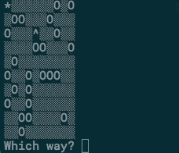

# Find Your Hat

## Project Goals
In this project, you’ll be building an interactive terminal game. The scenario is that the player has lost their hat in a field full of holes, and they must navigate back to it without falling down one of the holes or stepping outside of the field.

## Setup Instructions
If you choose to do this project on your computer instead of Codecademy, you can download what you’ll need by clicking the “Download” button below. You’ll need to open and work in main.js in a text editor. To edit main.js, use your text editor of choice. If you need a recommendation or help to install an editor, we recommend looking into our article about setting up a text editor for web development (Follow along until you get to the section: “Practice: Let’s Make a Project”). To run main.js on your computer, you will need to install Node.js. If you need help installing Node.js, read our article on installing Node.

## Start the game
Terminal => node app.js

## Environment variables
app.js => file bottom => game.generateField();

## Game controlls
* u - up
* r - right
* d - down
* l - left
## Improvements
* Ask at start of the game how big the map player wants
* After loosing the game ask if player wants to start new game
* Create Web App out of this
* [Solved] Have the character start on a random location that’s not the upper-left corner.
* Create a “hard mode” where one or more holes are added after certain turns.
* Improve your game’s graphics and interactivity in the terminal. There are many helpful packages to assist with this, and you can really get creative with how you approach terminal games.
* Create a field validator to ensure that the field generated by Field.generateField() can actually be solved. This might be pretty difficult! You’ll essentially be creating a version of a maze solver.
