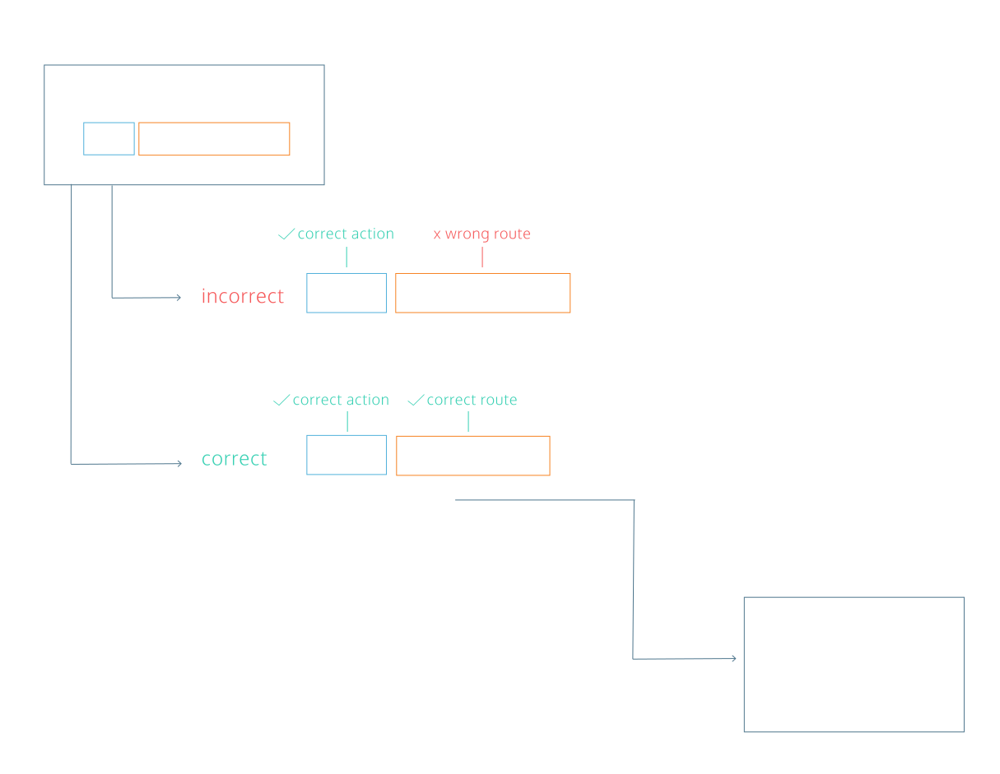
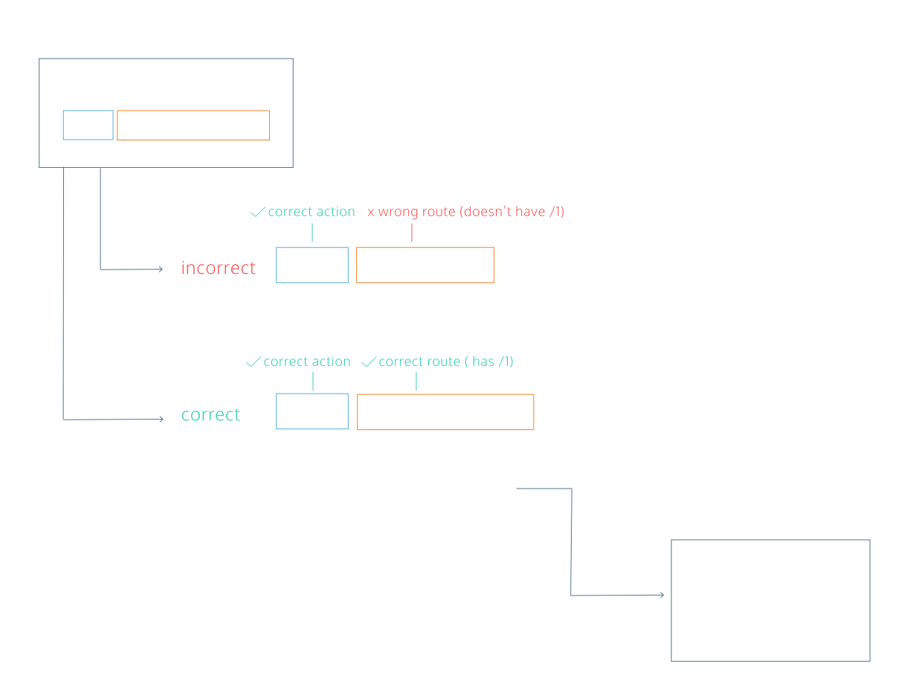
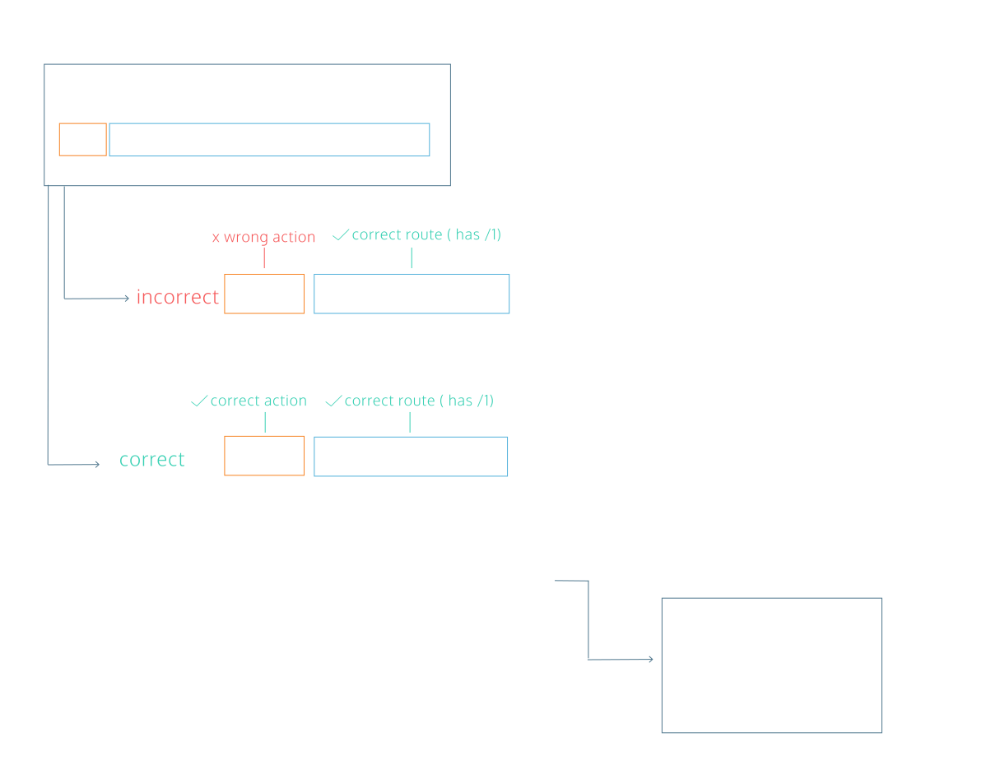

# Learn Express Routes


## Starting A Server
Express is a Node module, so in order to use it, we will need to import it into our program file. To create a server, the imported express function must be invoked.
```JS
const express = require('express');
const app = express();
```

On the first line, we import the Express library with require. When invoked on the second line, it returns an instance of an Express application. This application can then be used to start a server and specify server behavior.

The purpose of a server is to listen for requests, perform whatever action is required to satisfy the request, and then return a response. In order for our server to start responding, we have to tell the server where to listen for new requests by providing a port number argument to a method called app.listen(). The server will then listen on the specified port and respond to any requests that come into it.

The second argument is a callback function that will be called once the server is running and ready to receive responses.
```JS
const PORT = 4001;
app.listen(PORT, () => {
  console.log(`Server is listening on port ${PORT}`);
});
```
In this example, our app.listen() call will start a server listening on port 4001, and once the server is started it will log 'Server is listening on port 4001'.

## Writing Your First Route
Once the Express server is listening, it can respond to any and all requests. But how does it know what to do with these requests? To tell our server how to deal with any given request, we register a series of routes. Routes define the control flow for requests based on the request’s path and HTTP verb.

For example, if your server receives a GET request at /monsters, we will use a route to define the appropriate functionality for that HTTP verb (GET) and path (/monsters).

The path is the part of a request URL after the [hostname](https://en.wikipedia.org/wiki/Hostname) and port number, so in a request to localhost:4001/monsters, the path is /monsters (in this example, the hostname is localhost, the port number is 4001).

The HTTP verb is always included in the request, and it is one of a [finite number of options](https://developer.mozilla.org/en-US/docs/Web/HTTP/Methods) used to specify expected functionality. GET requests are used for retrieving resources from a server, and we will discuss additional request types in later exercises.

Express uses app.get() to register routes to match GET requests. Express routes (including app.get()) usually take two arguments, a path (usually a string), and a callback function to handle the request and send a response.
```JS
const moods = [{ mood: 'excited about express!'}, { mood: 'route-tastic!' }];
app.get('/moods', (req, res, next) => {
  // Here we would send back the moods array in response
});
```

The route above will match any GET request to '/moods' and call the callback function, passing in two objects as the first two arguments. These objects represent the request sent to the server and the response that the Express server should eventually send to the client.

If no routes are matched on a client request, the Express server will handle sending a 404 Not Found response to the client.

## Sending A Response
HTTP follows a one request-one response cycle. Each client expects exactly one response per request, and each server should only send a single response back to the client per request. The client is like a customer at a restaurant ordering a large bowl of soup: the request is sent through the wait staff, the kitchen prepares the soup, and after is it prepared, the wait staff returns it to the customer. In the restaurant, it would be unfortunate if the soup never arrived back to the customer, but it would be equally problematic if the customer was given four large bowls of soup and was asked to consume them all at the exact same time. That’s impossible with only two hands!

Express servers send responses using the .send() method on the response object. .send() will take any input and include it in the response body.
```JS
const monsters = [
  { type: 'werewolf' }, 
  { type: 'hydra' }, 
  { type: 'chupacabra' }
];
app.get('/monsters', (req, res, next) => {
  res.send(monsters);
});
```

In this example, a GET /monsters request will match the route, Express will call the callback function, and the res.send() method will send back an array of spooky monsters.

In addition to .send(), .json() can be used to explicitly send JSON-formatted responses. .json() sends any JavaScript object passed into it.

## Matching Route Paths
Express tries to match requests by route, meaning that if we send a request to <server address>:<port number>/api-endpoint, the Express server will search through any registered routes in order and try to match /api-endpoint.

Express searches through routes in the order that they are registered in your code. The first one that is matched will be used, and its callback will be called.

In the example to the right, you can see two .get() routes registered at /another-route and /expressions. When a GET /expressions request arrives to the Express server, it first checks /another-route‘s path because it is registered before the /expressions route. Because /another-route does not match the path, Express moves on to the next registered middleware. Since the route matches the path, the callback is invoked, and it sends a response.

If there are no matching routes registered, or the Express server has not sent a response at the end of all matched routes, it will automatically send back a 404 Not Found response, meaning that no routes were matched or no response was ultimately sent by the registered routes.



## Getting A Single Expression
Routes become much more powerful when they can be used dynamically. Express servers provide this functionality with named route parameters. Parameters are route path segments that begin with : in their Express route definitions. They act as [wildcards](https://expressjs.com/en/guide/routing.html#route-parameters), matching any text at that path segment. For example /monsters/:id will match both/monsters/1 and /monsters/45.

Express parses any parameters, extracts their actual values, and attaches them as an object to the request object: req.params. This object’s keys are any parameter names in the route, and each key’s value is the actual value of that field per request.
```JS
const monsters = { 
  hydra: { height: 3, age: 4 }, 
  dragon: { height: 200, age: 350 } 
};
// GET /monsters/hydra
app.get('/monsters/:name', (req, res, next) => {
  console.log(req.params); // { name: 'hydra' }
  res.send(monsters[req.params.name]);
});
```

In this code snippet, a .get() route is defined to match /monsters/:name path. When a GET request arrives for /monsters/hydra, the callback is called. Inside the callback, req.params is an object with the key name and the value hydra, which was present in the actual request path.

The appropriate monster is retrieved by name (the object key) from the monsters object and sent back to the client with res.send().

## Setting Status Codes
Express allows us to set the [status code](https://en.wikipedia.org/wiki/List_of_HTTP_status_codes) on responses before they are sent. Response codes provide information to clients about how their requests were handled. Until now, we have been allowing the Express server to set status codes for us. For example, any res.send() has by default sent a 200 OK status code.

The res object has a .status() method to allow us to set the status code, and other methods like .send() can be chained from it.
```JS
const monsterStoreInventory = { fenrirs: 4, banshees: 1, jerseyDevils: 4, krakens: 3 };
app.get('/monsters-inventory/:name', (req, res, next) => {
  const monsterInventory = monsterStoreInventory[req.params.name];
  if (monsterInventory) {
    res.send(monsterInventory);
  } else {
    res.status(404).send('Monster not found');
  }
});
```

In this example, we’ve implemented a route to retrieve inventory levels from a Monster Store. Inventory levels are kept in the monsterStoreInventory variable. When a request arrives for /monsters-inventory/mothMen, the route matches and so the callback is invoked. req.params.name will be equal to 'mothMen' and so our program accesses monsterStoreInventory['mothMen']. Since there are no mothMen in our inventory,res.status() sets a 404 status code on the response, and .send() sends the response.

## Matching Longer Paths
Parameters are extremely helpful in making server routes dynamic and able to respond to different inputs. Route parameters will match anything in their specific part of the path, so a route matching /monsters/:name would match all the following request paths:
```
/monsters/hydra
/monsters/jörmungandr
/monsters/manticore
/monsters/123
```

In order for a request to match a route path, it must match the entire path, as shown in the diagram to the right. The request arrives for /expressions/1. It first tries to match the /expressions route, but because it has additional path segments after /expressions, it does not match this route and moves on to the next. It matches /expressions/:id because :id will match any value at that level of the path segment. The route matches, so the Express server calls the callback function, which in turn handles the request and sends a response.



## Other HTTP Methods
[HTTP Protocol](https://en.wikipedia.org/wiki/Hypertext_Transfer_Protocol) defines a number of different method verbs with many use cases. So far, we have been using the GET request which is probably the most common of all. Every time your browser loads an image, it is making a GET request for that file!

This course will cover three other important HTTP methods: PUT, POST, and DELETE. Express provides methods for each one: app.put(), app.post(), and app.delete().

PUT requests are used for updating existing resources. In our Express Yourself machine, a PUT request will be used to update the name or emoji of an expression already saved in our database. For this reason, we will need to include a unique identifier as a route parameter to determine which specific resource to update.

## Using Queries
You may have noticed in the previous exercise that our PUT route had no information about how to update the specified expression, just the id of which expression to update. It turns out that there was more information in the request in the form of a query string. [Query strings](https://en.wikipedia.org/wiki/Query_string) appear at the end of the path in URLs, and they are indicated with a ? character. For instance, in /monsters/1?name=chimera&age=1, the query string is name=chimera&age=1 and the path is /monsters/1/

Query strings do not count as part of the route path. Instead, the Express server parses them into a JavaScript object and attaches it to the request body as the value of req.query. The key: value relationship is indicated by the = character in a query string, and key-value pairs are separated by &. In the above example route, the req.query object would be { name: 'chimera', age: '1' }.
```JS
const monsters = { '1': { name: 'cerberus', age: '4'  } };
// PUT /monsters/1?name=chimera&age=1
app.put('/monsters/:id', (req, res, next) => {
  const monsterUpdates = req.query;
  monsters[req.params.id] = monsterUpdates;
  res.send(monsters[req.params.id]);
});
```

Here, we have a route for updating monsters by ID. When a PUT /monsters/1?name=chimera&age=1 request arrives, our callback function is called and, we create a monsterUpdates variable to store req.query. Since req.params.id is '1', we replace monsters\['1']‘s value with monsterUpdates . Finally, Express sends back the new monsters\['1'].

When updating, many servers will send back the updated resource after the updates are applied so that the client has the exact same version of the resource as the server and database.

## Matching By HTTP Verb
Express matches routes using both path and HTTP method verb. In the diagram to the right, we see a request with a PUT verb and /expressions (remember that the query is not part of the route path). The path for the first route matches, but the method verb is wrong, so the Express server will continue to the next registered route. This route matches both method and path, and so its callback is called, the necessary updating logic is executed, and the response is sent.



## Creating An Expression
POST is the HTTP method verb used for creating new resources. Because POST routes create new data, their paths do not end with a route parameter, but instead end with the type of resource to be created.

For example, to create a new monster, a client would make a POST request to /monsters. The client does not know the id of the monster until it is created and sent back by the server, therefore POST /monsters/:id doesn’t make sense because a client couldn’t know the unique id of a monster before it exists.

Express uses .post() as its method for POST requests. POST requests can use many ways of sending data to create new resources, including query strings.

The HTTP status code for a newly-created resource is 201 Created.

## Deleting Old Expressions
DELETE is the HTTP method verb used to delete resources. Because DELETE routes delete currently existing data, their paths should usually end with a route parameter to indicate which resource to delete.

Express uses .delete() as its method for DELETE requests.

Servers often send a 204 No Content status code if deletion occurs without error.

## Wrap Up
In this exercise, you were able to create a full server allowing users to implement all CRUD operations for two kinds of resources: Expressions and Animals! With these skills and knowledge of the HTTP request-response cycle, you could implement an API for any project needing CRUD functionality. You could build a trip planner, an address book, a grocery list, an image-sharing application, an anonymous message board, the sky’s the limit!

Continue on to the next lesson to learn more about how to keep your code clean and modular with Express Routers!
