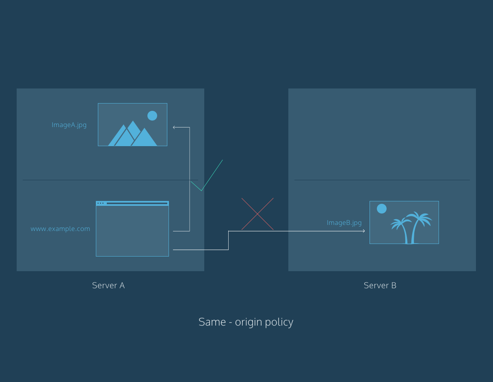

# Index
* [Middleware](#middleware)
* [Router Parameters](#router-parameters)
* [What is CORS?](#what-is-cors)

# Middleware

## Introduction
Writing code is a creative process. Programmers will be quick to differ in opinion on whether the solution to a problem should be implemented in one way or another — citing tradeoffs in algorithms, structures, or even languages. Due to these trade-offs, the problems programmers face most frequently will have several different solutions, all correct but all written differently with various factors considered. Because “correct” code can take so many different forms, developers have cultural notions of code quality that is somewhat independent of these decisions.

One concept that is central to the notion of quality code is that all code is read many, many more times than it is written. Maintaining and updating code takes up much more of a software developer’s time than production. There are many ways to make this less of a burden, and these techniques frequently correspond to code quality principles. Naming variables consistently so that they’re identifiable is one way to improve the readability of a codebase. Another pillar of code quality is avoiding duplication of code within a codebase.

Code duplication is an invitation for bugs. If incorrect code is copy-and-pasted in multiple places, a developer might remedy the flaws in only a few of those places and fail to fix the buggy code everywhere. In this course, we will investigate several ways to avoid replication and reduce complexity. In programming in general, this often means putting the reused code into reusable containers like functions and objects. In Express specifically, this will also mean composing our desired functionality into a series of middleware functions.

## DRYing Code With Functions
Beyond labeling, good code will leverage the strength of its programming language to avoid performing the same tasks

Take a look at the following code:
```JS
const addFive = number => {
  const fiveAdded = number + 5;
  console.log(`Your number plus 5 is ${fiveAdded}`);
}
 
const addTen = number => {
  const tenAdded = number + 10;
  console.log(`Your number plus 10 is ${tenAdded}`);
}
 
const addTwenty = number => {
  const twentyAdded = number + 20;
  console.log(`Your number plus 20 is ${twentyAdded}`);
}
```

While these three function definitions are not exact duplicates of each other, a well-designed application will be flexible enough to join similar functionality in a single element.
```JS
const addNumber = (number, addend) => {
  const numAdded = number + addend;
  console.log(`Your number plus ${addend} is ${numAdded}`);
}
```

As you can see, by adding an argument to the earlier functions we can simplify our application code which will ultimately save time should we realize that we also want an addFifty() function and an addHundred() function.

Code that performs the same task in multiple places is repetitive, and the quality coder’s credo is “Don’t Repeat Yourself” (DRY). If a program performs similar tasks without refactoring into a function, it is said to “violate DRY”. “Violating DRY” is a programmer’s way of complaining: “This script is saying the same thing over and over! We can do the same thing with less code!” Let’s try to not repeat ourselves in this codebase by repurposing some of the more glaringly repeated code into functions we can call instead.

## DRYing Routes With app.use()
By now you may have noticed that our efforts to not repeat ourselves have resulted in us putting the same function call over and over throughout our code. Isn’t that somewhat contradictory? You would be absolutely right to think so.

So how do we get code to run every time one of our Express routes is called without repeating ourselves? We write something called middleware. Middleware is code that executes between a server receiving a request and sending a response. It operates on the boundary, so to speak, between those two HTTP actions.

In Express, middleware is a function. Middleware can perform logic on the request and response objects, such as: inspecting a request, performing some logic based on the request, attaching information to the response, attaching a status to the response, sending the response back to the user, or simply passing the request and response to another middleware. Middleware can do any combination of those things or anything else a Javascript function can do.
```JS
app.use((req, res, next) => {
  console.log('Request received');
});
```

The previous code snippet is an example of middleware in action. app.use() takes a callback function that it will call for every received request. In this example, every time the server receives a request, it will find the first registered middleware function and call it. In this case, the server will find the callback function specified above, call it, and print out 'Request received'.

You might be wondering what else our application is responsible for that isn’t related to middleware. The answer is not much. To quote the [Express documentation](http://expressjs.com/en/guide/using-middleware.html):

An Express application is essentially a series of middleware function calls.

It is precisely this service that we leverage Express for. In addition to performing the routing that allows us to communicate appropriate data for each separate endpoint, we can perform application logic we need by implementing the necessary middleware.

## next()
It seems like our middleware was successful — it logged out

The middleware stack is processed in the order they appear in the application file, such that middleware defined later happens after middleware defined before. It’s important to note that this is regardless of method — an app.use() that occurs after an app.get() will get called after the app.get(). Observe the following code:
```JS
app.use((req, res, next) => {
  console.log("A sorcerer approaches!");
  next();
});
 
app.get('/magic/:spellname', (req, res, next) => {
  console.log("The sorcerer is casting a spell!");
  next();
});
 
app.get('/magic/:spellname', (req, res, next) => {
  console.log(`The sorcerer has cast ${req.params.spellname}`);
  res.status(200).send();
});
 
app.get('/magic/:spellname', (req, res, next) => {
  console.log("The sorcerer is leaving!");
});
 
// Accessing http://localhost:4001/magic/fireball 
// Console Output:
// "A sorcerer approaches!"
// "The sorcerer is casting a spell!"
// "The sorcerer has cast fireball"
```

In the above code, the routes are called in the order that they appear in the file, provided the previous route called next() and thus passed control to the next middleware. We can see that the final matching call was not printed. This is because the previous middleware did not invoke the next() function to run the following middleware.

An Express middleware is a function with three parameters: (req, res, next). The sequence is expressed by a set of callback functions invoked progressively after each middleware performs its purpose. The third argument to a middleware function, next, should get explicitly called as the last part of the middleware’s body. This will hand off the processing of the request and the construction of the response to the next middleware in the stack.

## Request And Response Parameters
Recall the function signature of an Express middleware, i.e., (req, res, next). You might recognize this signature as being the very same that we’ve used for Express routes in the past. Well there’s a perfectly good reason for that: Express routes are middleware. Every route created in Express is also a middleware function handling the request and response objects at that part of the stack. Express routes also have the option of sending a response body and status code and closing the connection. These two features are a byproduct of Express routes being middleware, because all Express middleware functions have access to the request, the response, and the next middleware in the stack.

## Route-Level app.use() - Single Path
Now that we’ve managed to refactor our duplicate code into middleware functions, we should be noticing that our code contains much less repetition than before. Unfortunately, we still have duplicate code in some of our routes. Since this code isn’t shared by all of our routes, the previous syntax of app.use() won’t work. Let’s see what the [Express documentation](https://expressjs.com/en/4x/api.html) for app.use() has to say about this use case. This is the app.use() function signature:

app.use(\[path,] callback [, callback...])

In documentation for many programming languages, optional arguments for functions are placed in square brackets ([]). This means that app.use() takes an optional path parameter as its first argument. We can now write middleware that will run for every request at a specific path.
```JS
app.use('/sorcerer', (req, res, next) => {
  console.log('User has hit endpoint /sorcerer');
  next();
});
```

In the example above the console will print 'User has hit endpoint /sorcerer', if someone visits our web page’s ‘/sorcerer’ endpoint. Since the method app.use() was used, it won’t matter if the user is performing a GET,a POST, or any other kind of HTTP request. Since the path was given as an argument to app.use(), this middleware function will not execute if the user hits a different path (for instance: '/spells' or '/sorcerer/:sorcerer_id').

## Control Flow With next()
We’ve experienced writing middleware that performs its function and hands off the request and response objects to the next function in the stack, but why exactly do we have to write next() at the end of every middleware? If it always needs to be at the end of every function we write, it seems like an unnecessary piece of boilerplate. You might be surprised to learn that we aren’t going to introduce a way to automatically hand off the request and response objects without having to repeatedly write next(). Rather, we’re going to explore why it is useful to have next() as a separate function call. The biggest reason being we don’t always want to pass control to the next middleware in the stack.

For example, when designing a system with confidential information, we want to be able to selectively show that information to authorized users. In order to do that, we would create middleware that tests a user’s permissions. If the user has the permission necessary, we would continue through the middleware stack by calling next(). If it fails, we would want to let the user know that they’re not allowed to see the information they’re trying to access.

## Route-Level app.use() - Multiple Paths
We learned that app.use() takes a path parameter, but we never fully investigated what that path parameter could be. Let’s take another look at the Express documentation for app.use():

“argument: path

description: The path for which the middleware function is invoked; can be any of:
* A string representing a path.
* A path pattern.
* A regular expression pattern to match paths.
* An array of combinations of any of the above. “

So app.use() can take an array of paths! That seems like a handy way to rewrite the code from our last exercise so that we don’t have to put the same code in two different routes with different paths.

## Middleware Stacks
Recall that middleware is just a function with a specific signature, namely (req, res, next). We have, for the most part, been using anonymous function definitions for this because our middleware has only been relevant to the route invoking it. There is nothing stopping us from defining functions and using them as middleware though. That is to say:
```JS
const logging = (req, res, next) => {
  console.log(req);
  next();
};
 
app.use(logging);
```

is a valid and reasonable way to introduce logging throughout all paths. It is also modifiable so that you can remove the app.use() line and replace it with a specific route method, or sprinkle it throughout the application without it being universal.

Up until this point we’ve only been giving each middleware-accepting method a single callback. With modular pieces like this, it is useful to know that methods such as app.use(), app.get(), app.post(), and so on all can take multiple callbacks as additional parameters. This results in code that looks like the following:
```JS
const authenticate = (req, res, next) => {
  ...
};
 
const validateData = (req, res, next) => {
  ...
};
 
const getSpell = (req, res, next) => {
  res.status(200).send(getSpellById(req.params.id));
};
 
const createSpell = (req, res, next) => {
  createSpellFromRequest(req);
  res.status(201).send();
};
 
const updateSpell = (req, res, next) => {
  updateSpellFromRequest(req);
  res.status(204).send();
}
 
app.get('/spells/:id', authenticate, getSpell);
 
app.post('/spells', authenticate, validateData, createSpell);
 
app.put('/spells/:id', authenticate, validateData, updateSpell);
```

In the above code sample, we created reusable middleware for authentication and data validation. We use the authenticate() middleware to verify a user is logged in before proceeding with the request and we use the validateData() middleware before performing the appropriate create or update function. Additional middleware can be placed at any point in this chain.

## Open-Source Middleware: Logging
Knowing how to write middleware, we should now feel inspired to solve all the problems that come at us by writing code. It’s encouraging to know how to fix an issue. If we find a solution we don’t need to write, however, it will allow us to work faster and more intelligently to focus on the problems that differentiate our application from others.

To illustrate: if we needed to write a web server from scratch every time we wanted to build a web application, we’d waste a lot of time solving problems that have been solved countless times before and ignoring perfectly good pre-existing solutions. Luckily for us web developers, Express already exists as an open-source package that we can install and use to build upon. There is a huge ecosystem of Javascript packages that will solve so many of the problems that developers frequently run into.

In the workspace you’ll see what code looks like using unnecessary custom solutions and lots of lines calling console.log(). It’s not bad code, but it introduces complexity that could be avoided. Time spent thinking about and writing code that accomplishes common tasks is time that could be better spent on thinking about and writing code that is unique to your application.

We will replace the logging code in the workspace with [morgan](https://github.com/expressjs/morgan), an open-source library for logging information about the HTTP request-response cycle in a server application. morgan() is a function that will return a middleware function, to reiterate: the return value of morgan() will be a function, that function will have the function signature (req, res, next) that can be inserted into an app.use(), and that function will be called before all following middleware functions. Morgan takes an argument to describe the formatting of the logging output. For example, morgan('tiny') will return a middleware function that does a “tiny” amount of logging. With morgan in place, we’ll be able to remove the existing logging code. Once we see how fast it is to add logging with morgan, we won’t have to spend time in the future trying to figure out how to replicate that functionality.

## Documentation
With software we’ve personally written, invocation is a simple process. We already know what the code does, what it expects, and may have some notion how things could go wrong. Losing this intuition is the biggest downside to using open-source packages.

This is not meant to be discouraging. The best open-source packages have extremely well written documentation. Documentation is a resource, presented by the package’s author(s), that includes information about what software is, what it does, and how to use it. We’ve seen the Express documentation in this course, and now we’re going to look at the morgan documentation.

## Open-Source Middleware: Body Parsing
Being able to use open-source middleware can certainly make our jobs as programmers a lot easier. Not only does it prevent us from having to write the same code every time we want to accomplish a common task, it allows us to perform some tasks that would take a lot of research for us to implement.

When we implement middleware, we take in the req object, so that we can see information about the request. This object includes a good deal of important information about the request that we can use to inform our response, however for some requests it misses a fundamental piece. An HTTP request can include a body, a set of information to be transmitted to the server for processing. This is useful when the end user needs to send information to the server. If you’ve ever uploaded a post onto a social media website or filled out a registration form chances are you’ve sent an HTTP request with a body. The lucky thing about using open-source middleware is that even though parsing the body of an HTTP request is a tricky operation requiring knowledge about network data transfer concepts, we easily manage it by importing a library to do it for us.

If we look at our bodyParser, we see a simplified version of how one might perform request body parsing. Let’s see if there’s a better way that doesn’t involve us trying to create our own body-parser. Maybe we can find a library that does it for us?

Take a look at [body-parser](https://github.com/expressjs/body-parser#body-parser). “Node.js body parsing middleware”, that’s just what we needed! Let’s see if we can use this dependency instead of trying to manage our own body-parsing library.

## Error-Handling Middleware
We’re almost finished with our Code Quality Checklist, there’s just one last problem to fix! When an error is thrown somewhere in our code, we want to be able to communicate that there was a problem to the user. A programming error is never something to be ashamed of. It’s simply another situation for which we should be prepared.

Error handling middleware needs to be the last app.use() in your file. If an error happens in any of our routes, we want to make sure it gets passed to our error handler. The middleware stack progresses through routes as they are presented in a file, therefore the error handler should sit at the bottom of the file. How do we write it?
```JS
app.use((err, req, res, next) => {
  console.error(err.stack);
  res.status(500).send('Something broke!');
});
```

Based on the code above, we can see that error-handling middleware is written much like other kinds of middleware. The biggest difference is that there is an additional parameter in our callback function, err. This represents the error object, and we can use it to investigate the error and perform different tasks depending on what kind of error was thrown. For now, we only want to send an HTTP 500 status response to the user.

Express has its own error-handler, which catches errors that we haven’t handled. But if we anticipate an operation might fail, we can invoke our error-handling middleware. We do this by passing an error object as an argument to next(). Usually, next() is called without arguments and will proceed through the middleware stack as expected. When called with an error as the first argument, however, it will call any applicable error-handling middleware.
```JS
app.use((req, res, next) => {
  const newValue = possiblyProblematicOperation();
  if (newValue === undefined) {
    let undefinedError = new Error('newValue was not defined!');
    return next(undefinedError);
  }
  next();
});
 
app.use((err, req, res, next) => {
  const status = err.status || 500;
  res.status(status).send(err.message);
});
```

In this segment we assign the return value of the function possiblyProblematicOperation() to newValue. Then we check to see if this function returned anything at all. If it didn’t, we create a new Error and pass it to next(). This prompts the error-handling middleware to send a response back to the user, but many other error-handling techniques could be employed (like logging, re-attempting the failed operation, and/or emailing the developer).

## Discovering Open-Source Middleware
While it’s good to know how to write error-handling middleware, it’s a natural curiosity that causes us to ask “isn’t error-handling a common task? Has someone written middleware that performs it for us?” Let’s take a look at the [list of Express middleware](https://expressjs.com/en/resources/middleware.html). This list of middleware includes many things the creators of Express maintain, some of which was included in Express in previous versions. The movement on the Express team’s part to identify separate functionality and modularize their code into independent factors allows developers like us to only take what we need. In this way, they can make major updates to each middleware individually and programmers who do not use that middleware won’t have to worry about their version of Express being out of date.

## Review
We’ve accomplished a lot! We learned what middleware is and we’ve used it to write cleaner, readable, adaptable, and maintainable code. We’ve written functions that are context aware and can have overlapping functionality without duplicating code. We can serve data by route, with each possible endpoint being treated as a separate relative of the family of our application. We learned to link these middleware using next() to continue to the next middleware in the stack. We’ve reduced complexity in our codebase by relying on external, open-source middleware. We are truly harnessing the power of the Express web server, the Node environment, and our knowledge of Javascript. Let’s review those skills.

In the workspace there is another codebase with a set of familiar problems. Custom middleware to accomplish tasks we could be importing a module for. Duplicated code throughout the different routes. Improperly managed middleware stack missing next() calls. You will need everything learned in this lesson, but it’s nothing you haven’t done before.

# Router Parameters

## Introduction
When building interfaces with Express, we will run into the pattern of expecting certain information in a requested URL and using that information to identify the data that is being requested. To give an example:
```JS
app.get('/sorcerers/:sorcererName', (req, res, next) => {
  const sorcerer = Sorcerers[req.params.sorcererName];
  res.send(sorcerer.info);
});
 
app.get('/sorcerers/:sorcererName/spellhistory', (req, res, next) => {
  const sorcerer = Sorcerers[req.params.sorcererName];
  const spellHistory = Spells[sorcerer.id].history;
  res.send(spellHistory);
});
```

In the above code we need to extract the request parameter :sorcererName from the url in both instances, and end up duplicating the necessary code so that it appears in both routes. When working with routes that require parameters, we might find ourselves in a position where multiple different routes require the same parameter and use it to identify the same piece of data. While writing this duplicate code will get the job done, copy-and-pasting functionality does leave a bitter taste in the mouth of the principled developer. We should investigate if there is a better way to accomplish this.

## router.param()
Express, luckily, is mindful of the pain-point of replicated parameter-matching code and has a method specifically for this issue. When a specific parameter is present in a route, we can write a function that will perform the necessary lookup and attach it to the req object in subsequent middleware that is run.
```JS
app.param('spellId', (req, res, next, id) => {
  let spellId = Number(id);
    try {
      const found = SpellBook.find((spell) => {
        return spellId === spell.id;
      })
      if (found) {
        req.spell = found;
        next();
      } else {
        next(new Error('Your magic spell was not found in any of our tomes'));
      };
    } catch (err) {
      next(err)
    }
});
```

In the code above we intercept any request to a route handler with the :spellId parameter. Note that in the app.param function signature, 'spellId' does not have the leading :. The actual ID will be passed in as the fourth argument, id in this case, to the app.param callback function when a request arrives.

We look up the spell in our SpellBook array using the .find() method. If SpellBook does not exist, or some other error is thrown in this process, we pass the error to the following middleware (hopefully we’ve written some error-handling middleware, or included some externally-sourced error-handling middleware). If the spell exists in SpellBook, the .find() method will store the spell in found, and we attach it as a property of the request object (so future routes can reference it via req.spell). If the requested spell does not exist, .find() will store undefined in found, and we let future middlewares know there was an error with the request by creating a new Error object and passing it to next().

Note that inside an app.param callback, you should use the fourth argument as the parameter’s value, not a key from the req.params object.

## Merge Parameters
Complexity is all around us. Buildings are made from bricks and many droplets of water make a cloud. When we want to create something complex in software, we model out our base components and use composition to create these relationships.

When we’re building web endpoints, we might want to access some property of a complex object. In order to do this in Express, we can design a nested router. This would be a router that is invoked within another router. In order to pass parameters the parent router has access to, we pass a special configuration object when defining the router.
```JS
const sorcererRouter = express.Router();
const familiarRouter = express.Router({mergeParams: true});
 
sorcererRouter.use('/:sorcererId/familiars', familiarRouter);
 
sorcererRouter.get('/', (req, res, next) => {
  res.status(200).send(Sorcerers);
  next();
});
 
sorcererRouter.param('sorcererId', (req, res, next, id) => {
  const sorcerer = getSorcererById(id);   
  req.sorcerer = sorcerer;
  next();
});
 
familiarRouter.get('/', (req, res, next) => {
  res.status(200).send(`Sorcerer ${req.sorcerer} has familiars ${getFamiliars(sorcerer)}`);
});
 
app.use('/sorcerer', sorcererRouter);
```

In the code above we define two endpoints: /sorcerer and /sorcerer/:sorcererId/familiars. The familiars are nested into the sorcerer endpoint — indicating the relationship that a sorcerer has multiple familiars. Take careful note of the {mergeParameters: true} argument that gets passed when creating the familiarRouter. This argument tells Express that the familiarRouter should have access to parents passed into its parent router, that is, the sorcererRouter. We then tell express that the path for the familiarRouter is the same as the path for the sorcererRouter with the additional path /:sorcererId/familiars. We then can create a family of routes (a router) built by appending routes to familiarRouter‘s base: /sorcerer/:sorcererId/familiars.

## Review
router.param is a powerful tool that we can use to keep our code from repeating core functionality through routes. This is a pattern we want to frequently follow: identify multiple pieces of code that accomplish the same goal, put it into a single component, let that component do that thing (and update it when we want the thing it does to change — in a single place).

Let’s try applying that knowledge again, to another codebase. If you look at the workspace you’ll find the same problem of data-lookup happening, based on a URL parameter, multiple times in different places. Try combining that logic in a single place using router.param.

# What is CORS?

Although you may not notice it, the web pages you visit make frequent requests to load assets like images, fonts, and more, from many different places across the Internet. If these requests for assets go unchecked, the security of your browser may be at risk. For example, your browser may be subject to hijacking, or your browser might blindly download malicious code. As a result, many modern browsers follow security policies to mitigate such risks.

## What is a security policy?
Servers are used to host web pages, applications, images, fonts, and much more. When you use a web browser, you are likely attempting to access a distinct website (hosted on a server). Websites often request these hosted resources from different locations (servers) on the Internet. Security policies on servers mitigate the risks associated with requesting assets hosted on different server. Let’s take a look at an example of a security policy: same-origin.

The same-origin policy is very restrictive. Under this policy, a document (i.e., like a web page) hosted on server A can only interact with other documents that are also on server A. In short, the same-origin policy enforces that documents that interact with each other have the same origin.

An origin is made up of the following three parts: the protocol, host, and port number. The details of these individual parts aren’t necessary at the moment, but it is important to illustrate how the same-origin policy uses these parts.

Consider the following URL:
```
http://www.example.com/foo-bar.html
```
Let’s call it URL1 (for short).

If you used a web browser to navigate from URL1 to http://www.example.com/hello-world.html, you would be allowed to do so because the protocol (HTTP), host (example.com), and port (80) of each URL match one another. (Port 80 is the default port.) The same-origin policy requires that all parts of the origin match.

Navigating to https://www.en.example.com/hello.html from URL1, however, would not be allowed because of the different protocol (HTTPS) and host (en.example.com).

As you can see, not having a security policy can be risky, but a security policy like same-origin is a bit too restrictive. Thankfully, there are security policies that strike a mix of both, like cross-origin, which has evolved into the cross-origin resource sharing standard, often abbreviated as CORS.



## What is CORS?
A request for a resource (like an image or a font) outside of the origin is known as a cross-origin request. CORS (cross-origin resource sharing) manages cross-origin requests.

Once again, consider the following URL:
```
http://www.example.com/foo-bar.html
```

Let’s call it URL1 (for short).

Unlike same-origin, navigating to https://www.ejemplo.com/hola.html from URL1 could be allowed with CORS. Allowing cross-origin requests is helpful, as many websites today load resources from different places on the Internet (stylesheets, scripts, images, and more).

Cross-origin requests, however, mean that servers must implement ways to handle requests from origins outside of their own. CORS allows servers to specify who (i.e., which origins) can access the assets on the server, among many other things.

You can think of these interactions as a building with a security entrance. For example, if you need to borrow a ladder, you could ask a neighbor in the building who has one. The building’s security would likely not have a problem with this request (i.e., same-origin). If you needed a particular tool, however, and you ordered it from an outside source like an online marketplace (i.e., cross-origin), the security at the entrance may request that the delivery person provide identification when your tool arrives.


## Why is CORS necessary?
The CORS standard is needed because it allows servers to specify not only who can access the assets, but also how they can be accessed.

Cross-origin requests are made using the standard HTTP request methods. Most servers will allow GET requests, meaning they will allow resources from external origins (say, a web page) to read their assets. HTTP requests methods like PATCH, PUT, or DELETE, however, may be denied to prevent malicious behavior. For many servers, this is intentional. For example, it is likely that server A does not want servers B, C, or D to edit or delete its assets.

With CORS, a server can specify who can access its assets and which HTTP request methods are allowed from external resources.

## How does CORS manage requests from external resources?
An HTTP header is a piece of information associated with a request or a response. Headers are passed back and forth between your web browser (also referred to as a client) and a server when the web page you are on wants to use resources hosted on a different server. Headers are used to describe requests and responses. The CORS standard manages cross-origin requests by adding new HTTP headers to the standard list of headers. The following are the new HTTP headers added by the CORS standard:
* Access-Control-Allow-Origin
* Access-Control-Allow-Credentials
* Access-Control-Allow-Headers
* Access-Control-Allow-Methods
* Access-Control-Expose-Headers
* Access-Control-Max-Age
* Access-Control-Request-Headers
* Access-Control-Request-Method
* Origin

These are all important, but let’s focus on the following header:
* Access-Control-Allow-Origin

The Access-Control-Allow-Origin header allows servers to specify how their resources are shared with external domains. When a GET request is made to access a resource on Server A, Server A will respond with a value for the Access-Control-Allow-Origin header. Many times, this value will be *, meaning that Server A will share the requested resources with any domain on the Internet. Other times, the value of this header may be set to a particular domain (or list of domains), meaning that Server A will share its resources with that specific domain (or list of domains). The Access-Control-Allow-Origin header is critical to resource security.

You can find a description of each CORS header at the following: [CORS Headers](https://developer.mozilla.org/en-US/docs/Web/HTTP/Headers#cors).

## Pre-flight Requests
As mentioned before, most servers will allow GET requests but may block requests to modify resources on the server. Servers don’t just blindly block such requests though; they have a process in place that first checks and then communicates to the client (your web browser) which requests are allowed.

When a request is made using any of the following HTTP request methods, a standard preflight request will be made before the original request.
* PUT
* DELETE
* CONNECT
* OPTIONS
* TRACE
* PATCH

Preflight requests use the OPTIONS header. The preflight request is sent before the original request, hence the term “preflight.” The purpose of the preflight request is to determine whether or not the original request is safe (for example, a DELETE request). The server will respond to the preflight request and indicate whether or not the original request is safe. If the server specifies that the original request is safe, it will allow the original request. Otherwise, it will block the original request.

The request methods above aren’t the only thing that will trigger a preflight request. If any of the headers that are automatically set by your browser (i.e., user agent) are modified, that will also trigger a preflight request.


## How do I implement CORS?
Implementing the request headers to set up CORS correctly depends on the language and framework of the backend.

For example, if you are using Node, you can use setHeader(), as shown below:
```JS
response.setHeader('Content-Type', 'text/html');
```

If you are using Express, you can use CORS middleware:
```
$ npm install cors
```

```JS
var express = require('express');
var cors = require('cors');
var app = express();
 
app.use(cors());
 
app.get('/hello/:id', function (req, res, next) {
  res.json({msg: 'Hello world, we are CORS-enabled!'});
});
 
app.listen(80, function () {
  console.log('CORS-enabled web server is listening on port 80');
});
```

## Conclusion
There are many resource sharing solutions for all web technologies. The overall concepts, however, will always be the same. By understanding security policies like CORS, you can understand how risky behavior — like downloading assets from external origins — are mitigated.
