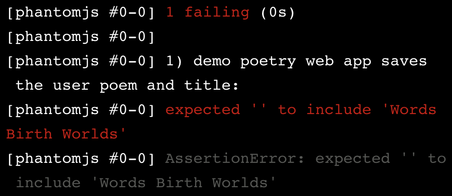

# Index
* [Outside-In Test-Driven Development](#outside-in-test-driven-development)
* [TDD Feature-Level Tests](#tdd-feature-level-tests)

# Outside-In Test-Driven Development

When software engineers and development teams build new features, they’re faced with challenging questions along the way. Some include:
* Where do we start development? (Do I start writing HTML, or adding server implementation?)
* What is the most efficient implementation? (Is X implementation faster than Y implementation?)
* How will the new feature impact our existing code? (Will new code introduce a bug?)

Outside-in test-driven development doesn’t answer these questions, but provides you with an approach to finding an answer. It helps you avoid the decision paralysis that often slows development teams, leads to extended deadlines, and incomplete implementation.

In addition to the efficiencies discussed above, the outside-in approach is a satisfying way to develop a web application with a full test suite.

At the end of this article, you will know how to approach development of features in a full-stack web application using outside-in test-driven development.

## Red, Green, Refactor
Test-driven development (TDD) is the process of writing tests before implementation code. You use the feedback from your tests to inform the implementation of a feature or outcome.

A common approach to TDD is the red, green, refactor cycle. When you write a test before the implementation exists you start “in the red” phase, because your test fails and outputs a red error message. Next, you write the minimum implementation code to get your test to pass. This puts you “in the green” phase, because your test passes and outputs a green message.

Once you are in the green, you should consider whether your implementation is the best or most efficient approach. If you think your code could be written more efficiently or cleaner, then you enter the refactor phase. You can refactor your code with confidence, because you have tests that cover the expected behavior.

## Outside-in TDD
Outside-in TDD is an approach that developers use to build full-stack web applications. It leverages the same red, green, refactor steps that we covered above, but with one caveat — a failing test does not always inform you to write new implementation code. Instead, it may require that you implement new functionality at a different level.

You start at the top of the stack, the view, and write tests as you work your way towards the database layer.

If a test pushes you to a lower level, you restart your red, green, refactor cycle by writing a new test. This test informs the implementation at your new layer. You continue the TDD cycle at this lower level until:
* You need to drop another layer to implement the desired behavior
* You have addressed the reason for dropping to the current layer

Once you address the reason for dropping a layer, you can start working your way back up the testing pyramid. If you’re in the model/database layer, you step up to the server, and run your server tests to see if you get a different response. The response should be one of the following:
* The test passes — you can start another red, green, refactor cycle at the server level or step up to the view layer.
* The test fails — the server test that pushed you to the model layer fails, but for a different reason. This is common, and indicates that you’re making progress. This failure may indicate that you need to write additional implementation at the server level, or drop back to the model.

## Outside-in Example
We’re going to use the following as an example of how to develop a new feature with outside-in TDD: You have a movie blog and want to develop a feature that renders user comments under your blog posts. The application should render no more than ten comments when a user lands on the web page. The application should present the comments in reverse chronological order (i.e. the most recent comment should be first).

Let’s assume the web application generates HTML at the server — any updates to the view require implementation at the server level.

### Feature Testing
The first step is to write a feature test that checks if your web application is rendering comments to the browser. Let’s use the following outside-in TDD approach:
1. Write a test that checks for the presence of a comment under a blog post.
2. The test fails, because your web application does not render comments.
3. Because your web application generates HTML at the server layer, you drop to the server to address the error.

Although we could continue to write feature tests to check for the number of rendered comments, we know server tests are cheaper, so we can test those details when we drop a layer.

### Server Testing
At the server layer, we start by writing a test that informs the implementation of our server-generated HTML. Because our web application renders unique comments from the database, we want to check that the server-generated HTML is dynamic.
1. Write a test that checks for the presence of a dynamically generated comment element in the server HTML.
2. The test fails, so we add implementation for a server-generated comment.
3. Once we’re in the green and consider refactoring, we want to write a test that calls a method at the model layer, let’s call it Comment.latest(). At the server layer, we’ll check if the method returns comments from the database.
4. Because this method doesn’t exist, we must drop to the model/database layer.

### Model and Database Testing
At the model layer, we start by writing a test that informs the implementation of our Comment.latest method. This method requires that you interface with the web application’s database.
1. Write a test that checks if the Comment.latest method returns ten comments when the database has eleven comments.
2. Implement the Comment.latest method to return ten comments, so the test is green.
3. Once you’ve considered refactoring, write a test that checks whether the method returns the last ten comments in reverse chronological order.
4. Implement and refactor
5. Write a test that checks if Comment.latest() returns an empty array when your database is empty.
6. Implement and refactor
7. Write a test that checks if Comment.latest returns the correct number and order of comments when your database has between zero and ten comments in it.
8. Implement and refactor

### Taking Stock
At this point, your entire test suite should be green. You have written seven new tests, and the implementation code to make them pass — your web application should render the last ten comments from your database in reverse chronological order.

Let’s take stock of our seven new tests:
1. Feature: Comments are rendered to a user’s browser.
2. Server: The server generates an HTML field for comments.
3. Server: The server has access to ten comments from the database.
4. Model: The Comment.latest method returns ten comments from your database.
5. Model: The Comment.latest method returns the last ten comments in your database in reverse chronological order.
6. Model: The Comment.latest method returns an empty array when your database has zero comments.
7. Model: The Comment.latest method returns all of the comments when your database has between zero and ten comments.

Once your feature is working as expected, you should consider how your new tests fit into the broader test suite. The rest of the test suite could have few tests, or over one hundred. It’s time to refactor.

### Refactoring Your Test Suite
The way you approach refactoring will vary based on the size and types of tests in your suite. One guiding light in refactoring is to optimize the suite for confidence and speed. Because we used TDD to implement our comment feature, we should feel confident that our comments are working as expected, and the feature is fully covered.

Consider the questions below when deciding how to refactor your suite:
* How much longer does it take to run my test suite with these new tests?
* Is the additional amount of time that your test suite takes to run acceptable?
* Is there overlap between any of my new tests?
* Is there overlap between my new tests and existing tests?

Let’s take a moment to consider a few of these questions in the context of our test suite.

How much longer does it take to run my test suite with these new tests?
* You can calculate this value by running your test suite before and after writing the new tests, and calculate the difference. Seven new tests, like the ones above may only add a few seconds to your suite. Let’s use our next question to think about how you can evaluate what an acceptable amount of time may be.

Is the additional amount of time that your test suite takes to run acceptable?
* Although a few seconds may seem acceptable, this time can add up as your suite grows. Even if you’re comfortable with the additional time, you should always consider whether you can make speed improvements that don’t impact confidence.

Is there overlap between any of my new tests?
* You should consider if any new tests, especially in the feature or server level, can be deleted without impacting your confidence that the comments feature works as expected. For example, our first server test checks if the server generates an HTML field for comments. Your feature-level test checks the same functionality — it also takes longer, but provides a higher level of confidence. We decide to delete the server test for reasons we will investigate when we consider our next question.

Is there overlap between my new tests and existing tests?
* Next, you should look outside your seven (now six) new tests to consider the coverage offered by the other tests in your suite. Often, your test suite will have a feature test that checks whether the web page renders as expected — this is usually good enough coverage for most new features. Given the cost of feature-level tests, and the coverage of your lower-level tests, it often makes sense to delete the new feature-level test.

# TDD Feature-Level Tests

## Introduction
Often the hardest part of creating a full-stack web application is knowing where to start. In this lesson, we will use an outside-in development process. With this approach, we start to build our new functionality at the feature level.

Starting at the feature level of the pyramid (going outside-in) means you begin by writing tests that inform implementation of the code that a user’s browser renders. These tests involve the aspects of your project that users will see and interact with.

In this lesson:

You will learn a few tools for writing feature-level tests.
You will go through a few rounds of the TDD cycle at the feature level to build an application that renders user input.
You will end the lesson “in the red,” with a failing feature-level test that you can only address by “dropping” to the server level.
If you want to continue the journey, you can pick up where you left off in the Codecademy course on testing the server.

## Feature Test Toolbelt
To write the most effective feature tests, we are going to employ a few additional tools. These tools are meant to support JavaScript testing. We will cover their uses in the scope of building a feature test that drives implementation.

### Chai
Node.js has a default assertion library that provides enough functionality to write basic test code. The [Chai testing library](https://www.chaijs.com/) extends the types of assertions we can make.

Chai is an assertion library for Node.js and browsers that can be paired with any JavaScript testing framework.

### PhantomJS
[PhantomJS](https://phantomjs.org/) is a headless browser scriptable with a JavaScript API, which allows us to write tests that mimic user interaction and then evaluate the results. It does not require us to render the application in a browser.

A browser runs “headless” when it doesn’t render anything to the screen, but runs in the background.

### WebdriverI/O
[WebdriverIO](https://webdriver.io/docs/what-is-webdriverio/) provides methods that allow us to programmatically interact with the user-facing elements of our app in the headless browser that PhantomJS runs.

### Toolbelt High-Level Summary
Phantom allows us to run an instance of a headless browser so you can run tests that mimic user interaction with a web application. WebdriverIO provides the methods to interact with browser values programmatically. We can make assertions against these tests using the Chai assertion library.

## Feature Test I
Feature tests exercise behavior by simulating a user navigating the application in a web browser.

Imagine we wanted to create a simple web-based poetry writing application.

The first feature test we want to write is to check our application’s empty state. The functionality we want to test is:
* When a user visits the homepage, the poems section is empty

We want to make sure that when there are no poems in the database, there are no poems rendered on the homepage. This is the application’s empty state.

The testing suite for our poetry app would begin with nested describe blocks like this:
```JS
describe('Poetry web app', () => {
  describe('user visits root', () => {
 
  });
});
```

The term ‘root’, refers to our application’s entry point, which in this example is the home page that users will visit in their browser.

Next, we add an it block to describe the behavior we want to test in our app:
```JS
describe('Poetry web app', () => {
  describe('user visits root', () => {
    it('page starts blank', () => {
 
    });  
  });
});
```

When a user visits the root of our app, they should have a blank page on which to write their own poem.

### The Plumbing
Next, we reach for our feature testing toolbelt. We start by to using the global browser variable that is provided by WebdriverI/O.

The browser variable is powerful because it gives us access to the browser that Phantom is running in the background. We can simulate a user interacting with our website by calling different methods on the global browser variable in our test suite.

For example, we can use browser.url() to simulate a user visiting the home page of our application, which is the first behavior we want to test.

The .url method navigates to the URL that is passed to it as an argument. The following line of code would navigate to the Codecademy website in the Phantom browser.
```JS
browser.url('https://www.codecademy.com')
```

In the case of our poetry web app, we will pass in '/' as the argument, which will point the browser to the root file of our project, which in this case is our index.html.

The code would look like this:
```JS
describe('poetry web app', () => {
  describe('user visits root', () => {
    it('page starts blank', () => {
      browser.url('/');
    });  
  });
});
```

## Feature Test I: Assert
The last thing our test needs is an assert statement to verify that the behavior we expect is equal to the actual behavior of our code.

We want to make sure our app is in an empty state.

We can write a test for this behavior by deciding that poems will be listed in an HTML element with an id attribute set to poems. Then, write an assert statement to verify that the element with the ID poems is empty.

We can do this using the Chai assert.equal method, which evaluates if the two arguments are equal.

In the case of our poetry app, the assert statement would look like this:
```JS
assert.equal(browser.getText('#poems'), '')
```

Because we will render the poetry onto the page as text, we can evaluate the contents of the HTML element as a string.

The .getText method, from WebdriverI/O, gets the text content from the selected DOM element.

Here we are using browser.getText() to evaluate if the text in the element with the ID poems is equal to an empty string.

Our final code for this feature test would look like this:
```JS
describe('User visits root', () => {
  describe('without existing poems', () => {
    it('page starts blank', () => {
      browser.url('/');
 
      assert.equal(browser.getText('#poems'), '');
    });
  });
});
```

## Feature Test I: Passing
Now that we have written our first test with an assert statement, we will run the test and use the error message to drive the next step in our development process.

When executing a feature test that fails, errors will have messages that discuss the failure in terms of HTML (i.e. that text or button that you said would be on the page isn’t on the page) or HTTP (i.e. the request that this page made resulted in a 404 HTTP status because the route you requested didn’t exist).

Considering our poetry web app example, if we ran our test suite we would get an error message that included:


The error message describes the issue in terms of HTML elements and tells us that the element we are expecting does not exist on our page. This is because we have not yet created the HTML in our index.html file.

Using a strict TDD approach, we would write just enough HTML code to make our test pass. Let’s do that now.
```JS
<section id="poems"></section>
```

When we run our tests we get a message confirming that it is passing.


We have written our first feature test and moved from the red to the green using a TDD approach.

We expected this test to pass because we haven’t created any poems as part of our test’s setup. Each test is discrete and isolated from the other parts of the project, so we know that the list of poems will be empty.

## Feature Test II: Setup
Now that we are in the green we should take a moment to consider refactoring our code.

Our code is pretty basic and succinct. We won’t refactor it but will take a moment to consider our current code implementation.

For more on the refactor phase, you can try the Codecademy Learn JavaScript Unit Testing With Mocha Course.

### Feature Test II
Returning to our poetry app demo, we want to write a test to check if the application saves the title and text of a user’s poem when they press the submit button.

The functionality we want to test is:
1. The user enters text into a text input element (the poem)
2. The user enters text into a second text input element (the title of the poem)
3. The user presses a submit button

Adding the describe and it blocks for this second test would look like this:
```JS
describe('demo poetry web app', () => { 
  it('saves the user poem and title', () => {

  });
});
```

Next, we want to write the setup, exercise, and verification phases of our test.

In the setup phase for this test, we create variables to represent a user’s input to the title and poem fields on the home page.
```JS
const title = 'Words Birth Worlds';
const poem = 'Our words are marvelous weapons with which we could behead the sun';
```

The second test would now look like this:
```JS
describe('demo poetry web app', () => { 
  it('saves the user poem and title', () => {
    const title = 'Words Birth Worlds';
    const poem = 'Our words are marvelous weapons with which we could behead the sun';
  });
});
```

## Feature Test II: Exercise
The next step for our poetry web app is to use our browser variable for the exercise phase of the test.

First, we will set the URL of the browser to go to the root of our project using the .url method:
```JS
browser.url('/');
```

Next, we will use the .setValue method, which sends a sequence of keystrokes to an element, based on a string argument.

We will use .setValue() to mimic a user entering the title and poem into the corresponding HTML input elements at the root of our web app.

The first argument passed to .setValue() is the CSS selector that references an HTML element, and the second argument is the value you want to assign that element.
```JS
browser.setValue('input[id=title]', title);
browser.setValue('textarea[id=poem]', poem);
```

In the example above, a text input with the ID of title will be set to a value of title. Also, the textarea with ID poem will be set to the value poem. The variables referenced here are the ones we created in the setup phase.

To complete the exercise phase of our test we would use the .click method to mimic a user clicking on a submit button.
```JS
browser.click('input[type=submit]');
```

Our second test, with the setup and exercise phases, now looks like this:
```JS
describe('demo poetry web app', () => { 
  it('saves the user poem and title', () => {
    // Setup
    const title = 'Words Birth Worlds';
    const poem = 'Our words are marvelous weapons with which we could behead the sun';
    // Exercise
    browser.url('/');
    browser.setValue('input[id=title]', title);
    browser.setValue('textarea[id=poem]', poem);
    browser.click('input[type=submit]');
  });
});
```

## Feature Test II: Verify
Now that we have programmed the behavior we want to test in the exercise phase, we will write the verification phase of our test. We will compare the actual results of exercising the code with the expected results.

In the case of our poetry app, we want to verify that once a user submits a poem, the section of the app’s webpage that we have decided will display the poems includes that poem.

We have created that element already to make our first feature test pass. It is the following line of code in our index.html file:
```HTML
<section id="poems">
</section>
```

To add an assert statement to evaluate the behavior of our feature, we will use the browser variable, and .getText() to return the text contents of the element, with the id poem.

The Chai Assertion Library allows us to use the .include method to check if the string that is returned from .getText() includes the substrings of the title and poem that the user has submitted:
```JS
assert.include(browser.getText('#poems'), title);
assert.include(browser.getText('#poems'), poem);
```

In both assert statements the first argument we pass to .include() is the function we created above it.

The .include() method works like this:
```JS
assert.include(haystack, needle)
```

The full second test would now look like this:
```JS
const {assert} = require('chai');
 
describe('User visits root', () => {
 
  describe('demo poetry web app', () => { 
    it('saves the user poem and title', () => {
      // Setup
      const title = 'Words Birth Worlds';
      const poem = 'Our words are marvelous weapons with which we could behead the sun;
     // Exercise
      browser.url('/');
      browser.setValue('input[id=title]', title);
      browser.setValue('textarea[id=poem]', poem);
      browser.click('input[type=submit]');
      // Verify
      assert.include(browser.getText('#poems'), title);
      assert.include(browser.getText('#poems'), poem);
    });
  });
});
```

## Stuck In The Red
Now that we have written our second test, it is time to write the minimal implementation code to move us forward in the TDD process. Running the test suite for our poetry web app at this point would give us this error message:


The error message describes the HTML issue that is preventing our test from continuing.

To address this error message, we would create an \<input> with the ID, title in our index.html file. It would look like this:
```HTML
<label for="title">Title</label>
<input id="title">
```

Now when we run our test, we will get a step further and receive an error message that tells us the next line of HTML code we need to write:


This error message tells us we are missing a \<textarea> element with the ID, poem. We can address this by adding the following to our index.html:
```HTML
<label for="poem">Your poem:</label>
<textarea id="poem"></textarea>
```

Running the test again would give us a similar error message concerning the input element with the type equal to submit. This is the submit button referenced in our test code, and we can address this error by adding the following code to our index.html file:
```HTML
<input type="submit">
```

The complete index.html file would now look like this:
```HTML
<section id="poems">
</section>
 
<label for="title">Title</label>
<input id="title">
 
<label for="poem">Your poem:</label>
<textarea id="poem"></textarea>
 
<input type="submit">
```

Running the test suite now would give us an error message like this:



While this error message looks similar to the ones we have been seeing, it is a different type of error message, and it signals the need for a shift in our TDD process.

What’s different here is that the failure comes from the verification phase instead of the exercise phase. While this isn’t always the case, that means that we’ve changed the implementation code enough to get to the part of the test where we’re specifying behavior, not just the existence of elements.

The kind of test we need to write in response to this error will force us to drop levels in the TDD Testing Pyramid.

## Review
Congratulations! You’ve built tests for a feature.

You will notice a couple changes to your files and the addition of a web browser. First, let’s take a look at your index.html file. You will see we added some tags to the file and added an \<h1> element with a title for our webpage.

We also linked to a style.css file that will provide some basic styling to the code you have written, so that we can see what our messaging app might look like in a live browser! To view your app, run npm start in the terminal component and then refresh the browser on the right.

Take a look at the style.css file in the editor. Feel free to add and change styles in the style.css file to customize your web application’s UI.

After making any changes to your style.css file, run npm start in your terminal, and refresh your browser to see the changes.

In this lesson, we have been writing tests at the top level of the TDD Testing Pyramid, which concerns the part of the app that users interact with. To make our feature test pass and get back into the green we need to drop down to the server level — which concerns the part of the application that makes ‘POST’ requests to the server.

### In this lesson you learned:
* When developing a new feature and practicing outside-in development, feature tests are where we’ll typically start.
* Feature tests often incorporate every layer of the application and — using WebDriverI/O and Mocha — exercise features in the same way that a human user would. They’re a good tool for reproducing end-user behavior.
* WebDriverI/O is a Node package that interacts with a “headless” instance of PhantomJS.
* Feedback from feature tests is usually in terms of HTML (i.e. that text or button that you said would be on the page isn’t on the page).
* Because feature tests typically hit every layer of a developer’s stack, they are slower than tests at lower layers, and errors thrown in feature tests can be difficult to interpret and provide little guidance on what the developer can do to resolve them.
* Their value, however, is in developer confidence that the software functions as expected.
