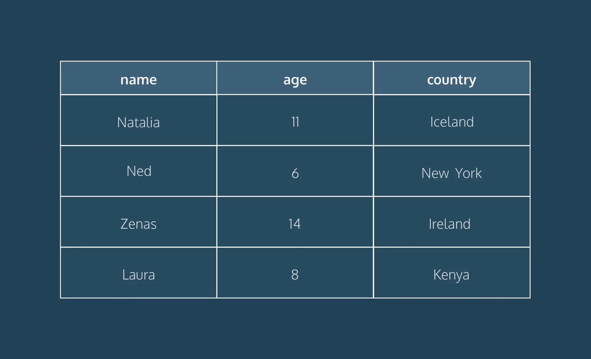
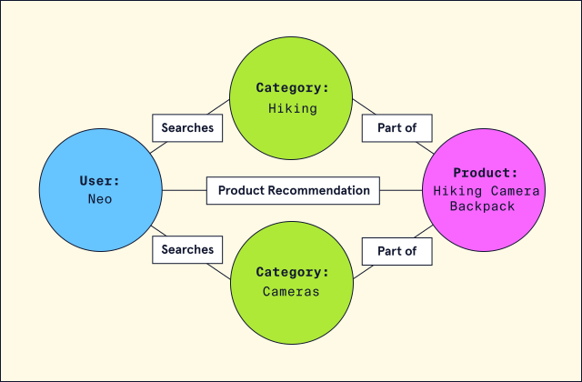

# Index
* [What is a Relational Database Management System?](#what-is-a-relational-database-management-system)
* [Introduction to NoSQL](#introduction-to-nosql)

# What is a Relational Database Management System?

## What is a Database?
A database is a set of data stored in a computer. This data is usually structured in a way that makes the data easily accessible.

## What is a Relational Database?
A relational database is a type of database. It uses a structure that allows us to identify and access data in relation to another piece of data in the database. Often, data in a relational database is organized into tables.

## Tables: Rows and Columns
Tables can have hundreds, thousands, sometimes even millions of rows of data. These rows are often called records.

Tables can also have many columns of data. Columns are labeled with a descriptive name (say, age for example) and have a specific data type.

For example, a column called age may have a type of INTEGER (denoting the type of data it is meant to hold).



In the table above, there are three columns (name, age, and country).

The name and country columns store string data types, whereas age stores integer data types. The set of columns and data types make up the schema of this table.

The table also has four rows, or records, in it (one each for Natalia, Ned, Zenas, and Laura).

## What is a Relational Database Management System (RDBMS)?
A relational database management system (RDBMS) is a program that allows you to create, update, and administer a relational database. Most relational database management systems use the SQL language to access the database.

## What is SQL?
SQL (Structured Query Language) is a programming language used to communicate with data stored in a relational database management system. SQL syntax is similar to the English language, which makes it relatively easy to write, read, and interpret.

Many RDBMSs use SQL (and variations of SQL) to access the data in tables. For example, SQLite is a relational database management system. SQLite contains a minimal set of SQL commands (which are the same across all RDBMSs). Other RDBMSs may use other variants.

(SQL is often pronounced in one of two ways. You can pronounce it by speaking each letter individually like “S-Q-L”, or pronounce it using the word “sequel”.)

Popular Relational Database Management Systems
SQL syntax may differ slightly depending on which RDBMS you are using. Here is a brief description of popular RDBMSs:

### [MySQL](https://www.mysql.com/)
MySQL is the most popular open source SQL database. It is typically used for web application development, and often accessed using PHP.

The main advantages of MySQL are that it is easy to use, inexpensive, reliable (has been around since 1995), and has a large community of developers who can help answer questions.

Some of the disadvantages are that it has been known to suffer from poor performance when scaling, open source development has lagged since Oracle has taken control of MySQL, and it does not include some advanced features that developers may be used to.

### [PostgreSQL](https://www.postgresql.org/)
PostgreSQL is an open source SQL database that is not controlled by any corporation. It is typically used for web application development.

PostgreSQL shares many of the same advantages of MySQL. It is easy to use, inexpensive, reliable and has a large community of developers. It also provides some additional features such as foreign key support without requiring complex configuration.

The main disadvantage of PostgreSQL is that it can be slower in performance than other databases such as MySQL. It is also slightly less popular than MySQL.

For more information about PostgreSQL including installation instructions, [read this article](https://www.codecademy.com/paths/design-databases-with-postgresql/tracks/what-is-a-database/modules/using-postgresql-on-your-own-computer/articles/installing-and-using-postgresql-locally).

### [Oracle DB](https://www.oracle.com/database/)
Oracle Corporation owns Oracle Database, and the code is not open sourced.

Oracle DB is for large applications, particularly in the banking industry. Most of the world’s top banks run Oracle applications because Oracle offers a powerful combination of technology and comprehensive, pre-integrated business applications, including essential functionality built specifically for banks.

The main disadvantage of using Oracle is that it is not free to use like its open source competitors and can be quite expensive.

### [SQL Server](https://www.microsoft.com/en-us/sql-server/sql-server-2017)
Microsoft owns SQL Server. Like Oracle DB, the code is close sourced.

Large enterprise applications mostly use SQL Server.

Microsoft offers a free entry-level version called Express but can become very expensive as you scale your application.

### [SQLite](https://www.sqlite.org/)
SQLite is a popular open source SQL database. It can store an entire database in a single file. One of the most significant advantages this provides is that all of the data can be stored locally without having to connect your database to a server.

SQLite is a popular choice for databases in cellphones, PDAs, MP3 players, set-top boxes, and other electronic gadgets. The SQL courses on Codecademy use SQLite.

For more info on SQLite, including installation instructions, [read this article](https://www.codecademy.com/courses/learn-sql/articles/what-is-sqlite).

## Using An RDBMS On Codecademy
On Codecademy, we use both SQLite and PostgreSQL. While this may sound confusing, don’t worry! We want to stress that the basic syntax you will learn can be used in both systems. For example, the syntax to create tables, insert data into those tables, and retrieve data from those tables are all identical. That’s one of the nice parts of learning SQL — by learning the fundamentals with one RDBMS, you can easily begin work in another.

That being said, let’s take a look at some of the more subtle details:
* File extensions — when working with databases on Codecademy, take a look at the name of the file you’re writing in. If your file ends in .sqlite, you’re using a SQLite database. If your file ends in .sql, you’re working with PostgreSQL.
* Data types — You’ll learn about data types very early into learning a RDBMS. One thing to note is that SQLite and PostgreSQL have slightly different data types. For example, if you want to store text in a SQLite database, you’ll use the TEXT data type. If you’re working with PostgreSQL, you have many more options. You could use varchar(n), char(n), or text. Each type has its own subtle differences. This is a good example of PostgreSQL being slightly more robust than SQLite, but the core concepts remaining the same.
* Built-in tables — As you work your way through more complicated lessons on databases, you’ll start to learn how to access built-in tables. For example, if you take our lesson on indexes, you’ll learn how to look at the table that the system automatically creates to keep track of what indexes exist. Depending on which RDBMS system you are using (in that lesson we’re using PostgreSQL), the syntax for doing that will be different. Any time you’re writing SQL about the database itself, rather than the data, that syntax will likely be unique to the RDBMS you’re using.

## Conclusion
Relational databases store data in tables. Tables can grow large and have a multitude of columns and records. Relational database management systems (RDBMSs) use SQL (and variants of SQL) to manage the data in these large tables. The RDBMS you use is your choice and depends on the complexity of your application.

# Introduction to NoSQL

## Introduction to NoSQL
In the world of databases, there are many different ways to organize and store data. At this point, we are familiar with the concept of relational databases that store data in rows, form relationships between the tables, and query the data using SQL. However, a new type of database, NoSQL, started to rise in popularity in the early 21st century.

NoSQL is short for “not-only SQL”, but is also commonly called “non-relational” or “non-SQL”. Any database technology that stores data differently from relational databases can be categorized as a NoSQL database. To get a good grasp on NoSQL, in this article, we will:
* Cover a brief overview of how we arrived at NoSQL technology.
* Examine some of the distinct reasons to choose or not choose a NoSQL database.
* Explore common types of NoSQL databases and how each type structures data.

Let’s dive in!

## Arriving at NoSQL
The need to store and organize data records dates back to way before the term “database” was coined. It wasn’t until around the late 1960s (although there were [methods of data storage](https://en.wikipedia.org/wiki/Punched_card) way before then) that the first implementation of a computerized database came into existence. Relational databases gained in popularity in the 1970s and have remained a staple in the database world ever since. However, as datasets became exponentially larger and more complex, developers began to seek a flexible and more scalable database solution. This is where NoSQL came in. Let’s examine some of the notable reasons developers may opt, or not opt, for a NoSQL database.

## Is NoSQL the Right Option?
When considering what type of database suits an application’s needs, it’s important to note that relational and non-relational (NoSQL) databases each offer distinct advantages and disadvantages. While not an exhaustive list, here are some notable benefits that a NoSQL database may provide:
* Scalability: NoSQL was designed with scalability as a priority. NoSQL can be an excellent choice for massive datasets that need to be distributed across multiple servers and locations.
* Flexibility: Unlike a relational database, NoSQL databases don’t require a schema. This means that NoSQL can handle unstructured or semi-structured data in different formats.
* Developer Experience: NoSQL requires less organization and thus lets developers focus more on using the data than storing it. However, NoSQL databases do have some drawbacks:
* Data Integrity: Relational databases are typically \[ACID](link to ACID article) compliant, ensuring a high degree of data integrity. NoSQL databases follow BASE principles (basic availability, soft state, and eventual consistency) and can often sacrifice integrity for availability. However, some NoSQL databases do offer ACID compliance.
* Language Standardization: While some NoSQL databases do offer using SQL, typically, each database has its unique way to set up, manage, and query data.

Now that we have a better idea about why we may choose or not choose a NoSQL solution, let’s explore our choices for data organization by exploring a few different types of NoSQL databases.

## Types of NoSQL Databases
There are four common types of NoSQL databases that store data in slightly different ways. Each type will provide distinct advantages and disadvantages depending on the dataset. In the examples below, we will be using an e-commerce website to illustrate how each database may store the data.

### Key-Value
A key-value database consists of individual records organized via key-value pairs. In this model, keys and values can be any type of data, ranging from numbers to complex objects. However, keys must be unique. This means this type of database is best when data is attributed to a unique key, like an ID number. Ideally, the data is also simple, and we are looking to prioritize fast queries over fancy features. For example, let’s say we wanted to store shopping cart information for customers that shop in an e-commerce store. Our key-value database might look like this:

| Key | Value |
| --- | ----- |
| customer-123 | { “address”: “…”, name: “…”, “preferences”: {…} } |
| customer-456 | { “address”: “…”, name: “…”, “preferences”: {…} } |

Amazon’s [DynamoDB](https://aws.amazon.com/dynamodb/) is A popular option for developers looking to work with key-value databases.

### Document
A document-based (also called document-oriented) database consists of data stored in JSON-like structures. Some supported document formats include: JSON, BSON, XML, and YAML. The document-based model is considered an extension of the key-value database and provides querying capabilities not solely based on unique keys. Documents are considered very flexible and can evolve to fit an application’s needs. They can even model relationships!

For example, let’s say we wanted to store product information for customers who shop in our e-commerce store. Our products document might look like this:

“`json [ { “product_title”: “Codecademy SQL T-shirt”, “description”: “SQL > NoSQL”, “link”: “https://shop.codecademy.com/collections/student-swag/products/sql-tshirt"
```
"shipping_details": {
  "weight": 350,
  "width": 10,
  "height": 10,
  "depth": 1
},
 
"sizes": ["S", "M", "L", "XL"],
 
"quantity": 101010101010,
 
"pricing": {
  "price": 14.99
}
} ]
```

[MongoDB](https://www.mongodb.com/) is a popular option for developers looking to work with a document database.

### Graph
A graph database stores data using a [graph structure](https://en.wikipedia.org/wiki/Graph_(abstract_data_type)). In a graph structure, data is stored into individual nodes (also called vertices) and establishes relationships via edges (also called links or lines). The advantage of the relationships built using a graph database as opposed to a relational database is that they are much simpler to set up, manage, and query. For example, let’s say we wanted to build a recommendation engine for our e-commerce store. We could establish relationships between similar items our customers searched for to create recommendations.



In the graph above, we can see that there are 4 nodes: “Neo”, “Hiking”, “Cameras”, and “Hiking Camera Backpack”. Because the user, “Neo”, searched for “Hiking” and “Cameras”, there are edges connecting all 3 nodes. More edges are created after the search includes a new node, “Hiking Camera Backpack”.

[Neo4j](https://neo4j.com/) is a popular option for developers looking to work with a document database.

### Column Oriented
A column-oriented NoSQL database stores data similar to a relational database. However, instead of storing data as rows, it is stored as columns. Column-oriented databases aim to provide faster read speeds by being able to quickly aggregate data for a specific column. For example, take a look at the following e-commerce database of products:

Art Request showing column-oriented table with products for name, total sales, and id

If we wanted to analyze the total sales for all the products, all we would need to do is aggregate data from the sales column. This is in contrast to a relational model that would have to pull data from each row, where we would also be pulling adjacent data (like size information in the above example) that isn’t relevant to our query.

Amazon’s [Redshift](https://aws.amazon.com/redshift/) is a popular option for developers looking to work with a column-oriented database.

## Wrap Up
We’ve now learned some of the fundamentals of NoSQL database technology. Let’s take a moment to review what we’ve learned:
* NoSQL stands for “not-only SQL” (also called “non-relational”, or “non-SQL”) and refers to any database that stores data in any format other than relational tables.
* NoSQL database technology grew in popularity due to datasets growing in size and complexity.
* NoSQL databases may provide advantages such as flexibility, scalability, and speed.
* NoSQL databases experience disadvantages such as lack of data integrity and lack of language standardization across different NoSQL databases.
* Common types of NoSQL databases include key-value, document, graph, and column-oriented.

Next time a project requires a database, consider the tradeoffs between a relational and a NoSQL database and pick one that best suits your use case!
