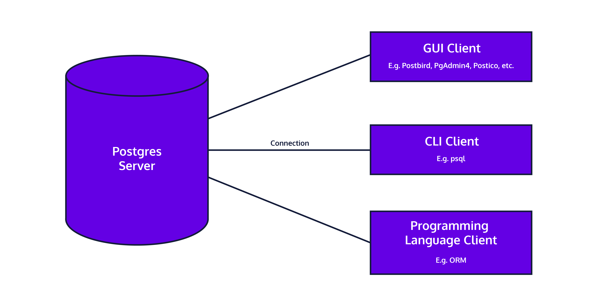

# Installing and Using PostgreSQL Locally

In this article, we will be exploring the extremely prevalent database engine called PostgreSQL (or Postgres, for short). We will describe what it does, its main uses, and then explain how to set it up and use it on your own computer.

## What is Postgres?
Let’s go to the source to get a good definition of Postgres! According to the [PostgreSQL website](https://www.postgresql.org/), Postgres is “a powerful, open-source object-relational database system with over 30 years of active development that has earned it a strong reputation for reliability, feature robustness, and performance.”

Like other relational databases, you can model almost any data and its relationships using tables, keys, constraints, triggers, and more!

Postgres is currently used in production by many modern technology companies, be it small startups or large organizations such as Apple, Instagram, Twitch, and Reddit.

Postgres itself is a database “server.” There are several ways to connect to Postgres via “clients,” including [GUIs](https://en.wikipedia.org/wiki/Graphical_user_interface), [CLIs](https://en.wikipedia.org/wiki/Command-line_interface), and programming languages often via [ORMs](https://en.wikipedia.org/wiki/Object%E2%80%93relational_mapping). In order to run and use Postgres on your own computer, you will need to set up both a Postgres server and a client.



In the rest of this article, we’ll get a Postgres server and GUI client set up locally.

## Setting Up Postgres (server)
These instructions will be different depending on your operating system.

### Windows
Follow the instructions for the Interactive Installer by EDB as described on [Postgres Download: Windows installers](https://www.postgresql.org/download/windows/); you’ll be prompted to enter in a password for the postgres user: for now, set the password as “postgres”. If you are asked to enter a port, you can use the default of “5432”.

After completing the installation, you may be asked whether you would like to use Stack Builder to install additional software. You shouldn’t need to install anything else for now.

### Mac OS X
There are several ways to download and manage your Postgres installation on Mac OS X, as described on [Postgres Download: macOS packages](https://www.postgresql.org/download/macosx/).

We recommend [Postgres.app](https://postgresapp.com/) as it’s the easiest way to get started. According to the Postgres website, Postgres.app is a native OS X app that runs in the menu bar without the need of an installer. Open the app, and you have a PostgreSQL server ready and awaiting new connections. Close the app, and the server shuts down.

Follow the instructions on their homepage to get started.

The first time you open Postgres.app, you may need to confirm that the app is not malicious.

### Linux
Follow the instructions for [downloading Postgres for Linux](https://www.postgresql.org/download/linux/); we recommend using apt installation.
```
# Create the file repository configuration:
sudo sh -c 'echo "deb http://apt.postgresql.org/pub/repos/apt $(lsb_release -cs)-pgdg main" > /etc/apt/sources.list.d/pgdg.list'
 
# Import the repository signing key:
wget --quiet -O - https://www.postgresql.org/media/keys/ACCC4CF8.asc | sudo apt-key add -
 
# Update the package lists:
sudo apt-get update
 
# Install the latest version of PostgreSQL.
# If you want a specific version, use 'postgresql-12' or similar instead of 'postgresql':
sudo apt-get -y install postgresql
```

You’ll then be prompted to start your server. To do so, follow the instructions provided:
```
sudo pg_ctlcluster 12 main start
```

## Setting up Postgres (client)
Now that Postgres is running locally, we can connect to it via a “client” – a graphical or command-line interface that enables us to connect to the Postgres server, write and execute SQL commands as input, and see the resulting output.

While you can have only one instance of Postgres running per port (typically 5432), you can have multiple open connections to the same database with different interfaces. There are many options; our preferences are listed below!

## GUI
Our preference for a cross-platform software to visually interact with Postgres is [Postbird](https://github.com/Paxa/postbird). It is open-source, simple, easy to use, and a great option for beginner and advanced users! A strong runner up is [PgAdmin](https://www.pgadmin.org/), one of the most popular and feature-rich open source administration and development platforms for Postgres. We’ll walk you through how to install and use Postbird on different operating systems!

### Windows
1. Download the .exe file from the [Postbird website](https://www.electronjs.org/apps/postbird).
2. Open the .exe file, and disregard the Security prompt from Microsoft Defender SmartScreen by clicking on “More Info” and then “Run Anyway”. This is just confirming that you want to run an .exe file that you downloaded online.
3. Postbird will automatically open, and from there you can enter in the username (postgres) and password (postgres) to connect to your locally running Postgres instance.
4. From there you can now use Postbird to start writing SQL queries. You can select the database you want to work in using the dropdown menu in the top left corner, you can add tables to that database using the plus sign in the bottom left corner, and you can use the query tab to write SQL queries to manipulate and investigate tables that you create!

### Linux
Install via [Snap](https://snapcraft.io/), which comes pre-installed on Ubuntu. From Terminal:
```
sudo snap install postbird
```

### Command Line
We’ll primarily be using Postbird as our client for connecting to Postgres, but you can also connect using the command line tool psql! [psql](https://www.postgresql.org/docs/9.3/app-psql.html) is the standard interactive CLI used by both hobbyists and professionals.

According to the Postgres documentation, psql “enables you to type in queries interactively, issue them to PostgreSQL, and see the query results. Alternatively, input can be from a file. In addition, it provides a number of meta-commands and various shell-like features to facilitate writing scripts and automating a wide variety of tasks.”

When using psql, you can use the \q command to quit out of psql and return to your normal terminal.

Let’s look at how to download psql on different operating systems.

### Windows
The EDB installation of Postgres comes pre-packaged with command line tools. Simply open the Windows Command Prompt, and execute the .exe:
```
Microsoft Windows [Version 10.0.19041.264]
(c) 2020 Microsoft Corporation. All rights reserved.
 
C:\Users\avinashmoondra>"C:\Program Files\PostgreSQL\12\bin\psql.exe" --username postgres
```

You’ll be prompted for the password (postgres), and then you can run a test query! (assuming you’ve created a table during the GUI installation)
```
psql (12.4)
WARNING: Console code page (437) differs from Windows code page (1252)
         8-bit characters might not work correctly. See psql reference
         page "Notes for Windows users" for details.
Type "help" for help.
 
postgres=# select * from films;
 id |    name    | release_date
----+------------+--------------
  1 | The Matrix | 1999-03-31
(1 row)
```

### Mac OS X
From Postgres.app, simply click on any database you’d like to connect to. It will automatically open up Terminal or iTerm (depending on your setting in Preferences) with psql CLI running.

From here, you can run a test query:
```
psql (12.3)
Type "help" for help.
 
postgres=# select * from films;
 id |    name    | release_date
----+------------+--------------
  1 | The Matrix | 1999-03-31
(1 row)
```

### Linux
postgresql-12 installation via apt-get comes with command-line tools.
```
parallels@parallels-Parallels-Virtual-Platform:~$ sudo -u postgres psql postgres
[sudo] password for parallels: 
psql (12.4 (Ubuntu 12.4-1.pgdg18.04+1))
Type "help" for help.
 
postgres=#
```
 
## Conclusion
You’ve installed, run, and connected to Postgres! We achieved this by setting up a Postgres server and client locally. Now you have the full power of the Postgres flavor of SQL at your fingertips. You’ll be able to manage all the data for any application you can dream of writing. Congratulations!
