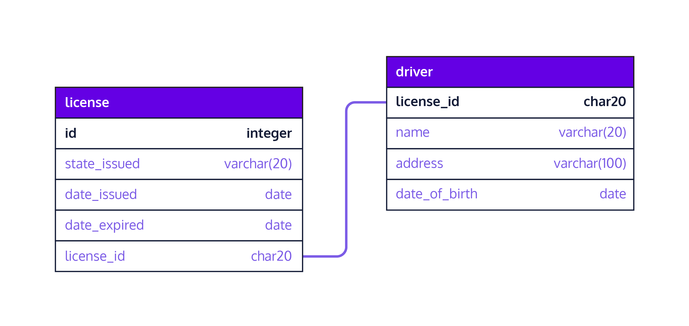

# Index

* Introduction: Designing Relational Databases
* Inreoduction to Database Design
* [Designing a Database](#designing-a-database)
  * [Introduction](#introduction)
  * [One-to-One Relationship](#one-to-one-relationship)
  * [One-to-Many Relationship](#one-to-many-relationship)

# Designing a Database

## Introduction
In this lesson, we will learn about relationships between tables and how to use this knowledge to enhance our database. This lesson is built upon prior knowledge of database keys in the Database Keys lesson.

On the right is a sample database schema diagram. Let’s take a look at what it entails. There are seven tables in this diagram and most of them are related to each other with the exception of a standalone table, popular_books. In each table, primary keys are bolded. The lines between tables connect foreign keys and primary keys.

What are relationships? A database relationship establishes the way in which connected tables are dependent on one another.

What are the different types of database relationships? There are three types: one-to-one, one-to-many and many-to-many. We will delve into each one in the upcoming exercises. Let’s get started.


## One-to-One Relationship

In a one-to-one relationship, a row of table A is associated with exactly one row of table B and vice-versa. For example, a person may only have one passport assigned to them. Conversely, a passport may only be issued to one person. A car may only have one vehicle identification number assigned to it and vice-versa. A driver may only have one driver’s license issued to them in their home state.

Let’s elaborate on the last example further. Let’s say we have a driver table with the following columns:
* name
* address
* date_of_birth
* license_id

We also have a license table with the following columns:
* id
* state_issued
* date_issued
* date_expired

In the driver table, the primary key that uniquely identifies a driver would be the license_id. Similarly, the primary key that uniquely identifies a driver’s license in the license table would be the id itself. To establish a one-to-one relationship in PostgreSQL between these two tables, we need to designate a foreign key in one of the tables. We can pick the license_id from driver to be the foreign key in the license table. However, doing this is not enough to ensure that duplicate rows will not exist in the license table.

To enforce a strictly one-to-one relationship in PostgreSQL, we need another keyword, UNIQUE. By appending this keyword to the declaration of the foreign key, we should be all set.
```SQL
license_id char(20) REFERENCES driver(license_id) UNIQUE
```



The full PostgreSQL script for creating these two tables is as follows:
```SQL
CREATE TABLE driver (
    license_id char(20) PRIMARY KEY,
    name varchar(20),
    address varchar(100),
    date_of_birth date
);      
 
CREATE TABLE license (
    id integer PRIMARY KEY,
    state_issued varchar(20),
    date_issued date,
    date_expired  date,
    license_id char(20) REFERENCES driver(license_id) UNIQUE
);
```

### Exercise
Suppose we want to maintain additional optional information such as book rating, language it’s written in, a keyword list to tag the book with, and date of publication. Since these information are optional, we don’t have to include them in the book table. If we do, we may end up with a lot of empty columns for some books. Instead, we can create a new table to house them. Then, we can establish a one-to-one relationship between these two tables.

`script.sql`
```SQL
CREATE TABLE book_details (
  id integer PRIMARY KEY,
  -- Linking two tables by table_name(column_name)
  book_isbn varchar(50) REFERENCES book(isbn) UNIQUE,
  rating decimal,
  language varchar(10),
  keywords text[],
  date_published date
);

-- This returns any constrains added to the table
SELECT
  constraint_name,
  table_name,
  column_name
FROM information_schema.key_column_usage
WHERE table_name = 'book_details';

-- START ADDING DATA
INSERT INTO book VALUES (
  'Learn PostgreSQL',
  '123457890',
  100,
  2.99,
  'Great course',
  'Codecademy'
);

INSERT INTO book_details VALUES (
  1,
  '123457890',
  3.95,
  'English',
  '{sql, postgresql, database}',
  '2020-05-20'
);

INSERT INTO book_details VALUES (
  2,
  '123457890',
  3.95,
  'French',
  '{sql, postgresql, database}',
  '2020-05-20'
);
-- END

-- The query should return one row of result for the book whose title is Learn PostgreSQL
-- Learn PostgreSQL | $2.99 | English | 3.95
SELECT
  book.title,
  book.price,
  book_details.language,
  book_details.rating
FROM book
JOIN book_details
ON book.isbn = book_details.book_isbn;
```

## One-to-Many Relationship
As opposed to one-to-one, a one-to-many relationship cannot be represented in a single table. Why? Because there will be multiple rows that need to exist for a primary key and this will result in redundant data that breaks the constraint placed upon a primary key.

For example, consider a table where we want one person to be able to have many email addresses. However, if there is a primary key in the table, such as id, the following rows will be rejected by the database.
```SQL
name   id (PK)     email       
Cody   2531       cody@yahoo.com 
Cody   2531       cody@google.com
Cody   2531       cody@bing.com
```

To resolve this, we need to represent a one-to-many relationship with two tables - a parent and a child table. Analogous to a parent-child relationship where a parent can have multiple children, a parent table will house a primary key and the child table will house both primary and foreign keys. The foreign key binds the child table to the parent table.

The following illustration shows the one-to-many relationship between person and email tables.


### Exercise

```SQL
CREATE TABLE page (
  id integer PRIMARY KEY,
  -- Linking two tables by table_name(column_name)
  chapter_id integer REFERENCES chapter(id),
  content text,
  header varchar(20),
  footer varchar(20)
);

-- Omiting from displaying
ALTER TABLE chapter
DROP COLUMN content;

-- Displaying restrictions
SELECT
  constraint_name,
  table_name,
  column_name
FROM information_schema.key_column_usage
WHERE table_name = 'page';

-- START ADDING DATA
INSERT INTO book VALUES (
  'Learn PostgreSQL',
  '0-9673-4537-5',
  100,
  2.99,
  'Dive into Postgres for Beginners',
  'Codecademy Publishing'
);
INSERT INTO book VALUES (
  'Postgres Made Easy',
  '0-3414-4116-3',
  255,
  5.99,
  'Learn Postgres the Easy Way',
  'Codecademy Press'
);

INSERT INTO chapter VALUES (
  1,
  '0-9673-4537-5',
  1,
  'Chapter 1'
);
INSERT INTO chapter VALUES (
  2,
  '0-3414-4116-3',
  1,
  'Chapter 1'
);

INSERT INTO page VALUES (
  1,
  1,
  'Chapter 1 Page 1',
  'Page 1 Header',
  'Page 1 Footer'
);
INSERT INTO page VALUES (
  2,
  1,
  'Chapter 1 Page 2',
  'Page 2 Header',
  'Page 2 Footer'
);
INSERT INTO page VALUES (
  3,
  2,
  'Chapter 1 Page 1',
  'Page 1 Header',
  'Page 1 Footer'
);
INSERT INTO page VALUES (
  4,
  2,
  'Chapter 1 Page 2',
  'Page 2 Header',
  'Page 2 Footer'
);
-- END

-- Joining all tables
SELECT
  book.title AS book_title,
  chapter.title AS chapter_title,
  page.content AS page_content
FROM book
INNER JOIN chapter
ON
  book.isbn = chapter.book_isbn
INNER JOIN page
ON chapter.id = page.chapter_id;
```
book_title | chapter_title | page_content
| -------- | ------------- | ------------ |
Learn PostgreSQL | Chapter 1 | Chapter 1 Page 1
Learn PostgreSQL | Chapter 1 | Chapter 1 Page 2
Postgres Made Easy | Chapter 1 | Chapter 1 Page 1
Postgres Made Easy | Chapter 1 | Chapter 1 Page 2