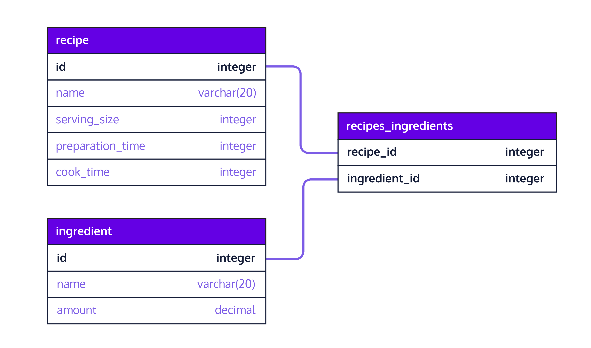

# Index
* Introduction: Designing Relational Databases
* Inreoduction to Database Design
* [Designing a Database](#designing-a-database)
  * [Introduction](#introduction)
  * [One-to-One Relationship](#one-to-one-relationship)
  * [One-to-Many Relationship](#one-to-many-relationship)
  * [Many-to-Many Relationship Part 1](#many-to-many-relationship-part-1)

# Resources
* [Design pattern: many-to-many (order entry)](https://web.csulb.edu/colleges/coe/cecs/dbdesign/dbdesign.php?page=manymany.php)

# Designing a Database

## Introduction
In this lesson, we will learn about relationships between tables and how to use this knowledge to enhance our database. This lesson is built upon prior knowledge of database keys in the Database Keys lesson.

On the right is a sample database schema diagram. Let’s take a look at what it entails. There are seven tables in this diagram and most of them are related to each other with the exception of a standalone table, popular_books. In each table, primary keys are bolded. The lines between tables connect foreign keys and primary keys.

What are relationships? A database relationship establishes the way in which connected tables are dependent on one another.

What are the different types of database relationships? There are three types: one-to-one, one-to-many and many-to-many. We will delve into each one in the upcoming exercises. Let’s get started.


## One-to-One Relationship

In a one-to-one relationship, a row of table A is associated with exactly one row of table B and vice-versa. For example, a person may only have one passport assigned to them. Conversely, a passport may only be issued to one person. A car may only have one vehicle identification number assigned to it and vice-versa. A driver may only have one driver’s license issued to them in their home state.

Let’s elaborate on the last example further. Let’s say we have a driver table with the following columns:
* name
* address
* date_of_birth
* license_id

We also have a license table with the following columns:
* id
* state_issued
* date_issued
* date_expired

In the driver table, the primary key that uniquely identifies a driver would be the license_id. Similarly, the primary key that uniquely identifies a driver’s license in the license table would be the id itself. To establish a one-to-one relationship in PostgreSQL between these two tables, we need to designate a foreign key in one of the tables. We can pick the license_id from driver to be the foreign key in the license table. However, doing this is not enough to ensure that duplicate rows will not exist in the license table.

To enforce a strictly one-to-one relationship in PostgreSQL, we need another keyword, UNIQUE. By appending this keyword to the declaration of the foreign key, we should be all set.
```SQL
license_id char(20) REFERENCES driver(license_id) UNIQUE
```


The full PostgreSQL script for creating these two tables is as follows:
```SQL
CREATE TABLE driver (
    license_id char(20) PRIMARY KEY,
    name varchar(20),
    address varchar(100),
    date_of_birth date
);      
 
CREATE TABLE license (
    id integer PRIMARY KEY,
    state_issued varchar(20),
    date_issued date,
    date_expired  date,
    license_id char(20) REFERENCES driver(license_id) UNIQUE
);
```

### Exercise
Suppose we want to maintain additional optional information such as book rating, language it’s written in, a keyword list to tag the book with, and date of publication. Since these information are optional, we don’t have to include them in the book table. If we do, we may end up with a lot of empty columns for some books. Instead, we can create a new table to house them. Then, we can establish a one-to-one relationship between these two tables.

`script.sql`
```SQL
CREATE TABLE book_details (
  id integer PRIMARY KEY,
  -- Linking two tables by table_name(column_name)
  book_isbn varchar(50) REFERENCES book(isbn) UNIQUE,
  rating decimal,
  language varchar(10),
  keywords text[],
  date_published date
);

-- This returns any constrains added to the table
SELECT
  constraint_name,
  table_name,
  column_name
FROM information_schema.key_column_usage
WHERE table_name = 'book_details';

-- START ADDING DATA
INSERT INTO book VALUES (
  'Learn PostgreSQL',
  '123457890',
  100,
  2.99,
  'Great course',
  'Codecademy'
);

INSERT INTO book_details VALUES (
  1,
  '123457890',
  3.95,
  'English',
  '{sql, postgresql, database}',
  '2020-05-20'
);

INSERT INTO book_details VALUES (
  2,
  '123457890',
  3.95,
  'French',
  '{sql, postgresql, database}',
  '2020-05-20'
);
-- END

-- The query should return one row of result for the book whose title is Learn PostgreSQL
-- Learn PostgreSQL | $2.99 | English | 3.95
SELECT
  book.title,
  book.price,
  book_details.language,
  book_details.rating
FROM book
JOIN book_details
ON book.isbn = book_details.book_isbn;
```

## One-to-Many Relationship
As opposed to one-to-one, a one-to-many relationship cannot be represented in a single table. Why? Because there will be multiple rows that need to exist for a primary key and this will result in redundant data that breaks the constraint placed upon a primary key.

For example, consider a table where we want one person to be able to have many email addresses. However, if there is a primary key in the table, such as id, the following rows will be rejected by the database.
```SQL
name   id (PK)     email       
Cody   2531       cody@yahoo.com 
Cody   2531       cody@google.com
Cody   2531       cody@bing.com
```

To resolve this, we need to represent a one-to-many relationship with two tables - a parent and a child table. Analogous to a parent-child relationship where a parent can have multiple children, a parent table will house a primary key and the child table will house both primary and foreign keys. The foreign key binds the child table to the parent table.

The following illustration shows the one-to-many relationship between person and email tables.


### Exercise

```SQL
CREATE TABLE page (
  id integer PRIMARY KEY,
  -- Linking two tables by table_name(column_name)
  chapter_id integer REFERENCES chapter(id),
  content text,
  header varchar(20),
  footer varchar(20)
);

-- Omiting from displaying
ALTER TABLE chapter
DROP COLUMN content;

-- Displaying restrictions
SELECT
  constraint_name,
  table_name,
  column_name
FROM information_schema.key_column_usage
WHERE table_name = 'page';

-- START ADDING DATA
INSERT INTO book VALUES (
  'Learn PostgreSQL',
  '0-9673-4537-5',
  100,
  2.99,
  'Dive into Postgres for Beginners',
  'Codecademy Publishing'
);
INSERT INTO book VALUES (
  'Postgres Made Easy',
  '0-3414-4116-3',
  255,
  5.99,
  'Learn Postgres the Easy Way',
  'Codecademy Press'
);

INSERT INTO chapter VALUES (
  1,
  '0-9673-4537-5',
  1,
  'Chapter 1'
);
INSERT INTO chapter VALUES (
  2,
  '0-3414-4116-3',
  1,
  'Chapter 1'
);

INSERT INTO page VALUES (
  1,
  1,
  'Chapter 1 Page 1',
  'Page 1 Header',
  'Page 1 Footer'
);
INSERT INTO page VALUES (
  2,
  1,
  'Chapter 1 Page 2',
  'Page 2 Header',
  'Page 2 Footer'
);
INSERT INTO page VALUES (
  3,
  2,
  'Chapter 1 Page 1',
  'Page 1 Header',
  'Page 1 Footer'
);
INSERT INTO page VALUES (
  4,
  2,
  'Chapter 1 Page 2',
  'Page 2 Header',
  'Page 2 Footer'
);
-- END

-- Joining all tables
SELECT
  book.title AS book_title,
  chapter.title AS chapter_title,
  page.content AS page_content
FROM book
INNER JOIN chapter
ON
  book.isbn = chapter.book_isbn
INNER JOIN page
ON chapter.id = page.chapter_id;
```

### Result
book_title | chapter_title | page_content
| -------- | ------------- | ------------ |
Learn PostgreSQL | Chapter 1 | Chapter 1 Page 1
Learn PostgreSQL | Chapter 1 | Chapter 1 Page 2
Postgres Made Easy | Chapter 1 | Chapter 1 Page 1
Postgres Made Easy | Chapter 1 | Chapter 1 Page 2

## Many-to-Many Relationship Part 1
Consider the following examples of many to many relationships:
* A student can take many courses while a course can have enrollments from many students.
* A recipe can have many ingredients while an ingredient can belong to many different recipes.
* A customer can patronize many banks while a bank can service many different customers.

In each of the above examples, we see that a many-to-many relationship can be broken into two one-to-many relationships.

To implement a many-to-many relationship in a relational database, we would create a third cross-reference table also known as a join table. It will have these two constraints:
* foreign keys referencing the primary keys of the two member tables.
* a composite primary key made up of the two foreign keys.

Let’s elaborate on this further with the recipe and ingredient many-to-many relationship. Let’s say a recipe table has the following columns:
* id (primary key)
* name
* serving_size
* preparation_time
* cook_time

An ingredient table has the following columns:
* id (primary key)
* name
* amount

A third cross-reference table, recipes_ingredients, will support the following columns:

recipe_id (foreign key referencing recipe table’s id)(primary key)
ingredient_id (foreign key referencing ingredient table’s id) (primary key)
Both recipe_id and ingredient_id also serve as a composite primary key for recipes_ingredients.



Many-to-many relationship database schema

### Exrecise
`script.sql`
```SQL
CREATE TABLE books_authors (
  -- Creating Composite Primary Key
  PRIMARY KEY (book_isbn, author_email),
  -- Linking to books table
  book_isbn varchar(50) REFERENCES book(isbn),
  -- Linking to author table
  author_email varchar(100) REFERENCES author(email)
);

-- Validating restrictions
SELECT
  constraint_name,
  table_name,
  column_name
FROM information_schema.key_column_usage
WHERE table_name = 'books_authors';
```
`db.sql`
```SQL
/* All tables should be created in a new schema called cc_user */

DROP SCHEMA IF EXISTS cc_user CASCADE;
CREATE SCHEMA cc_user;
SET SEARCH_PATH = cc_user;

CREATE TABLE book (
  title varchar(100),
  isbn varchar(50) PRIMARY KEY,
  pages integer,
  price money,
  description varchar(256),
  publisher varchar(100)
);

CREATE TABLE author (
  name varchar(50),
  bio varchar(100),
  email varchar(20) PRIMARY KEY
);
```

## Many-to-Many Relationship Part 2
Now that you have related two tables with a many-to-many relationship via a cross-reference table, you will get to populate the cross-reference table and make interesting queries.

In this exercise, you are going to demonstrate the many-to-many relationship between book and author through the cross-reference table, books_authors.

### Exercise
3. Write statements to populate the books_authors table to show the following relationships:
* 'Learn PostgreSQL Volume 1' is written by both 'James Key' and 'Clara Index'
* 'Learn PostgreSQL Volume 2' is written by 'Clara Index'

The primary keys for books are:
* `'123457890' for 'Learn PostgreSQL Volume 1'
* '987654321' for 'Learn PostgreSQL Volume 2'

The primary keys for authors are:
* 'jkey@db.com' for 'James Key'
* 'cindex@db.com' for 'Clara Index'

```SQL
INSERT INTO books_authors VALUES (
  '123457890',
  'jkey@db.com'
);
INSERT INTO books_authors VALUES (
  '123457890',
  'cindex@db.com'
);
INSERT INTO books_authors VALUES (
  '987654321',
  'cindex@db.com'
);
```

4. Write a query to show the one-to-many relationship between book and author. Display three columns using these aliases - book_title, author_name and book_description.

You should expect 3 rows of results, in which one row might look like:
book_title | author_name | book_description
| -------- | ----------- | ---------------- |
| Learn PostgreSQL Volume 1 | Clara Index | Manage database part one |

```SQL
SELECT
  book.title AS book_title,
  author.name AS author_name,
  book.description AS book_description
FROM book, author, books_authors
WHERE book.isbn = books_authors.book_isbn
AND author.email = books_authors.author_email;
```

```SQL
-- To display selected columns (column_one and column_two) from different tables (table_one and table_two) as aliases (alias_one and alias_two) and join them with the help of a cross-reference table (joined_table), use the following syntax:
SELECT column_one AS alias_one, column_two AS alias_two
FROM table_one, table_two, joined_table
WHERE table_one.primary_key = joined_table.foreign_key_one
AND table_two.primary_key = joined_table.foreign_key_two

-- Alternatively, you can query with INNER JOIN from three tables.
SELECT column_one AS alias_one, column_two AS alias_two
FROM table_one
INNER JOIN joined_table
ON table_one.primary_key = joined_table.foreign_key_one
INNER JOIN table_two
ON table_two.primary_key = joined_table.foreign_key_two
```

5. Write a query to show the one-to-many relationship between author and book. Display three columns as aliases - author_name, author_email and book_title.

You should expect to see 3 rows of results and one of them might look like this:
| author_name | author_email | book_title |
| ----------- | ------------ | ---------- |
| Clara Index | cindex@db.com | Learn PostgreSQL | Volume 1 |

```SQL
SELECT
  author.name AS author_name,
  author.email AS author_email,
  book.title AS book_title
FROM author
INNER JOIN books_authors
ON author.email = books_authors.author_email
INNER JOIN book
ON book.isbn = books_authors.book_isbn;
```
