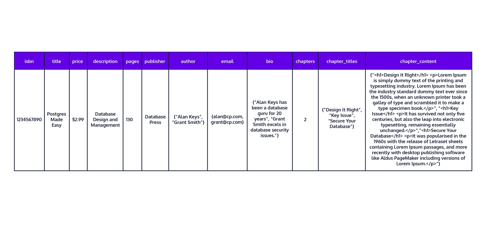

# Index
* [What is a Database Schema?](#what-is-a-database-schema)
* [What Are Database Keys?](#what-are-database-keys)
* [What Are Database Relationships?](#what-are-database-relationships)

# What is a Database Schema?

## Introduction
Welcome! In this lesson, you will learn what a database schema is and how to create one with PostgreSQL. PostgreSQL is a popular database management system that stores information on a dedicated database server instead of on a local file system. The benefits of using a database system include better organization of related information, more efficient storage and faster retrieval.

Like an architectural blueprint, a database schema is documentation that helps its audience such as a database designer, administrator and other users interact with a database. It gives an overview of the purpose of the database along with the data that makes up the database, how the data is organized into tables, how the tables are internally structured and how they relate to one another.

When designing a database schema consider the following steps:
* Define the purpose of your database
* Find the information that make up the database
* Organize your information into tables
* Structure your tables into columns of information
* Avoid redundant data that leads to inaccuracy and waste in space
* Identify the relationships between your tables and implement them

The last two items ensure data accuracy and integrity anytime you need to add or update information in the database. It also makes querying the database much more efficient.

You can design database schemas by hand or by software. Here are a few examples of free online database design tools:
* [DbDiagram.io](http://dbdiagram.io/) - a free, simple tool to draw ER diagrams by just writing code, designed for developers and data analysts.
* [SQLDBM](http://sqldbm.com/home) - SQL Database Modeler
* [DB Designer](http://dbdesigner.net/) - online database schema design and modeling tool
On the right is a sample database schema diagram generated from DbDiagram.io. Let’s take a look at what it entails.

The purpose of this database is to maintain a book inventory. The information in the database is organized into four tables and they are book, chapter, author, and book_list. What data are we storing about a book? What is the book_list table used for?

In this particular schema diagram, the symbols 1 and * on the lines denote a one-to-many relationship between these tables:
* book and chapter
* book and book_list
* author and book_list

We will delve into relationships in more detail in a later lesson.

Different database tools illustrate table relationships with different symbols.

Your database schema should contain the following:
* table names
* column names per table
* column types per table
* constraints per table, if any
* relationships between tables, if any

In this lesson, we will focus mainly on the first three items. In subsequent lessons, we will address constraints and relationships.


## Identifying Your Tables
In this exercise, we are going to delve into designing our own database schema. The purpose of our database is to enable an online bookstore to show its catalog of books to potential buyers and for a buyer to preview sample chapters for a selected book. Imagine you are book browsing on Amazon.com.

After gathering information for this database, we found that our database should have:
* book information which includes title, isbn, number of pages, price, description, and publisher for an overview of the book
* author information which includes author bio and contact
* book chapter information which includes chapter number, chapter title and chapter content that is available for online previewing

As you can see, there is quite a lot of information to maintain in our database. The next step would be to organize the information in our database into tables.



From the information provided, does it make sense to organize our data in one table? Is the table easy to use as is? Does it have too many columns covering different topics?

What makes up the bulk of this table? You are correct if you guess it’s the chapter content. The chapter content is useful when a potential buyer wants to preview a book. But not all books make their content available to the public. In such a case, the chapter content columns will be empty. To make this table easier to use, storing the chapter content in its own table makes more logical sense. This would also make the current table more lightweight and manageable. Therefore, we should restructure this table so that chapter-related information resides in its own table.

Now we are left with a table containing just book and author information. What if we are interested in contacting an author without needing to know what books they write? Would it make sense to consult this table which always links a book to its author? Or would it make more sense to keep the author information separate as well? The answer is ‘yes’ to the latter question.

## Creating Your Tables
Once we have identified our tables for our schema, the next step is to declare what should be in our tables. A database table is made up of columns of information. Each column is assigned a name and data type. You can see this information represented in the schema diagram from exercise 1.

To create a table in PostgreSQL, we would use the following SQL syntax:
```SQL
CREATE TABLE person (
  first_name varchar(15),
  last_name varchar(15),
  age integer,
  …
  ssn char(9)
);
```

In this example, the table name is person, and its column names include first_name, last_name and ssn. You can think of a column name representing a property, attribute or field in the table. The naming convention that we are using for this course in defining PostgreSQL tables is snake case, which uses lower case letters with underscores between words for columns and table names.

Each column name is associated with a column type which is a data type such as numeric, character, boolean or other interesting types. Here is a summary of common data types, what they represent, their sample values and how they display on Postgres:

| Data Type | Representation | Value | Display |
| --------- | -------------- | ----- | ------- |
| integer | whole number | 617 | 617 |
| decimal | floating-point number | 26.17345 | 26.17345 |
| money | fixed floating-point number with 2 decimal places | 6.17 | $6.17 |
| boolean | logic | TRUE, FALSE | t, f |
| char(n) | fixed-length string removes trailing blanks | ‘123 ‘ | ‘123’ |
| varchar(n) | variable-length string | ‘123 ‘ | ‘123 ‘ |
| text | unlimited-length string | ‘123 ‘ | ‘123 ‘ |

## Querying Your Tables
Now that we have defined our three tables, book, chapter and author, let’s populate our tables with sample data and make queries.

To insert data into a PostgreSQL table, use this syntax:
```SQL
INSERT INTO table_name VALUES (
  column_one_value,
  column_two_value,
  …
  column_N_value
);
```

To query a table to return all the columns, type:
```SQL
SELECT * from table_name;
```

In order to have a useful schema, we need to prevent a database table from storing inaccurate data and returning multiple rows when we expect only one. We do this by constraining the table with the help of a primary key assigned to one or more columns. This will ensure that the column or combination of columns contains only unique values. We will explore this topic further in a subsequent lesson on keys.

## Relationships Between Tables
You may remember from the diagram in Exercise 1, that the database tables are connected by lines. The lines connecting the tables depict the relationships between them. For instance, the book table is related to two other tables - chapter table and the book_list table, via related columns - isbn and book_isbn.

Let’s say we have a person table and an email table, where a person can have many email addresses, but an email address can only belong to one person. To implement this type of relationship, we need to apply a constraint on the email table by adding another column to it and designating it to associate with the person table.

Let’s say we have a hobby table as well and populate it with all kinds of hobbies. If we try to query both the hobby and person tables, how do we know for sure that a hobby is tied to a particular person? There is nothing in the person table that links it to a hobby.

To associate a hobby with a person, we need to relate the person table to the hobby table with the type of relationship they have. Can a person have only one hobby or multiple hobbies? Can a hobby apply to only one person or can it be shared by multiple people?

We will discuss these interesting relationships between tables and how to implement them in subsequent lessons about keys and relationships. So far, the tables that you have created are stand alone tables that are unrelated to one another. Let’s see if we can relate the tables in this schema in the following exercises.

## Review
Nice work! In this lesson, you have accomplished the following:
* You have learned what a database schema is.
* You have learned how to go about designing a database schema.
* You have learned how to organize data in a database through tables.
* You have learned how to define a table in Postgres.
* You have learned about data types supported in Postgres.
* You have successfully created the tables: book, chapter and author in Postgres for your schema.
* You have populated the schema you created with sample data and validated it through querying.
* You have learned that your current schema is incomplete.
* You have thought about how the tables you created can relate to each other.


# What Are Database Keys?
# What Are Database Relationships?