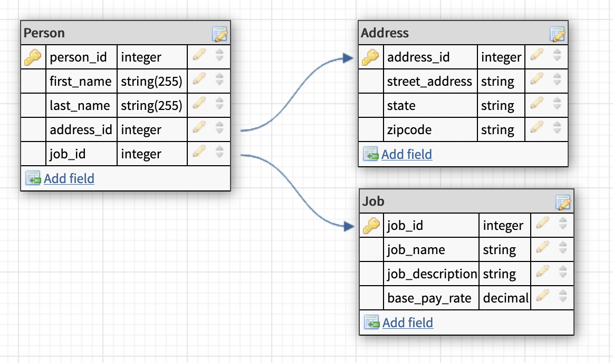
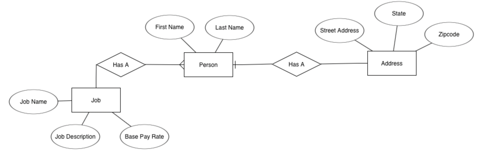

# Index
* [Representing a Schema with Entity Relationship Diagrams](#representing-a-schema-with-entity-relationship-diagrams)
* [Three Tier Architecture](#three-tier-architecture)

# Representing a Schema with Entity Relationship Diagrams

## What is a schema?
When designing a database, the most common thing seen among most teams will be a database schema. Database schemas are often drawn as diagrams — big pictures showing every table and how they are connected. These schemas will usually include the columns in each database and arrows showing how a table relates to another table. There are a few different ways to draw out these diagrams, but in this article, we’ll cover an Entity Relationship Diagram, which is a slightly higher level than a basic database schema.

## Why use a schema?
When working with a database, especially larger databases, it can become very difficult to track each relation within the database due to the size and scope of the database. To assist in keeping track of the database, a schema can be used to help visualize the database and all of its relations. These schemas can be as simple as just naming each table and drawing a line to each connected table. An example of a simple database schema can be seen below.

## What’s an Entity Relationship Diagram?
An Entity Relationship Diagram, or ERD, is a method of diagramming a database with a little more description put into it to allow a designer to better understand the database and the relationships between the tables. This is done by using several different items within the schema. Including:
* Entities. Entities are usually represented as rectangles and indicate the table’s name.
* Attributes. Attributes can be found in one of two places, either inside of the entity’s rectangles as rows or outside of the entity represented by an oval that is connected to the entity. In both places, an attribute means the same thing and is the individual columns that will be found within that table or entity.
* Actions. Actions are seen as diamonds within the ERD and describe the relationships between different entities. For instance, if we have two entities, a Customer and a Credit Card that are both connected, we can put an action in between those two that says “has” to show the designer that a Customer has a Credit Card.
* Connecting Lines. These lines, just like in a basic schema, are used to show the connection between each entity, action, and attribute.

An example of an entity-relationship diagram can be seen below. Notice that the connecting lines have special symbols on the ends, this will be talked about in more detail later.

## Connecting Lines in More Detail
Let’s look at some of the different ways you can use lines to represent relationships between entities. We can represent the cardinality of entities by using symbols on the lines connecting the entities. Using these symbols, we can represent relationships such as many to many, many to one, one to one, and so forth.

The only complication that comes from cardinality is that several different styles currently exist to display these relationships, including Information Engineering Style, Chen Style, Bachman Style, and more. These different styles all still represent the same information, and can be learned about more [here](https://www.lucidchart.com/pages/er-diagrams#section_5).

## How To Create a Schema
When building a schema, there are several tools available to help ensure that you can create a clean-looking schema. The first option we’ll look at is just a simple hand-drawn schema. While a hand-drawn schema will be easier with simpler schemas, nothing is stopping us from drawing these schemas on a piece of notebook paper or a whiteboard in a meeting room. Once drawn we can take a picture of the schema and email it, save it, or start translating it into a web-designed schema.

A web designed schema is a schema designed on the web. There is a large variety of different tools available to start creating schemas online, and it’s all a matter of personal preference for which one to use. At the end of the day, someone could even make a schema using paint on Windows. Some online tools to help build a schema online can be seen below.
* [dbdiagram.io](https://dbdiagram.io/home). This website helps with designing ERDs while also providing a script to help create the database.
* [dbdesigner.net](https://www.dbdesigner.net/). This online design tool allows us to create diagram schemas with simple tools while also creating a script for database creation in several different languages.
* [lucidchart.com](https://www.lucidchart.com/pages/examples/database-design-tool). This website allows us to create database schemas with the same tools used to create different charts. A large amount of freedom lets us create highly detailed database schemas while also providing an export option to several different database options.

One thing to keep in mind when designing the schema is to try and keep the schema as organized as possible. Especially in larger databases, there can be a large number of tables all connected in different ways. When this happens, make sure that each connecting line is fully visible, easy to follow, and doesn’t intersect with other lines. Make sure that all the columns are labeled correctly in the table you expect them to go into once the database is built. Outside of those few practices, the user has general freedom when designing the schema and can generally do whatever needs to be done to show what the database would look like.

## Other Schema Types
While this article mainly looked at the ERD, there are still several different schema options available to use. Some being more complicated than others and some being less complicated. For example, some lower level schema types are the hierarchical model, the network model, and the relational model. Most schemas will use the relational model. If a higher level is needed than ERD we could use the star schema or the snowflake schema. These higher levels deal more with the design of the database and making it more efficient rather than trying to display more information about the schema.

The best choice when creating a schema is to use whatever you believe will be most effective. If working in a small team a simple schema with the tables and connecting lines might be enough as any questions about the diagram can easily be asked among members. But in larger workplaces an ERD can be useful to help convey more information within the schema, reducing the number of questions regarding the design of the database. In the end, it’s a matter of either personal choice or management choice in a career.

# Three Tier Architecture

## What is a three tier application?
When discussing a new application or program that will be built, the number of tiers an application will need is going to likely be discussed. A tier is used to help separate the different processes that will be used within an application. This can be through the use of different tech stacks or by simply dividing into separate teams for each tier. These tiers are easier to understand after viewing a few examples which will be seen later in the article.

Now that we know what a tier is, we can look at a three tier application. In this framework, the three tiers are the presentation tier, application tier, and data tier. These tiers will be discussed in more detail later, but for now, we just need to understand that these tiers can run on their own infrastructure. This allows for easier scalability when expanding the application. This will be detailed later as well.

## The Presentation Tier
The first tier we will be looking at will be the presentation tier. This tier is the one most people will be familiar with as it represents items such as the user interface or GUI. It represents how the user will interact with the application. For example, as a Codecademy student, you are currently interacting with the lessons on a user interface, meaning that this article is currently being represented on the presentation tier. Most users will never need to worry about anything that happens in other tiers.

This tier consists mostly of markup languages including HTML, JavaScript, and CSS. This is because this tier is mainly for presenting and gathering information from the user, and less about processing the data in this tier.

## The Data Tier
The next tier that we will be discussing is the data tier. This is the tier that stores all of the data. Data at this level is not manipulated and is strictly for storage. This is usually just a database to store the data on. The data tier can only interact with the application tier, and is unable to communicate directly to the presentation tier. This is because of the fact that the data tier is strictly for storage and not manipulation.

Think of the data tier as a bin, whatever is inside of the bin is kept there unless something else comes and grabs whatever is inside of it. Unless that happens, the bin does nothing to the items inside of it except store them. In terms of Codecademy and this article, the data tier represents where this article is stored within the Codecademy database. That is all that this tier does and it does not do anything with this article other than store it.

The data tier of applications is usually a database, meaning that services like SQL, MongoDB, and PostgreSQL are used to create the database and assist with querying later. However, any querying done to the database is not considered to be a part of the data tier and is instead a part of the application tier.

## The Application Tier
The final tier that will be looked at will be the application tier. This is where the bulk of the application will go. This tier will deal with processing data gathered from the presentation tier and modifies the data within the data tier. It acts like a bridge connecting the two other tiers.

For example, when looking at this Codecademy article, the application tier represents the process performed when you first opened this article. The data for this article was grabbed from the data tier and then converted into a form you now see in the presentation tier. The middle work between the two tiers is all done in the application tier.

Most of the work performed inside of the application tier will be done in programming languages such as Java, Python, Perl, and other popular programming languages. This is because they are best at manipulating the data into a number of different forms.

## Why use tiered architecture?
Tiered architecture is beneficial in development for a number of reasons. The biggest being the added assistance in designing and development and the ease of scaling up programs as use grows over time. The added assistance with designing and development makes it easier to create separate teams to focus on individual parts of the project. A project can be split into a number of teams each focusing on a different tier within the application.

This also assists with scaling for when the project starts to gather larger users. These layers are typically on their own tech stacks, meaning that when it comes time to upgrade a server, change the user interface, or modify how data is handled, it can all be modified without having to make too many changes to the other tiers. For instance, if Codecademy decided to change the user interface, it would not need to make major changes to the application tier and data tier.

## Other tiered architectures
A three tiered architecture is not the only choice when it comes to deciding the number of tiers inside of an application. Two tiered architecture exists within the development world and contains only a presentation tier and a data tier. This means data is directly displayed to the user, and also means that the logic and data manipulation is limited. This means that two tiered applications are usually very simple in their operations.

Applications can also contain more than three tiers as well. In fact, an application can contain as many tiers as necessary and is usually referenced as an n tier application due to the fact that there is no true limit to the number of tiers an application can contain. As more tiers are added though, it can become harder to maintain the project and can even slow it down due to all of the tiers the project has to manage.

## Conclusion
A three tiered application is a nice middle ground for building a project. It allows for complex applications without slowing down the application. Through the use of a presentation tier, application tier, and data tier, full projects can be built and managed with different teams. The different tiers also help allow for improved scalability for when an application grows and is easier to manage than higher tiered application.
