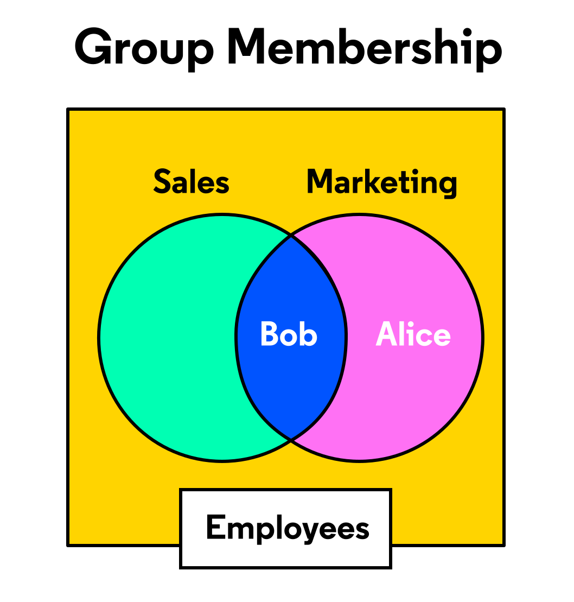
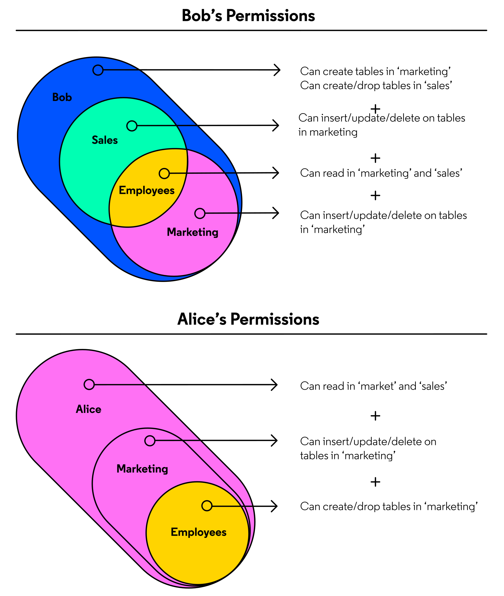

# How to Make Sure My Database Stays Intact
# PostgreSQL Roles; Database Security

## Introduction to Database Permissions
When you create a new PostgreSQL database server there will be a single database and a single user (both usually named postgres) available. In PostgreSQL, you can run the following command to check the name of the current user:
```SQL
SELECT current_user;
```

The postgres user (or any initial user) has the ability to create new databases, tables, users, etc. In PostgreSQL, the term for a user with these types of permissions is superuser. A superuser bypasses all permission checks that other users face before being allowed to perform an action. In Codecademy lessons, this user is most often named ccuser.

superuser privileges are not restricted to a single user. In fact, the superuser designation can be passed along to any number of other users in the DB. However, the superuser designation is a dangerous privilege and should be used sparingly. In computing, there is a rule called the principle of least privilege that suggests all applications and users should have only the minimum permissions required for their function.

In PostgreSQL, to adhere to this principle, you’d want ensure that most users access have restricted privileges, superusers are not be performing routine database tasks, and specialized roles are created with only the permissions they require. In the remainder of this lesson we’ll discuss how permissions can be set up to enforce these standards in your database.

## Investigating Superuser Permissions
As a superuser you may want to check the permissions of users in your database to ensure that they have access to only what they need. The following tables and columns are particularly useful for understanding the state of any user’s permissions:
* pg_catalog.pg_roles — a listing of all users in the database and understand what special permissions these users have.


| Column Name | Description |
| ----------- | ----------- |
| usename | role name |
| usecreatedb | Does the user have `CREATEDB` privileges? |
| usesuper | Does the user have `SUPERUSER` privileges? |

* information_schema.table_privileges — description of the permissions a user (grantee) has on a table. This table can be used to answer questions about who can SELECT, INSERT, UPDATE, etc. values on a table.

You don’t need all the columns in this table to understand what permissions apply to a user on a table. To illustrate how to interpret this table, let’s look at an example below:
```SQL
SELECT grantor, grantee, table_schema, table_name, privilege_type
FROM information_schema.table_privileges 
WHERE grantee = 'userB';
```

| grantor | grantee | table_schema | table_name | privilege_type |
| ------- | ------- | ------------ | ---------- | -------------- |
| userA | userB | finance | sales | SELECT |
| userA | userB | finance | sales | UPDATE |

Each row of this response corresponds to a single permission. The name of the privilege is shown in the privilege_type column. The grantor column tells us name of the role that originally granted the privilege. Overall, this output tells us that userB has been given the ability to SELECT and UPDATE on a table named finance.sales by userA.

Alternatively, as a superuser, you can use SET ROLE to mimic the permissions of other users. For example, If a superuser runs SET ROLE \<test role> and then attempts to perform an action that role couldn’t, they’d receive following message indicating that they don’t have permission.
```SQL
SET ROLE userB;
```

```SQL
ERROR:  permission denied for schema <schema name>
```

This behavior is identical to the connecting to the database with the role from the start. As superuser, you can run SET ROLE \<superuser role> to regain all superuser privileges.

## Creating and Modifying Database Roles
As a superuser, one of the permissions you have is the ability to create new roles. In PostgreSQL, roles can either be login roles or group roles. Login roles are used for most routine database activity. Group roles typically do not have the ability to login themselves, but can hold other roles as “members” and allow access to certain shared permissions.

The CREATE ROLE statement takes a series of arguments that modify the specific parameters around the newly-created user’s permissions. You can create a new login role using CREATE ROLE <name> WITH <list of permissions>;

For example, to create a role with the most basic privileges you might use the following:
```SQL
CREATE ROLE sampleusr WITH NOSUPERUSER LOGIN;
```

Some of the most commonly used permissions are described below. You can reference a full list of permissions available for [CREATE ROLE](https://www.postgresql.org/docs/10/sql-createrole.html) here.

| Permission Name | Function |
| --------------- | -------- |
| SUPERUSER | Is the role a superuser? |
| CREATEROLE | Is the role permitted to create additional roles? |
| CREATEDB | Is the role able to create databases? |
| LOGIN | Is the role able to login? |
| IN ROLE | List of existing roles that a role will be added to as a new member. |

Just like tables or schemas, roles can be altered. As a superuser, you can use the same syntax as CREATE ROLE to ALTER an existing role. The following statement alters a role, miriam, and gives them the ability to create new databases with CREATEDB.
```SQL
ALTER ROLE miriam WITH CREATEDB
```

Sometimes you may see CREATE USER on older versions of PostgreSQL, CREATE USER is equivalent to CREATE ROLE except CREATE USER assumes WITH LOGIN while CREATE ROLE does not. It’s a better practice to use the more up to date syntax, CREATE ROLE, when using more recent PostgreSQL version.

## Modifying Permissions on Existing Schemas and Tables
In addition to being used to manage who can login and create new databases and roles, roles are also used to manage what schemas and tables users can see and modify. Every table or schema in a PostgreSQL database has an owner that can set the permissions on their tables.

As a superuser or table or schema owner, you may use GRANT and REVOKE statements to modify these permissions at the schema and table level.

To use a schema, a role must have a permission called USAGE. Without USAGE a role cannot access tables within that schema. Other schema level permissions include CREATE and DROP, which allow the grantee the ability to create or remove tables in that schema respectively.

To interact with a table, a role must have USAGE on the table’s schema. Additionally, a table owner must also grant SELECT, UPDATE, DELETE, INSERT etc. on a specific table to to define how that role can interact with the table.

Let’s examine what this looks like in practice. As the owner of the schema finance, perhaps you’d like to grant the ability to SELECT and UPDATE a table named finance.revenue to a user named analyst. You could accomplish this with the following:
1. First by granting USAGE on the schema. In this example, analyst is also granted the ability to CREATE new tables in the schema.
    ```SQL
    GRANT USAGE, CREATE ON SCHEMA finance TO analyst;
    ```

1. Then by granting the table specific permissions.
    ```SQL
    GRANT SELECT, UPDATE ON finance.revenue TO analyst;
    ```

Notice that when granting permissions, the specific permissions can be listed successively as in the statements above.

Any GRANT statement can be reversed using quite similar syntax. First replacing GRANT with REVOKE and TO to FROM. For example, to revoke the ability to UPDATE given above, the owner of the table could use the following statement:
```SQL
REVOKE UPDATE ON finance.revenue FROM analyst;
```

## Modifying Default Permissions
To make managing permissions easier, PostgreSQL introduced a feature called default permissions. With default permissions, a superuser can set permissions to be updated automatically when new objects are created in a schema.

Let’s work through an example. Perhaps we want to allow a role named analyst to be able to SELECT on all tables in a schema, finance, regardless if they’re the owner or not.

Default permissions only apply to objects created after the defaults are set, so we still need to ensure the following GRANT statements have given the role access to the schema and the tables that already exist in the schema.
```SQL
GRANT USAGE ON finance TO analyst;
 
GRANT SELECT ON ALL TABLES IN finance TO analyst;
```

Without default privileges, anytime another user creates a table, that user or a superuser would need to execute GRANT SELECT ON \<table> TO analyst before analyst could interact with the table. With default permissions, this process becomes much smoother. The following statement would allow analyst to SELECT on all newly-created tables in finance immediately after another user has created them
```SQL
ALTER DEFAULT PRIVILEGES IN SCHEMA finance
GRANT SELECT ON TABLES TO analyst;
```

Default permissions can be used to set permissions at the database level as well. For example, replacing IN SCHEMA finance with IN DATABASE \<database name> in the query above would apply default permissions across a whole DB. In general, any permissions that could otherwise be set with a GRANT statement can be applied to newly created objects with ALTER DEFAULT PRIVILEGES

However, There is not an equivalent to ALTER DEFAULT PRIVILEGES statement in all SQL databases — if you’re working on an older PostgreSQL system or with another database server you may still need to set permissions manually.

### EXERCISES
1. Write the SQL statement that grants the analyst role USAGE and CREATE on the marketing schema.
2. Write the SQL statement that grants SELECT, INSERT, and DELETE on the table marketing.prospects to analyst.
3. Write the SQL statement that revokes DELETE on the table marketing.prospects from analyst
4. Run the SQL below that SETs your role into analyst and tries to delete from marketing.prospects. Is this query successful?
```SQL
-- 1.
GRANT USAGE, CREATE ON SCHEMA marketing TO analyst;

-- 2.
GRANT SELECT, INSERT, DELETE ON marketing.prospects TO analyst;

-- 3.
REVOKE DELETE ON marketing.prospects FROM analyst;

-- 4.
SET ROLE analyst;
 
DELETE FROM marketing.prospects WHERE id = 2;
```

### EXERCISES
1. Grant a role named writer the ability to SELECT, DELETE, UPDATE, and INSERT on a table named census.economic_survey. You may assume that the role already has USAGE on the schema.
2. This schema will soon be populated with many tables containing data from other census surveys. Modify the DEFAULT PRIVILEGES so that SELECT, DELETE, UPDATE, and INSERT are granted to writer on newly created tables in the census schema.
3. Use the SQL given below to create a new table in the census schema. If we’ve set default permissions properly, then the permissions we just defined will automatically apply to this table as well:
    ```SQL
    CREATE TABLE census.housing_survey (
        area_id int primary key, 
        median_rent int
    );
    ```
4. Let’s confirm that altering the default privileges has had the desired effect. Now that census.housing_survey has just been created, run the query below to confirm that all privileges appear in information_schema.table_privileges.
    ```SQL
    SELECT
        grantee, 
        table_schema,
        table_name,
        privilege_type
    FROM information_schema.table_privileges 
    WHERE table_schema  = 'census'
    AND grantee = 'writer';
    ```
```SQL
-- 1.
GRANT
  SELECT,
  DELETE,
  UPDATE,
  INSERT
ON census.economic_survey TO writer;

-- 2.
ALTER DEFAULT PRIVILEGES IN SCHEMA census
GRANT
  SELECT,
  DELETE,
  UPDATE,
  INSERT
ON TABLES TO writer;

-- 3.
CREATE TABLE census.housing_survey (
    area_id int primary key, 
    median_rent int
);

-- 4.
SELECT
    grantee, 
    table_schema,
    table_name,
    privilege_type
FROM information_schema.table_privileges 
WHERE table_schema  = 'census'
AND grantee = 'writer';
```

## Groups and Inheritance
Earlier in this lesson, we mentioned the fact that all roles in PostgreSQL are either login or group roles. In PostgreSQL, any role can be assigned to be a member of another role. For example, alice, bob, and charlie can each be login roles, and they can also all be members of a group role called employees. As members of a group role, these accounts can inherit certain permissions from employees. If a superuser granted SELECT on a table to employees, alice, bob, and charlie would also be able to SELECT on this table because they’re “members” of employees.

This is a useful feature for maintaining databases with many users, but only a few “types” of users. You could have a DB with hundreds of users, but if their permissions are managed through just a few group roles, the job of maintaining permissions is far simpler.

However, members in a group don’t necessarily all share the exact same permissions. Consider the example below, alice and bob are both members of employees. This grants them all the permissions granted to employees. alice (marketing) and bob (marketing and sales) are also both members of additional group roles. Because they’re members of these group roles, they also have all the permissions granted to these roles. Finally, they also have permissions granted only to their login role.




There are some “gotchas” with role inheritance that you should be aware of. For security reasons, PostgreSQL disallows the inheritance of certain powerful permissions such as LOGIN, SUPERUSER, CREATEDB, and CREATEROLE. This prevents a developer from accidentally granting high-level permissions to a wide group of users.

There are several ways to create a new group role:
* Using CREATE ROLE and the WITH ROLE option when creating a role — this automatically adds the listed names to the role.
```SQL
CREATE ROLE marketing WITH NOLOGIN ROLE alice, bob;
```
* Using CREATE ROLE and a GRANT statement — this grants all the permissions of the newly created role to the listed names.
```SQL
CREATE ROLE finance WITH NOLOGIN;

GRANT finance TO charlie;
```

You can also add users to group(s) on creation by specifying IN ROLE along with the CREATE ROLE statement. For example:
```SQL
CREATE ROLE fran WITH LOGIN IN ROLE employees, managers;
```

### EXERCISES
1. Create a group role called pgdba (Postgres Database Administrator) with SUPERUSER, CREATEDB, and NOLOGIN permissions. For the moment, do not include any roles within the group role.
2. Create a user named david with LOGIN. david should be added as a member of two (already existing) groups.
    1. pgdba - The group you created in the previous exercise
    2. employees - A group that already exists on the DB.
3. Using the PostgreSQL internal tables, confirm that david doesn’t have superuser permissions. Write a SELECT statement that returns rolname and rolsuper for david from pg_catalog.pg_roles.
4. Let’s confirm that david has inherited permissions from employees. employees has access to SELECT from a table named company_startdates. Do you expect david to have access to this table? Run the SQL below to test your hypothesis.
    ```SQL
    SET ROLE david;
    
    SELECT * 
    FROM cc_user.company_startdates;
    ```
```SQL
-- 1.
CREATE ROLE pgdba WITH SUPERUSER CREATEDB NOLOGIN;

-- 2.
CREATE ROLE david WITH LOGIN IN ROLE pgdba, employees;

-- 3.
SELECT rolname, rolsuper FROM pg_catalog.pg_roles
WHERE rolname = 'david';

-- 4.
SET ROLE david;
 
SELECT * FROM cc_user.company_startdates;
```

## Column Level Security
Sometimes we’ll want more fine grained permissions than at the table or schema level. For example, consider a table (projects) with the format below.

| project_code | project_name | project_status | budget_target |
| ------------ | ------------ | -------------- | ------------- |
| C001 | Conglomo Consulting | Active | 100000 |

If we’d like a role to be able to see all columns from this table except for budget_target, we might consider splitting projects into multiple tables. One table (project_budgets) that contains project_code and budget_target and another (projects_names) that includes project_code, project_name, and project_status. From there, we could grant permissions on project_names and restrict access to project_budgets.

Luckily, we don’t need to go through this process. PostgreSQL offers the ability to write GRANT statements that specify specific columns for a set of permissions to apply to. Consider the following example:
```SQL
GRANT SELECT (project_code, project_name, project_status) 
ON projects to employees;
```

With these permissions in place, when a member of employees attempts to SELECT on projects, the server checks if they have access to all the requested columns. For example, if employees executes the following, an error would be returned permission denied for table projects
```SQL
SELECT * 
FROM projects LIMIT 1
```

This is because * includes budget_target, a column that employees doesn’t have access to. When the query is changed to the following, no error is thrown, because the query doesn’t request any restricted columns.
```SQL
SELECT project_code, project_status 
FROM projects LIMIT 1
```

| project_code | project_status |
| ------------ | -------------- |
| C001 | Active |

### EXERCISES
1. Write the GRANT statement that allows a role named manager to SELECT on the table projects. You can assume manager already has USAGE on the schema, but no permissions defined on projects yet.
2. Write the statement that will allow the role manager to UPDATE on project_name and project_status, but not the other columns of the table.
3. Let’s confirm that the update to permissions was effective. Write a query that returns all rows from information_schema.column_privileges where manager is the grantee.

    Which columns can a manager UPDATE?

```SQL
-- 1.
GRANT SELECT ON projects TO manager;

-- 2.
GRANT UPDATE (project_name, project_status) ON projects TO manager;

-- 3.
SELECT * FROM information_schema.column_privileges
WHERE grantee = 'manager';
```

## Row Level Security
In the previous exercise we discussed how column-level security can be used to manage permissions on specific columns in a table. PostgreSQL has a feature called Row-level security (RLS) that allows developers to define permissions on individual rows. Row-level permissions act as an additional layer of security beyond schema and table level permissions. To access (or modify) information from a table with RLS, a row-specific condition must be met.

For example, let’s say we wanted to create a system where all salespeople (in group role sales) can view their contracts in a table called contracts. Without RLS, any user can SELECT contracts belonging to another salesperson.

| salesperson | client | contract_start | contract_end | contract_amt |
| ----------- | ------ | -------------- | ------------ | ------------ |
| alice | conglomo | 2021-01-01 | 2022-12-31 | 100000 |
| bob | mega co. | 2020-03-01 | 2021-06-30 | 140000 |

There are a few steps required to enable RLS. First, we create a policy using a CREATE POLICY statement. The syntax can be a bit tricky — here’s the full reference for the [CREATE POLICY](https://www.postgresql.org/docs/10/sql-createpolicy.html).
```SQL
CREATE POLICY emp_rls_policy ON accounts FOR SELECT 
TO sales USING (salesperson=current_user);
```

The statement above does the following:
1. Creates a RLS policy ON a table (accounts) and specifies the permissions type the policy applies to.
2. Specifies the role (sales) this policy applies to using TO <role name>.
3. Specifies the condition to check before permitting a user to carry out an action. In this example, the policy is that the current_user must equal the value in that row’s salesperson column.

The result of this statement is now we have an inactive policy named “emp_rls_policy”. Next, we need to enable RLS on the table the policy refers to.
```SQL
ALTER TABLE accounts ENABLE ROW LEVEL SECURITY;
```

With RLS enabled, if bob were to SELECT * from accounts, they’d see only the row(s) where they’re listed as the salesperson.

| salesperson | client | contract_start | contract_end | contract_amt |
| ----------- | ------ | -------------- | ------------ | ------------ |
| bob | mega co. | 2020-03-01 | 2021-06-30 | 140000 |

### EXERCISES
1. Create a policy on accounts for group role sales that enforces that the current user must match the salesperson before being able to DELETE rows. The name of the policy is not important.
2. ENABLE this policy on the table.
3. Set role of the current session to alice
4. As alice, run the SQL give below. Which rows do you think this query will effect? Does the table contain any rows with a contract_amt under 10000? Who is listed as the salesperson for these rows?
    ```SQL
    DELETE FROM accounts 
    WHERE contract_amt < 10000;
    
    SELECT * FROM accounts;
    ```
```SQL
-- 1.
CREATE POLICY sales ON accounts FOR DELETE
TO sales USING(salesperson=current_user);

-- 2.
ALTER TABLE accounts ENABLE ROW LEVEL SECURITY;

-- 3.
SET ROLE alice;

-- 4.
DELETE FROM accounts WHERE contract_amt < 10000;
 
SELECT * FROM accounts;
```

## Wrap-up
Congratulations, this concludes the lesson on database security with roles. In this section we’ve covered quite a few concepts related to database security.
* Superuser permissions — You learned what a superuser was, what privileges they have, and when to use a superuser role.
* Group and login roles — You learned about how login and group roles can be used to manage sets of users.
* PostgreSQL internal permissions tables — You learned about the tables you can reference to monitor the privileges of the users in your database. With this knowledge, you’ll be able to safely delegate the correct permissions to other users in the database.
* Schema and table level security — You learned about schema and table level security how enabling default privileges can simplify the permission granting process.
* Row and column level security — You learned about using these tools to have finer control over what table within a table a user can access.


