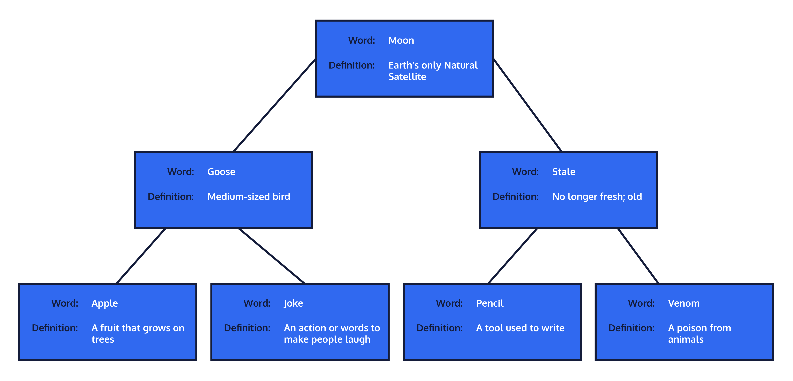
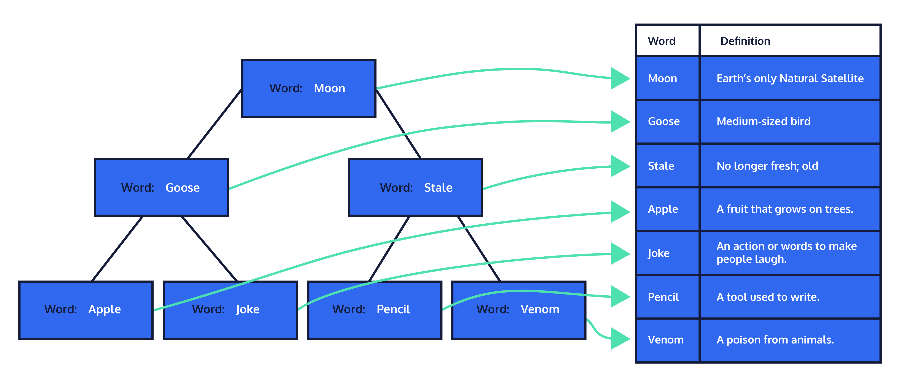

# How Do I Make Sure My Database Stays Fast?
# Intermediate Indexes

## What Else Is There To Learn About Indexes?
Now that you have a good base of understanding of indexes let us dive deeper to explore in more detail how they work and how you can use them to improve the systems you work on.

In the previous lesson you learned about:
* What an index is and how they function.
* How to build an index.
* How to drop an index.
* Multicolumn indexes used to expand the power of your indexes.
* Some of the benefits and burdens of indexes:
  * Increase in speed of searches/filtering
  * Increase in storage space
  * Increase in runtime for Insert/Update/Delete on impacted indexes.

In this lesson you will learn about:
* How to build a partial index
* How to improve the speed of ordering data
* The Relationship between:
  * Primary keys and unique indexes
  * Unique constraints and unique indexes.
* How clustered and non-clustered indexes work.
* Index-Only Scans
* Combining indexes vs multicolumn indexes
* Indexes based on expressions

Like in the previous lesson, we will at times be working with larger databases so some of your execution times on the site might be longer than you have experienced. Please be patient.

We will be working with the same customers table we did in the first lesson. As a refresher let us take a look at it again.

## Partial Index
Many times companies have two sets of users in their databases, internal and external users. The numbers in each category tend to be far apart from each other, for example, [Wells Fargo has 70 Million customers and 258 Thousand employees](https://en.wikipedia.org/wiki/Wells_Fargo). If you were trying to get information about your internal employees, searching through all 70 million records would be a waste when you are looking for a group of users making up about 0.37% of the total. Even with a good index, with this many users, you are wasting time examining far more records than you are interested in.

A potential solution to this problem would be to put the internal and external users in separate tables. Unfortunately, this opens a whole can of worms. Every time you wanted users you would need to consider both tables and when looking for both types you would have to UNION them together. Any changes to the tables would have to be done to both, and in all relevant references to both, doubling the effort and risk to any change. So then, what’s the solution? We can create a partial index.

A partial index allows for indexing on a subset of a table, allowing searches to be conducted on just this group of records in the table. So in our example, you would be searching an index of ~258 Thousand instead of 70+ Million. Think how powerful this addition to your index toolset can be if you find yourself working with massive databases.

So, how do you create one? All you have to do is create an index like you normally would with a WHERE clause added on to specify the subgroup of data your index should encompass. Let’s assume that in our example the users are stored in a users table and we want an index based on user_name. If we know that all internal employees have an email_address ending in '@wellsfargo.com', we would write the partial index like this:
```SQL
CREATE INDEX users_user_name_internal_idx ON users (user_name)
WHERE email_address LIKE '%@wellsfargo.com';
```

Notice that the filtering of the index does not have to be for a column that is part of your index.

### EXERCISES
1. To get a good feel for the power of partial indexes you need to be working with very large data sets and searching for a small part of those tables regularly, something we can not simulate well in this environment.

    Let’s suppose the company you are working for wants to run regular advertising targeting your teenage (13-19) customers, sounds like this might be a good use of a partial index.

    Run EXPLAIN ANALYZE on the customers table when searching for records where the years_old is a teenager. There is already an index built for years_old.

    If you are not familiar with BETWEEN this can save you time. So if you write WHERE years_old BETWEEN 13 AND 19 the database server will treat this just as if you had written ‘WHERE years_old >= 13 AND years_old <= 19`.
2. Create a partial index on the customers table for the years_old column where the range is 13-19. Call it customers_years_old_teen_idx.
3. Create another EXPLAIN ANALYZE after you create your partial index, so you should have one before and another after your partial index so you can see the impact the index has.

    Take note of the difference in both the planning and execution times.
```SQL
-- 1.
EXPLAIN ANALYZE SELECT * FROM customers
WHERE years_old BETWEEN 13 AND 19;

-- 2.
CREATE INDEX customers_years_old_teen_idx ON customers (years_old)
WHERE years_old BETWEEN 13 AND 19;

-- 3.
EXPLAIN ANALYZE SELECT * FROM customers
WHERE years_old BETWEEN 13 AND 19;
```

## Order By
If you are commonly ordering your data in a specific way on an indexed column, you can add this information to the index itself and PostgreSQL will store the data in your desired order. By doing this, the results that are returned to you will already be sorted. You won’t need a second step of sorting them, saving time on your query.

To specify the order of an index, you can add on the order you want your index sorted in when you create the index. Say you have a logins table that tracks the user_name and date_time each time a login occurs. If you wanted to check to see who has been logging in recently to use your site you could run:
```SQL
SELECT
    user_name,
    date_time
FROM logins
WHERE date_time >= (NOW() - INTERVAL'1 month')
ORDER BY date_time DESC;
```

If you were running this query regularly you could improve the speed by creating your index like this:
```SQL
CREATE INDEX logins_date_time_idx ON logins (date_time DESC, user_name);
```

You could also use ASC to switch the direction. If your column contains NULLs you can also specify the order they appear by adding NULLS FIRST or NULLS LAST to fit your needs. By default, PostgreSQL orders indexes by ascending order with NULLs last, so if this is the order you desire, you do not need to do anything.

Another way to think of this is that every index we have created so far has had this ordering applied to it without you even knowing the server was doing this ordering.

### EXERCISES
1. Say we are regularly being asked for customer email (email_address) from specific states (state_name). The results should be ordered by state_name (descending) then email_address (ascending). Let’s start with our standard multicolumn index with no ordering so we can compare with the ordering later to see the difference. Create the index called customers_state_name_email_address_idx.
2. Now let’s get a baseline for the time it takes to get the data we are after using a multicolumn index without our specific order on it. Do an EXPLAIN ANALYZE SELECT for the state_name and email_address on the customers table where the state_name is either 'California' or 'Ohio' and remember to order the results by descending state_name then email_address.
3. Now create the ordered multicolumn index for this scenario so we can compare. Remember, we want state_name (descending) then email_address (ascending). Create this index called customers_state_name_email_address_ordered_idx.
4. Now let’s compare our runtime now that we have an order by on our multicolumn index that matches the output we desire. Add the same EXPLAIN ANALYZE you ran before below your ordered index and run it to see the change in run times. As a reminder, it should be an EXPLAIN ANALYZE SELECT for the state_name and email_address on the customers table where the state_name is either 'California' or 'Ohio' and remember to order the results by descending state_name then email_address.

    Do you expect this query to run faster or slower? Why?
```SQL
-- 1.
CREATE INDEX customers_state_name_email_address_idx ON customers (state_name, email_address);

-- 2.
EXPLAIN ANALYZE SELECT
  state_name,
  email_address
FROM customers
WHERE state_name IN ('California', 'Ohio')
ORDER BY 1 DESC, 2 ASC;

-- 3.
CREATE INDEX customers_state_name_email_address_ordered_idx ON customers (state_name DESC, email_address ASC);

-- 4.
EXPLAIN ANALYZE SELECT
  state_name,
  email_address
FROM customers
WHERE state_name IN ('California', 'Ohio')
ORDER BY 1 DESC, 2 ASC;
```

## Primary Keys and Indexes
PostgreSQL automatically creates a unique index on any primary key you have in your tables. It will also do this for any column you define as having a unique constraint. A unique index, primary key, and unique constraint all reject any attempt to have two records in a table that would have the same value (multicolumns versions of these would reject any record where all the columns are equal).

Recall that to view any indexes already associated with a table, such as products, including the index automatically created by the system upon creation of a primary key, there is a system view you can query against.
```SQL
SELECT *
FROM pg_Indexes
WHERE tablename = 'products';
```

As a note, the primary key index standard is to end in _pkey instead of _idx to identify it as a specific type of index. It is also the way the system names it when created automatically.

## Clustered Index
We learned in the previous lesson that an index is an organization of the data in a table. A table can have many indexes. To expand on this, all indexes are either a clustered index or a non-clustered index. For now, let’s focus on the clustered index. A clustered index is often tied to the table’s primary key.

When a clustered index is created for a table, the data is physically organized in the table structure to allow for improved search times. You can think of the clustered index like searching a dictionary. In a dictionary, the data (words) and all their related information (definition) are physically ordered by their index (words sorted alphabetically). Just like a dictionary, you can seek your word by quickly jumping to the letter in the alphabet the word you’re looking for starts with. Then, even within that letter, you can get a good idea how deep in that subset your word will probably be ('bat' will be near the front of the b’s while 'burgundy' will be near the end).



This is how the clustered index physically organizes the data in your table, reorganizing it to allow faster searches. Because it is physically organizing the data in the table, there can only be one clustered index per table. In the next exercise, we’ll look into how non-clustered indexes are different.

When the system creates, alters, or refreshes a clustered index, it takes all the records in your database table that are in memory and rearranges them to match the order of your clustered index, physically altering their location in storage. Then when you go to do your searches for records based on this index, the system can use this index to find your records faster.

Something to note that PostgreSQL does differently than other systems is that it does not maintain this order automatically. When inserting data into a table with a clustered index on other systems, those systems will place the new records and altered records in their correct location in the database order in memory. PostgreSQL keeps modified records where they are and adds new records to the end, regardless of sorting. If you want to maintain the order, you must run the CLUSTER command again on the index when there have been changes. This will “re-cluster” the index to put all of those new records in the correct place.

Because PostgreSQL does not automatically recluster on INSERT, UPDATE and DELETE statements, those statements might run faster than equivalent statements using a different system. The flip side of this coin though is that after time, the more your table is modified the less useful the cluster will be on your searches. Reclustering the table has a cost, so you will need to find a balance on when to recluster your table(s). There are tools that can be used to help you identify when this would be useful, but these tools fall outside of this lesson.

To cluster your database table using an existing index (say products_product_name_idx) on the products table you would use:
```SQL
CLUSTER products USING products_product_name_idx;
```

If you have already established what index should be clustered on you can simply tell the system which table to apply the cluster on.
```SQL
CLUSTER products;
```

And if you want to cluster every table in your database that has an identified index to use you can simply call
```SQL
CLUSTER;
```

## Non-Clustered Index
You can create many indexes on a table, but only one can be a clustered index, so what about the rest? They are known as non-clustered indexes. Non-clustered indexes have records of the columns they are indexing and a pointer back to the actual data in the table. If you are searching for just the records in the non-clustered index, the system will simply seek for your query results and return them. When you search on a non-clustered index for more information than is in the indexed columns, there are two searches. The first to find the record in the index and another to find the record the pointer identifies. There are some things you can do, such as creating a multicolumn index, that in some cases can help cut down or eliminate the need for the look back to the main table in memory.

Previously we compared how a clustered index functions as a dictionary. You can think of all other indexes (non-clustered) more akin to an index in a book. The keywords you are looking for are organized (by type, alphabetically, by the number of appearances, etc) and can be found quickly. However, the index doesn’t contain information beyond that. Instead, it contains a pointer (page number, paragraph number, etc) to where the rest of the data can be found. This is the same way non-clustered indexes in databases work. You have a key that is sorted and a pointer to where to find the rest of the data if needed.

In the next exercise, we will go over ways that this pointer look back can be avoided altogether in some cases. For now, the main take away is that a clustered index contains all the information in your table and physically reorganizes the way it is stored in memory. A non-clustered index creates a key on the columns you indicate and a pointer back to the main table for any columns not part of the index.



## Index-Only Scans
The lookup that a non-clustered index does back to the table after finding records has a cost. If referencing a small number of records this cost is negligible, however, it can add up if many records are needed. If all columns being used in a query are part of an index then no secondary lookup is done. Let’s examine the following multicolumn index.
```SQL
CREATE INDEX customers_idx ON customers (last_name, first_name);
```

This will improve the speed when searching for customers by last_name and first_name. What happens when we frequently want to know the customers email_address as well? For each record found, it will use the index to find a pointer then look up the email_address matched to that record found in the index to return the last_name, first_name, and email_address. If you include the information that is regularly looked for, even if it isn’t used in the filtering, as part of the index, a secondary search can be avoided. So in this example, you could add email_address as another column in the index to prevent the lookup step. Remember the order the columns are in when creating the index should be whatever is most useful for your particular situation for searches and filtering.

### EXERCISES
1. There is already an index on last_name. Let’s run a query with EXPLAIN ANALYZE looking for first_name, last_name, email_address where last_name = 'Smith'.
2. Create a new index based on the example index to prevent a secondary search when looking for first_name, email_address based on last_name. Call it customers_last_name_first_name_email_address_idx (put the coulmns in the order of the name).
3. Create another EXPLAIN ANALYZE after you create your index, so you should have one before and another after your CREATE INDEX so you can see the impact the index has. The search should again be looking for first_name, last_name, email_address where last_name = 'Smith' and compare with results from step 1. You will notice the speed improvement as the system no longer has to go back to the actual table to find the information you are requesting.
```SQL
-- 1.
EXPLAIN ANALYZE SELECT
  first_name,
  last_name,
  email_address
FROM customers
WHERE last_name = 'Smith';

-- 2.
CREATE INDEX customers_last_name_first_name_email_address_idx ON customers (last_name, first_name, email_address);

-- 3.
EXPLAIN ANALYZE SELECT
  first_name,
  last_name,
  email_address
FROM customers
WHERE last_name = 'Smith';
```

## Combining Indexes
Previously we went over multicolumn indexes as a way PostrgeSQL can speed searches on multicolumn filtering, but if you don’t have an appropriate single index for a query, the server can combine indexes together to speed the filter.

Like anything automatically handled by a system, there are some things to keep in mind when using this convenience.
* A single multicolumn index is faster (if ordered well) than combining indexes.
* A multicolumn index is less efficient than a single index in cases where a single index is needed.
* You could create all of them, then the server will try to use the best one in each case, but if they are all not used relatively often/equally then this is a misuse of indexes.

Take for example, searching for first_name and last_name in the customers table.
* If searches are most often for only one of the columns, that should be your index.
* If searches are most often last_name and first_name then you should have a multicolumn index.
* If the searches are frequent and evenly spread among; first_name alone, last_name alone, and the combination of the two, that is a situation where you would want to have all three indexes.

## Indexes Based On Expressions
An index is not limited to just a column reference, it can use the result of a function or scalar expression computed from one or more columns.

For example, if you want to ensure the company_name in a manufactures table is unique, you can add the UNIQUE option to make a unique index constraint on the results on your index. Any duplicate will then be rejected. Using UNIQUE here tells the system that your index also needs to be a constraint and only allow one record in the system that matches the criteria for your index. In other words, by creating an index with UNIQUE the system will automatically create the constraint to match the logic in the index at the same time. Just like the creation of a constraint, if you try to create an index in this way where the data already in the table does not pass, the system will reject your creation and notify you of the issue.

Let’s look at our UNIQUE example a bit more. In PostgreSQL, 'ExampleCompany' is NOT the same thing as 'examplecompany' even though we would probably want to reject this as a duplicate. You can add a function on your index to convert all your company_name data to lower case by using LOWER. This ensures that 'ExampleCompany' would be considered the same as 'examplecompany'. This combination of the UNIQUE constraint and the use of the function LOWER would look like this:
```SQL
CREATE UNIQUE INDEX unique_manufacture_company_name_idx ON manufacture(LOWER(company_name));
```

These special indexes compound the pros and cons of indexes. Because the results of the expression are stored in the index, it saves the search function from having to perform it on every row on future searches. However, every change in the table data that impacts the index means it has to do the expression again, making Inserts and Updates more expensive on these indexes than a basic index. Be especially thoughtful about when to use indexes that use functions or expressions.

## Review
Indexes are very powerful tools and as a database engineer you have a lot of options on their implementation. With that customizability you have to be mindful not to misuse indexes. Make sure to carefully consider the indexes that you create in your database and don’t forget to review them to ensure continued benefit all around.

We covered:
* How to build a partial index
  ```SQL
  CREATE INDEX <index_name> ON <table_name> (<column_name>)
  WHERE <condition>;
  ```
* How to improve the speed of ordering data
* The Relationship between:
  * Primary keys and unique indexes
  * Unique constraints and unique indexes.
* What a clustered index is and how to refresh one
  ```SQL
  CLUSTER <table_name> USING <index_name>;
  ```
* How non-clustered indexes work.
* Index-only scans
* Combining indexes vs multicolumn indexes
* Indexes based on expressions
  ```SQL
  CREATE INDEX <index_name> ON <table_name>(<EXP>(<column_name>));
  ```
