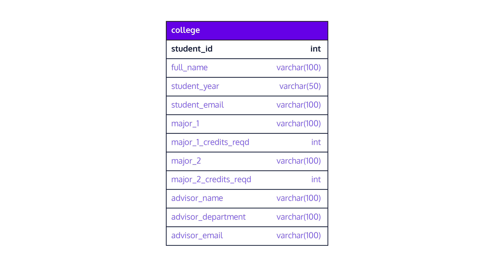
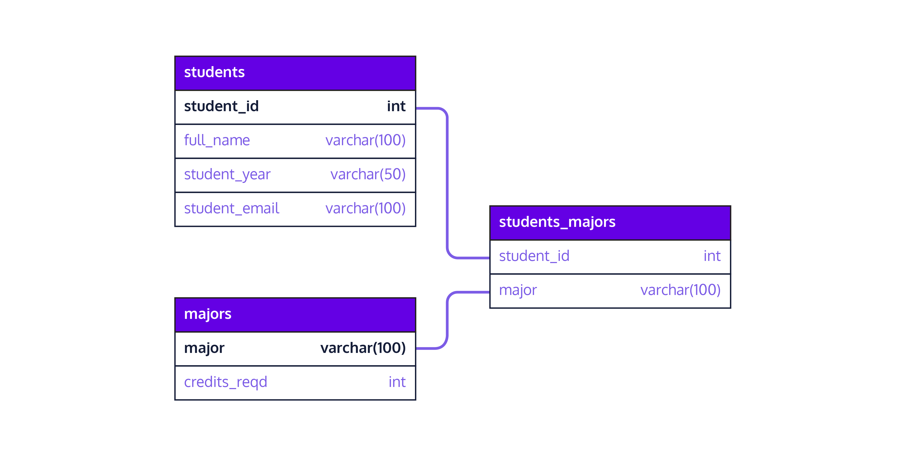
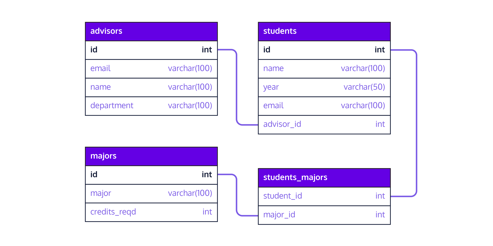

# Normalizing a Database
# Database Normalization with PostgreSQL

## Introduction To Normalization
Imagine that you are tasked with designing a database to store student, faculty, and curriculum information at a college. Currently, the school is storing data in a single table. Each row of the table represents an individual student; the column names are listed in the schema below:



In the following exercises, we will examine some of the inefficiencies associated with the structure of this table and think about possible ways to remedy the situation.

The process of restructuring a database in this way is called normalization. If you look up “database normalization,” you’ll see that there are formal names and definitions for different levels of restructuring; the most common are first, second, and third normal form (1NF, 2NF, 3NF). In practice, the formal vocabulary tends to be used in academic settings, and would be important to understand if you want to read a paper about how to optimize your database schema. Database engineers think about the underlying concepts of normalization on a day-to-day basis, but rarely use the technical names and definitions. This lesson is therefore focused on the ideas behind normalization, rather than the formal vocabulary (although we encourage you to do your own research if you are interested in learning more!).

Before we get started unpacking the college table described above, let’s first query it to get a sense of the data. Remember that you can return all columns of a table using SELECT * and limit the number of rows using LIMIT. For example, the following query would return the first 5 rows of a table called products.
```SQL
SELECT *
FROM products
LIMIT 5;
```

## Duplicated Data
Let’s now examine the college table from exercise 1 more closely. The primary key of this table is student_id (a unique student identifier), and most of the columns describe characteristics of students, including their:
* name
* class year
* email
* major(s)
* advisor

This table also contains columns that do not describe students directly. For example, the columns advisor_name, advisor_department, advisor_building, and advisor_email describe further details about advisors; meanwhile, major_1_credits_reqd and major_2_credits_reqd describe further detail about majors.

When columns of a database table do not depend on (i.e., describe) the primary key, the same data may be duplicated in multiple places. For example, all students who share an advisor will have the same information listed in these four advisor-related columns. In future exercises, we will see how this can cause problems related to data modification. For now, let’s query the table to examine the duplication.

Remember that you can use a WHERE clause within a SELECT statement to return rows of a table where a particular condition is met. For example, the following query would return all sophomore student names and emails:
```SQL
SELECT student_name, student_email
FROM college
WHERE student_year = 'sophomore';
```

## Data Update Challenges
In the last exercise, we saw that the college table contains duplicated data. This can be especially problematic if we want to modify the duplicated information, because we’ll have to make the same updates in multiple locations.

For example, suppose that a faculty member named Professor 'Hill' changes their email address to 'hill@college.edu' and asks you to update the school database accordingly. Since multiple students may have Professor Hill as an advisor, you’ll need to update her email address in multiple rows of the table. To do this, your first instinct might be something like:
```SQL
UPDATE college
SET advisor_email = 'hill@college.edu'
WHERE advisor_name = 'Hill';
```

Unfortunately, this could cause problems if there are multiple professors with the same name. For example, suppose we run the code above, then query the table for all rows where advisor_name = 'Hill' and observe the following result:

| advisor_name | advisor_department | advisor_email |
| ------------ | ------------------ | ------------- |
| Hill | Biology | hill |@college.edu
| Hill | English | hill |@college.edu
| … | … | … |

Oh no! We accidentally modified two professors’ emails when we only intended to change one. If advisor information were housed in a separate table, we could have imposed a UNIQUE or PRIMARY KEY constraint on the advisor_email column to make sure that no two advisors have the same emails recorded in our database; however, this was not possible in the current design, since we needed to store duplicate emails for all students with the same advisor. Our database is not well protected against modification errors!

### EXERCISES
1. Query the college table to print the advisor_name, advisor_department, and advisor_email (in that order) for all students with Professor 'Sommer' listed as an advisor. Are there multiple advisors with this name?
2. Update Prof. Sommer’s email to be 'sophie@college.edu'. Make sure to only update the email for Prof. 'Sommer' in the 'Statistics' department. Think about how this update is more complicated because there could be multiple advisors named 'Sommer'.
```SQL
-- 1.
SELECT
  advisor_name,
  advisor_department,
  advisor_email
FROM college
WHERE advisor_name = 'Sommer';

-- 2.
UPDATE college
SET advisor_email = 'sophie@college.edu'
WHERE advisor_name = 'Sommer' AND advisor_department = 'Statistics';
```

## Data Insertion Challenges
Let’s again consider the college table. In the last exercise, we saw how data duplication can complicate database modification. Unfortunately, there is another potential problem that can arise when all columns in a table do not depend on the primary key: new data cannot be inserted into the table until a primary key is known.

Suppose, for example, that the school hires a new advisor in the Computer Science department. The advisor’s name is Professor Algorithm and his email is algorithm1000@college.edu. Unfortunately, we cannot add a new row to this database table because Professor Algorithm has not been assigned to advise any students yet — and we need a primary key (associated with an individual student) in order to insert a new row of data.

To get around this problem, we could theoretically come up with a fake student ID and leave non-relevant columns empty. For example, assuming that the database is set-up to assign NULL values by default to every non-key column, we could use the following code to insert Professor Algorithm’s information into the database:
```SQL
INSERT INTO college 
(student_id, advisor_name, advisor_department, advisor_email)
VALUES 
(-1, 'Algorithm', 'Computer Science', 'algorithm1000@college.edu');
```

The problem here is that we had to create a fake student ID in order to put Professor Algorithm into our table! This is bad because we can no longer use a simple count of unique student IDs to accurately determine the number of students who are enrolled. We’ll also have to remember to modify or delete this row in the future when Professor Algorithm starts advising students. Otherwise, we’ll open ourselves up to future mistakes and inconsistencies (for example, if we later want to know how many students Professor Algorithm advises, we might accidentally count this fake student as a real person).

## Search and Sort Efficiency
Again consider the college table. Besides the fact that the major-related columns are not directly dependent on the primary key, you may also notice that there are two sets of columns where a student’s major (and related information) can be recorded. This structure can make queries related to a student’s major less efficient (and more messy). For example, suppose that your boss is interested in figuring out which majors are most popular. They ask you to produce a table of unique majors along with the number of students who have declared each one, sorted by popularity.

If all information about student majors were contained in a single column (eg., major_1), this would be relatively simple:
```SQL
SELECT major_1, count(*)
FROM majors
GROUP BY major_1
ORDER BY count DESC;
```

The first few rows returned by the query above would look something like:

| count | major_1 |
| ----- | ------- |
| 53 | History |
| 49 | Political Science |
| 49 | Computer Science |
| 49 | English |
| 47 | Spanish |
| 46 | Geology |

The problem is that these counts are incorrect — they completely ignore majors recorded in the major_2 column! To remedy this, we’ll have to join the major_1 and major_2 columns together somehow, creating additional complexity.

### EXERCISES
1. Let’s first combine all of the data found in the major_1 and major_2 columns. Note that major_2 has many NULL values because some students only have one major. Fill in the blanks in the provided query to return the contents of major_1 and NOT NULL contents of major_2 in a single column called major. Note that this is way more complicated than it should be because of the poor table design!
    ```SQL
    SELECT major_1 as major 
    FROM college
    UNION ALL
    SELECT ___ as major
    FROM ___
    WHERE ___ IS NOT NULL;
    ```
2. EDIT your query from step 1: First, delete the ; at the end; then use the syntax indicated below to query the list of majors you produced in step 1 and return each major name alongside the number of students who have declared that major, ordered by popularity from most to least popular (you will need to use COUNT, GROUP BY, and ORDER BY to accomplish this). The syntax is:
    ```SQL
    WITH majors AS(
    __query from step 1 goes here without ';' at the end__
    )
    SELECT___, count(_)
    FROM majors
    GROUP BY ___
    ORDER BY ___ DESC;
    ```

    Compare your result to the output from the narrative (which only looked at the major_1 column). Once we include major_2, is the most popular major still History? Or has it changed to something else?
```SQL
-- 1.
SELECT major_1 as major FROM college
UNION ALL
SELECT major_2 as major FROM college
WHERE major_2 IS NOT NULL;

-- 2.
WITH majors AS(
  SELECT major_1 as major FROM college
  UNION ALL
  SELECT major_2 as major FROM college
  WHERE major_2 IS NOT NULL
)
SELECT major, COUNT(*) FROM majors
GROUP BY major
ORDER BY COUNT DESC;
```

| major | count |
| ----- | ----- |
| Geology | 77 |
| Spanish | 75 |
| Computer Science |	74 |
| English | 74 |
| History | 74 |
| Political Science |	74 |
| Neuroscience | 74 |
| Sociology | 71 |
| Mandarin | 66 |
| Psychology | 65 |
| Environmental Science | 64 |
| Data Science | 63 |
| Journalism | 63 |
| Philosophy | 62 |
| French | 62 |
| Physics | 61 |
| Chemistry | 60 |
| Studio Art |	60 |
| Biology | 59 |
| Statistics | 58 |
| Economics | 56 |
| Art History |	55 |
| Mathematics | 53 |
| Astronomy | 51 |
| Creative Writing | 49 |

## Restructuring the Advisor Columns
Up to this point, we have examined problems with this database design and implications for queries and modifications. In this exercise, we’ll start to redesign our database to address some of these problems.

First, we saw that every student with the same advisor has identical information recorded in all advisor-related columns in the college table. One way to address this is by moving the four advisor-related columns into their own table, with only one row per unique advisor. This helps ensure every table has its own purpose or concern.

To create a new table from an existing one, we can precede any query with CREATE TABLE new_table_name AS. For example, the following code selects the unique values of major_1 and major_1_credits_reqd from the original college table and inserts them into a newly created table called majors:
```SQL
CREATE TABLE majors AS
SELECT distinct major_1, major_1_credits_reqd
FROM college;
```

We can also delete columns from our original table once we have moved them. For example, the following code drops the columns major_1 and major_1_credits_reqd from the college table:
```SQL
ALTER TABLE college
DROP COLUMN major_1, 
DROP COLUMN major_1_credits_reqd;
```

### EXERCISES
1. Create a new table named advisors that contains the advisor_email, advisor_name, and advisor_department columns (in that order) from the college table. Use the DISTINCT key word so that you keep one row per unique advisor (you can assume that each advisor has a unique email).
2. Do not delete the CREATE TABLE statement from step 1. Below it, add an ALTER TABLE statement to delete the advisor_name and advisor_department columns from the original college table. Note that we need to keep advisor_email (or some sort of advisor identifier) in the college table to ensure that we can still match advisors to students.
3. Do not delete the CREATE TABLE or ALTER TABLE statements from steps 1 and 2. Below them, query the new advisors table for all rows where 'Brunson' is listed as the advisor_name. Note that this information is now condensed to a single row in our database!
```SQL
-- 1.
CREATE TABLE advisors AS
SELECT DISTINCT
  advisor_email,
  advisor_name,
  advisor_department
FROM college;

-- 2.
ALTER TABLE college
DROP COLUMN advisor_name,
DROP COLUMN advisor_department;

-- 3.
SELECT * FROM advisors
WHERE advisor_name = 'Brunson';
```

## Restructuring the Major Columns
We saw in the previous exercises that there are two potential issues with the four major-related columns in the college table:

1. The two _credits_reqd columns describe the majors themselves, rather than the students, creating duplication
2. The repeating sets of columns make it challenging to search and sort our data by major.

To address these problems, we can extract the four major-related columns to create two new tables:
* A majors table listing each unique major and the number of credits required
* A cross-reference table that matches students with majors. Note that we need two additional tables (as opposed to one) because the relationship between students and majors is many-to-many (multiple students can have the same major and each student can have multiple majors), while each major has only one value of credits_reqd.

After creating these two new tables, student and major data will be stored in three smaller tables that are related as follows:



The first few rows of these tables might look something like:
* students (student-specific data):

| student_id | full_name | student_year | student_email |
| ---------- | --------- | ------------ | ------------- |
| 1 | Joshua Davis | senior | Joshua1@college.edu |
| 2 | Ricardo Sansburn | junior | Ricardo2@college.edu |
| 3 | Waneesa el-Zakaria | freshman | Waneesa3@college.edu |
| 4 | Selena Mendoza | freshman | Selena4@college.edu |

* majors (major-specific data):

| major | credits_reqd |
| ----- | ------------ |
| Statistics | 13 |
| Data Science | 16 |
| Art History |	15 |
| Neuroscience | 16 |

* students_majors (student-major pairs):

| student_id | major |
| ---------- | ----- |
| 1 | Chemistry |
| 1 | Sociology |
| 2 | Sociology |
| 3 | Data Science |

If you look carefully at that last table, you’ll see that the student with student_id = 1 (Joshua Davis) is listed in two rows of the students_majors table: one row for each of his majors.

### EXERCISES
1. Create a table called majors that contains the major_1 and major_1_credits_reqd columns (in that order) from the college table. Use the DISTINCT key word to only include one row per unique major (note: for simplicity, we are assuming — correctly — that all possible majors are represented in the major_1 column).
2. Below your first CREATE TABLE statement from step 1: Copy, paste, and fill in the blanks in the following code to create a table called students_majors containing all unique student-major pairs. To identify a unique student, use the student_id column.
    ```SQL
    CREATE TABLE ___ AS
    SELECT major_1 as major, ___ 
    FROM ___
    UNION ALL
    SELECT major_2 as major, ___
    FROM ___
    WHERE major_2 IS NOT NULL;
    ```
3. Below the two CREATE TABLE statements from steps 1 and 2, write an ALTER TABLE statement to delete the major_1, major_1_credits_reqd, major_2, and major_2_credits_reqd columns from the original college table.
4. Below all of your CREATE TABLE and ALTER TABLE statements from the previous steps, query the students_majors table to print the first 10 rows (and all columns), ordered by student_id. Does it look as expected?
```SQL
-- 1.
CREATE TABLE majors AS
SELECT DISTINCT
  major_1,
  major_1_credits_reqd
FROM college;

-- 2.
CREATE TABLE students_majors AS
SELECT
  major_1 AS major,
  student_id
FROM college
UNION ALL
SELECT
  major_2 AS major,
  student_id
FROM college
WHERE major_2 IS NOT NULL;

-- 3.
ALTER TABLE college
DROP COLUMN major_1,
DROP COLUMN major_1_credits_reqd,
DROP COLUMN major_2,
DROP COLUMN major_2_credits_reqd;

-- 4.
SELECT * FROM students_majors
ORDER BY student_id LIMIT 10;
```

## Creating Versus Modifying a Database Schema
In the last few exercises, we used columns in an existing database table (with data already inserted) to create three new tables, then dropped the redundant information from our original table. While this kind of table and schema modification can (and does) happen, it is much easier (and often preferable) to implement a schema design before data has been inserted into a database. This is because existing data might already violate constraints that we would like to impose under a new structure.

Moving and dropping columns is also not quite enough to turn the single college table from exercise 1 into the four-table version we likely would have designed if starting with no existing tables or data. For example, the two figures below show the original schema (with a single college table) compared to a normalized version with four tables.

non-normalized version:


compared to the normalized version:



In the previous exercises, we created tables similar to the ones in the four-table schema described above; however, there are some important differences. For example:

* The advisor_name column is renamed name in the advisors table, because it is already clear that everything within that table describes advisors.
* The college table is renamed students because all non-student-related data has now been moved to other tables.
* The primary keys in the advisors, students, and majors tables are now unique integer values. While it is valid to use advisor_email as a primary key in the advisors table, it can make things more difficult when we want to update or delete an email address.

In the four-table schema, we’ll also want to implement some constraints that were either not necessary or not possible in the original version. For example:
* We can now implement a UNIQUE constraint on the email column of the advisors table, ensuring that no two advisors have the same email listed.
* We can also enforce a foreign key constraint on the advisor_id column of the students table so that each advisor_id in that table matches an id in the advisors table.

In this exercise, we’ll create the four-table version of this schema using CREATE TABLE statements (instead of by extracting, deleting, and renaming columns from the original college table). Remember that the following syntax can be used to create a pair of related tables with primary and foreign key constraints. The first line creates a customers table with id as the primary key; the second creates an orders table with order_id as the primary key and customer_id as a foreign key referencing the id column in the customers table:
```SQL
CREATE TABLE customers (
  id serial PRIMARY KEY,
  name text,
  age integer
);
 
CREATE TABLE orders (
  order_id integer PRIMARY KEY,
  customer_id integer REFERENCES customers(id),
  price money
);
```

### EXERCISES
1. Here is the four-table database schema that we want to create:
    
    Create the advisors table from the schema diagram, with columns in the same order. Make sure to include any relevant primary and foreign key constraints and add a UNIQUE constraint to the email column.
2. Add a second CREATE TABLE statement (below the first) to create the students table from the schema diagram, with columns in the same order. Make sure to include any relevant primary and foreign key constraints and add a UNIQUE constraint to the email column.
3. Add a third CREATE TABLE statement (below the first two) to create the majors table from the schema diagram, with columns in the same order. Make sure to include any relevant primary and foreign key constraints.
4. Add a fourth CREATE TABLE statement (below the first three) to create the students_majors table from the schema diagram, with columns in the same order. Make sure to include any relevant primary and foreign key constraints.
```SQL
-- 1.
CREATE TABLE advisors (
  id integer PRIMARY KEY,
  email varchar(100) UNIQUE,
  name varchar(100),
  department varchar(100)
);

-- 2.
CREATE TABLE students (
  id integer PRIMARY KEY,
  name varchar(100),
  year varchar(50),
  email varchar(100) UNIQUE,
  advisor_id integer REFERENCES advisors(id)
);

-- 3.
CREATE TABLE majors (
  id integer PRIMARY KEY,
  major varchar(100),
  credits_reqd integer
);

-- 4.
CREATE TABLE students_majors (
  student_id integer REFERENCES students(id),
  major_id integer REFERENCES majors(id)
);
```

## Database Structure and Use
Throughout this lesson, we have seen how poor database structure can impact our ability to store, modify, and ask questions of our data. In the last few exercises, we saw some possible ways to modify our database to address these common problems. While it often makes sense to break up large tables in this way, there are no universal rules about the best way to design a database schema. Sometimes, the most important design consideration is how a database will be used in the future. For example, if a particular column of data is never going to be modified, then data duplication in that column is less problematic.

In order to see how the changes we implemented in this lesson have impacted our ability to work with our database, let’s return to some of the issues we encountered in previous exercises. Let’s see how the normalized four-table structure addresses some of these problems.

### EXERCISES
1. The students_majors and majors tables have been created for you. The students_majors table contains columns student_id and major_id; the majors table contains columns id, major, and credits_reqd

    Fill in the blanks in the provided query to produce a list of majors and the number of students who have declared them, sorted by popularity.
    ```SQL
    SELECT ___, count(*)
    FROM students_majors, majors
    WHERE major_id = id
    GROUP BY major
    ORDER BY ___ DESC;
    ```
2. An advisors table has been created for you with advisor email, name, and department. The email column is constrained as UNIQUE because we now expect no duplication in this column.

    Below your query from step 1: copy, paste, and fill in the provided code to update the advisors table such that email = 'sophie@college.edu' in all rows where name = 'Sommer'. Unlike before, you should get an error because there are two professors with the name ‘Sommer’ and this update will therefore violate the UNIQUE constraint.
    ```SQL
    UPDATE ___
    SET ___ = ___
    WHERE name = 'Sommer';
    ```
```SQL
-- 1.
SELECT
  majors.major,
  COUNT(*)
FROM
  students_majors,
  majors
WHERE major_id = id
GROUP BY major
ORDER BY count DESC;

-- 2.
UPDATE advisors
SET email = 'sophie@college.edu'
WHERE name = 'Sommer';
```
```
ERROR:  duplicate key value violates unique constraint “advisors_email_key”
DETAIL:  Key (email)=(sophie@college.edu) already exists.
```

## Database Structure and Use (Continued)
In the last exercise, we saw how the normalized four-table database schema solved some important problems, but it’s worth noting that normalization does not exclusively make queries and modification easier. When we split a large database table into multiple smaller tables, some queries may actually become more complex. This generally happens when a particular question about the data now requires two or more tables to be joined back together. Usually, this added complexity is worth it in order to maintain simple database structure and data integrity via constraints, but it’s useful to understand the slight trade-off.

For example, suppose that we’ve now fully redesigned our original database to have the following structure:


If we want to know how many students are advised by faculty in each department, we’ll have to join the students and advisors tables back together. To do this, we can select from both tables where the advisor_id column from the students table equals the id column from the advisors table. The following query will do the trick:
```SQL
SELECT students.id as student_id, department as advisor_department
FROM students, advisors
WHERE students.advisor_id = advisors.id;
```

This gives us a table with student ids matched to advisor departments. The first few rows might look like this:

| student_id | advisor_department |
| ---------- | ------------------ |
| 1 | Philosophy |
| 2 | Philosophy |
| 3 | Computer Science |

Next, we can alter this query slightly to count the number of students with advisors in each department. We can accomplish this using COUNT and GROUP BY as follows:
```SQL
SELECT COUNT(students.id), advisors.department as advisor_department
FROM students, advisors
WHERE students.advisor_id = advisors.id
GROUP BY advisor_department;
```

This gives us what we want: a table showing the number of students advised by faculty in each department. Here are the first few rows:

| count | advisor_department |
| ----- | ------------------ |
| 68 | Computer Science |
| 53 | Environmental Science |
| 24 | Chemistry |

That wasn’t too complicated - but note that we could have accomplished the same thing by querying the original college table without any joins! In the exercises below, you’ll walk through another example of a query that requires joining tables back together.

### EXERCISES
1. The students, majors and students_majors tables have been created for you as outlined in the schema from this exercise. Suppose that you are asked to email students a reminder about the number of credits required for their major(s).

    To answer this question, you’ll need to join the students, students_majors and majors tables back together. Fill in the code below to select the student_id, and credits_reqd columns from the appropriately joined table.
    ```SQL
    SELECT student_id, ___
    FROM students, students_majors, majors
    WHERE students.id = students_majors.___
    AND students_majors.___ = majors.id;
    ```
2. Now, edit your query from step 1 to replace the credits_reqd column with a column named total_credits that contains the total number of credits required by each student (to accomplish this, you’ll need to sum the credits_reqd values associated with each unique student_id).
3. Finally, edit your query from steps 1 and 2 to also return the email column from the students table as a third column named student_email.

    Note that, because you are grouping by student_id, you will need to aggregate any other column you query; However, because the email column is unique for every student_id, it doesn’t matter how you aggregate. We can, for example, use MIN(email) to get the first email associated with each student_id(and this would yield the same results as MAX(email)).

```SQL
-- 1.
SELECT
  student_id,
  credits_reqd
FROM
  students,
  students_majors,
  majors
WHERE students.id = students_majors.student_id
AND students_majors.major_id = majors.id;

-- 2.
SELECT
  student_id,
  SUM(credits_reqd) AS total_credits
FROM
  students,
  students_majors,
  majors
WHERE students.id = students_majors.student_id
AND students_majors.major_id = majors.id
GROUP BY student_id;

-- 3.
SELECT
  student_id,
  SUM(credits_reqd) AS total_credits,
  MIN(email) AS student_email
FROM
  students,
  students_majors,
  majors
WHERE students.id = students_majors.student_id
AND students_majors.major_id = majors.id
GROUP BY student_id;
```

## Review
Let’s review what you have learned!

* Repeating groups of columns and columns that are not dependent on the primary key of a table can cause problems related to:
  * Duplicated data
  * Data modification (updates/insertions)
  * Querying
* Database normalization is a process by which database tables are modified/restructured to address these problems
* Database design can be modified after data has been entered, but it is usually easiest to design a normalized schema up front
* It is important to keep database use in mind when designing an optimal database schema

In this final exercise, we’ve re-loaded the initial college table from exercise 1, as well as the 4 smaller tables from exercise 9 (students, students_majors, majors and advisors). Below are some questions you might try to answer with both database structures to better understand how they differ.

Note: solution code for the following questions can be found in the answers.sql file provided in the workspace.
* Which advisor(s) are the most popular?
* What are the emails of all students in the Mathematics or Statistics departments?
* Can you sort student names and emails by major? (students with multiple majors should be listed twice)
```SQL
/* which advisors are the most popular? -- using the college table */

SELECT MIN(advisor_name) as name, count(*)
FROM college
GROUP BY advisor_email
ORDER BY count DESC
LIMIT 5;

/* which advisors are the most popular? -- using the normalized database */
SELECT MIN(advisors.name) as name, count(students.id)
FROM advisors, students
WHERE students.advisor_id = advisors.id
GROUP BY advisors.id
ORDER BY count DESC
LIMIT 5;


/* What are emails of all students in math or statistics department? -- using the college table */

SELECT student_email 
FROM college
WHERE major_1 IN ('Mathematics', 'Statistics')
OR
major_2 IN ('Mathematics', 'Statistics')
ORDER BY student_email;

/* What are emails of all students in math or statistics department? -- using the normalized database */

SELECT students.email 
FROM students, students_majors, majors
WHERE students_majors.student_id = students.id
AND
students_majors.major_id = majors.id
AND
majors.major IN ('Mathematics', 'Statistics')ORDER BY students.email;


/* Sort student names and emails by major -- using the college table */

SELECT full_name, student_email, major_1 AS major 
FROM college
UNION ALL 
SELECT full_name, student_email, major_2 AS major 
FROM college
WHERE major_2 IS NOT NULL
ORDER BY major;

/* Sort student names and emails by major -- using the normalized database */

SELECT students.name, students.email, majors.major 
FROM students, students_majors, majors
WHERE students.id = students_majors.student_id
AND majors.id = students_majors.major_id
ORDER BY majors.major
```
