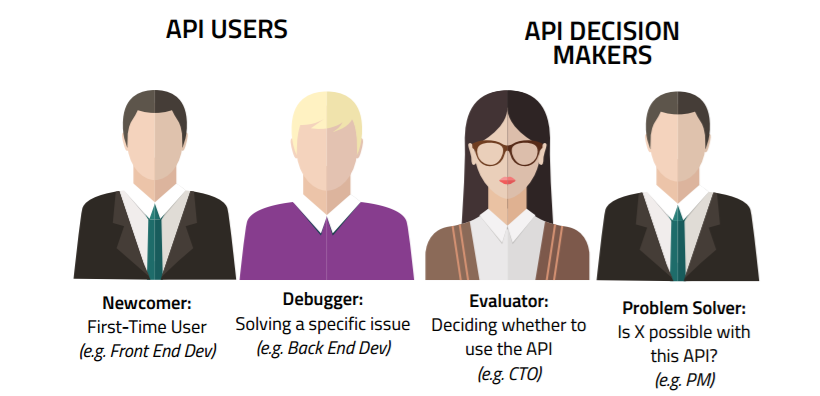

# Introduction to the API Development
# API Documentation Best Practices

## Introduction
APIs are only as good as their documentation — a great API can be rendered useless if people don’t know how to use it. However, creating and maintaining good documentation that’s easy to read, enjoyable to interact with, and sets the end-user up for success, can be extremely challenging. Creating excellent documentation requires effort and patience, but it has direct implications for API adoption and maintainability. In this article, we’ll start by looking at who we should design documentation for and then follow up with exploring some common best practices. Let’s dive in!

## Who is the API documentation for?
Most likely, an API is meant to solve real-world problems faced by companies in a specific industry and will directly be integrated into applications by software engineers. As such, there are two types of potential audiences of an API who will influence an API’s consumption and its adoption usage:
* Decision-makers: Decision-makers are the people who evaluate an APIs services and decide if it makes sense for the development team to spend time exploring the service. They are looking to use an API to solve potential challenges in their product or service strategy. In many cases, they don’t directly work with the API, but they are the main points of contact for influencing an organization’s decision to consume it. Examples of decision-makers are CTOs or Product Managers.
* Users: Users are the people who will be directly working with an API. They need to learn the ins and outs of the API and how it applies to their use case. This could mean learning how to call and integrate with many, or all, of the resources the API exposes. They are critical to the sustainability of an API. They are analytical, work on significant and complex engineering problems, and have a shortage of time. Hence, an API must be easy to use and have excellent documentation so these users can successfully integrate with an API as quickly as possible. Examples of API users are front-end and back-end developers.

Ideally, an API’s documentation needs to cater to both personas. This can be challenging, but it ensures the documentation is sustainable and complete, ensuring long-term success. So, how do we accomplish these goals and serve both user groups? Well, let’s run through some common best practices that will set up our next API documentation for success!

## Best Practices in API Documentation
Now that we’ve understood who to document APIs for, it’s time to understand what goes into good API documentation. Let’s dive into some best practices all well-documented APIs follow!

### Detailed Error Messages
Error messages are important because they tell end-users when they’re integrating with an API incorrectly. Explain error standards and provide solutions on how to overcome them when an end-user gets an error.

### A List of All Exposed Resources
Resources are the core components of an API that end-users will constantly be interacting with. An API should list all of its exposed resources and understand how end-users may integrate with them.

### A Terms of Use Agreement
Terms of use is a legal agreement between the end-user and an organization, defining how the end-user should ideally use the API’s services. These terms should include API limits under best practices, with terms and conditions. Constraints also need to be clearly stated so that end-users understand what API usage and practices are permitted, so they don’t accidentally have their access restricted.

### A Changelog
A changelog is a document, usually published on an APIs website, that should detail updates and versions of an API and how it might affect API end-users. This will help end-users know the stability of the API and see if any changes need to be made to their integration with the API.

### Less Technical Jargon
Keep in mind that many end-users working with an API may not have intimate knowledge of the domain to understand technical jargon. Documentation should cater to the “very technical” developer audience and the less technical decision-makers. A big mistake technical writing teams make is assuming their audience is entirely technical and has a complete understanding of how to work with APIs. If an API does have technical or domain-specific jargon, it is helpful to link those specific items to further documentation explaining the terms.

### Examples of all Requests and Responses
An API call response is a guide for end-users, indicating whether they’re on the right track or are doing something wrong. An API end-user should know exactly what to expect from a successful API call. Ideally, an API provides examples for every single object it is supposed to return and examples of parameters that end-users can add for a successful call.

It is also best to describe the entire sample response body in every supported format. Think of standard formats like XML or JSON, but also HTTP headers, error codes, and messages.

### An Authentication Guide
An API’s documentation should have a section dedicated to any authentication (if it exists) required to start consuming the API’s data. Most APIs have authentication schemes, and end-users have to authenticate before gaining access to the API. Make sure this section is adequately documented and hand-holds end-users to authenticate against the API successfully.

## Arm Documentation with Resources
Excellent API documentation goes beyond the essential content and ensures end-users reach success with an API as quickly as possible. Let’s examine some potential candidates for resources to include in the documentation.

### A Getting Started Guide
The getting started guide provides a detailed account of how to start working with the API quickly. The emphasis in the guide should be on ensuring end-users reach success with the API as soon as possible, hand-holding them throughout the journey.

### SDKs and Libraries
Code libraries help developers quickly call different resources. Having quick and easy methods in different languages to work with an API allows developers to feel more comfortable working with it. Software Development Kits (SDKs) - a set of libraries or tools that end-users can work with out of the box, are challenging to build, and aren’t crucial for launch, but can significantly improve API adoption.

### A Interactive Console
One way to encourage end-users to test what they read in the API documentation immediately, is to provide an interactive API console. Experimentation is powerful, and a console makes getting started easy, with limited liability from the end-users perspective. An interactive console can go a long way in helping developers learn about an API’s value very quickly.

## Wrap up
To summarize, we learned:
* The two types of people API documentation is typically written for
* A few best practices to follow when writing API documentation
* Key resources that API documentation should provide

Although it may seem challenging and time-consuming, following these practices and creating these resources will help make excellent API documentation that is effective and helpful to all individuals who use it.
