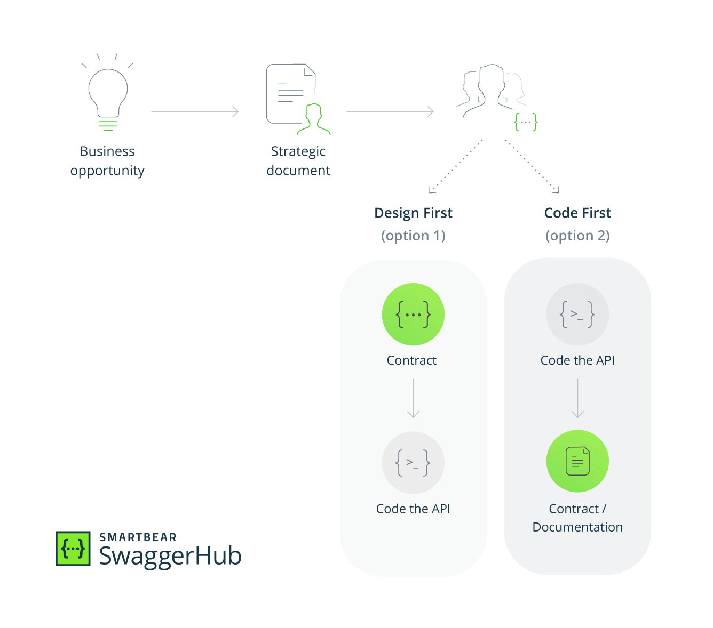

# Design First API Design
# Design First vs Code First

## Introduction
When it comes to using API development, two popular schools of thought have emerged: The “Design First” and the “Code First” approach to API development. To understand the two approaches better, let’s look at the general process followed during the API lifecycle.

First, the concept of the API starts with a team (or individual) identifying an opportunity. The opportunity is analyzed, and a plan to capitalize on it is created in a text document by strategists, analysts, and other business folks. This document is then passed along to the development team, where the plan takes some tangible form. There are two possibilities from here on to develop the API:
1. Design First: The API design plan is converted to a human and machine-readable contract from which the code is built.
2. Code First: Based on a business plan, an API is directly coded, from which a human and machine-readable document can be generated.

Both approaches depend on a API contract - a document, usually written in a human and machine-readable language (e.g., JSON, YAML) that describes the API’s capabilities, endpoints, and finer details. Typically the API contract serves both as a plan for the API implementation but also as the APIs documentation.

In the “Design-First” approach, the API contract serves as a blueprint for the APIs structure and features and guides the development process. In the “Code-First” approach, since the API is already implemented, it typically serves the role of documentation. Here is a visual breakdown of the process:

## Choosing the right approach
There are advantages and disadvantages associated with both approaches. Choosing the right approach boils down to a team’s immediate technological and strategic needs that they wish to solve with the API. Let’s dive into when and why we would choose each approach for our next API project.

### Design First Approach
#### When Developer Experience Matters
A well-designed API can do wonders for the adoption and consumption of the API, and good design is typically better achieved with the Design First approach (since it is in the earlier stages of the lifecycle). If an APIs strategy involves the need for high adoption and retention of users integrating with the API, then good Developers Experience (DX) matters.

##### When Delivering Mission Critical APIs
The biggest reason to adopt the Design First approach is when an APIs target audiences are external customers or partners. In such a case, the API is a crucial distribution channel so that end-users can consume the services we want to provide, and good design plays a key role in determining customer satisfaction.

#### When Ensuring Good Communication
The API contract can act as the central draft that keeps all team members aligned on an API’s objectives and how the API’s resources will be exposed. Identifying bugs and issues in the APIs architecture with a team becomes more straightforward when working with a human-readable design document such as the API contract. Spotting issues in the design before writing any code is a much more efficient and streamlined approach than doing so after the implementation is already in place.

### Code First Approach
#### When Delivery Speedy Matters
Developers can start implementing an API much faster by coding the API directly from the requirements document. This is important if an APIs go-to-market strategy emphasizes speed and agility as essential factors for the success of the API program. The fact that automation is much easier in the code-first approach helps strengthen this case, with many libraries supporting scaffolding server code, functional testing, and deployment automation.

#### When Developing Internal APIs
The Code First approach affords speed, automation, and reduced process complexity, at the cost of good developer experience. If the API will only be consumed by the team or company building it, then the Code First approach is an ideal solution. This is especially true if the API developed is small, with only a few endpoints being used internally.

## Wrap Up
To summarize, we learned:
* The two different approaches to API development: Design First and Code First
* The reasons for choosing Design First or Code First approach for API development

There are positives and negatives to both approaches. The approach we take to developing our APIs will play a vital role in determining how they’re consumed and maintained. Consider three important questions when choosing an approach:
1. Who are the API’s end-users?
2. What needs do the end-users have?
3. What problem is the API trying to solve for the end-users?

These are the types of questions that should guide decision-making when choosing a suitable methodology for API development.
