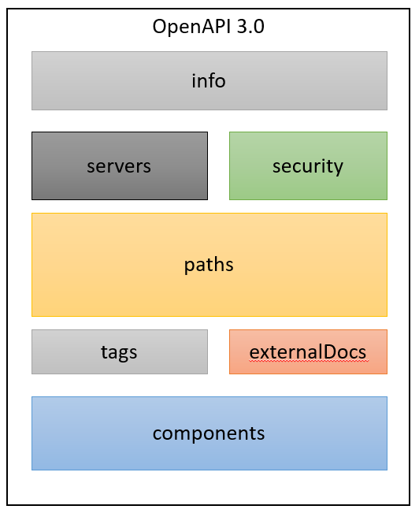

# Design First API Design
# Introduction ot the Open API Specification

## Introduction
Good design is the reason why monuments become wonders, and why products become great. Design can be the cornerstone for excellent usability and adoption. In the world of APIs, design can be thought of as modeling the contract between the server and client. Designing an API means providing an effective interface that helps an API’s end-user better understand, use, and integrate with it. Every product needs a usage manual, and an API is no exception.

Tony Tam, the creator of the original “Swagger” Specification (now known as the OpenAPI), explains that designing an API involves “planning for failures.” This article will explore how using a standard like OpenAPI will help us create human-readable API contracts that support internal and external stakeholders to understand what to do and how they can better work together to build a great API.

## Designing an API using OAS 3.0
The OpenAPI Specification (OAS) is one of the most popular standards for designing human-readable API contracts. The OAS specifies the rules and syntax required to describe an API’s interface. The OAS has evolved to meet the needs of modern API teams and continues to introduce updates to make the specification simpler to use and easier for humans and computers to understand.

Here is the general structure of an OAS defined API contract using OAS 3.0:



The above figure breaks down the various sections in an API designed by the OAS. Let’s go over what each section means and how it can be used.

Info & OpenAPI
The info and openapi section of the API contract contains essential metadata. There are both required and optional fields such as contact information, license information, terms of service links, and more! Essentially, the info object should give an API’s end-users and internal developers a high-level overview of what the API does. Take a look at the example below:
```YAML
openapi: 3.0.0
info:
  title: Simple Pet Store
  version: 1.0.0
  description: This is a sample server for a pet store.
  termsOfService: http://example.com/terms/
  contact:
    name: API Blogger
    email: support@example.com
    url: http://example.com/support
  license:
    name: Apache 2.0
    url: http://www.apache.org/licenses/LICENSE-2.0.html
```

For more information, check out the [openapi object](https://github.com/OAI/OpenAPI-Specification/blob/main/versions/3.1.0.md#openapi-object) and [info object](https://github.com/OAI/OpenAPI-Specification/blob/main/versions/3.1.0.md#info-object) in the official OAS documentation.

## Servers
An API is a contract between the end-user and a server (usually the server hosting the API). The servers object can give a client information on where the API’s servers are located through its URL. Unlike the 2.0 version of the spec, which only allowed an API definition to have one server URL, OAS 3.0 supports multiple servers. This is useful since, in the real world, APIs exist in numerous environments, and each environment can have its own purpose. Here is an example:
```YAML
servers:
- url: https://development.gigantic-server.com/v1
  description: Development server
- url: https://staging.gigantic-server.com/v1
  description: Staging server
- url: https://api.gigantic-server.com/v1
  description: Production server
```

For more information on this section, check out the [server object](https://github.com/OAI/OpenAPI-Specification/blob/main/versions/3.1.0.md#serverObject) in the official OAS documentation.

## Paths
An OAS contract’s paths object shows the various endpoints an API exposes and the corresponding HTTP methods. It’s also under each method that the actual request-response cycle is detailed. The requests are described by parameter objects and the responses by the responses objects. This section gives all parties a clear sense of the data the API will expose and helps with planning, documenting, and implementing the API.

Here is an example of a single defined path:
```YAML
paths:
  /pet/{petId}:
    get:
      summary: Find pet by ID
      description: Returns a single pet
      parameters:
      - name: petId
        in: path
        description: ID of pet to return
        required: true
        schema:
          type: integer
          format: int64
      responses:
        200:
          description: successful operation
        400:
          description: Invalid ID supplied
          content: {}
        404:
          description: Pet not found
          content: {}
```

Notice two critical parts of the defined path:
* Parameters: Parameters are the variable parts of a request. There are four types of parameters that can be specified using the OAS 3.0:
  * path parameters, such as /users/{id}
  * query parameters, such as /users?role=admin
  * header parameters, such as X-MyHeader: Value
  * cookie parameters, which are passed in the Cookie header, such as Cookie: debug=0; csrftoken=BUSe35dohU3O1MZvDCU
* Responses: Responses are the objects returned on a request. Every response is defined by its HTTP status code, and the data is returned. The HTTP status codes are used to define whether the request was successful or unsuccessful.

This overview barely scratches the surface of the [paths object](https://github.com/OAI/OpenAPI-Specification/blob/main/versions/3.1.0.md#paths-object) options. For more information, take a look at the paths object in the official documentation.

## External Docs
Any additional information that an API can offer to ease consumption and integration with the API is always a good idea. OAS 3.0 allows an API to reference external documentation via the external documentation object.
```YAML
description: Find more info here
url: https://example.com
```

Find out more info about the [external documentation object](https://github.com/OAI/OpenAPI-Specification/blob/main/versions/3.1.0.md#externalDocumentationObject) in the official documentation.

## Tags
Tags are friendly categories to group various API operations. This allows end-users of the API to better segment and identify what they want to use the API for. These tags can also be handled by other third-party tools which integrate or read the OAS.

Tags can automatically be added to every path operation using the tags object. Tags can also be given descriptions by adding an optional tags section in the root level of the API definition.
```YAML
paths:
  /pet/findByStatus:
    get:
      summary: Finds pets by Status
      tags:
        - pets
  /pet:
     post:
       summary: Adds a new pet to the store
       tags:
         - pets
tags:
- name: pets
  description: Everything about your Pets
```

## Components
As an API needs to expose more resources and operations, the contract can tend to get really long. The API may repeat a lot of existing parameters or response descriptions in many different paths and operations, and rewriting them every time makes them prone to inconsistent descriptions and can be very time-consuming.

The component object can hold a set of reusable objects for an APIs design. The reusable objects can be schemas, responses, parameters, examples, and more. The exact reusable component can then be referenced in any path item.

Here’s an example of the components object:
```YAML
paths:
  /pets/{petId}:
    get:
      summary: Get a pet by ID
      parameters:
        ...
      responses:
        '200':
          description: A single pet.
          content:
            application/json:
              schema:
                $ref: '#/components/schemas/Pet'
  /pets:
    get:
      summary: Get all pets
      responses:
        '200':
          description: A list of pets.
          content:
            application/json:
              schema:
                type: array
                items:
                  $ref: '#/components/schemas/Pet'
components:
  schemas:
    Pet:
      type: object
      properties:
        id:
          type: integer
        name:
          type: string
```

## Wrap Up
To summarize, in this article we learned:
* What the OpenAPI Specification is
* Benefits of designing APIs with OAS
* The different sections of an API as defined by the OAS

Of course, this is just a general overview of the various sections associated with an OpenAPI designed API. Design is subjective, and while the OAS gives the required rules and items to describe an API, how we use them to effectively communicate the value of the API is what makes for a great design.
