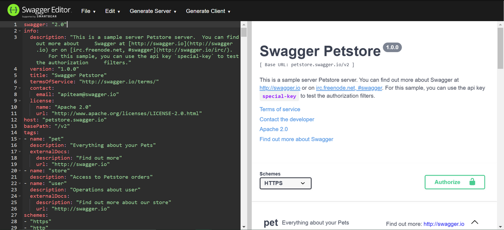
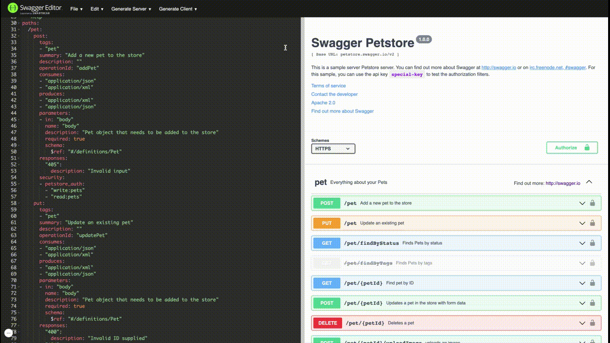
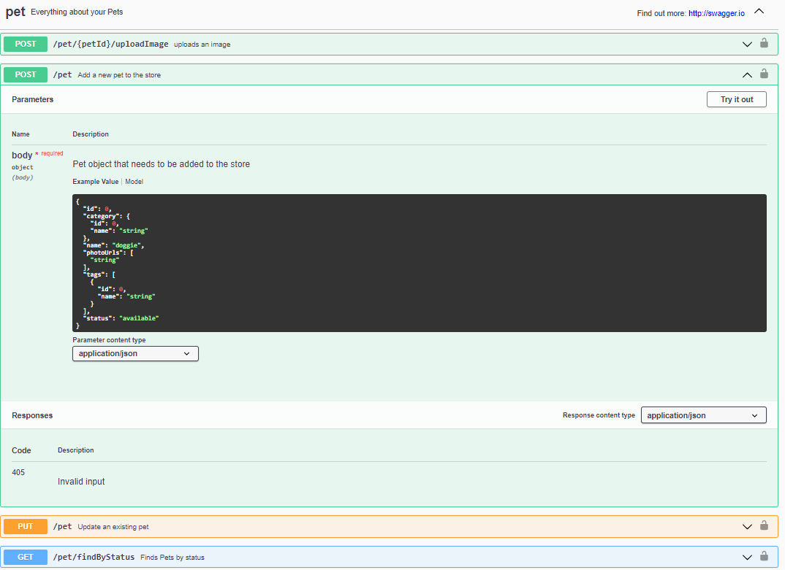

# Design and Document APIs with Swagger and OpenAPI
# Introduction to Swagger Tooling

## Introduction
Let’s say we came up with an excellent idea for a new web application, and we want to develop an API for it. It’s essential that we create a blueprint of how our API works before jumping into the programming; otherwise, we might have to redo code, and we might run into bugs and other issues. This leads us to decide to use the Design First approach for our API. This means we will write out an API contract before diving into writing the code.

Another thing to consider is that writing the skeleton code (or structural code which does not yet contain logic) can take a long time and can be very tedious. In addition, while we are working on our code and once it is finished, how are we going to explain it easily to other people, document it, or even visualize it for debugging? These points make it seem like a lot of hard work to create an API for our shiny new web application. Thankfully, a software quality company called [SmartBear](https://smartbear.com/), as well as the development community, has created a set of tools that will make our process of creating our API much easier.

[Swagger](https://swagger.io/tools/) is the name for a set of tools that help with each step of designing, developing, testing, and visualizing an API. In this article, we will be exploring three specific open-source tools: [Swagger Editor](https://swagger.io/tools/swagger-editor/), [Swagger Codegen](https://swagger.io/tools/swagger-codegen/), and [Swagger UI](https://swagger.io/tools/swagger-ui/). We will take a look at each tool, examine what it accomplishes, and see how we can use all three together to build an API. By the end of this article, we will better understand how these three tools can help us and the teams we work on to develop APIs more efficiently. Let’s dive in!

`A note on Swagger:`
The year 2017 marked the official release of OpenAPI 3.0, the latest version of the OpenAPI specification. OpenAPI 3.0 was the first official release of the specification since it was donated to the OpenAPI Initiative by SmartBear Software and renamed from the Swagger Specification to OpenAPI specification in 2015. This means there may be resources on the web that still refer to Swagger as a specification rather than a set of tools. The easiest way to understand the difference is:
* OpenAPI = Specification
* Swagger = Tools for implementing the specification

Information about the changes from Swagger 2.0 to OpenAPI 3.0 can be found at [SmartBears’s blog post that explains the changes](https://swagger.io/blog/api-strategy/difference-between-swagger-and-openapi/).

## Swagger Editor
As we noted earlier, our first step in designing our shiny new API would be to create an API contract. This is where the Swagger Editor tool comes into play. This tool is primarily used to design, define and document RESTful APIs. This editor accepts different OpenAPI versions, includes the option to convert a written specification to YAML (or JSON), and highlights any errors that might be occurring in the specification. The other two tools (Swagger Codegen and Swagger UI) can also be used directly from the Swagger Editor, but we will touch more on that later in this article.

The Swagger Editor can be accessed two ways:
* Via a web browser by visiting [Swagger’s online editor](https://editor.swagger.io/).
* Via a local machine by downloading the editor from [Swagger’s GitHub repository](https://github.com/swagger-api/swagger-editor).

## Swagger Codegen
Once our API specification has been designed, now it’s time for the grueling task of writing out the code for the backend logic and frontend interactions, right? Wrong! Using Swagger Codegen and a provided API specification, we can generate server and client-side code in many different languages. The generated code will even include documentation from the provided specification. Besides saving time by easily generating code, the Swagger Codegen tool provides more consistent code than writing it manually from scratch.

Since code generation typically occurs after the design process, the Swagger Editor tool allows you to generate the code directly through its options. Here is an example:

Swagger Codegen can also be downloaded via its [GitHub repository](https://github.com/swagger-api/swagger-codegen) and used locally through a Command Line Interface (CLI).

## Swagger UI
Lastly, once we have a specification in place, and have created (or generated) our server and client-side code, we will need to document the API. The Swagger UI tool allows anyone — be it a development team or end-users — to visualize and interact with an API’s resources without having any of the implementation logic in place. This means we don’t even have to have any code written for an end-user to see the APIs resources, end-points, and even execute mock API calls. Here’s what it looks like:

Swagger UI can primarily be accessed two ways:
* Via the online [Swagger Editor](https://editor.swagger.io/) tool. The right-hand side of the editor tool neatly displays any valid specification using Swagger UI. This means Swagger Editor already has Swagger UI built into it and generates the specification documentation live as it is created.
* Via a local machine by downloading from the [Swagger UI GitHub repo](https://github.com/swagger-api/swagger-ui).

## Wrap Up
To summarize, we learned:

What Swagger is
The difference between the OpenAPI and Swagger
What the Swagger Editor, Swagger Codegen, and Swagger UI open-source tools are and what they can help us accomplish
These tools can make designing, building, and maintaining an API a much more efficient process. Give them all a try and check out more details on each tool on the [Swagger homepage](https://swagger.io/tools/).
