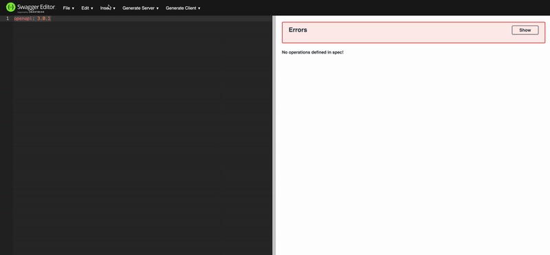
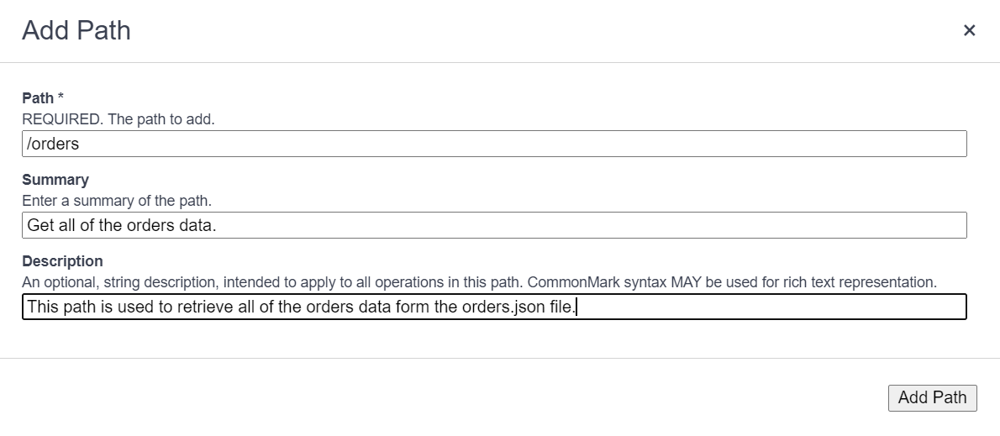
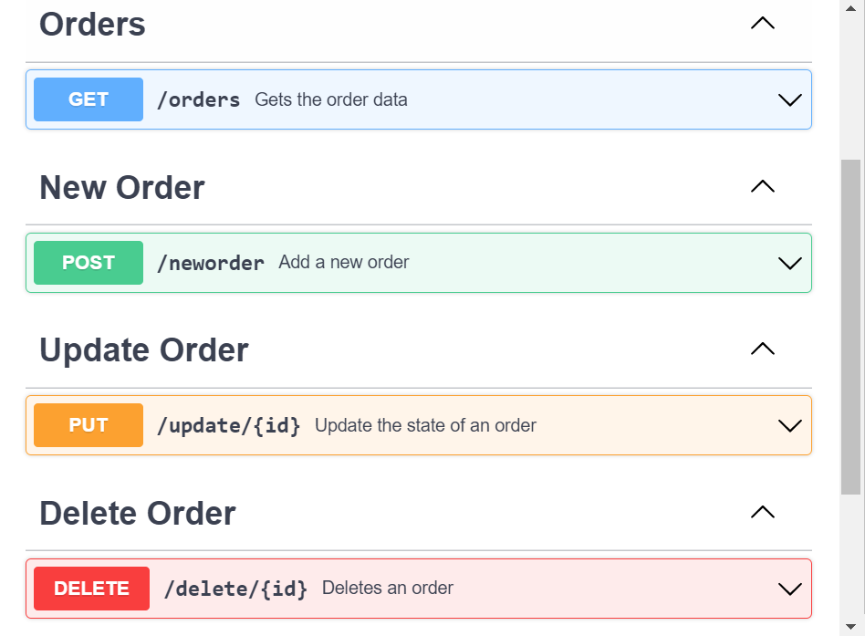
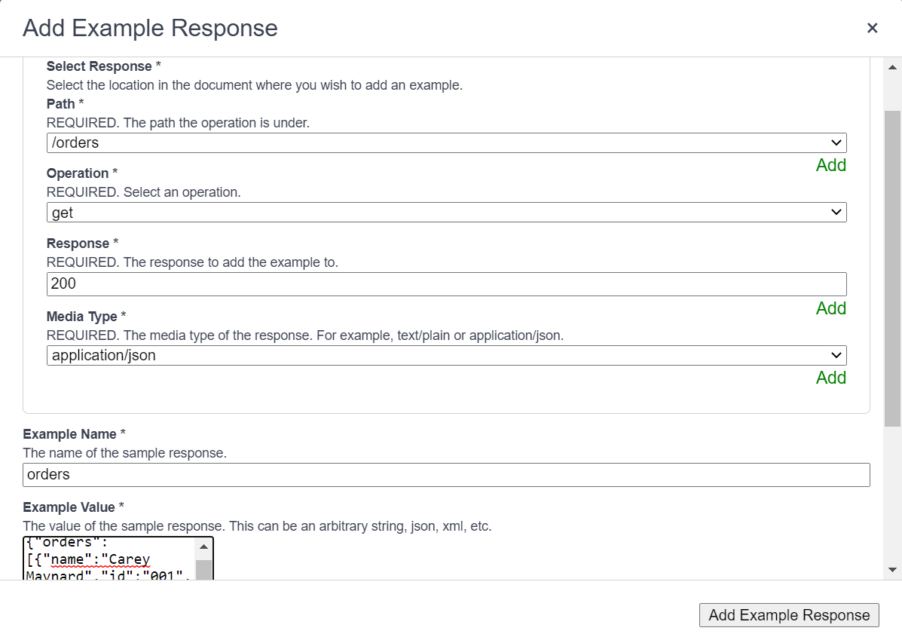
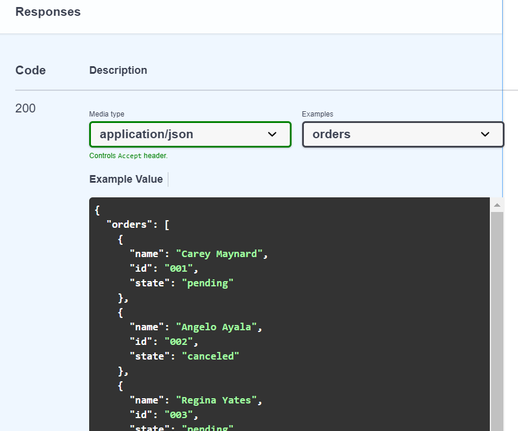
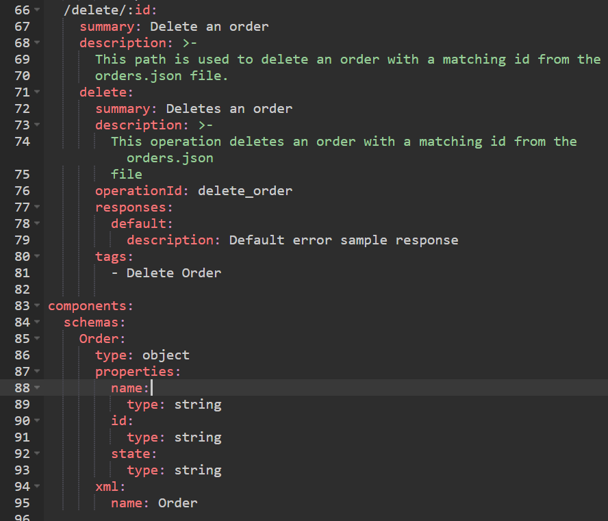

# Design and Document APIs with Swagger and OpenAPI
# Designing and Documenting an API with Swagger

## Introduction
In the last article, we learned about Swagger and the three main open-source tools used to design, develop, and document APIs. We learned that we could create an API specification (API contract) using the Swagger Editor, generate code based on a specification using Swagger Codegen, and visualize the specification in an easy-to-read way using Swagger UI.

In this article, we will be downloading and using these tools locally to develop an API for the backend of an application that manages store orders. Our API will retrieve existing orders, create new orders, change an order’s status, and delete existing orders.

Before we begin, download the starter code from [here](https://static-assets.codecademy.com/Courses/Swagger-OpenAPI/orders_project_starting.zip).

### Prerequisites
* Make sure that you are familiar with the OpenAPI specification and YAML format
* Make sure that you are familiar with Node.js
* Make sure that you are familiar with Express.js
* Ensure that you have downloaded and installed Node.js
* Ensure that you have downloaded and installed Express.js

If any of the concepts mentioned seem unfamiliar, this is an excellent time to pause and review the previous articles in the course. Additionally, note that while this tutorial primarily uses a Javascript-based tech stack (Node, Express), any tech stack that can build a RESTful API will suffice.

## Designing the API contract using Swagger Editor
We are going to be using a Design-First approach when creating our simple API. To make it easier, let’s download and run the Swagger Editor locally. To do this, follow these steps:
1. Download or clone the code from: [https://github.com/swagger-api/swagger-editor](https://github.com/swagger-api/swagger-editor)
2. If Node.js and npm are installed, run npm start to spin up the editor. Make sure to run the command from inside the downloaded Swagger Editor directory. Otherwise, open the index.html file from the downloaded repository.

The Swagger Editor should now be open in a browser window and look something like this:


## Using the Swagger Tools
Now that we have Swagger Editor setup locally, let’s begin by deleting the existing “Petstore” example provided by default by the Swagger Editor. For the first line of our specification, add the specification format version. For this tutorial, we will be using version 3.0.1, so on the first line, add openapi: 3.0.1. By adding this, we will gain access to the “Insert” tab on the top options bar of the editor.



## Adding Info
The first part of our specification we need to fill in is the info section. Fortunately, using the Swagger Editor “Insert” tab, we can quickly and easily add this into our specification without having to worry about the YAML format at all. Select the “Add Info” option from the “Insert” tab. A window should pop up, and we can fill in the basic information of our web app. It should look something like this:


Select the “Add Info” button and tada! Part of the OpenAPI specification has been automatically generated for us! Some formatted info appears on the side of the screen as well. This is Swagger UI automatically updating based on the specification provided. As we add to our specification, Swagger UI will continue to populate with more info. We will dive into that soon! For now, the editor should look close to this:


At this point, Swagger UI should be displaying a structural error saying that we are missing our paths. This is another helpful feature of the tool because, in addition to populating with specification info, Swagger UI will also notify us of any problems in our specification. Let’s fill in a path to resolve the error!

## Adding Paths
Similar to the last step, we can use the “Add Path Item” option in the “Insert” tab to easily add in our first path. A box will appear, which we can fill in with our first path called /orders. This path will serve as a way to retrieve all the orders we have in our API. Here is what our path details for /orders will look like:



Repeat this process to add the following three paths and their associated descriptions to the API specification:
* A /neworder path
  * This path is used to add a new order to the orders.json file.
* A /update/{id} path
  * This path is used to change the status of an order matching the provided id. It modifies the state attribute of each order.
* A /delete/{id} path
  * This path is used to delete an order with a matching id.

Now our specification should be similar to this:


Note: There will be errors about the `id` parameter, which we will address later.

## Adding Operations
Now that we have our paths defined, let’s add our operations. For this API, we will only have one operation for each path, but typically, there could be multiple. For each operation that we add, we will also add a tag to organize them in a meaningful way. This is especially helpful when viewing them through the Swagger UI panel. Let’s start by adding the GET operation for the /orders path.

Use the “Add Operation” option in the “Insert” tab to do so. In the form, select the /orders path and get operation. Continue filling in the fields with information describing how the get operation will return the list of orders. Make sure to add a tag at the bottom of the form. Here is an example of what it could look like:


Now add the rest of the paths by using the following information:
* The /neworder path uses a POST operation to add a new order to the orders.json file.
* The /update/{id} path uses a PUT operation to update the state of an order with a matching id in the orders.json file.
* The /delete/{id} path uses a DELETE operation to delete an order with a matching id from the orders.json file.

Once all of the operations have been added, Swagger UI should generate this:



## Adding Example Responses
Now that we have all of our paths and operations defined, we can add more details, such as example responses. To do this, we once again use the “Insert” tab and select “Add Example Response”. We can add a new 200 successful example response to our GET operation to show what data will be returned on a successful call to the route. In this example, we can copy the contents of the orders.json file located in the main project directory and paste it into the text box. It will be formatted nicely for us in Swagger UI. Here is what the form should look like:



When expanding the /orders path in Swagger UI, a nicely formatted example response should now be visible:



Now, take some time to add some example responses for the different HTTP response status codes that our four operations can return.

## Adding example request bodies and parameters
We are almost done with the API specification! Lastly, we are going to add example request bodies and parameters for the operations which require them. For example, our POST operation for the /neworder path requires that an application/json request body be sent since we are creating a new order. In order to add details about this, we can manually add it into the Swagger Editor text box. Within the /neworder path and associated POST operation, add this code above the responses: section:
```YAML
requestBody:
  description: A new order object
  content:
    application/json:
      schema:
        $ref: '#/components/schemas/Order'
```

Ensure the YAML code is indented correctly and starts with the same indention depth as the responses section. Note that the code we just added uses the OpenAPI [schema feature](https://github.com/OAI/OpenAPI-Specification/blob/main/versions/3.1.0.md#schemaObject). This will allow us to reuse an order component throughout the rest of our specification. To complete the schema, scroll down to the bottom of the editor and add the order component:
```YAML
components:
  schemas:
    Order:
      type: object
      properties:
        name:
          type: string
        id:
          type: string
        state:
          type: string
      xml:
        name: Order
```

Make sure the components section is not nested at all. It should look like this:



You can also describe the parameters in a similar way. In the /update/{id} and /delete/{id} paths, add the following text below the operationId section:
```YAML
parameters:
  - name: id
    in: path
    description: 'The id of the order.'
    required: true
    schema:
      type: string
```

Ensure that the YAML code is indented correctly and is on the same indentation level as operationId. This will update Swagger UI to describe that the id parameter is required and that it represents the id of an order.

Go through the API specification and add any more missing pieces of information, then open the provided specification in the project files to compare. Look at each of the components in the Swagger UI section to see how each part is labeled and how it is much easier to read.

To see a completed version of the API specification, download it [here](https://static-assets.codecademy.com/Courses/Swagger-OpenAPI/openapi.yaml).

## Writing the Code
Now that we have completed the specification, it is time to write the code for the API. Typically at this stage, we could use Swagger Codegen to generate code and save ourselves time. This is useful in a large project with a giant specification, however, since our API isn’t huge, it is not necessary. Even so, select the “Generate Server” tab and the “nodejs-server” option. This will download some code onto your device. Take a look at the way the code is structured and the files in the “controllers” directory. Here we have code that we could use to fill in our logic, however, we are going to write it from scratch.

Exit out of the generated code from Swagger Codegen and navigate to the [code directory](https://static-assets.codecademy.com/Courses/Swagger-OpenAPI/orders_project_starting.zip) that was provided at the beginning of this article. To begin, open the server.js file in the project directory. Some setup code has been included so that we only need to add in the missing code from our API specification.

### All Orders
In Swagger UI, select the /orders path and take a look at the info from the specification. It should show that no parameters and no request body are accepted but that a response is returned in the form of a JSON object. Here is what our API request should look like in express.js:
```JS
server.get('/orders',(request,response)=>{
 response.json(orderData);
});
```

Here we take the orderData variable that was provided in the starter code and set the response to a call to the /orders route to send a JSON response with all of the orders.

### Creating New Orders
Next, select the /neworder path in Swagger UI. The POST operation accepts a JSON body in the request and has a success message as the response. For the logic, we are going to add the order to our orders JSON object and overwrite the orders.json file to save the change. Here is what that looks like:
```JS
server.post('/neworder', express.json(), (request,response)=>{
 orderData.orders.push(request.body);
 fs.writeFileSync('orders.json', JSON.stringify(orderData));
 response.send("Success")
 console.log("Success");
});
```

Here we use the express.json() built-in middleware function to parse an incoming POST request with new order data. We then push the body of the request (the new order information) into the orderData object. Lastly, we commit the changes to the orders.json file and send a response indicating that the operation of creating a new order was a success.

### Updating Existing Orders
The /update/{id} path in Swagger UI shows that a parameter called id and a request body string are both needed for this PUT operation. The logic will replace the state attribute of the matching order object. Here is what that looks like:
```JS
server.put('/update/:id', express.text({type: '*/*'}), (request,response)=>{
 var items = orderData.orders
 
 items.forEach(function(o) {
   console.log(o)
     if (o.id == request.params.id){
       console.log('Modifying order!')
       o.state = request.body; 
     }  
  });
 
 fs.writeFileSync('orders.json', JSON.stringify(orderData));
 
 response.send('Success');
 console.log('Success');
});
```

Here we set up a PUT route to handle an update request for a specific order. We use the express.text() middleware built-in function to parse the data. We then loop through each item inside of orderData.orders and find the specific order we want to modify and update the information. Lastly, we write the new order data to orders.json and send a response indicating the operation was successful.

### Deleting Orders
Finally, Swagger UI shows that the /delete/{id} only accepts the id parameter which is the id of an order. For out logic, we can loop through and replace the order list with orders that do not have the matching id. Here is what that looks like:
```JS
server.delete('/delete/:id', (request,response)=>{
 var items = orderData.orders
 var newData = {"orders": []}
 items.forEach(function(o) {
   console.log(o)
     if (o.id == request.params.id){
       console.log('Deleting order!') 
     } else{
       newData.orders.push(o)
     }
  });
 
 fs.writeFileSync('orders.json', JSON.stringify(newData));
 response.send('Success');
 console.log('Success');
});
```

Here we do mostly the same operations we performed on the update route, except we create a new orders object called newData to store all orders that are not the one that is getting deleted.

## Testing the API
In order for us to test that the API functions, we will be using some terminal commands to ping our server. At this point, if you are feeling stuck, feel free to download the completed tutorial code [here](https://static-assets.codecademy.com/Courses/Swagger-OpenAPI/orders_project_finished.zip) to follow along.

Before we get started, run npm install and npm run from a terminal inside the project directory. The API server should boot up, and we can now interact with it. Let’s try calling our API routes!

### Getting All Orders
To test the /orders path, we can simply navigate to http://localhost:3000/orders in a browser. The data should appear on the screen.

### Creating a New Order
Next, to test our /neworder path, we can use the curl command in a terminal. Open a terminal window (or command prompt) and navigate to the project directory. From here, run the following command:
```
curl --header "Content-Type: application/json" -d "@new_order.json" http://localhost:3000/neworder
```

This will make a POST request to the /neworder path using the data from the new_order.json file in the provided project directory. Try making the GET request again from the browser, and the new order should appear.

### Updating an Existing Order
Now try using this curl command from the terminal:
```
curl -X PUT -d complete http://localhost:3000/update/001
```

This command makes a PUT request which modifies the state of the order with an id of 001. It will change it to the text complete. Use the GET request again by refreshing the server on the browser to see the changes in the first order.

### Deleting an Existing Order
Finally, use this curl command to make a DELETE request to our /delete/{id} endpoint:
```
curl -X DELETE http://localhost:3000/delete/002
```

Using the GET request by refreshing the server on the browser should show that the order with an id of 002 has been removed from the orders list.

## Wrap Up
Great work! This has been a lengthy tutorial going through each of the main three open-source Swagger tools for API development. Specifically, we learned:
* To utilize Swagger Editor to design an API contract using the OpenAPI specification and YAML
* To utilize Swagger UI to generate API documentation
* To use an API contract to create a working RESTful API

Using these tools can significantly speed up the process of creating APIs, and having it visualized can make it much easier for a development team to take over and fill in the missing logic. From here, feel free to expand the API and add more features or review the API we created. Happy Coding!
