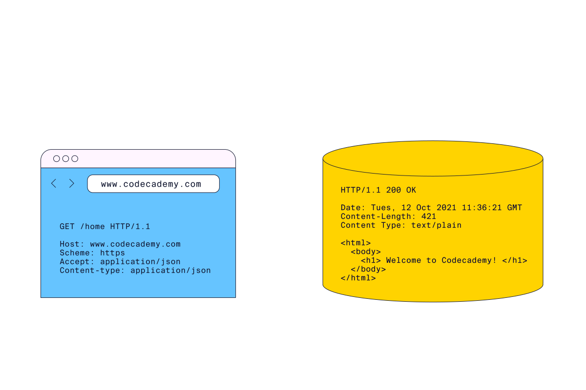
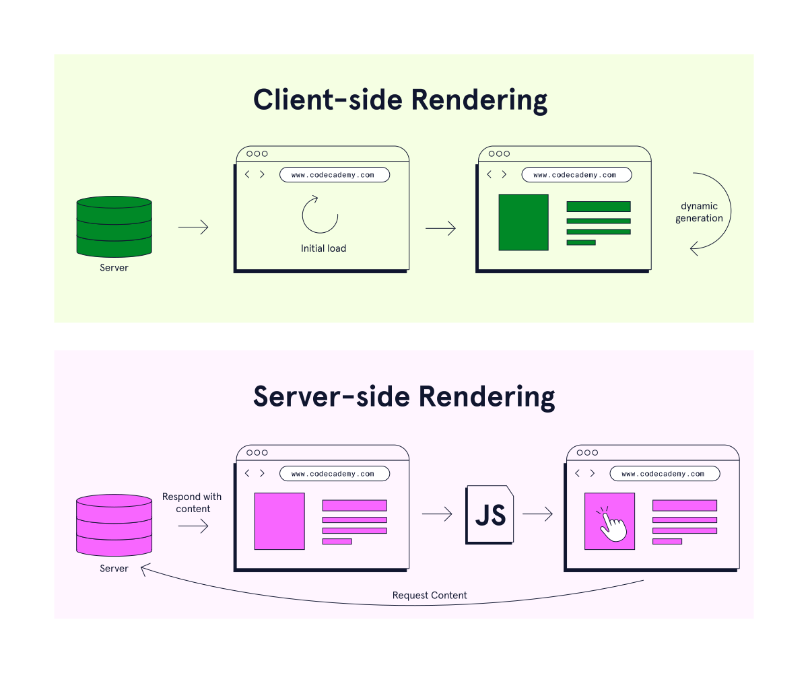
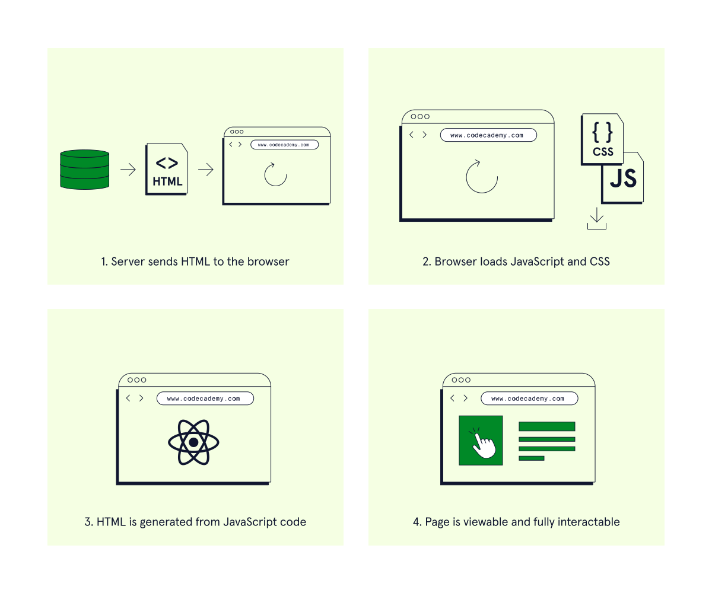
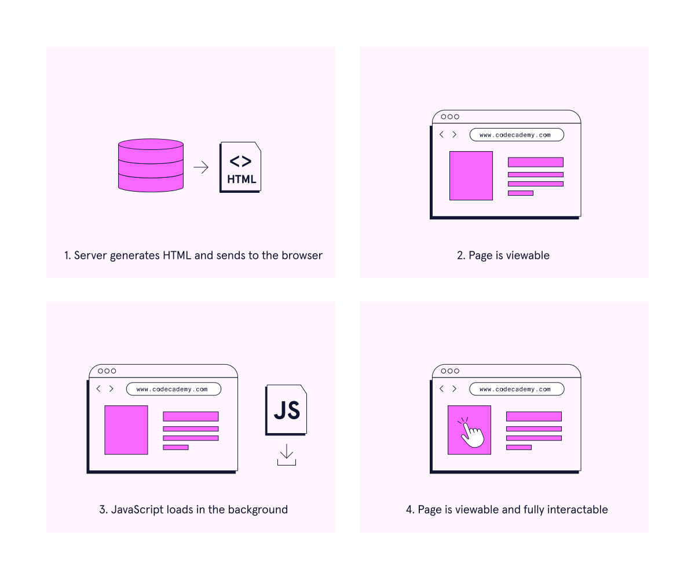

# Connecting Front-End to Back-End

## What are the Front-End and the Back-End?
The front-end refers to the visual features of an application that a user can see and directly interact with. At a minimum, front-end developers should be proficient with HTML, CSS, and JavaScript. Modern front-end developers will also be familiar with one or more frameworks that aid in styling and building front-end layouts. [React](https://reactjs.org/), [Angular](https://angular.io/), and [Vue](https://vuejs.org/) are popular frameworks for structuring user interfaces, while [Bootstrap](https://getbootstrap.com/) and [Material UI](https://mui.com/) are two well-known libraries that facilitate designing responsive user interfaces.

The back-end of an app concerns everything users can’t see, that allows the website to function, and store and retrieve data. Developers will often use frameworks like [Express](http://expressjs.com/) to build the back end of web apps.

When contrasting the front and back-end of a website, a house offers a helpful analogy. We can think of the front-end as the interior of a house: the floorplan, wallpaper, furniture, decoration, and lighting. On the other hand, the back-end is everything we don’t see behind the walls of a home that make it a functional and comfortable space: electrical wiring, gas, plumbing, internet, and insulation. Check out the graphic on the right for a visual reference.

## Transferring Data
In web applications, the front-end and the back-end communicate via an HTTP request/response cycle. For a refresher on how client and server communicate over HTTP, take a look at the [Setting up a Server with HTTP](https://www.codecademy.com/courses/learn-node-js/lessons/setting-up-a-server-with-http/exercises/introduction-to-http) lesson. Here, we’ll focus on the information that is sent back and forth between client and server.

An HTTP request from the client to the server can be broken down into:
* A start line that includes an HTTP method, the path for the requested resource, and the HTTP version number.
* Headers that provide the server with additional information about the sender and the request.
* A body, if needed. Generally, POST and PUT requests will include a body to send data.

Once the server has received the request made by the front-end, it builds a response to send back to the client. An HTTP response can also be broken down into at least two parts:
* A status line that indicates whether or not the request was completed successfully.
* A series of headers to give more context about the response.

Often a response from the server will contain a body, which includes data requested from the client. Generally, the server will send back the following types of data:
* HTML documents
* Static assets, like stylesheets, JavaScript files, and images
* Formatted data

## Different Types of Rendering
Rendering is the aspect of web development concerned with translating code into a visual and interactive website. The browser uses HTML and CSS to build a render tree. We can think of the render tree as a blueprint for the page view that the user eventually sees.

There are different ways to render a web app. Each approach has benefits and drawbacks, and we choose a rendering method depending on our priorities: SEO, user experience, and performance. In this lesson, we’ll discuss client-side and server-side rendering.

In client-side rendering, the content of the page is dynamically generated in the browser as the user navigates the app. Alternatively, in server-side rendering, the server generates the content and sends it to the browser, on-demand. We can also combine client-side and server-side rendering to use hybrid-rendering to incorporate the advantages of both. In hybrid-rendering, static content is generated on the server, while dynamic content is generated on the client-side as the user navigates the site.

We’ll go into more detail on client-side rendering and server-side rendering in the upcoming exercises.

## Client-Side Rendering
Client-side rendering has become a popular method for delivering highly interactive web applications. Let’s take a closer look at what client-side rendering is and how it works.

In client-side rendering, the server sends the browser a boilerplate HTML document that includes a reference to a JavaScript file. This JavaScript code is responsible for dynamically generating content in the browser, as the user moves through the site. With client-side rendering, content is generated and rendered as needed; only the requested content will be loaded, at the time it is requested.

In terms of user experience, the initial page load can be slow, since the JavaScript first has to generate the content for a given view before it is visible and interactable. As the user navigates the app, however, JavaScript code will produce content directly in the browser. Since round-trip calls to the server are not necessary to render additional content, subsequent loads will be much faster. Because of its quick rendering time after the initial load, client-side rendering tends to be preferred for highly interactive web applications.

Front-End frameworks like React, Vue, and Angular often rely on client-side rendering to deliver [Single Page Applications](https://developer.mozilla.org/en-US/docs/Glossary/SPA).

When deciding whether client-side rendering is right for your app, consider the following pros and cons:

Pros:
* Fast speed after initial page load.

Cons:
* Poor [Search Engine Optimization (SEO)](https://en.wikipedia.org/wiki/Search_engine_optimization) performance with dynamically generated content.
* Can lead to poor user experience on slower devices.

## Server-Side Rendering
With server-side rendering, all of the content for a given view is generated on the server, then sent to the browser to be rendered. Pages are generated and rendered on-demand. Every time the user navigates to a different page on the site, the server builds the web page and sends it to the client. Because the content is ready to be rendered when it arrives in the browser, the time it takes for the page to become viewable is usually quick.

Before the page is fully interactable, the browser must download and parse the JavaScript. This process can be slow, and largely depends on the amount of JavaScript code, the quality of the network connection, and the user’s device.

Since static content loads quickly, server-side rendering is ideal for informational sites where there is little interactivity. Implementing server-side rendering for sites that have rich interactions can lead to a poor user experience since more requests to the server need to be made, and JavaScript has to load before the user can engage with the site.

Consider the following pros and cons before choosing server-side rendering for your next app:

Pros:
* Visual elements of the page load quickly, since the content is ready to render before it’s sent to the browser.
* Better [Search Engine Optimization (SEO)](https://en.wikipedia.org/wiki/Search_engine_optimization) performance, since search engines can index static content immediately.

Cons:
* [Time to interactive (TTI)](https://developer.mozilla.org/en-US/docs/Glossary/Time_to_interactive) can be slow if the page is JavaScript-heavy. Speed depends on many factors outside of the developer’s control, like network connection quality, and the user’s device.

## Review
In this lesson, we learned about communication between the front-end and back-end of an application and the different ways of rendering a web app. Let’s recap some key takeaways from this lesson:
* Front-end web development concerns all aspects of a web app that a user can see and directly interact with.
* Back-end web development concerns how a website functions, and the storage and retrieval of data.
* The front-end and back-end of a web app communicate via an HTTP request/response cycle. The types of data that servers send to the browser include HTML documents, JavaScript, static assets, and formatted data.
* Websites can be rendered on the client-side or server-side. Hybrid rendering combines both of these approaches.
* With client-side rendering, JavaScript dynamically generates all content in the browser as the user navigates the site. Content is rendered quickly, after the initial page load.
* Client-side rendering is ideal for dynamic sites, with rich JavaScript interactions.
* With server-side rendering, the server sends the content to the browser. Static content is quickly viewable in the browser, but rich site interactions can take longer to load.
* Server-side rendering is ideal for mostly static sites, where there is not a lot of user interaction.
* Hybrid rendering models attempt to optimize speed, performance, and SEO by combining aspects of client and server-side rendering.
