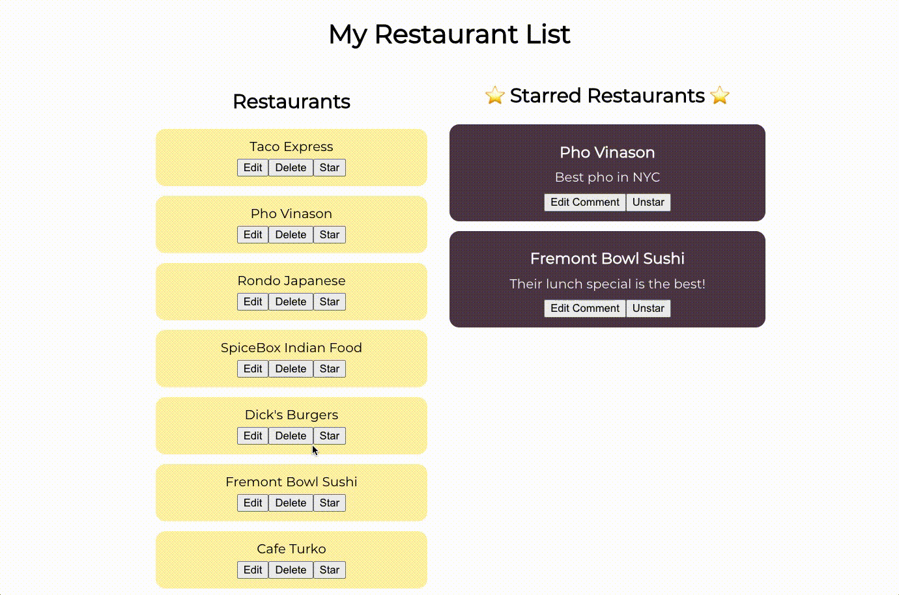

# Off-Platform Project: RESTful Restaurants

## Introduction
In this off-platform project, you will be building an API to connect the front-end and back-end of a restaurant review site. This site will allow its users to view a list of saved restaurants, add to that list, star their favorite restaurants, and leave comments about these places. We’ve got you started by building the front-end and setting up some API routes for you. You’ll focus on adding the remaining routes needed to handle starred restaurants and comments.

In this project, you will:
* Build REST API endpoints using Express
* Implement communication between the front-end and back-end of a website
* Develop locally on your computer
* Use your terminal to navigate through your project directory

## Download the Starting and Solution Code
Download the [folder containing the starting and solution codes of the project](https://static-assets.codecademy.com/Courses/Connecting-FE-to-BE/restful-restaurants.zip).

The starting-code folder contains code to help you get started. Our project is broken up into two main folders: frontend and backend.

The frontend directory contains all of the code for the front-end of our app, along with the API. Open up the src folder and have a look around. Inside, you’ll find the API calls to the back-end defined in the api folder and the React components that make up the app’s interface in the components folder.

The backend directory holds all the code for our app’s back-end. Inside the routes folder, you’ll find all of the routes that accept and handle API calls from the front-end.

We’ve also included a solution-code folder to help guide you if you get stuck. You can also compare the solution provided to your own after you complete the project.

You will be doing this project outside of the Codecademy platform, on your computer. You will be using a local text editor (we suggest VSCode). If you need help setting up your text editor, read our [article about setting up a text editor for web development](https://www.codecademy.com/articles/visual-studio-code).

## Part 1 - Setting up the Project
Let’s get started by installing the necessary packages. We will set up the back-end first. Navigate to the backend folder and install the dependencies.

Next, set up the application’s front-end by navigating to the frontend folder and installing the dependencies.

We are now ready to run the back-end and front-end of our application locally! Start the back-end server first, then the front-end server.
* You can run both back-end and front-end servers by running the `npm start` command in each folder.
  Since the back-end is running on port 3000, you will see the following command line prompt when you run the start command in the frontend folder asking if you want to choose a different port.

  Would you like to run the app on another port instead? › (Y/n)

  Type Y to run the front-end server on a different port. If your site does not automatically open in the browser, navigate to it using the URL provided in your terminal.

## Part 2 - Planning the API Endpoints
You will be using the [Express](https://expressjs.com/) library to create the following REST endpoints:
* Get a specific starred restaurant
* Add a restaurant to your list of starred restaurants
* Delete from your list of starred restaurants
* Update your comment of a starred restaurant

Before you jump into coding, take a moment to think about how you’ll implement each endpoint. It can be helpful to write comments outlining the steps you’ll need to take to create that feature. Check out the endpoints in the restaurants router in backend/routes/restaurants.js to familiarize yourself with how other endpoints work.

Front-end and back-end communication in this app can be summarized as follows:
* API calls are initiated by the front-end components found in frontend/src/components.
* API calls to the back-end are defined inside of frontend/src/api.
* The routers in backend/routes handle API calls and send an appropriate response to the front-end.

It’s worth noting that we are using arrays and objects to create our databases. Though we will not be working with persistent databases like PostgreSQL or MongoDB in this project, our APIs and routers are designed to simulate the process of communicating with external databases.

We will be working with two databases in this project. Both are structured as an array of objects, where each object represents an individual record. ALL_RESTAURANTS maintains the list of all the restaurants for the entire app. We are using the ALL_RESTAURANTS array in both the restaurants and starred restaurants routers. Our other database, STARRED_RESTAURANTS, is a sub-list of ALL_RESTAURANTS and keeps track of the restaurants that have been starred.

Before you write any code, consider making a timeline for yourself. Setting firm boundaries and deadlines will keep you on track and prevent [scope creep](https://en.wikipedia.org/wiki/Scope_creep).

## Part 3 - Creating Endpoints
Let’s get started with building the endpoints to complete our API. You will be writing all of your code inside the starred restaurants router in backend/routes/starredRestaurants.js.

### Get a specific starred restaurant
Inside of your starred restaurants router, scroll down until you reach the comment that says, “Feature 7: Getting a specific starred restaurant.” Here, implement an endpoint to get a single restaurant from your list of starred restaurants.

#### Hint:
Follow these steps for guidance in creating this endpoint:
* Join the starred data with the all restaurants data to get the name of the starred restaurant.
* Find the restaurant in the list of restaurants.
* If the restaurant doesn’t exist, send a status code to the client to let it know the restaurant was not found.
* Otherwise, create an object with the starred restaurant’s id, comment, and name, and send the restaurant data to the front-end.

You’ll need to use the Express .get() method to build this endpoint. Check out Feature 2 in backend/routes/restaurants.js to see how we implemented a similar endpoint.

### Add a restaurant to your list of starred restaurants
Now, scroll down to the comment that says, “Feature 8: Adding to your list of starred restaurants.” Build the endpoint to add a restaurant to your list of starred restaurants.

#### Hint:
Follow these steps for guidance in creating this endpoint:
* Find the restaurant in the list of starred restaurants.
* If the restaurant doesn’t exist, send a status code to the client to let it know the restaurant was not found.
* Otherwise, proceed with adding a restaurant to your starred restaurants list:
  * Generate a unique id for the new starred restaurant.
  * Create a record for the new starred restaurant.
  * Push the new record into STARRED_RESTAURANTS.
  * Set a success status code and send the restaurant data to the front-end.

You’ll need to use the Express .post() method to build this endpoint. Check out Feature 3 in the restaurants router in backend/routes/restaurants.js to see how we implemented a similar endpoint.

### Delete from your list of starred restaurants
Next, scroll to the comment that reads, “Feature 9: Deleting from your list of starred restaurants.” Create an API endpoint to delete a restaurant from your list of starred restaurants.

#### Hint:
Follow these steps for guidance in creating this endpoint:
* Use the .filter() method to remove this restaurant from your list of starred restaurants and save this list in a variable.
* If the restaurant doesn’t exist, send a status code to the client to let it know the restaurant was not found.
* Otherwise, reassign STARRED_RESTAURANTS with the updated list of starred restaurants that you stored in a variable.
* You’ll need to use the Express .delete() method to build this endpoint. Check out Feature 4 in the restaurants router in backend/routes/restaurants.js to see how we implemented a similar endpoint.

### Update your comment of a starred restaurant
Finally, scroll down to the comment that reads, “Feature 10: Updating your comment of a starred restaurant.” Here, create an endpoint to add or edit a comment for a starred restaurant.

#### Hint:
Follow these steps for guidance in creating this endpoint:
* Find the restaurant in the list of starred restaurants.
* If the restaurant doesn’t exist, send a status code to the client to let it know the restaurant was not found.
* Otherwise, update the restaurant’s comment with the comment included in the request body.
* Send a success status code to the client.

You’ll need to use the Express .put() method to build this endpoint. Check out Feature 5 in the restaurants router in backend/routes/restaurants.js to see how we implemented a similar endpoint.

## Part 4 - Deploying Locally
As you build, test your code in your browser to make sure things are working as you expect. You can start your project by running npm start inside of your front-end and back-end directories. Remember that you’ll need to start your back-end server first for the app to work correctly.

We are using nodemon to run the back-end server. [nodemon](https://www.npmjs.com/package/nodemon) is a Node package that watches our files and automatically restarts the server each time we save a change. Without it, we’d need to restart the server each time we made a change to see those changes take effect.

## Debugging Tips
Feeling stuck? Try the following:
* Google your question: Often, someone has had the same question as you! Check out websites like [StackOverflow](https://stackoverflow.com/) and [Dev.to](https://dev.to/) to see how other folks have found solutions.
* Read the documentation: Make sure to carefully read through the documentation for any languages and libraries you are using. Often they’ll have examples of what you’re looking for!
* Rubber ducking: Try to explain a problem to a friend or co-worker. Often you’ll figure out the solution as you’re trying to explain it. And if not, getting another pair of eyes on your code can be helpful.
* Discuss with other learners: Sometimes, it’s helpful to talk things out with someone at a similar point in their learning journey. Check out the [Codecademy Forum for Off-Platform projects](https://discuss.codecademy.com/c/project/off-platform-practce-projects/1939) to connect with other learners who are working on the same project.

## Review
Congratulations! You’ve just implemented a REST API. In this project, we built on top of an existing codebase by adding four new endpoints to our API.

As a challenge, check out the [Express documentation](https://expressjs.com/en/guide/routing.html) to learn more about routing using this library. Try adding additional routes or experimenting with the available response methods.

We are well on our way to building a cleanly-structured, client-side rendering, full-stack application!
