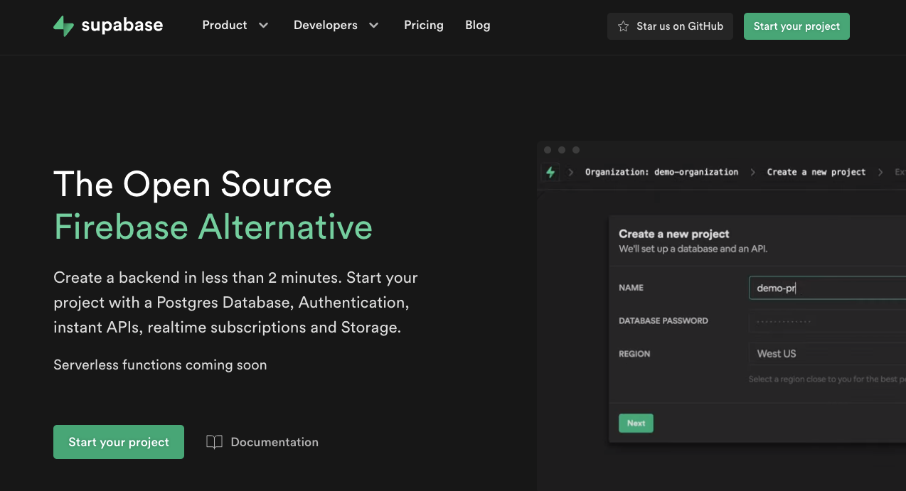
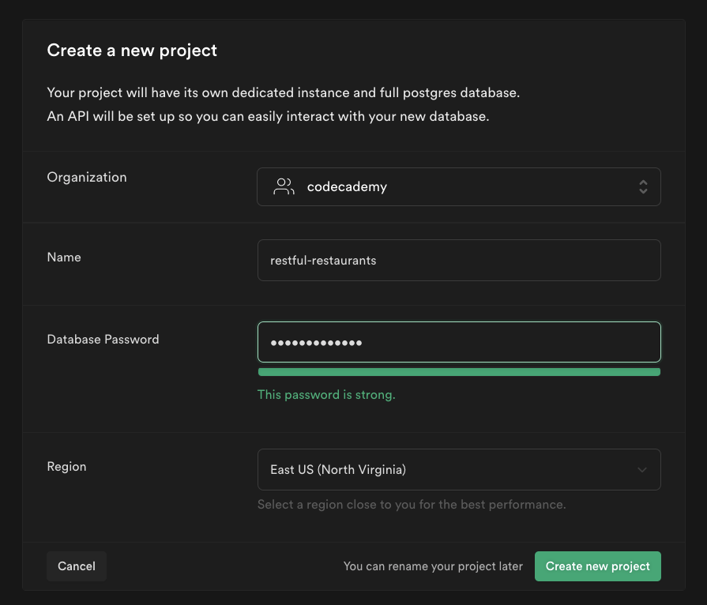
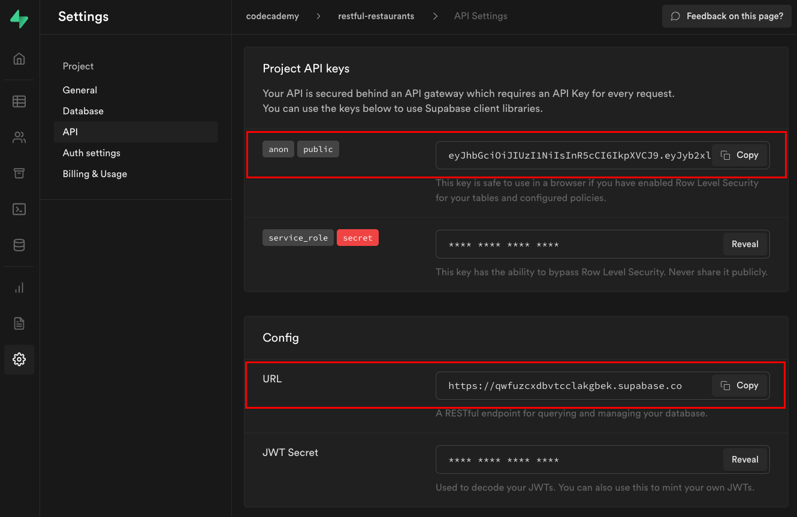
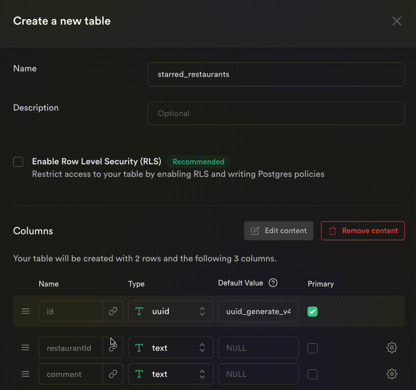

# Connecting Front-End to Back-End

# Server-Side API Calls to External APIs

## Introduction
In this tutorial, we will build on top of the [RESTful Restaurants](https://www.codecademy.com/content-items/adf6a0dee5abf33f002707e9647446df) project to connect the application to an external API to persist the data.

By the end of this tutorial you will know:
* How to connect your back-end to an external API.
* How to use supabase to host PostgreSQL tables.
* What a .env file is and how to use it.

## Project Setup
To get started with this tutorial, make sure you download the [starting and solution code](https://static-assets.codecademy.com/Courses/Connecting-FE-to-BE/external-api/external-api.zip). When you complete the steps in this tutorial, compare your code with the code in the solution-code folder and see how you did!

The starting-code folder contains the following sub-folders:
* frontend
* backend

Run the following command in both sub-folders separately to install the dependencies:
```
npm install
```

To run the application, you will need to have two separate terminal windows or tabs open: one for the frontend folder and the other for the backend folder. You will want to start the application in backend folder, then the frontend folder. You can start the application with the following command:
```
npm run start
```

When first starting the backend server, you will see an error be thrown. This error is because the back-end is not connected to supabase yet. After you complete the steps in this tutorial, the errors will be resolved.

You will get a notification in the terminal window when starting the server in the frontend folder, stating that the port 3000 is in use and asking if you would like to use another port like below:
```
Would you like to run the app on another port instead? › (Y/n)
```

Type y in the terminal prompt to use a different port.

You are ready to get started with the tutorial steps! Note that the start command runs nodemon for the backend server and react-scripts for the frontend server. Any code changes you make in these folders will trigger the application to re-render automatically.

## Tutorial Steps
In the following steps, we will be creating PostgreSQL tables in [supabase](https://supabase.io/) and modifying backend/provider/supabase.js to connect to your supabase database. The variables that we create in supbase.js will be exported to use supabase providers, allowing us to authenticate with the external API and make calls to supabase.

Before we start coding, you will want to familiarize yourself with the code of the following files in the starting-code folder:
* backend/routes/restaurants.js and backend/routes/starredRestaurants.js
  * These files contain the supabase provider initialization, as well as the back-end routes for interacting with the external API.
* frontend/src
  * The files in this folder contain the front-end code of the application, as well as the calls to the backend routes, which will make the calls to the external API.

### Creating a Supabase Database
First, navigate to supabase and create an account by selecting the “Start your project” button.



You will be asked to log in with your GitHub account. Follow the steps to allow supabase access to your GitHub account.

Next, let’s create a new project in supabase. To create a project, you will also need to create an organization. Click on the “New project” button, then click on “New organization”.


You will be prompted to first, name your organization, then to enter the name for your project and database password. Select the region of your choice, then click on the “Create new project” button.



Supabase will take a couple of minutes to generate your project. After your project is ready, navigate to the Settings page by clicking on the gear icon at the bottom of the right panel. Click on the API page— we will need two things from here: the API URL in the Config section and the public key in the Project API keys section highlighted in the image below.



Next, we will set up the tables we will use for this tutorial. Click on the table icon, located right below the home icon.


Click on “New table”. We will start by creating a table called restaurants— enter this as the name of the table. Then, click on the “Import data via spreadsheet” button in the Columns section. Click on the “Paste Text” option at the top and copy in the text below:
```
id,name
0b65fe74-03a9-4b37-ab09-1c8d23189273,Taco Express
869c848c-7a58-4ed6-ab88-72ee2e8e677c,Pho Vinason
213ca4a4-97ce-4783-917b-f94ef8315778,Rondo Japanese
2334b925-802e-4161-b5dd-de53315c9325,SpiceBox Indian Food
3e075c8e-7489-4fb6-b029-43a0a1b8936c,Dick's Burgers
e8036613-4b72-46f6-ab5e-edd2fc7c4fe4,Fremont Bowl Sushi
7f4a4fe2-58eb-4833-9e93-2dfdd1a1d91f,Cafe Turko
```

When you click “Save”, you should see two columns defined for this table. We will need to make some adjustments to the fields for the id column. Set its Type as uuid, and Default Value as uuid_generate_v4(), which will automatically generate [UUIDs](https://en.wikipedia.org/wiki/Universally_unique_identifier) for our table entries. Check the Primary box for the id column.


After you click “Save”, you should see your restaurants table filled with the data we imported.


Let’s create another table for our starred restaurants. Click on the “New table” button again and name the table as starred_restaurants. Click on the “Import data via spreadsheet” button, then select the “Paste Text” option again to copy-paste the following data:
```
id,restaurantId,comment
a7272cd9-26fb-44b5-8d53-9781f55175a1,869c848c-7a58-4ed6-ab88-72ee2e8e677c,Best pho in NYC
8df59b21-2152-4f9b-9200-95c19aa88226,e8036613-4b72-46f6-ab5e-edd2fc7c4fe4,Their lunch special is the best
```

When you click “Save”, you should see that there are three columns defined for this table. We will need to set up the id column the same way we did for the restaurants table. Set its Type as uuid, Default Value as uuid_generate_v4(), and check the Primary box.

Next, we will add a [foreign key](https://www.postgresql.org/docs/current/tutorial-fk.html) to our restaurantId column. Foreign keys help maintain the referential integrity of the data by creating relationships between two tables. In our case, we will set the restaurantId column to reference our restaurants table’s id column. Click “Save”.



Your finished starred_restaurants table should look like below:


When you click “Save”, the starred_restaurants table should be generated and filled with the data we imported.


We are now ready to use our PostgreSQL tables in supabase!

### Creating an .env file
In the root of starting-code/backend create a file named .env. A .env file is where we put API keys and other sensitive information. This is to ensure that our secrets are not viewable in the browser.

In the .env file, SUPABASE_URL should be equal to your API URL and SUPABASE_SECRET should be equal to your API key.
```
SUPABASE_URL = insert supabase URL from above
SUPABASE_SECRET = insert supabase key from above
```

To ensure that our .env file remains hidden and is not committed to a Github repository, we will add .env to our starting-code/backend/.gitignore file. Any file or directory listed in the .gitignore file will not be added to a remote repository and, therefore, will not be viewed publicly.
```
# dotenv environment variables file
.env
```

### Connecting to Supabase
At the top of backend/provider/supabase.js, we need to import the dotenv package and call the .config() method. This will read the .env file and set the variables in the process.env object, this allows us to access the environment variables in our code.
```JS
require("dotenv").config();
```

To initialize supabase, use object abstraction to target createClient and set the value of the variable to the @supabase/supabase-js package.
```JS
const { createClient } = require("@supabase/supabase-js");
```

Below the initialization of the supabase client, we will store the SUPABASE_URL and SUPABASE_SECRET environment variables as const variables.
```JS
const supabaseUrl = process.env.SUPABASE_URL;
const supabaseSecret = process.env.SUPABASE_SECRET;
```

After we have used our environment variables, we are going to execute the createClient function and pass in the supabaseUrl and supabaseSecret variables as arguments.
```JS
const supabase = createClient(supabaseUrl, supabaseSecret);
```

At the bottom of the file, we are going to export the supabase variable so it can be used in backend/routes/restaurants.js and backend/routes/starredRestaurants.js. The supabase provider allows the back-end to interact with supabase for CRUD operations. Take a look at backend/routes/restaurants.js and backend/routes/starredRestaurants.js to see how we are using the supabase provider to interact with our PostgreSQL tables.
```JS
module.exports = supabase;
```

## Conclusion
Congratulations! The data for the RESTful Restaurants application will now persist between sessions. Take a look at the solution-code folder to compare your work with our solution code.

Feel free to play with the application, whether that be in the back-end or front-end! Take some time to experiment with how the application interacts with the supabase database. Happy coding!
