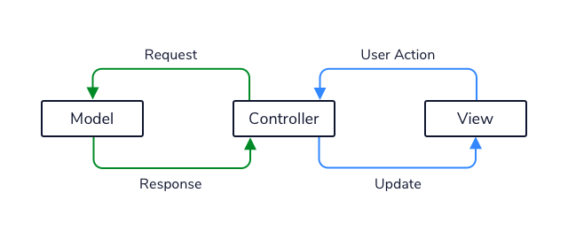

# How to Structure Your App

# Introduction to Model View Controller

## Model View Controller
Model View Controller is an organizational design pattern used for applications that need:
* To move around data throughout the application.
* To display the visual and interactive elements to the users of the application.
* A means of having the user’s actions change the application data.

These needs are so common which is what makes MVC such a great pattern to start the design of applications! The Model View Controller pattern organizes a system into three types of components: the Model, View, and Controller.

Imagine we are designing a website that displays a fun fact each time a button is clicked. Let’s discuss how we would organize the site with the Model View Controller pattern.

### The Model
The Model is made up of the data storage, as well as any classes that represent that data as it moves around the application. Data is often stored outside the application in a database or files. While the data can be stored in different formats, we often read data from storage into a representational object. These objects should be extremely simple and have very little behavior outside of allowing access to their data.

Within our “fun fact” site, our model might consist of the storage of our facts, as well as the classes that represent them.

### The View
The View component is the classes that describe how our application will be presented to the user — it’s what the users see. These might be our React components or HTML elements in a web application or XML files in an Android application.

In our fun fact site, this would be the code that displays the button to click and the currently visible fact.

### The Controller
The Controller is the brain of our application. The View and the Model do not define much behavior for our applications, instead, they merely represent presentational and data objects. The Controller defines the behaviors that our system will accomplish using the Model and View. The Controller is responsible for receiving events (clicks, submitted forms, typing) passed in from the View and processing them to make meaningful responses. The Controller will interact with the Model, making queries or representing data as appropriate to make these responses happen.

In our example application, the Controller of our fun fact website would receive the button click event from the View, and request a new fact from the model, then send that new fact back to the View for display.

## Benefits and Disadvantages of MVC
The primary advantage of the MVC pattern is the separation of the data representation, logical, and presentational layers. By keeping these aspects from being highly tied together, they can be modified independently. Changing the Model should not require major changes to the View, and vice versa.

By separating the Controller from the View, we can create multiple ways of viewing our application. For example, an application can have the web and mobile Views interact with the same Controller. This can allow us to greatly reduce the amount of work needed to port our application to new means of user interaction.

The main drawback of MVC is that it can introduce unneeded complexity to an application. Having multiple components and structure may not be necessary for simpler applications. A decent guideline is that if our application requires multiple people for development, having a pattern such as MVC probably would be helpful. This will help team members reason about class intents and where an object might fit into the application.

Overall, the MVC pattern is ideal for more complex projects in which there are expected to be changes in the way data is represented or presented over the product’s lifetime. The separation of these concerns allows flexibility when making changes to the system.

## Review
In this article, we introduced the Model View Controller pattern for organizing our system at a high level. This pattern separates the following aspects of our application:
* The way we store and represent our application’s data, the Model
* The way we present our application to the user, the View
* The way our application achieves system behaviors, the Controller.

MVC is an important and popular way to design applications and a crucial part of the software designer’s tools. Consider using the Model View Controller pattern the next time you build a complex application!
