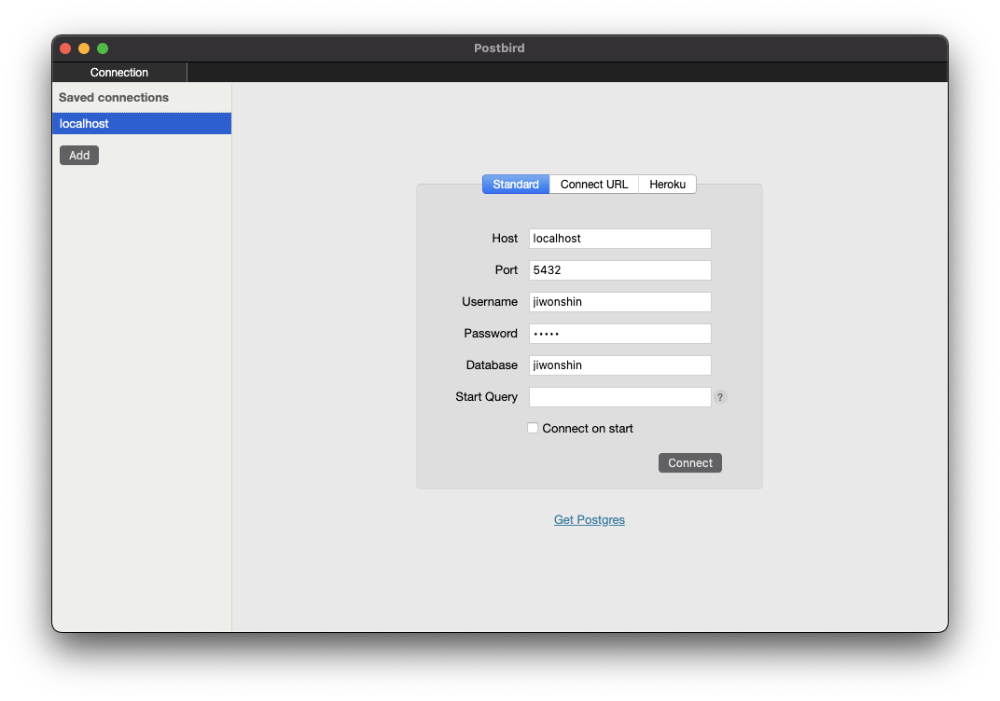
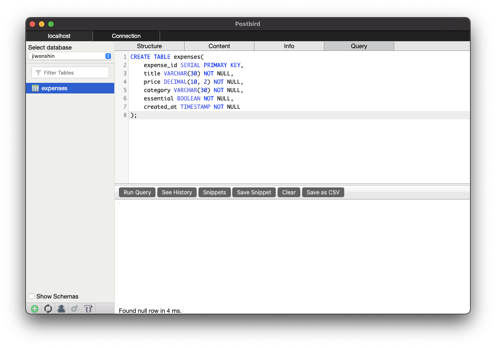

# How to Structure Your App

# MVC Architecture for Full-Stack App

## Project Setup
To get started with this tutorial, make sure you download the [starting and solution code](https://static-assets.codecademy.com/Courses/Connecting-FE-to-BE/mvc/mvc.zip). Follow the steps in this tutorial using the starting-code folder. When you complete the steps in this tutorial, compare your code with the code in the solution-code folder and see how you did! We will be using PostgreSQL as our database. If you are unfamiliar with PostgreSQL and need to set it up on your local machine, check out the [Installing and Using PostgreSQL Locally](https://www.codecademy.com/content-items/bf607b283ce4655cc7596bf32ee4d132) article. Follow the instructions in the article to set up the Postgres server and Postbird client GUI.

Make sure your Postgres server is running. Then, open Postbird to connect it to your Postgres server. Take note of the username and password you use here, as we will need it to join the Postgres database to our app.



Next, navigate to the Query tab and copy-paste the following SQL code below:
```SQL
CREATE TABLE expenses(
    expense_id SERIAL PRIMARY KEY,
    title VARCHAR(30) NOT NULL, 
    price DECIMAL(10, 2) NOT NULL, 
    category VARCHAR(30) NOT NULL, 
    essential BOOLEAN NOT NULL, 
    created_at TIMESTAMP NOT NULL
);
```

Click the “Run Query” button. You should see the expenses table appear on the left side of the Postbird app.



Your local Postgres server should now be ready to use in our app! Let’s connect this to our code. Navigate to the starting-code directory. In the root of the folder, create a .env file. We will define the following environment variables in the .env file.
```
DB_USER=
DB_PASSWORD=
DB_HOST=localhost
DB_POST=5432
DB_DATABASE=expenses
PORT=8000
```

In the above snippet, the values for DB_USER and DB_PASSWORD are missing. Set DB_USER as the username you used to connect to Postbird and DB_PASSWORD as the database password that you entered in Postbird.

Our database setup is complete. Run the following command to install Node package dependencies in the root directory of starting-code and in the starting-code/view folder in two separate terminal windows:
```
npm install
```

Then, to run the application, run the following command in the starting-code and starting-code/view folders:
```
npm run start
```

Your back-end server should be running on port 8000 and the front-end React app should be running on port 3000. Note that the back-end server should be running without error messages if the Postgres database connection was successful. You will see some error messages for the front-end app since there is missing code we will add during the steps of this tutorial.

You are ready to get started with the tutorial steps! Note that the start command runs nodemon for the backend server and react-scripts for the frontend server. Any code changes you make in these folders will trigger the application to re-render automatically.

## Tutorial Steps
### Getting Started: Model and Controller
Begin by familiarizing yourself with the controllers/index.js file. Each of these functions allows for querying or manipulating the PostgreSQL database and leverages a CRUD API. Next, have a look at the models directory. Inside this folder, there are two files: database.js and expense.sql. database.js is a file that connects our application to the PostgreSQL database. expense.sql helps us define the data structure of each collection in our database as well as the name of our database. Now, check out the utils directory. Inside utils/index.js is a function for form field validation. This function will allow the application to run validation code on the form fields sent to the controller. Finally, take a look at the server.js file inside of the root directory. This file allows us to connect and run our Express server with route middlewares.

### Connecting the Model and Controller
The MVC model relies on API requests and responses for the model and controller to communicate. Inside of routes/expense.js, we will create routes that access the controller’s functions.

First, add a POST route to create an expense. We’ll use the create function from the controller directory as the callback function. Import this function at the top of the file, under the router declaration.
```JS
const { create } = require('../controllers');
```

Use the Express .post() method to add the POST route:
```JS
router.post('/expense/create', create);
```

Next, we’ll build a route to get an individual expense. We need to include an id in the route so that we can obtain the desired expense. To do this, we’ll pass an :id as a route parameter.

This route will have a middleware function and a callback function. The middleware will receive the id and search the database for it. Once found, that expense data will be sent to the callback function. The expense will then be read and sent back to the client as a response.

Before building the route, import the expenseById and read functions from the controllers/index.js file:
```JS
const { create, expenseById, read } = require('../controllers');
```

Use the Express .get() method to create the GET route:
```JS
router.get('/expense/:id', expenseById, read);
```

The PUT route will allow us to make updates to an expense. This route will be very similar to the last route we created, but instead of applying the read function as a callback, we will use the update function.

The update callback will receive the expense data along with the body of the PUT request, which includes the data that we want to update. The expense will then be altered and saved.

Import the update function from the controllers/index.js file:
```JS
const { create, expenseById, read, update } = require('../controllers');  
```

Now, use the Express .put() method to create the PUT route:
```JS
router.put('/expense/:id', expenseById, update);
```

Next, we’ll create a DELETE route to remove an expense from our database. This route will also leverage the :id parameter but will only contain the remove callback function.

Import the remove function from the controller/index.js file:
```JS
const { create, expenseById, read, update, remove } = require('../controllers');
```

Use the Express.delete() method to create the DELETE route:
```JS
router.delete('/expense/:id', remove);
```

Finally, we will create another GET route. This route will be similar to the first GET route we built, but instead of finding one expense by its id, this route will find a list of expenses based on a date passed in as a route parameter.

Import the expenseByDate function from the controllers/index.js file:
```JS
const { create, expenseById, read, update, remove, expenseByDate } = require('../controllers');
```

Use the Express .get() method to create the GET route:
```JS
router.get('/expense/list/:expenseDate', expenseByDate, read);
```

### Getting Started with the View
Now that we have the routes necessary to connect our Model and Controller let’s connect the Controller and View. Start by getting familiar with the view directory.

Inside the view directory, there are multiple child directories and some other files included to configure our app. We will be focusing on the src directory.

Take a look inside the src/components directory. Inside are three files: ExpenseList.js, LogExpense.js, and Modal.js. ExpenseList.js is responsible for populating a list of expenses for a given date. It also contains functionality to handle updating and deleting an expense. LogExpense.js is where the user can enter the data necessary to either create or update an expense.

The last file, Modal.js, is used to present the component exported from LogExpense.js as a modal.

From our root directory, we can navigate to utils/index.js. This file houses all of the functions needed to interact with the controller from the views. Finally, have a look at the view/src/App.js file. This file is where the application comes together. We can consider this file the “view” of our application.

### Connecting the View and Controller
To connect the Controller and View, we will add functions to our views that relay user action and update the view. Within certain component files, there are comments. We will insert the proper code under these comments to achieve a Controller-View connection.

We will begin with the view/src/App.js file. Within the useEffect() function, we find our first comment. Here, we’ll add some code that will fetch a list of expenses from the database for the current day and then set them to the expenses state, which will update the view.

We can do this by calling setExpense() with what is returned from fetchExpense(). First, import fetchExpense() from utils.
```JS
import { fetchExpenses, expenseByCategory } from './utils';
```

Now, inside of useEffect() call the functions, as so:
```JS
fetchExpenses().then((res) => setExpenses(res));
```

Now when the App.js component re-renders, it will update with data found in the model.

Within the \<DatePicker/> component of App.js, we will need to update the view as different dates are selected. We can use the same function we used in the useEffect() while passing the selected date to the fetchExpense() function. It will look like this:
```JS
fetchExpenses(newValue.getTime()).then((res) => setExpenses(res));
```

Inside of view/src/components/ExpenseList.js, we have the power to delete entries. Inside this component, we will communicate with the controller to remove an entry from the model.

Import the function deleteExpense from utils:
```JS
import { deleteExpense } from '../utils';
```

Within the handleDelete() function, we are prompted to send the user’s action to the controller. This action is the clicking of the delete icon; therefore, we can call the deleteExpense() function asynchronously, passing the expense _id:
```JS
const handleDelete = async (_id) => {  
  // send user action to controller  
  await deleteExpense(_id);  
  setExpenses(expenses.filter((expense) => expense.expense_id !== _id));
};
```

We will finish off in view/src/components/LogExpense.js. This component allows the user to create and update individual expenses. Once the creation or update is completed, the new model data is fetched from this component and then sent to App.js so that the entire view can be refreshed to represent the new data. To communicate with the controller for all of these functionalities we can import createExpense(), fetchExpense(),fetchExpenses(), and updateExpense(), from utils:
```JS
import { createExpense, fetchExpense, fetchExpenses, formSetter, updateExpense } from '../utils';
```

The setExpenseData() function is called anytime that an expense id is set. This function updates the state with the data of the expense whose id was passed. We can complete the function by asynchronously calling fetchExpense() and passing in the id of the selected expense:
```JS
const setExpenseData = async (id) => {  
  // update view from model w/ controller  
  const expenseById = await fetchExpense(id);  
  setExpense(expenseById[0]);
};
```

The expenseListRefresh() function is called anytime an expense is created or updated. This function sets the error state within the view if an error is sent back from the controller. If the expense is created or updated successfully, it fetches and refreshes the expenses list for the given date. We can complete the function by asynchronously calling fetchExpenses() and passing in a selected date:
```JS
const expenseListRefresh = async (res, date) => {  
  if (res) {    
    return setErr(res);  
  }  
 
  // update view from model w/ controller  
  const expenseList = await fetchExpenses(date);  
  setExpenses(expenseList);  
  handleClose();  
  return null;
};
```

The handleSubmit() function handles the action to either create or update an expense. In both cases, the form data is sent to the controller to alter the model. After an expense is created or updated, the expenseListRefresh() function is called with the response from the controller.

We can complete the function by asynchronously calling updateExpense() and passing in an expense id as well as the form data, and by calling createExpense() and passing in the form data:
```JS
const handleSubmit = async (event) => {  
  event.preventDefault();    
  const data = new FormData(event.currentTarget);  
 
  if (data.get('essential') === null) {    
    data.set('essential', false);  
  }    
 
  if (_id) {    
    formSetter(data, expense);    
    // send user action to controller    
    const res = await updateExpense(_id, data);    
    expenseListRefresh(res, expense.created_at);  
  } else {    
    data.set('created_at', new Date().toISOString());    
    // send user action to controller    
    const res = await createExpense(data);    
    expenseListRefresh(res);  
  }
};
```

## Putting It All Together
Now that the Expense Tracker has a completed MVC structure, it should function as expected. To verify this, first, make sure that the local PostgreSQL server is running. Next, start the Express server. Open a terminal window and run the command npm start server in the root project folder. Finally, start the React server. Open up another terminal window, cd into the view directory, and run the npm run start command.

With those three servers running, you should now be able to visit localhost:3000 in your browser and use the application successfully.

Feel free to play with the application and experiment by making any changes you would like, whether that be in the Model, Controller, or View! Happy coding!
