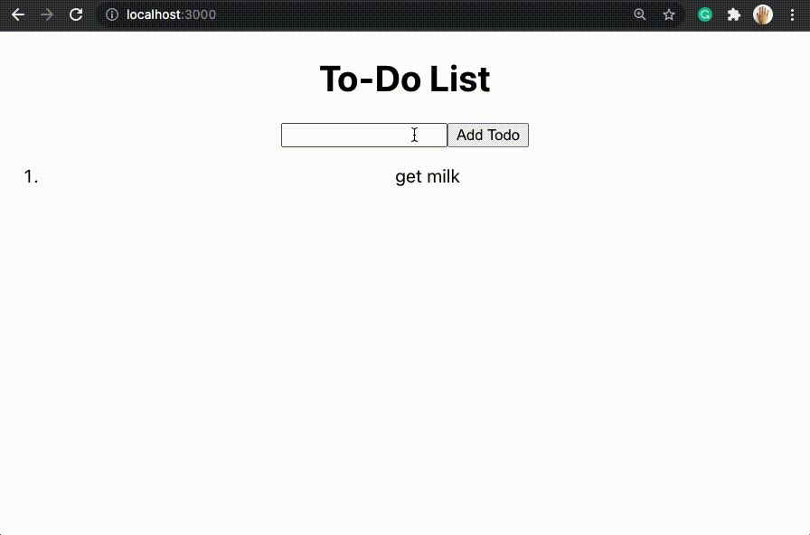

# How to Structure Your App

# Off-Platform Project: To-Do List

## Introduction
In this off-platform project, you will build a simple to-do list web application leveraging the MVC architecture. This web application will allow users to add a new task to their to-do list. Users will also be able to remove tasks from the list once they have completed them by clicking on the list item. We will build this web application from scratch, making sure it is built using the MVC structure.



In this project, you will:
* Build REST API endpoints using Express
* Implement communication between the model, controller, and view of a web app

## Download the Starting and Solution Code
Before we start writing code, download the folder containing the [starting and solution code](https://static-assets.codecademy.com/Courses/Connecting-FE-to-BE/mvc/to-do-list.zip) of the project. The starting-code folder contains code to help you get started. Our project is broken up into three main folders: model, controller, and view.

The view directory contains all of the code for the front-end of our app. Open up the src folder and have a look around. Inside, you’ll find the usual files that come along with an application created with [create-react-app](https://create-react-app.dev/). The App component will make up the web app’s main user interface.

The controller and model directories are empty, as we will fill them up throughout this project. In addition to the controller and model directories, you’ll notice an index.js file, along with some configuration files: database.js , todo.sql, and package.json. We will touch on each of these files as they become relevant throughout the project steps.

We’ve included a solution-code folder to help guide you if you get stuck. You can also compare the solution provided to your own after you complete the project.

You will be doing this project outside of the Codecademy platform, on your computer. You will be using a local text editor (we suggest VSCode). If you need help setting up your text editor, read our article about [setting up a text editor for web development](https://www.codecademy.com/articles/visual-studio-code).

## Part 1 - Setting up the Project
Let’s get started by installing the necessary packages. We will set up the root directory first. Within the root directory of starting-code, install the dependencies in package.json.
  * Remember that you can install dependencies in package.json by running the below command:
    ```
    npm install
    ```

Next, set up the application’s view directory by navigating there from your terminal and installing the dependencies.
  * Remember that you can install dependencies in package.json by running the below command:
    ```
    npm install
    ```

Now that our project has all of the necessary node modules installed, let’s set up PostgreSQL locally on our computer. Be sure to write down your PostgreSQL username and password. We’ll need these later when we set up our environment file.
* Check out the Installing and Using PostgreSQL Locally if you need help setting up the PostgreSQL server and Postbird client GUI.

Once we’ve set up PostgreSQL on our local computer, use the code in the todo.sql file to create a database and a table called todo that our application will populate.
* If you are using Postbird, navigate to the Query tab and copy-paste the following SQL code below:
    ```SQL
    CREATE TABLE todo(
      todo_id SERIAL PRIMARY KEY,
      description VARCHAR(225) NOT NULL 
    );
    ```

    You can also use the PostgreSQL terminal to create a database called todo by running the following command:
    ```SQL
    CREATE DATABASE todo;
    ```

    Then, create the todo table within the database we just created by running:
    ```SQL
    CREATE TABLE todo(
      todo_id SERIAL PRIMARY KEY,
      description VARCHAR(225) NOT NULL 
    );
    ```
With PostgreSQL set up, we can use the database.js file to connect our application to our database. Create a .env file to correlate with the process.env declarations provided within the database.js file.
* You can use the below as boilerplate code, filling in the empty variables with our database username and password.
    ```
    DB_USER=
    DB_PASSWORD=
    DB_HOST=localhost
    DB_POST=5432
    DB_DATABASE=todo
    PORT=8000
    ```

We are now ready to move on and begin building our to-do list app! Note that at this point our app will not function as it is missing many critical components which we will be adding next.

## Part 2 - Building the model directory
Let’s build the model of our web app by using the PostgreSQL database and table we just created.

Begin by placing the database.js and todo.sql files within the model directory for organizational purposes as these files are directly related to the functionality of our model.

Now, create a file called todo.js within the model directory that will contain the SQL code for database interaction. The application will have the ability to create a task, display the list of tasks, and delete tasks. Each of these functionalities correlates with the following CRUD REST API functions: create, read and delete.

In model/todo.js, create a const variable called pool to connect the SQL database.
* At the top of model/todo.js, create a pool variable that imports our database from './database'.
    ```JS
    const pool = require('./database');
    ```

Now, write a function called create that takes in description as its argument and creates an entry in the todo database table. Inside the function, use the .query() method on pool to pass in the below SQL query:
```SQL
'INSERT INTO todo (description) VALUES ($1) RETURNING *', [
    description,
]
```

The above SQL query should insert the description into the todo table.
* The complete create() function should look something like below:
    ```JS
    const create = (description) =>
      pool.query('INSERT INTO todo (description) VALUES ($1) RETURNING *', [
        description,
      ]);
    ```

Next, we’ll create a function called get that will read all the tasks in the todo table. Similar to how we created the create() function above, use the .query() method on the pool object.

Inside the .query() method, pass in the below SQL code to select all items in the todo table:
```SQL
'SELECT * FROM todo'
```
* Your complete get() function should look something like below:
    ```JS
    const get = () => pool.query('SELECT * FROM todo');
    ```

Finally, create a function called remove that takes id as its argument to search for a to-do item to remove from the todo table. We will use the .query() method here as well. Inside the argument of the .query() method, pass in the below SQL code to find an item where todo_id of the todo table is equal to id:
```SQL
'DELETE FROM todo WHERE todo_id = $1', [id]
```
* Your complete remove() function should look something like below:
    ```JS
    const remove = (id) => pool.query('DELETE FROM todo WHERE todo_id = $1', [id]);
    ```

To finish, make sure to export all three functions we just created: create, get, and remove.
* Remember that functions can be exported by using model.exports to export functions by their name.

## Part 3 - Building the controller directory
Now that we have the model established, we can move on to the controller.

Inside of the controller directory, add an index.js file to house our functions.

Begin by importing the [formidable package](https://www.npmjs.com/package/formidable) as formidable, which we will use to parse our PostgreSQL data. Next, import the create, get, and remove functions that we just created in model/todo.js.
* At the top of controller/index.js, import formidable and the three functions from model/todo.js like below:
    ```JS
    const formidable = require('formidable');
    const { create, get, remove } = require('../model/todo');
    ```

Now, we’ll create an exported middleware function called create for adding tasks to the todo database that receives REST API request and response data. The function should receive req and res as its arguments and should use formidable to parse the received form data to check to see if the description field is received. If description is received, use the imported create function to add a new entry to the todo database. If the description field does not exist, return an error.

Since the focus of this tutorial is on using the MVC model, not validating forms using formidable, take a look at the below hint for an example of the create middleware function.
* Your exported `create()` middleware function should look something like below:
    ```JS
    exports.create = (req, res) => {
      const form = new formidable.IncomingForm();
      form.keepExtensions = true;
      form.parse(req, async (err, fields) => {
        const { description } = fields;
        // check to see if the description field exists in the form
        // if description doesn't exist, send error
        if (!fields.description) {
          return res.status(400).json({
            error: 'Description is required',
          });
        }
        // if description exists, add to database using create() function
        try {
          const newTask = await create(description);
          return res.status(201).send({ data: newTask.rows[0] });
        } catch (error) {
          // if description cannot be added to database, send error
          return res.status(400).json({
            error,
          });
        }
      });
    };
    ```

Next, we will need to add another exported async function called read for fetching all existing items in the todo database. The function should take req and res as its arguments and use the get() function to return all rows of the table as response.
* Remember that we will want to return the rows of the todo table in JSON format. Make sure to also use try and catch blocks to capture errors.

Finally, create an exported async function called removeTodo for deleting a task from the todo database. The function will take req and res as its arguments and use the remove() function that we created in model/todo.js to match and delete the row with the received id.
* Keep in mind that we will have access to the task id through the route that will call this function. Make sure to also use try and catch blocks to capture errors.

## Part 4 - Connecting the Model to Controller
Now that we have populated the model and controller directories, we can provide communication between the two by adding routes.

Begin by creating a routes directory inside the root folder and populating it with a todo.js file.

Inside routes/todo.js, require express and the functions that we created in the controller/index.js file (create, read, removeTodo). Also, declare a router variable to initialize the router object using the .Router() method.
* At the top of our newly created routes/todo.js file, our require statements should look like below:
    ```JS
    const express = require('express');
    const { create, read, removeTodo } = require('../controller');
    Also, initialize the router object using the .Router() method like below:

    const router = express.Router();
    ```

Next, we will create routes for POST, GET, and DELETE. The POST route should handle requests from '/todo/create', the GET route from '/todos', and the DELETE route from '/todo/:id'.
* Remember that you can use the .post(), .get(), and .delete() methods on the router object to create these routes.

Lastly, make sure to export the router.
* Remember that you can use module.exports to export the router.

## Part 5 - Building out the View Directory
Now that we have connected our application’s model and controller components, we can move on to the view directory.

Inside view/src, create a util directory. Then, create an index.js file inside view/src/util. In view/src/util/index.js, we will create three exported functions that will perform the API calls to the Controller.

To start, create a function called createTodo that performs a POST method to the route that we created for task creation. The function should take todo as its argument which will contain the contents of the new form.
* Remember to use the try and catch block to fetch the response from 'api/todo/create'.

Next, create a function called updateTodo that performs a GET request to update an existing entry in the todo database. The function takes id and form as its arguments to update the row with id to the updated form data.
* Remember to use the try and catch block to fetch the response from 'api/todo/${id}'.

Create another function called getTodos that also performs a GET request to get all the existing entries in the todo database.
* Remember to use the try and catch block to fetch the response from 'api/todos'.

Finally, create a function called removeTodo that performs a DELETE request. The function should take id as its argument to delete the row that matches the received id from the todo table.
* Remember to use the try and catch block to fetch the response from 'api/todo/${id}'.

## Part 6 - Connecting the View to Controller
All that we have left to do now is to connect the View to the Controller.

Take a look at view/src/App.js. You will see that the application’s interface is not very complicated and that most of the code has been provided for you. However, we are missing some front-end functionalities to handle new to-do items, delete existing to-do items, and fetch the to-do items in the database.

Let’s start with creating an async function called fetchTodos that will use the getTodos() function from util/index.js to GET the existing list of to-do items. The function should set the state of todoList to the data received as the response of the GET request.
* The complete fetchTodos() function should look something like below:
    ```JS
    const fetchTodos = async () => {
      const res = await getTodos();
      if (res.error) {
        setError(res.error.name);
      }
      setTodoList(res.data);
    };
    ```

Next, create an async function called handleSubmit that will use the createTodo() function from util/index.js to POST the to-do item. The function should also set todo and todoList states to reflect changes to the front-end by calling the fetchTodos() function we created just now.

There are many ways to create this function—if you are feeling stuck, check the below hint for an example of the handleSubmit() function.
* The handleSubmit() function should look something like below:
    ```JS
    const handleSubmit = async (e) => {
      e.preventDefault();
      setError();
      const data = new FormData(e.currentTarget);
      try {
        data.set('description', todo.description);
        data.set('created_at', `${new Date().toISOString()}`);
        const newTodo = await createTodo(data);
        if (newTodo.error) {
          setError(newTodo.error);
        }
        setTodo({ description: '' });
        fetchTodos();
      } catch (err) {
        setError(err);
      }
    };
    ```

Now, create an async function called handleDelete that takes in id as its argument to handle the deleting of tasks. This function should call the removeTodo() function that we defined in util/index.js as well as handle any errors. You will also need to call the fetchTodos() function to reflect changes to the View.
* Remember that we will want to pass the task id as an argument of the removeTodo() function.

## Part 7 - Deploying Locally
We are now ready to run our to-do list app! Start the project by running npm start inside the root directory as well as inside the view directory. Remember that you’ll need to start your back-end server first for the app to work correctly.

We are using nodemon to run the back-end server. nodemon is a Node package that watches our files and automatically restarts the server each time we save a change. Without it, we’d need to restart the server each time we made a change to see those changes take effect.

## Debugging Tips
Feeling stuck? Try the following:
* Google your question: Often, someone has had the same question as you! Check out websites like StackOverflow and Dev.to to see how other folks have found solutions.
* Read the documentation: Make sure to carefully read through the documentation for any languages and libraries you are using. Often they’ll have examples of what you’re looking for!
* Rubber ducking: Try to explain a problem to a friend or co-worker. Often you’ll figure out the solution as you’re trying to explain it. And if not, getting another pair of eyes on your code can be helpful.
* Discuss with other learners: Sometimes, it’s helpful to talk things out with someone at a similar point in their learning journey. Check out the Codecademy Forum for Off-Platform projects to connect with other learners who are working on the same project.

## Review
Congratulations! You’ve just implemented a to-do list app built using the MVC architecture. In this project, we reorganized files, altered existing files, created new ones to build out our MVC components and connect them.

As a challenge, try adding additional routes or experimenting with the available response methods. You can check out the Express documentation on routing to learn more.

We are well on our way to building a cleanly-structured, client-side rendering, full-stack application!
