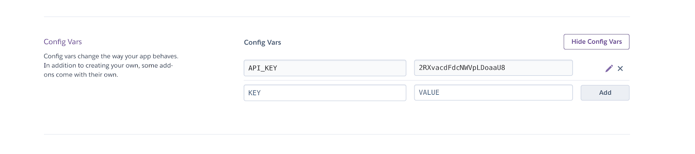
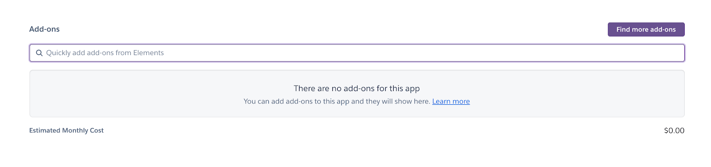

# Deploying a PERN App with Heroku

# Going Beyond with Heroku

## Heroku CLI
Once you know the fundamentals of Heroku and what it can do for you, the next step is installing and learning the [Heroku Command Line Interface (CLI)](https://devcenter.heroku.com/articles/heroku-cli). The Heroku CLI is an essential tool in creating and managing apps on the Heroku platform. Once installed, creating an app can be done in as little as two commands:
```
heroku login
```

The heroku login command will initiate a login process by prompting you to press any key to open a new page in your web browser. After verifying your credentials in the browser, the CLI will log you in automatically. Next, use the command:
```
heroku create
```

This command will create an app and give it a randomly generated name. Additional arguments and options, such as [defining your own app name](https://devcenter.heroku.com/articles/heroku-cli-commands#heroku-apps-create-app), can be added.

## Config Vars
Anything that you don’t want to appear in your source code (like API keys or database login credentials), as well as anything that varies between environments (like usernames, or URL’s) should be stored in environment variables. Heroku’s environment variables are called config vars. To set a config var, navigate to the Settings tab of your app’s dashboard, and click Reveal Config Vars.



You can also set Config Vars through the CLI. For example:

heroku config:set API_KEY=2RXvacdFdcNWVpLDoaaU8
Here, the config:set argument sets the specified config var.

## Adding a Database
Heroku offers a free HerokuPostgres data service as an add-on for all customers. Adding a Postgres database to your app can be done in the “Add-ons” section of the Resources tab of your app’s dashboard:



But it might be more convenient to set up Postgres in the CLI, since you can also interact with the database in your terminal. To provision Heroku Postgres type:
```
heroku addons:create heroku-postgresql:hobby-dev
```

This command uses the addons:create argument to create an add-on. Then, the heroku-postgresql:hobby-dev argument specifies the add-on and plan.

Configuring the database is beyond the scope of this article, but each language in the Heroku Getting Started Guide has a section detailing how to create a table and access the data using the code specific to the chosen language.

## Fullstack Application
You’ve learned how to deploy a back-end app with Heroku, but you can also deploy a fully-operational full-stack app on Heroku’s platform. Check out Deploying a Full-Stack App with Heroku to for a guide using Node.js, or see the the [Heroku Getting Started Guide](https://devcenter.heroku.com/start) language of your choice.

## Premium Features
If your app starts getting an increase in traffic, or you decide on using a custom domain, upgrading to the hobby dyno might be a good idea. With the hobby dyno, you gain a few additional features. For instance, apps on the hobby dyno:
* won’t go to sleep after 30 minutes of inactivity.
* can use Heroku SSL to encrypt traffic to and from your site, provided you upload and manage the SSL certificates. (gives you the ability to use HTTPS instead of HTTP in your URL).
* or even better, Automated Certificate Management, which uses TLS certificates, managed and renewed by Heroku. (same as SSL, but no need to worry about uploading and managing certificates).

Beyond the hobby dyno plan, there are professional plans aimed at providing businesses with additional features to fit their needs. Visit the plan estimator page to see which plan is best suited to your project!

## Wrap Up
Way to go! Now you’re aware of some more of the features Heroku to offer, as well as a few commands to get started using the Heroku CLI. There is so much more to learn, as this platform serves everyone from new developers just getting started, to large companies with teams of experienced developers. Try taking your knowledge further by adding some of these features to your own app, or create a new app to test them out and see where they take you!
