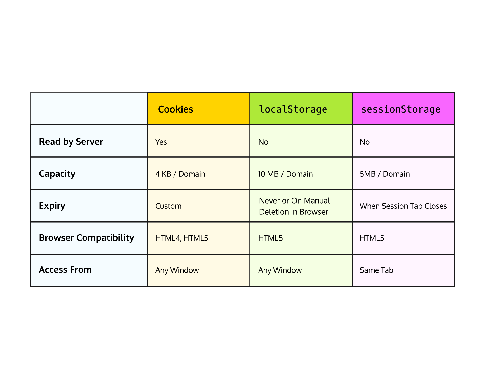

# Session Authentication in Express.js

# Sessions & Cookies vs localStorage

## Web Sessions
HTTP(S) protocol on its own is stateless, meaning requests and responses are just relaying information back and forth with no knowledge of a specific user.

But web developers want to create engaging, personalized experiences for users. This means there needs to be a system that associates the requests with a specific user and does so in a secure way. This is where sessions come in!

A web session refers to a series of user interactions over a time frame. Session data is stored server-side and associated with a session ID.

Think of a session as short-term memory for a web application. In the next exercise, we will explain where this session identifier is kept so that the browser (client) can keep retrieving the same session data between different page loads.

## Sessions and Cookies
It’s a bit clunky for the client to remember to tack the session ID onto every request. Because of this, the session ID is often kept client-side in the form of session cookies. Cookies are tiny pieces of data — text files of max 4kb — the browser stores that are automatically sent with HTTP requests to a web application. Cookies are set by the HTTP response header in key-value pairs:
```
Set-Cookie: Key=Value
```

A session cookie is set with the first HTTP response from the server and persists until the browser is closed or the cookie expires. They look like this in the HTTP header:
```
Set-Cookie: sessionID=34jgL79b
```

This is roughly how a session is implemented with cookies:
1. A user goes to a site. The web server creates a session and a session ID.
2. In the server’s response, it tells the browser to store a cookie with the session ID (should not include any personal information).
3. The session ID cookie automatically attaches to each subsequent HTTP request to the server.
4. When the server reads the session ID cookie sent with the next HTTP request, it returns the session data associated with the ID.
5. The process continues as long as the session is active.
6. The session and session ID cookie expires after a user closes out the browser, logs out, or a predetermined session length (i.e. an hour) passes.

## Cookie Security
Cookies often store sensitive information, especially when they’re used in session management. Cookies are also used to store a user’s personal preferences or history, which should also stay secure.

It’s important to add security to the cookies, especially in the case that someone tries to swipe data from them to steal your session data!

The first step to securing a cookie could be adding an expiration date or duration so a cookie doesn’t persist longer than it needs to. We can specify that information through the Set-Cookie header in an HTTP response like so:
```
Set-Cookie: Key=Value; expires=Saturday, 01-May-2021 07:30:10 GMT
```

The [HttpOnly](https://owasp.org/www-community/HttpOnly) attribute for the Set-Cookie header makes sure that the cookie’s data is not accessible to a script running client-side. This helps prevent a Cross-Site Scripting (XSS) attack that tries to steal a session cookie and take over the victim’s session, which is extremely common.
```
Set-Cookie: Key=Value; expires=Saturday, 01-May-2021 07:30:10 GMT; HTTPOnly
```

Here are some other Set-Cookie options:
* [SameSite](https://developer.mozilla.org/en-US/docs/Web/HTTP/Headers/Set-Cookie/SameSite) helps prevent Cross-Site Request Forgery (CSRF) attacks.
* [Secure](https://owasp.org/www-community/controls/SecureCookieAttribute) makes sure cookies are only sent with a request to an HTTPS page.

You can explore [more options](https://developer.mozilla.org/en-US/docs/Web/HTTP/Headers/Set-Cookie) for the Set-Cookie header.

## What is localStorage?
Reading cookie data can involve some tedious syntax and relying on cookies to be attached for each HTTP request can affect a website’s performance. Cookies are also quite limited in storage. Cookies were the only option for storing miscellaneous data outside of the database until HTML5 came around with localStorage and sessionStorage.

[localStorage](https://developer.mozilla.org/en-US/docs/Web/API/Window/localStorage) is a newer form of client-side storage. These browser files also store data as key-value pairs, and web applications can choose to store up to 5MB of data in localStorage. localStorage does not interact with the server, but is instead accessed and modified by simple client-side JavaScript code. localStorage will persist even after a user exits the browser, and will continue to persist until the browser cache is deleted.

[sessionStorage](https://developer.mozilla.org/en-US/docs/Web/API/Window/sessionStorage), which uses the same syntax aslocalStorage, can hold session data. This storage clears once the browser closes, so, for many use cases, this is more secure.

localStorage/sessionStorage security depends on the general security of your web application’s code against common web attacks. Coming up, we will talk more in-depth on how they compare to cookies.

### Exercises
1. Let’s try out localStorage in action! To the right we have the beginnings of a web application where a user can select a character. This character should be saved in session data. We’ll use localStorage to store the selection.
    
    Setting a key-value pair in localStorage is as easy as this:
    ```JS
    localStorage.setItem('key', 'value');
    ```

    In main.js, in the function selectProfile(), add a key-value pair in localStorage where the key is 'profile' and the value is the name argument of the function.
2. Now we want to display the actual character associated with the session. We can get a key-value pair in localStorage like so:
    ```JS
    localStorage.getItem('key');
    ```

    In main.js, in the function loadProfile(), set the character variable, which is currently equal to null, equal to the 'profile' saved in localStorage.

    Edit the code, then hit Run! You should now be able to select a character, then have it displayed in the next page.

```JS
var images = new Map([
  ["lucy", 'https://static-assets.codecademy.com/content/paths/web-security/sessions-cookies/localStorage-exercise/lucy.jpg'],
  ["red", 'https://static-assets.codecademy.com/content/paths/web-security/sessions-cookies/localStorage-exercise/red.jpg'],
  ["maxine", 'https://static-assets.codecademy.com/content/paths/web-security/sessions-cookies/localStorage-exercise/maxine.jpg'],
]);

function selectProfile(name){
  if (name != localStorage.getItem('profile')) {
    alert("Now setting character to... " + name)
  }
  // 1. Set the profile in localStorage below:
  localStorage.setItem('profile', name);
}

function loadProfile(){
  //2. Set character to the 'profile' value from localStorage
  var character = localStorage.getItem('profile');

  if (character) {
    display_character(character)
  }
}

function display_character(name) {
  var img = document.createElement('img');
  img.src = images.get(name);
  document.getElementById('character').appendChild(img);
} 

function loadHome(){
  if (localStorage.getItem('profile')) {
    display_character(name)
  }
}
```


## Cookies vs. localStorage vs. sessionStorage
As you can see, the localStorage syntax is very straightforward and makes storage and retrieval easy. So why hasn’t everything transitioned to using localStorage or sessionStorage? What are the pros and cons of each? Below, we’ll compare cookies and localStorage.

Though both cookies and browser storage are a form of client-side storage, they differ in a number of ways.

localStorage and sessionStorage are meant to be accessed directly by JavaScript and not sent directly to the server like cookies. localStorage is also newer, so there is less browser compatibility. The syntax to access this storage is also arguably simpler.

There is also the difference in data expiry and capacity. Cookie expiration can be configurated through code, but localStorage and sessionStorage expiration work differently and are more so dependent on browser operations. Cookies hold 4KB per domain, whereas localStorage and sessionStorage have greater capacity per domain.

Take a look at the side-by-side comparison!



## More On Session Security
Users and web developers should be concerned with [session hijacking](https://owasp.org/www-community/attacks/Session_hijacking_attack), an attack in which an attacker steals session identifiers and gains access to the web server as a different person.

Why hijack a session? If a user is in an authenticated session on their bank’s website, the attacker could transfer funds from a user’s bank account. Another scenario is an attacker could hijack the session of an authorized admin on an organization’s website and steal data.

Below, we will introduce a couple of secure practices for implementing sessions that prevents hijacking attacks.

## Define Session Expiry
The shorter a session is, the less time an attacker has to hijack a session. This is usually done by setting an expiry on the session cookie. It’s also important to implement an automatic session expiration on the backend.

A timeout dictates how long a session can stay open. The session timeout after an idle period is a common feature on bank websites! Other environments that require high security even implement an absolute timeout where a user’s session ends regardless of activity.

## Make Session IDs Difficult to Hack
Session IDs are just like passwords — the longer and more random, the better. According to [OWASP](https://owasp.org/www-community/vulnerabilities/Insufficient_Session-ID_Length), session identifiers should be at least 128 bits long. This helps prevent brute-force attacks where a hacker uses multiple bots to guess IDs.

In order to make the session ID random, ensure it does not contain personally identifying information and that the algorithm to generate an ID doesn’t follow a predefined pattern that makes it easier to guess.

## Securing Cookies
Session cookies can be made more secure if they expire. This decreases the timeframe where an attacker could steal the session identifier.

You should also use the [Secure](https://owasp.org/www-community/controls/SecureCookieAttribute), [HttpOnly](https://owasp.org/www-community/HttpOnly), and [SameSite](https://developer.mozilla.org/en-US/docs/Web/HTTP/Headers/Set-Cookie/SameSite) attributes in the Set-Cookie HTTP header.

## Enforce HTTPS
Ideally, all sessions-based web applications should enforce HTTPS for all communication! This prevents common web attacks that could give the attacker access to the session.

