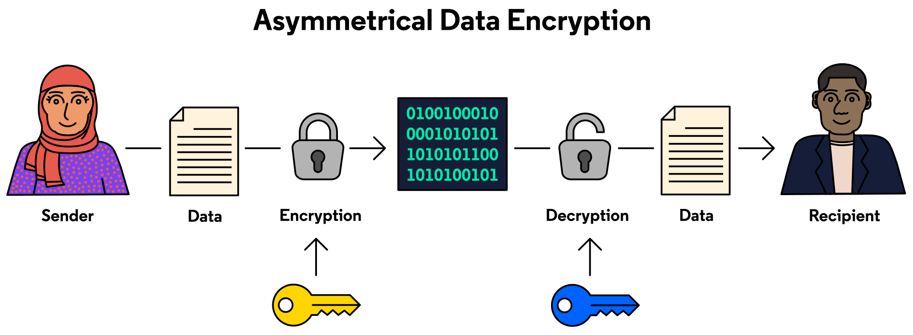
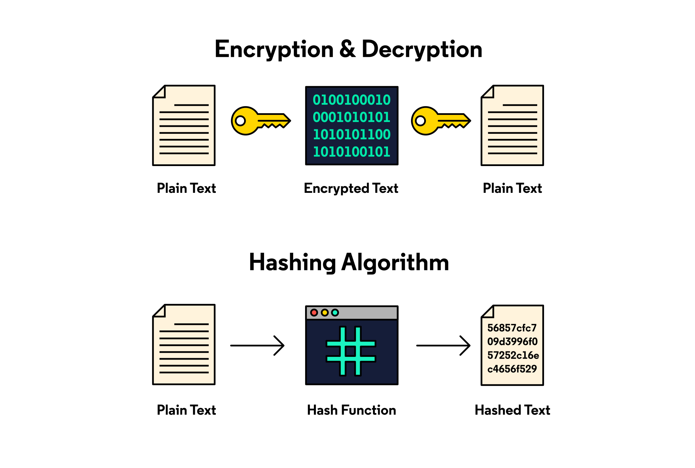

# Password Authentication

# Hashing vs Encryption vs Encoding vs Obfuscation

## Encryption
Cryptography is the science of hiding data and making it available again. In cryptography, hiding data is called encryption and unhiding it is called decryption. When data is securely exchanged, it is first encrypted by the sender, and then decrypted by the receiver using a special key.

There are two main types of encryption: symmetric and asymmetric.
* Symmetric encryption uses the same key to both encrypt and decrypt data.
* Asymmetric encryption uses two different keys to encrypt and decrypt data.

### Symmetric Encryption
Symmetric encryption is the fastest way to encrypt data, and the most common for sending large chunks of data, however, it has one major vulnerability: if you send someone your key, then it’s in a form that any other person can read. That means your data is vulnerable to being stolen.

### Asymmetric Encryption
Asymmetric encryption differs from symmetric encryption in one way: Instead of one key, you have a key pair. A key pair is made up of a public key and a private key.
* The public key can be given to anyone and is only used to encrypt data.
* The private key is kept secret and is only used to decrypt data.

What’s the use of having two keys? Having two keys mean you are the only person who ever has access to the private key used to decrypt data, so it is impossible for someone to intercept and read your messages.

For example, if you want to receive an encrypted message from someone, you would first generate a key pair and give them the public key. Then, they would write a message and encrypt it using the public key you gave them. Finally, they would send you the message and you would decrypt it with your private key.

Asymmetric encryption is the most secure way to transmit data; however, it is slower and more complex than symmetric encryption. Therefore, it is primarily used to exchange smaller pieces of data.

## Hashing
Hashing does not encrypt data. Instead, hashing is a one-way process that takes a piece of data of any size and uses a mathematical function to represent that data with a unique hash value of a fixed size. You cannot compute the original data from its hash.

Because each hash should be unique, hashing allows us to see if changes have been made to documents.

Ideally, hash functions always generate unique values for different inputs. When they don’t it’s called a hash collision. While it’s hypothetically possible to encounter a hash collision with nearly any hashing algorithm, with modern algorithms like SHA-256, it would take so long to result in a collision that it’s functionally impossible. Earlier hashing algorithms, like MD5 and SHA-1, are more likely to result in hash collisions.

### Using Hashes to Protect Data
Hashes are widely used in order to store passwords in online databases. If passwords are stored in plaintext and a database is breached, so are all of the passwords! However, if they are stored as hash values, even if someone hacks into a website’s database, only the password hashes are exposed.

For example, let’s suppose a user’s password is:

CodecademyIsGr8t

Now, if the website storing the password is using a SHA-256 hash, even if someone hacked into that website, all the hacker would see is the hash value:

d04f855e71ad9d495d91e666175d593b669f45970f885a258f6dbbaab262ac8b

Remember, an attacker has no way of decrypting a hash value to get the original value. Hashing is a one-way process.

## Encoding
Encoding, while it may sound similar to encryption, is not actually used to hide data. Encoding transforms data into a form that can be used by a different type of system. Some different types of encoding are:
* ASCII (American Standard Code for Information Interchange)
* Unicode
* Base64

When would we ever use one of these? Let’s look at ASCII as an example. ASCII is a character encoding standard that is used to translate human text into something a computer can understand and vice versa. It’s a shared language all computers use to translate human text.

Let’s look at the encoding process with the capital letter “A”.

| Letter | Decimal Encoding | Binary Encoding |
| - | - | - |
| A | 65 | 100 0001 |
| B | 66 | 100 0010 |
| C | 67 | 100 0011 |

Looking at an ASCII table, we can encode the capital letter “A” as the number 65. Then, we have to translate 65 into binary which gives us the value 100 0001. Using ASCII encoding, we are able to change “A” into something another system, our computer, can understand.

Encoded information is easily reversed and only requires knowledge of the algorithm used to decode information.

## Obfuscation
Obfuscation is less about data security and more about securing code. Developers might obfuscate their code in order to hide what their code is actually doing. Obfuscate means to hide the meaning of something by making it difficult to understand. Why would developers do this?

Developers might want to hide trade secrets or intellectual property from others who can access their code. Obfuscating their code makes it difficult for others to steal code and use it for their own purposes. Obfuscation can also make it harder for users to hack software or get around licensing requirements needed to use programs.

Malicious actors might also use obfuscation to make it hard for users or antivirus software to detect a virus they are planting on a system. If you don’t know what an application is for, be very careful before downloading or opening it.

## Conclusion
According to [CISA](https://www.cisa.gov/uscert/sites/default/files/publications/infosecuritybasics.pdf),

Authentication and authorization go hand in hand. Users must be authenticated before carrying out the activity they are authorized to perform. Security is strong when the means of authentication cannot later be refuted—the user cannot later deny that [they] performed the activity. This is known as non-repudiation.

Securing data is an important part of upholding the principles of authentication, authorization, and non-repudiation.

Whether it’s financial data, health data, personal user data, or any other type of data, chances are it will need to be secured in some way. Sometimes data can be secured by simply limiting who accesses it, but some data is so sensitive, it must be secured using additional measures.

Implementing authentication and authorization is just part of securing a system. Proper encryption and hashing practices are also imperative to an application’s security.
