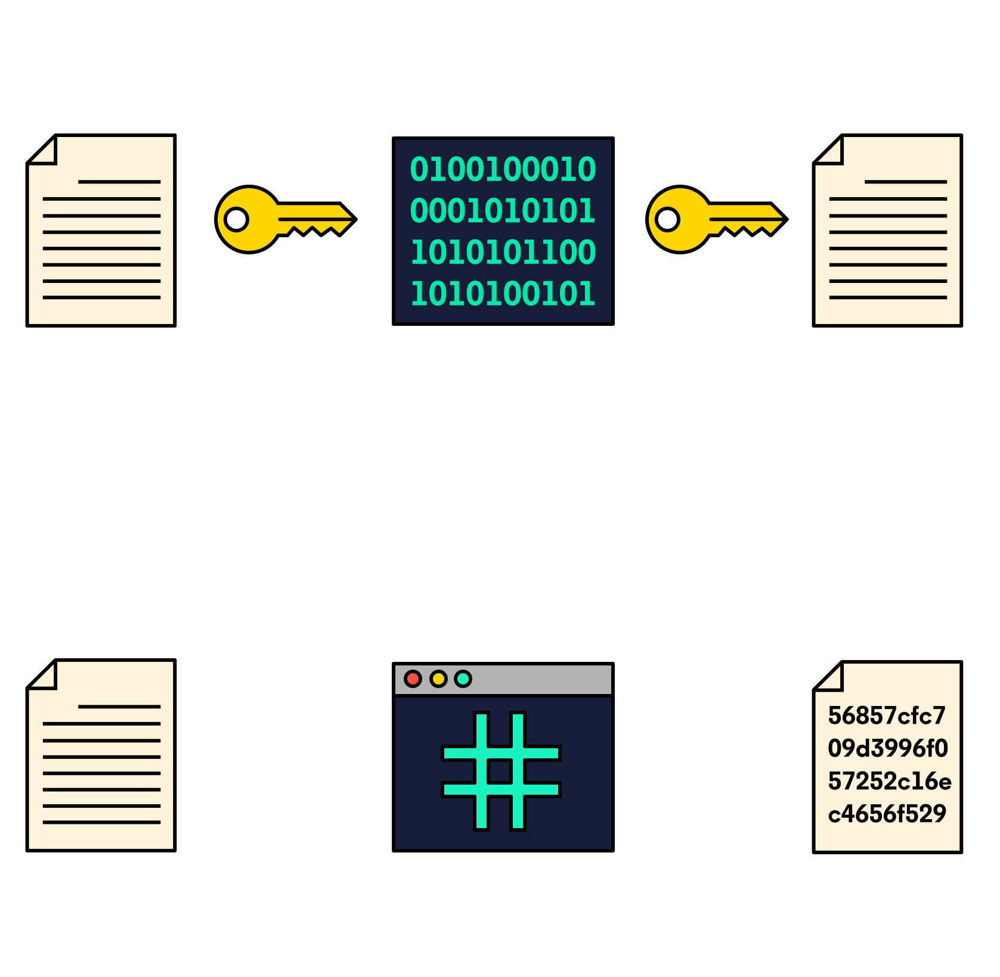

# Password Authentication

# Bcrypt

## Introduction


When practicing new concepts, we might store plaintext passwords in a local database, but this is incredibly insecure. One should never do this in a production environment. Sensitive Data Exposure is one of the OWASP’s Top Ten security risks to web applications for a reason! Instead, you should hash passwords before storing them in a database in order to protect your users from being hacked.

There are plenty of cryptographic hashing functions to choose from, such as the SHA-3 or MD-5 algorithms. SHA-3 and MD-5 algorithms are known to be quite fast. Unfortunately, the faster the function, the faster a hacker can retrieve a hashed password through brute-force attacks. So, using a function that is slower at hashing passwords can actually protect your users.

We can accomplish this by using the bcrypt algorithm and library. Using bcrypt, we can protect our users by hashing and salting passwords. Using multiple rounds of hashing ensures that an attacker must deploy massive funds and hardware to be able to crack your passwords.

## Hash Functions
bcrypt is hashing algorithm. This means you cannot easily retrieve the plaintext password without already knowing the salt, rounds, and key (password).

A hash function only works one-way, which means that once a value is hashed it can’t be unhashed. This is different from encryption, because, if you know which algorithm was used to encrypt a value, you can use that same algorithm to decrypt it.

On a typical website, when a user first signs up, we retrieve their password and run it through a hashing algorithm. The hashed password is then stored in the database. Whenever the same user logs in, we hash the password they tried to log in with and compare it to the already stored hash value. If the values match, the user is authenticated.



## Salts and Rainbow Table Attacks
As with many security measures, hashing isn’t foolproof. How can an attacker discover what users’ passwords are?

One common way to attempt cracking hashed passwords is through the use of rainbow tables.

Rainbow tables are large lookup databases that consist of pre-computed password-hash combinations which correlate plaintext passwords with their hashes.

Rainbow tables are complex and consist of two different types of functions:
* A Hashing function: Used by the table must match the hashed password you want to recover.
* A Reduction Function: Transform a hash into something usable as a password. However, it’s important to understand that the reduction function doesn’t reverse the hash value, so it doesn’t output the original plaintext (i.e. the password), because this isn’t possible, but instead outputs a completely new one.

In essence, rainbow tables are massive lookup tables that can crack complex passwords significantly faster than using traditional password cracking methods.

So what are some measures we can take to protect ourselves from rainbow table attacks? One common technique is the use of salts. A salt is a random value that is added to the input of a hashing function in order to make each password hash unique even in the instance of two users choosing the same passwords. Salts help us mitigate hash table attacks by forcing attackers to re-compute them using the salts for each user.


## Using bcrypt to Hash Passwords
Bcrypt uses a salt and salt rounds to secure a password.
* A salt is a value that is concatenated to a password before hashing in order to make it less vulnerable to rainbow table and brute-force attacks.
* A salt round can be described as the amount of time needed to calculate a single bcrypt hash. The higher the salt rounds, the more time is necessary to crack a password.

In this asychronous implementation, we’ll generate a salt and hash in the same function call. This involves 3 steps:
1. Generate a salt
2. Hash the password
3. Return null if there’s an error

We’ll make use of async/await and try/catch blocks to create an asynchronous function. We’ll pass in a password string and salt rounds:
```JS
const passwordHash = async (password, saltRounds) => {
  try {
 
  } catch (err) {
 
  }
};
```

The built-in genSalt() function automatically generates a salt for us. Since we’re using an asynchronous function we can await this function call:
```JS
const salt = await bcrypt.genSalt(saltRounds);
```

Once we have a salt generated, we make a call to bcrypt.hash(). bcrypt.hash() takes in a password string and a salt. We await and return this function call since it will return the hashed password. Now, our try block looks like:
```JS
  try {
    // Generate salt:
    const salt = await bcrypt.genSalt(saltRounds);
    // Hash password using generated salt:
    return await bcrypt.hash(password, salt);
  }
```

We also want to handle potential errors. In the catch block, we can print out the error with console.log(). Lastly, we return null if there’s an error with bcrypt and we’re unable to hash a password. The final code might look like:
```JS
const passwordHash = async (password, saltRounds) => {
  try {
    const salt = await bcrypt.genSalt(saltRounds);
    return await bcrypt.hash(password, salt);
  } catch (err) {
    console.log(err);
  }
  return null;
};
```

## Verifying Passwords
Now that we know how to hash a password, let’s explore how we can verify a stored password hash against one sent from a request.

Remember that a generated hash should be stored in our database, since we’ll be comparing that hash to the retrieved password after it’s hashed. The process of comparing passwords should look as follows:
1. Retrieve plain text password.
2. Hash the password.
3. Compare the hashed password with the one stored in our DB. (Since we’re using the same hash, it should return the same value if the password is correct.)

bcrypt provides us with a handy function called compare() which takes in a plaintext password, password and a hashed password, hash:
```JS
bcrypt.compare(password, hash);
```

bcrypt.compare() deduces the salt from the provided hash and is able to then hash the provided password correctly for comparison.

We can include a function that verifies if the password entered is valid. We’ll use an asynchronous function and pass in password and hash as its parameters.
```JS
const comparePassword = async (password, hash) => {
  try {
 
  } catch (err) {
 
  }
};
```

Within our try block we can use the built-in function and compare the provided password with the stored hashed password:
```JS
const comparePasswords = async (password, hash) => {
  try {
    const matchFound = await bcrypt.compare(password, hash);
    return matchFound;
  } catch (err) {
    console.log(err);
  }
  return false;
};
```

The return value will be true if the password provided, when hashed, matches the stored hash. Outside the try/catch block we can return false in order to end the execution of the code if there were any other errors or if bcrypt did not execute correctly.

## Bcrypt in a CRUD App
Today we’ll be looking at how to protect and hash passwords through bcrypt without the use of a database.

When creating an authentication flow, we should never store passwords as plaintext. Instead, we can take the password retrieved from a user’s input and hash it using bcrypt. Once it’s hashed, then we can store it in our database.

A typical POST request for registering a user might look something like this:
```JS
app.post("/register", (req, res) => {
  const { email, password } = req.body;
 
  // Create a new user object to store in the database:
  user = new User({
    email,
    password
  });
  // Save user in database:
  await user.save();
  res.redirect("login");
});
```

In the above example, passwords are not being hashed and are therefore stored as plaintext in the database.

Before creating a new user object, we must first hash the password and store that value:
```JS
const salt = await bcrypt.genSalt(10);
 
const hash = await bcrypt.hash(password, salt);
 
const newUser = {
  email,
  password: hash
};
 
await user.save();
```

Once hashed, that value will be stored in our database and protect the password from brute-force attacks.

In order to log that registered user back in, a request without hashed passwords might look something like this:
```JS
app.post("/login", (req, res) => {
  const { email, password } = req.body;
  let user = await User.findOne({ email: email });
  // If passwords don't match, redirect client back to the login page:
  if (user.password !== password) return res.redirect("login");
 
  // If passwords match, redirect client along with the user object:
  res.render("profile", { user });
});
```

The issue above is, once again, plaintext passwords are being compared. Instead, bcrypt should be used to hash the user’s password input and compare it to the hash stored in the database:
```JS
const { email, password } = req.body;
let user = await User.findOne({ email: email });
// ...
 
// Use bcrypt to hash the retrieved password and compare it to hash stored in database:
const matchedPassword = await bcrypt.compare(password, user.password);
```

Using bcrypt.compare() pulls the salt out of stored hash in the database and uses it to hash the retrieved password and perform the comparison. The function will then return true if the passwords match and false if they don’t.

With that in place, we have safely secured the endpoints in order to protect our user’s passwords when registering and logging in!

We have provided you with a basic application in order to register and log in users. Since we’re not using a database, we’re manually updating a JSON file and adding a new user whenever someone registers. Feel free to explore the app further before starting the exercises in order to get a better understanding of how it works.

### Exercises
1. In the users.routes.js file you’ll find a POST request to register new users. The flow is almost complete but the passwords still need to be hashed before storing them in the local database.

    Add the missing code in order to generate a salt using 10 salt rounds, and store the value in a const variable called salt.
2. Now that a salt has been generated, use it in order to hash the retrieved password.

    Store the value in a const variable called hashedPassword.
3. Under the POST request to log in a user, app.post("/login"), the password input must be compared to the hashed password in the database.

    Use bcrypt to compare the user’s input password and the stored hashed password.

    Store the value in a const variable called matchedPassword.
```JS
const express = require("express");
const router = express.Router();
const helper = require("../helpers/helpers");
let users = require("../data/users.json");
const filename = "./data/users.json";
const bcrypt = require("bcrypt");

/* Register a user */
router.post("/register", async (req, res) => {
  const { email, password } = req.body;
  const id = { id: helper.getNewId(users) };

  try {
    const user = await helper.findUser(users, email);

   if (user) {
      console.log("User already exists!");
      return res.redirect("login");
    }
    // 1. Generate salt
    const salt = await bcrypt.genSalt(10);
    // 2. Hash password
    const hashedPassword = await bcrypt.hash(password, salt);
    const newUser = {
      ...id,
      email,
      password: hashedPassword,
    };

    await users.push(newUser);
    await helper.writeJSONFile(filename, users);

    res.redirect("login");
  } catch (err) {
    res.status(500).json({ message: err.message });
  }
});

/* Log in user */
router.post("/login", async (req, res) => {
  const { password, email } = req.body;

  try {
    const user = await helper.findUser(users, email);

    if (!user) {
      console.log("User does not exist!");
      return res.redirect("login");
    }

    // 3. Compare passwords:
    const matchedPassword = await bcrypt.compare(password, user.password);

    if (!matchedPassword) {
      console.log("Passwords did not match!");
      return res.redirect("login");
    }
    // return res.status(401).json({
    //   token: null,
    //   message: "Invalid password",
    // });

    res.render("profile", { user });
  } catch (err) {
    res.status(500).json({ message: err.message });
  }
});

router.get("/login", (req, res) => {
  res.render("login");
});

router.get("/register", (req, res) => {
  res.render("register");
});

router.get("/profile", (req, res) => {
  res.render("profile");
});

module.exports = router;
```
