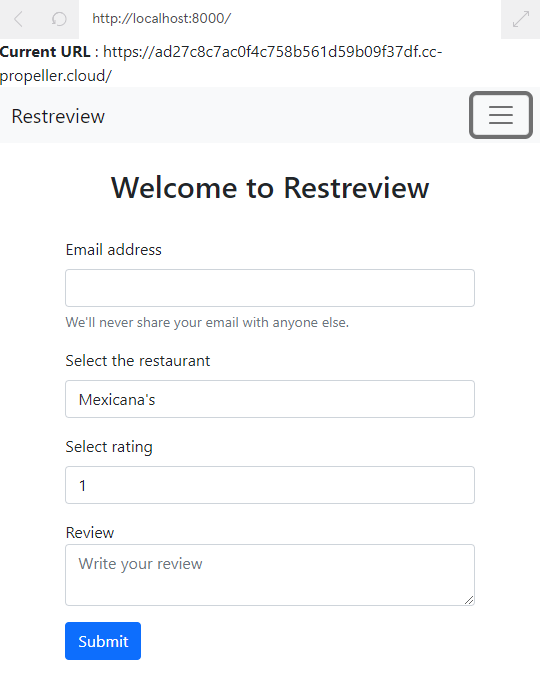

# Restreview: Preventing Cross Site Scripting (XSS) Attacks

Welcome to Restreview!

Restreview is an application that publicly compiles reviews on selected restaurants.

The product is in the very early stages, and we’re taking over the development of the landing page to review a restaurant. We’re working closely with a new intern and, unfortunately, the current code hasn’t been secured properly and is vulnerable to different types of XSS attacks!

For this project, we’ll focus on implementing best practices and adding layers of security to protect the app from DOM-Based, Reflected, and Stored XSS Attacks.

We’ll make use of helmet and express-validator as well as explore how to use alternative methods from the document object in order to prevent any potential attacks on the application.

## Data Validation and Sanitization
2. Restreviewer is currently storing all the reviews locally and the form to submit reviews is vulnerable to malicious code being injected into the server.

    Begin by importing the check method from the express-validator at the top of app.js
3. In the /review endpoint, use express-validator to ensure the following data to matches the format below:

    | Data Input | Format |
    | - | - |
    | email | Is an email |
    | restaurant | Is not empty AND blacklists the characters < and > |
    | rating | Is numeric |
    | review | Is not empty AND blacklists the characters < and > |

    To test your changes, you can use Ctrl + C in the Terminal to stop the app and rerun it by typing node app.js again.

## Protecting the DOM
4. The intern currently wrote code in home.ejs that exposes a DOM-Based vulnerability by making use of document.write.

    Find an alternative way to write content to the DOM.

    Start by creating a new HTML tag with the id “urlinfo”.
5. Now that we have a separate HTML tag with a specific id, we can use getElementById to target that object and use textContent to assign it to document.baseURI.

## Securing Cookies and Headers
6. Add a cookie object to the existing session and set the appropriate properties to secure the cookie.
7. Implement the helmet middleware.

    Note: If you implement helmet properly, the mini browser may appear broken. This is because of the security headers helmet enables. While inconvenient for this exercise, this is good for real-world security!
