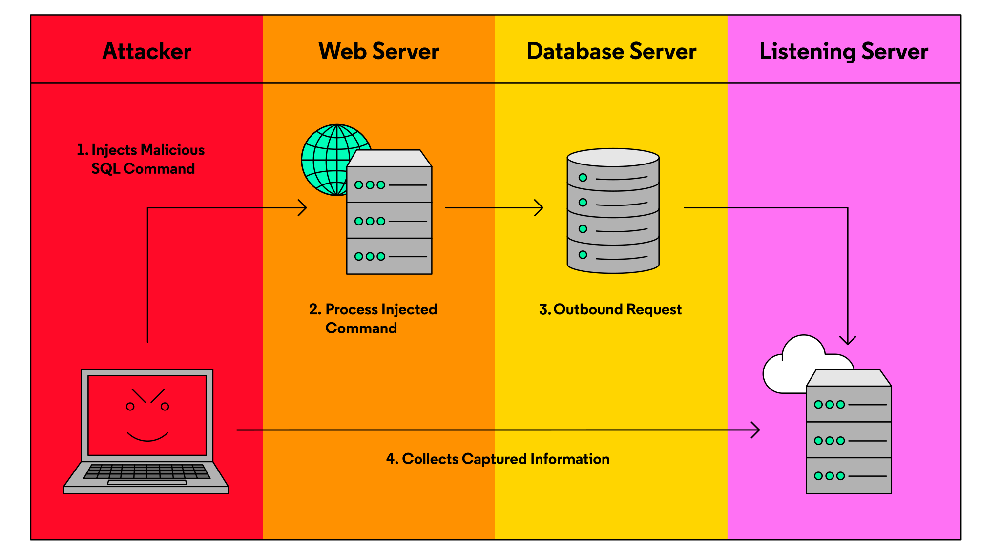

# Preventing SQL Injection Attacks

# SQL Injection

## Union-Based Injections
A union-based injection leverages the power of the SQL keyword UNION. UNION allows us to take two separate SELECT queries and combine their results. Union-based injections can allow an attacker to quickly steal information from a system.

Let’s look at an example.

Say this is how the query is created when a customer searched for a product name (USER_INPUT):
```JS
query = "SELECT product_name, product_cost, product_description FROM product_table WHERE product_name = " + USER_INPUT + "';";
```

If the attacker enters a user input such as this:
```SQL
soap' UNION SELECT username,password,NULL FROM user_table;-- -
```

This input would create a valid SQL statement that grabs information for “soap” but UNIONS all the usernames and passwords of the users!
```SQL
SELECT product_name, product_cost, product_description FROM
product_table WHERE product_name = 'soap' UNION SELECT username,password,NULL FROM user_table;-- -';
```

Notice the strategic placement of the ' character that allows the attacker to insert SQL syntax and extend the SQL query!

## Error-Based Injections
In an error-based injection, an attacker writes a SQL query to force the application to return an error message with sensitive data.

Let’s take a look at the example below from an [actual vulnerability](https://packetstormsecurity.com/files/138790/Dolphin-7.3.0-SQL-Injection.html). In this example, the attacker’s input causes an error that spits out the password.
```SQL
asdf' UNION select 1, exp(~(select*from(SELECT Password FROM profiles WHERE ID=1)x)); -- -
```
SQL query:
```SQL
SELECT user_id FROM users WHERE username='asdf' UNION select 1, exp(~(select*from(SELECT Password FROM profiles WHERE ID=1)x)); -- -
```
SQL completes that inside statement getting the password for the profile ID 1, but errors on the value type that should be returned. This is the error that accidentally gives away the password!
```
Database access error. Description: DOUBLE value is out of range in 'exp(~((select 'SUP3r_S3cur3_P@a55w0rd!' from dual)))'<?xml version='1.0' encoding='UTF-8'?><ray><result value="Error saving setting." status="failed" /></ray>
```

## Boolean-Based Injections
Boolean-based injections involve SQL statements that can confirm TRUE/FALSE questions about the database. When using this method, the attacker takes note of the difference in the web response (changes in HTML, HTTP response code, or other web session data) when the result of their question is true or false.

Suppose a website has a search box that will return the username and email of a specific user ID. The SQL query below is used:
```SQL
SELECT username, email FROM users WHERE id = '[USER INPUT]';
```

In a normal search for id 1, the website will give back the username admin and email admin@site.com and display everything as normal.

Someone sneaky can use the AND keyword to see what happens on the website when the SQL statement is false.

For example, if the search input was this,
```SQL
1' AND '1' = '2
```
and this was the SQL query that was run,
```SQL
SELECT username, email FROM users WHERE id = '1' AND '1' = '2';
```

We won’t be getting a username and email back, since 1 is never equal to 2. At this point, the attacker makes note of what happens on the website when the statement is false.

The attacker would also make note of what happens when the modified SQL statement is true (1 is always equal to 1).
```SQL
SELECT username, email FROM users WHERE id = '1' AND '1' = '1';
```

Using this technique with the AND keyword, the attacker could write in any boolean statement on the other side of the AND, and based on the website’s response figure out if the statement is true.

Boolean injections are often used to figure out the name of a database table (possibly to build up for a Union-based injection), manipulating one query at a time to confirm one character at a time.

## Time-Based Injections
Not all SQL injections will provide visible output. A time-based injection makes use of several built in SQL functions, such as SLEEP() and BENCHMARK(), to cause visible delays in an application’s response time. While the output of a command isn’t visible, delays in the response time can be used to infer some information!

Suppose we have a database query that will check to see if a certain username USER exists within the database.
```SQL
SELECT id FROM users WHERE username = 'USER';
```

Someone could write this SQL syntax as the text input to confirm if the admin‘s password is P@ssw0rd123
```SQL
a' OR IF((SELECT password FROM users WHERE username='admin')='P@ssw0rd123', SLEEP(5), NULL);-- -
```

making the SQL query:
```SQL
SELECT id FROM users WHERE username = 'a' OR IF((SELECT password FROM users WHERE username='admin')='P@ssw0rd123', SLEEP(5), NULL);-- -';
```

If there’s a 5-second delay before a response from the server, an attacker could confirm the admin user had a password of P@ssw0rd123.

## Out-of-Band SQL Injections
Out-of-Band injections are generally the rarest and most difficult injections to execute for attackers. Unlike the other methods, which return the results via the web application, an out-of-band injection will leverage a new channel to retrieve information from a query.

Generally, these SQL injections will cause the database server to send HTTP or DNS requests containing SQL query results to an attacker-controlled server. From there, the attacker could review the log files to identify the query results.

Again, these injections are extremely difficult to execute. They rely on permissions to database functions that are most often disabled, and would have to bypass firewalls that might stop requests to the attacker’s server.



## SQL Injection Prevention
There are two main methods for preventing injection attacks: sanitization and prepared statements.

### Sanitization
Sanitization is the process of removing dangerous characters from user input. When it comes to SQL injections, we would want to escape dangerous characters such as:
* '
* ;
* \--

These sorts of characters can allow attackers to extend queries to output more data from a database.

While this does provide a layer of protection, this method isn’t perfect. If a user finds a way to bypass your sanitization process, they can easily inject data into your system.

Additionally, depending on your query, removing certain characters may have no effect! Therefore, this shouldn’t be your only defense mechanism.

### Prepared Statements
Writing prepared statements (also known as parameterized queries) in backend code is a common, reliable, and secure solution against SQL injections. Prepared statements are nearly foolproof.

How does it work? We provide the database the query we want to execute in advance.
1. First, a SQL query template is sent to the database. Certain values, called parameters, are left unspecified. For example, user input.
2. The database processes the query and performs optimizations.
3. Values are bound to the parameters and the SQL query is executed.
4. Then we pass in the parameters/user input. Any input, regardless of whether the content has SQL syntax, is then treated only as a parameter and will not be treated as SQL code.

Here is an example of what a prepared statement looks like in PHP web application backend code:
```PHP
$username= $_GET['user'];
$stmt = $conn->prepare("SELECT * FROM Users WHERE name = '?'");
$stmt->bind_param("s", $username);
$stmt->execute();
```

In addition to providing added security, prepared statements also make queries far more efficient.
