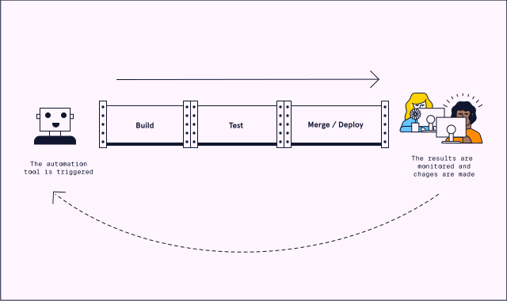

# DevOps: Introduction and Culture
# DevOps Automation

## What Can We Automate?
### Planning

Many project planning tools such as Jira, Monday, and Slack have automation features. These features allow:
* Recurring meetings and standups to be auto-generated
* Notifications to be sent to team members when items are completed
* And more

Building, Testing, and Deploying

One of the main areas of automation in DevOps is building, testing, and deploying our code. The main practice for this is continuous integration and continuous deployment (CI/CD). CI/CD tools allow for automated building, testing, and deployment of application code. CI/CD helps ensure a working prototype is available and running with the most recent changes.

### Monitoring

Automation is useful for processing logs and collecting metrics when monitoring software. Visualization tools allow for the processed data to be converted to interactive diagrams.

Let’s see what tools we can use for these tasks!

## Popular DevOps Automation Tools

There are many tools available to assist in DevOps automation. In this section, we will be taking a brief look at some of the most popular automation tools used in DevOps.
* [Jenkins](https://www.jenkins.io/) - most popular and well-known
* [GitHub](https://github.com/features/actions) Actions - integrated into Github
* [Gradle](https://gradle.org/) - a focus on building and compiling

While they have their differences, all three automatically build, test, and deploy code. Learning these tools allows us to automate aspects of our DevOps workflows. When learning one tool, keep an open mind about learning the others as well. Each DevOps team will have their own DevOps automation workflow. Having flexibility with our tooling can be a great asset.

## Review

DevOps automation prevents people from repeating the same time-consuming steps over and over. We have learned how automation can help with many parts of software development:
* planning
* building
* testing
* deploying
* monitoring

Automation can speed up workflows, reduce human errors, and save money. It’s no wonder that many companies are using these automation tools for their projects!
