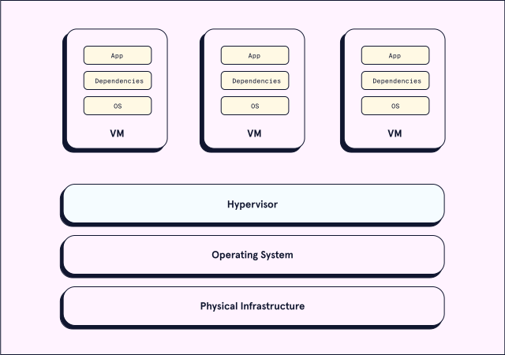
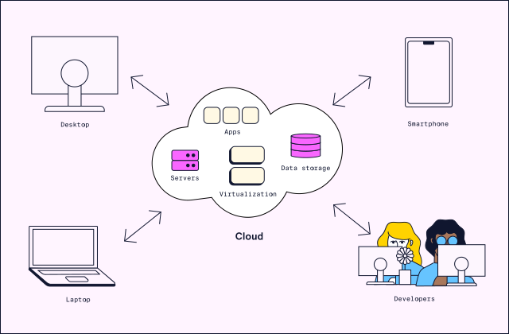
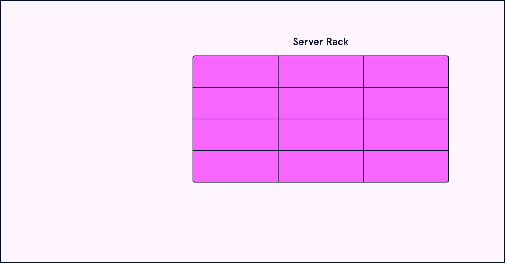

# DevOps: Introduction and Culture
# Types of Infrastructure

## Traditional Infrastructure

In What is Infrastructure/Traditional Infrastructure, we learned about traditional infrastructure. Traditional infrastructure refers to the ways that companies managed infrastructure for web services. With traditional infrastructure, the company acquires, configures, and maintains physical infrastructure components. These components include servers, power supplies, and cooling.

Traditional infrastructure offers the ultimate amount of control and flexibility. But we learned many challenges arise when managing infrastructure. Two key challenges that traditional infrastructure faces are:
* Differences in development environments can lead to bugs.
* Taking full advantage of the computing resources of each machine.

Consider an application that relies on a library. Different machines will have different versions of this library installed or different versions of an operating system. These differences can lead to inconsistent behavior between machines.

Now, imagine a server that is only able to host a single application. This scenario is common with a traditional infrastructure approach. That application might have only used 40% of the server’s physical capacity. With many such servers, a lot of physical capacity goes to waste.

What if there is a way to take advantage of this unused physical capacity and eliminate differences between environments? In the next sections, we’ll explore how virtualization and containerization address these challenges.

## Virtualization

Virtualization technology allows many virtual machines (VMs) to run on one physical computer. Each virtual machine can simulate the execution of a computer. VMs are distinct environments with their own operating system (OS), dependencies, and users.

Virtualization relies on a layer of software called a hypervisor. Hypervisors sit atop the host machine, allocating its physical resources to different VMs.

With virtualization, each server uses more of its physical capacity. Having fully utilized servers reduces the number of physical servers needed. Requiring fewer servers lowers maintenance, power, and cooling costs. These savings are the main benefits of virtualization.

Another benefit is the convenience of configuring and provisioning virtual machines. Virtual machine management software allows VM configuration with several clicks. Using these tools is more efficient than installing and managing pieces of hardware. VMs also allow for remote configuration.

However, there are some challenges with virtualization. For example, it can have some high upfront costs. These costs come from buying VM software licenses and hiring qualified staff. Also, not all machines are capable of virtualization.

Virtualization paved the way for a shift in infrastructure management. It allowed us to abstract an application’s environment. Yet, each virtual machine still requires an operating system. These operating systems each need some slice of the host machine’s resources. Let’s look at how a successor of virtualization solved this problem. This successor is containerization.

## Containerization

Containerization is another form of virtualization. With containerization, users create virtual environments called containers. Containers share the operating system of the host physical machine. By comparison, virtual machines each have their own operating system, requiring more system resources. Sharing the operating system makes containers smaller and more portable than virtual machines.

The technology for containerization has been around for decades. Yet, it did not become widespread until 2013 with the release of Docker. Docker standardized building and deploying containers. It provided a simple interface for developers to interact with.

Containerization brings several benefits. When compared to virtual machines, containers are smaller and faster to create. The smaller size allows many more containers to run on a single machine. The speed of creating containers offers convenience for developers.

Like virtual machines, containers reduce bugs caused by differences between development and production environments.

A container combines an application and its dependencies into a single package. This combination allows containers to migrate to different environments with ease.

Some challenges with containers include increased complexity and potential security issues. Containers are less isolated compared to virtual environments due to their shared kernel. If someone gains control of the operating system, then they have access to all the containers.

Virtualization and containerization led to an important shift in infrastructure technology, cloud-based infrastructure.

## Cloud-Based Infrastructure

Cloud-based infrastructure means infrastructure and computing resources available to users over the internet. Usually, a third-party company owns, houses, and manages the physical infrastructure.

With cloud-based infrastructure, applications are entirely separate from their environments. Cloud providers create physical pools of resources. Virtualization allows many instances of an application to run on these resources. A simple interface on the web enables users to configure the pool.

Cloud-based infrastructure has several benefits:
* It maximizes the cost savings brought by virtualization.
* It allows specific companies to specialize in physical infrastructure management and security.
* It allows a company to deploy an initial infrastructure that can scale as demand grows.

As with other types of infrastructure, cloud-based services have several downsides as well:
* They need an internet connection which may not always be available.
* They allow less control/flexibility compared to in-house infrastructure.
* A third-party company may have access to some critical data.

For most, the advantages of using cloud-based infrastructure far outweigh the disadvantages. The majority of companies today use cloud-based services. The biggest providers are Amazon Web Services (AWS), Microsoft Azure, and Google Cloud.

Cloud-based infrastructure takes away the physical management of infrastructure. But, it does not always take away the configuration of that infrastructure. Cloud administrators need to configure the resources provided by the cloud service. The advent of serverless computing removed the need for businesses to configure infrastructure. Let’s dig in.

## Serverless

Serverless computing is a model for cloud-based infrastructure. It allows applications development without needing to configure infrastructure. Serverless providers automate many of the resources needed to support an application. These resources include databases, networking components, and servers. Serverless applications are still run on servers. However, the provisioning, configuration, and management of these servers are invisible to developers.

The most popular serverless model is Functions-as-a-Service (FaaS). With FaaS, applications consist of one or more functions. Each function performs a task in response to a specific event. When an event occurs, the cloud provider provisions infrastructure from the cloud. It then uses this infrastructure to execute the function. When the function finishes executing, the resources return to the underlying pool.

This model allows infrastructure usage to match what customers need for their applications. When no functionality is requested, no resources are used to support the application. When usage increases, the cloud provider provisions more infrastructure for the application.

The FaaS model begins with some event (such as a button click) occurring. Next, virtual infrastructure is allocated, and some function loads into memory. The function then executes and returns a response. Finally, resources return to the underlying pool until needed again.

Serverless computing has several main benefits:
* Developers can focus on business logic without worrying about infrastructure configuration.
* Infrastructure usage and scaling correlates with user demand.

Serverless computing has several downsides as well:
* It can be more expensive if functions run often.
* There can be some start-up delay if a function was not used recently.
* It can be challenging to switch from one provider to another.
* Managing state within a serverless application is more complex.

For these reasons, serverless computing is better suited for some apps than others. An app with infrequent surges in demand is an ideal candidate.

In time, some of the downsides may get worked out. After all, serverless is still new and catching on fast. It was not popularized until 2014 with the introduction of AWS Lambda. Microsoft Azure Functions and Google Cloud Functions followed shortly after.

Serverless computing is the latest trend to change the infrastructure landscape. It won’t be the last. The next major shift might come from technology that exists today. Or perhaps it has already begun.

## Review

In this article, we covered the main types of infrastructure. We also discussed their benefits and drawbacks and how they evolved over the years. We began with traditional infrastructure and its challenges. We looked at how virtualization and containerization helped mitigate those challenges. We then discussed how virtualization paved the way for cloud-based infrastructure. Finally, we explored serverless computing, the most recent major shift in cloud-based infrastructure.

The world of infrastructure changes fast. The next advancement could be right around the corner. Companies around the world wonder, “where is the cloud going to next?”
