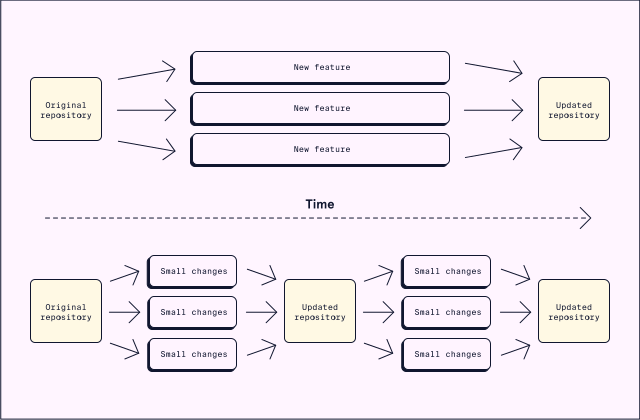

# DevOps Processes
# Continuous Integration

## What is Continuous Integration?

Continuous integration is a practice that consists of two main components:
* Merging source code changes on a frequent basis
* Building and testing the changes in an automatic process

The combination of these components ensures new additions are built and tested often.

## Feature Branch Development

In the past, traditional source control management approaches used long-lived branches. These branches were merged only once a feature was completed, hence the name, feature branch development. This works well for smaller projects or for a single developer. However, issues arise with bigger projects:
* Long review periods for relatively larger feature branches
* Many conflicts when merging the large branches into the main repository

Remember that the goal of CI is to frequently merge, build and test code changes on one main branch. Feature branch development cannot be the solution due to the slow cycle of merges and relatively larger branch sizes.

Let’s discuss an approach to source control management compatible with continuous integration.

## Trunk-Based Development

Trunk-based development is frequently merging small changes into the main branch (or trunk). Some of the benefits of trunk-based development include:
* Discovering problems early (known as “shifting left”) instead of at the end of a large merge attempt
* Small changes mean fewer conflicts and simpler fixes

## CI with Trunk-Based Development

Continuous integration combines trunk-based development and the automation of building and testing. After each small merge into main, the codebase is automatically built and tested. This process ensures that the repository always has valid code ready to be deployed.

Now that we have an understanding of continuous integration, let’s look at a few tools which can help with automation.

## Popular CI Tools

Many of the CI tools use servers to watch for changes or triggers from the project repository. The tools can be configured to run automated tests and notify developers of any problems. Some of the most popular tools for CI are:
* Jenkins — Open source and self-hosted which allows for complete control and configuration
* Github Actions — Embedded within the popular source control management system
* CircleCI — Works with many different source control management systems

Learning at least one of these tools can be very helpful for a team hoping to incorporate CI practices. Let’s see how we can set up CI in a project!

## Implementing CI

Implementing CI on an entire project has a few steps:
* Make sure that the project is using one main source branch.
* Pick one of many CI servers to control automatic builds and tests.
* Configure the CI server to trigger automatic builds when merges occur.
* Develop tests and configure the CI server to run them.
* Set up notifications for build or test failures.

This seems like a lot of extra work, but luckily there are plenty of tools to help with CI.

##Review

CI is very important to DevOps by ensuring that codebases stay in a deploy ready state. CI solves problems of feature branch development through less conflicts and fewer bugs. Through the use of popular CI tools, a project can be set up to follow CI practices. Continuous integration’s benefits have made it popular. CI is being adopted by companies all throughout the world!
