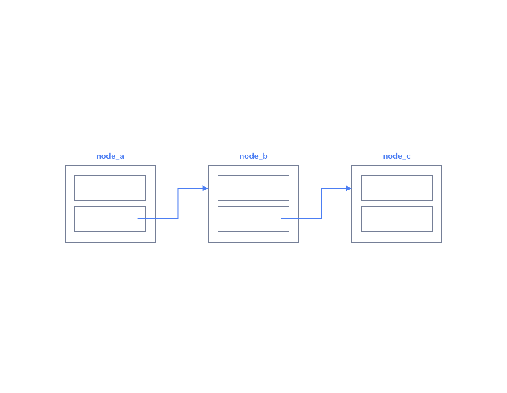
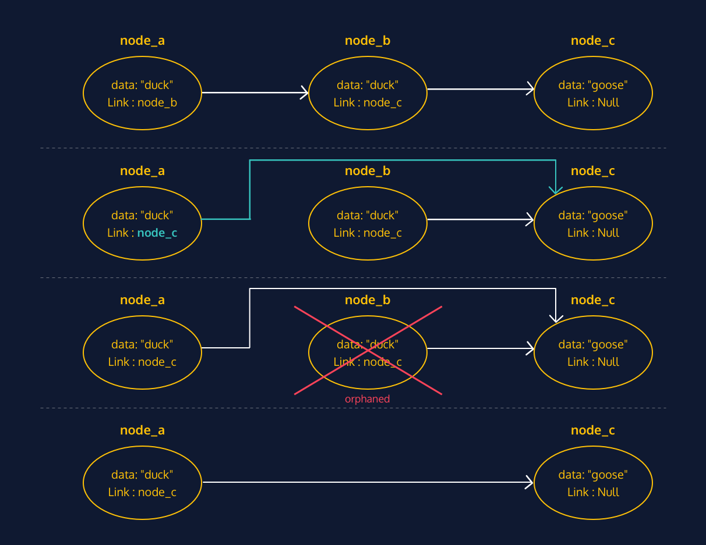

# Singly Linked Lists
# Linked Lists: Conceptual

Now that you are familiar with nodes, the next step is to actually use them to build something! Linking together nodes using their next property creates a singly linked list. Singly linked lists are extremely versatile and useful, while also beautiful in their simplicity. Like nodes, these lists are used as foundations for future data structures and are an alternative to arrays when trying to store information in a linear way.

## Linked List Example

As an example, we added values to the linked list diagram from the introduction.

This linked list contains three nodes (node_a, node_b, and node_c).

Each node in this particular list contains a string as its data. As the sequence is defined, the order is "cats", "dogs", and "birds".

The list ends at node_c, since the link within that node is set to null.

What links would need to be established to add a new head node to this list? What about the tail?

## Linked Lists Adding and Removing Nodes

With linked lists, because nodes are linked to from only one other node, you can’t just go adding and removing nodes willy-nilly without doing a bit of maintenance.

### Adding a new node
Adding a new node to the beginning of the list requires you to link your new node to the current head node. This way, you maintain your connection with the following nodes in the list.

### Removing a node
If you accidentally remove the single link to a node, that node’s data and any following nodes could be lost to your application, leaving you with orphaned nodes.

To properly maintain the list when removing a node from the middle of a linked list, you need to be sure to adjust the link on the previous node so that it points to the following node.

Depending on the language, nodes which are not referenced are removed automatically. “Removing” a node is equivalent to removing all references to the node.

## Linked List Review

Let’s take a minute to review what we’ve covered about linked lists in this lesson.

Linked Lists:
* Are comprised of nodes
* The nodes contain a link to the next node (and also the previous node for bidirectional linked lists)
* Can be unidirectional or bidirectional
* Are a basic data structure, and form the basis for many other data structures
* Have a single head node, which serves as the first node in the list
* Require some maintenance in order to add or remove nodes
* The methods we used are an example and depend on the exact use case and/or programming language being used
