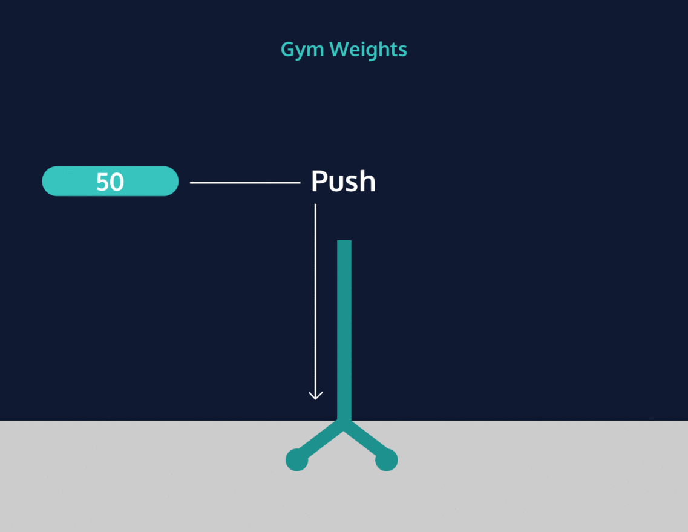
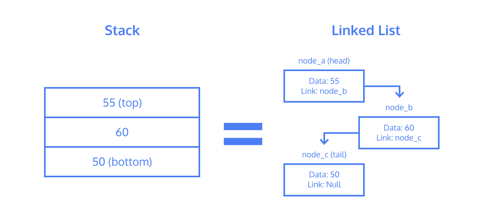

# Stacks
# Stacks: Conceptual

Stacks are another data structure with a perfectly descriptive name. Like a queue, a stack is a linear collection of nodes that adds (pushes) data to one end of the data structure (let’s say the top, for the purposes of this example). However, unlike a queue, a stack removes data (pops) from the same end of the data structure. Think of it as a stack of books, where you can only pick up the top book, and add a new book to the top.

Stacks are often thought of as a “First In, Last Out” (FILO) data structure — the first book you add to the stack won’t be removed until all other books are removed from the stack.

Queues on the other hand are thought of as a “First In, First Out” (FIFO) data structure — the first person in line will be the first person to leave the line.

A real-world computing example of a stack is a web browser’s back/forward function, which is something you will model with a project in JavaScript!

## Stacks Introduction
A stack is a data structure which contains an ordered set of data.

Stacks provide three methods for interaction:
* Push - adds data to the “top” of the stack
* Pop - returns and removes data from the “top” of the stack
* Peek - returns data from the “top” of the stack without removing it

Stacks mimic a physical “stack” of objects. Consider a set of gym weights.

Each plate has a weight (the data). The first plate you add, or push, onto the floor is both the bottom and top of the stack. Each weight added becomes the new top of the stack.

At any point, the only weight you can remove, or pop, from the stack is the top one. You can peek and read the top weight without removing it from the stack.

The last plate that you put down becomes the first, and only, one that you can access. This is a Last In, First Out or LIFO structure. A less frequently used term is First In, Last Out, or FILO.

## Stacks Implementation
Stacks can be implemented using a linked list as the underlying data structure because it’s more efficient than a list or array.

Depending on the implementation, the top of the stack is equivalent to the head node of a linked list and the bottom of the stack is equivalent to the tail node.

A constraint that may be placed on a stack is its size. This is done to limit and quantify the resources the data structure will take up when it is “full”.

Attempting to push data onto an already full stack will result in a stack overflow. Similarly, if you attempt to pop data from an empty stack, it will result in a stack underflow.

## Stacks Review
Let’s take a minute to review what we’ve covered about stacks in this lesson.

Stacks:
* Contain data nodes
* Support three main operations
  * Push adds data to the top of the stack
  * Pop removes and provides data from the top of the stack
  * Peek reveals data on the top of the stack
* Implementations include a linked list or array
* Can have a limited size
  * Pushing data onto a full stack results in a stack overflow
* Stacks process data Last In, First Out (LIFO)
